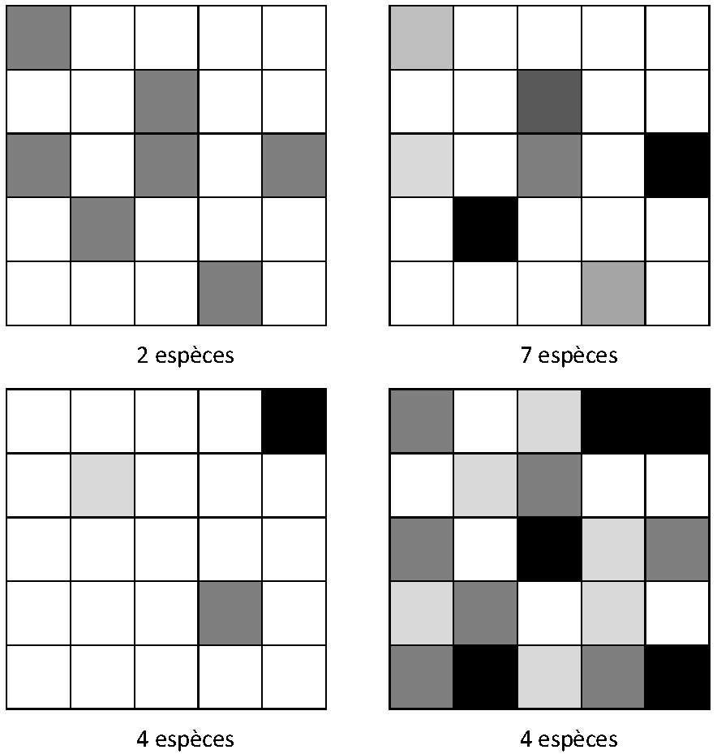
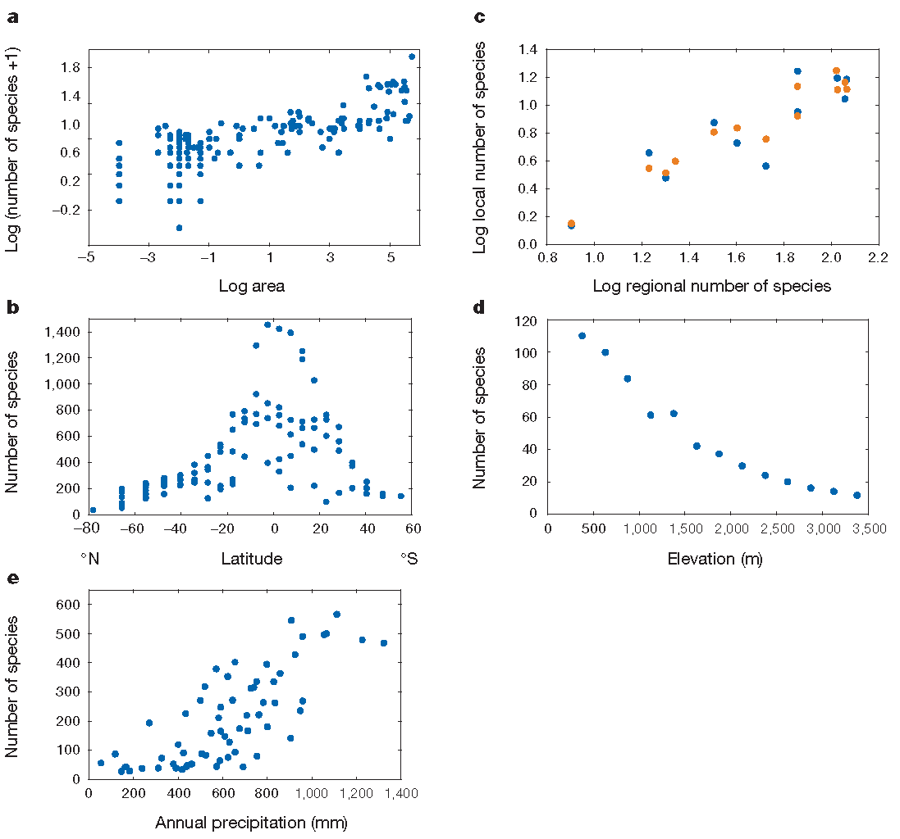

# (PART) Notions {-}

# Notions de Diversité {#chap-Notions}

```{r, include=FALSE}
library("tidyverse")
```

## Composantes

(ref:Composantes) Importance de la richesse (en haut) et de l'équitabilité (en bas) pour la définition de la diversité. Ligne du haut: toutes choses égales par ailleurs, une communauté de 7 espèces semble plus diverse qu'une communauté de 2 espèces. Ligne du bas: à richesse égale, une communauté moins équitable (à gauche) semble moins diverse. Colonne de gauche: une communauté moins riche (en haut) peut sembler plus diverse si elle est plus équitable. Colonne de droite: idem pour la communauté du bas.
```{r Composantes, fig.cap="(ref:Composantes)", echo=FALSE, out.width='60%'}

```


Une communauté comprenant beaucoup d'espèces mais avec une espèce dominante n'est pas perçue intuitivement comme plus diverse qu'une communauté avec moins d'espèces, mais dont les effectifs sont proches (figure \@ref(fig:Composantes), colonne de gauche). 
La prise en compte de deux composantes de la diversité, appelées richesse et équitabilité, est nécessaire [@Whittaker1965].


### Richesse

La richesse [terme introduit par @Mcintosh1967] est le nombre (ou une fonction croissante du nombre) de classes différentes présentes dans le système étudié, par exemple le nombre d'espèces d'arbres dans une forêt.

Un certain nombre d'hypothèses sont assumées plus ou moins explicitement:

* Les classes sont bien connues: compter le nombre d'espèces a peu de sens si la taxonomie n'est pas bien établie.
C'est parfois une difficulté majeure quand on travaille sur les microorganismes;
* Les classes sont équidistantes: la richesse augmente d'une unité quand on rajoute une espèce, que cette espèce soit proche des précédentes ou extrêmement originale.

L'indice de richesse le plus simple et le plus utilisé est tout simplement le nombre d'espèces $S$.


### Équitabilité

La régularité de la distribution des espèces (équitabilité en Français, *evenness* ou *equitability* en anglais) est un élément important de la diversité. 
Une espèce représentée abondamment ou par un seul individu n'apporte pas la même contribution à l'écosystème. 
Sur la figure \@ref(fig:Composantes), la ligne du bas présente deux communautés de 4 espèces, mais celle de droite est beaucoup plus équitable de celle de gauche et semble intuitivement plus diverse.
À nombre d'espèces égal, la présence d'espèces très dominantes entraîne mathématiquement la rareté de certaines autres: on comprend donc assez intuitivement que le maximum de diversité sera atteint quand les espèces auront une répartition très régulière.

Un indice d'équitabilité est indépendant du nombre d'espèces (donc de la richesse).

La plupart des indices courants, comme ceux de Simpson ou de Shannon, évaluent à la fois la richesse et l'équitabilité.


### Disparité

Les mesures classiques de la diversité, dites mesures de diversité neutre (*species-neutral diversity*) ou taxonomique ne prennent pas en compte une quelconque distance entre classes. 
Pourtant, deux espèces du même genre sont de toute évidence plus proches que deux espèces de familles différentes. 
Les mesures de diversité non neutres (chapitre \@ref(chap-cadrephyfonc)) prennent en compte cette notion, qui nécessite quelques définitions supplémentaires [@Mouillot2005; @Ricotta2007].

La mesure de la différence entre deux classes est souvent une distance, mais parfois une mesure qui n'a pas toutes les propriétés d'une distance: une dissimilarité.
Les mesures de *divergence* [@Pavoine2011] sont construites à partir de la dissimilarité entre les classes, avec ou sans pondération par la fréquence.

Si la divergence entre espèces est une distance évolutive comme l'âge du plus récent ancêtre commun, la diversité sera dite phylogénétique.
Si c'est une distance fonctionnelle, définie par exemple dans l'espace des traits fonctionnels, la diversité sera dite fonctionnelle.

La disparité [@Runnegar1987], divergence moyenne entre deux espèces (indépendamment des fréquences), ou de façon équivalente la longueur totale des branches d'un arbre phylogénétique, est la composante qui décrit à quel point les espèces sont différentes les unes des autres.

Les mesures de *régularité* décrivent la façon dont les espèces occupent l'espace des niches (régularité fonctionnelle) ou la régularité dans le temps et entre les clades des évènements de spéciation représentés par un arbre phylogénétique.
Ce concept complète celui d'équitabilité dans les mesures classiques: la diversité augmente avec la richesse, la divergence entre espèces, et la régularité (qui se réduit à l'équitabilité quand toutes les espèces sont également divergentes entre elles).


### Agrégation

À partir d'une large revue de la littérature dans plusieurs disciplines scientifiques s'intéressant à la diversité (au-delà de la biodiversité), @Stirling2007 estime que les trois composantes, qu'il nomme *variété* (richesse), *équilibre* (équitabilité) et *disparité*, recouvrent tous les aspects de la diversité.

Stirling  définit la propriété d'*agrégation* comme la capacité d'une mesure de diversité à combiner explicitement les trois composantes précédentes.
Cela ne signifie pas que les composantes contribuent indépendamment les unes des autres à la diversité [@Jost2010].


## Niveaux de l'étude

La diversité est classiquement estimée à plusieurs niveaux emboîtés, nommés $\alpha$, $\beta$ et $\gamma$ par  @Whittaker1960 [page 320] qui a nommé $\alpha$ la diversité locale qu'il mesurait avec l'indice $\alpha$ de Fisher (voir le chapitre \@ref(chap-Fisher)) et a utilisé les lettres suivantes selon ses besoins.

### Diversité $\alpha$, $\beta$ et $\gamma$

La diversité $\alpha$ est la diversité locale, mesurée à l'intérieur d'un système délimité. 
Plus précisément, il s'agit de la diversité dans un habitat uniforme de taille fixe.


(ref:Gaston2000) Patrons de biodiversité. (a) Le nombre d'espèces de vers de terre augmente en fonction de la surface échantillonnée, de 100 m² à plus de 500000 km² selon la relation d'Arrhenius). (b) Nombre d'espèces d'oiseaux en fonction de la latitude. (c) Relation entre la richesse régionale et la richesse locale. (d) Nombre d'espèces de chauves-souris en fonction de l'altitude dans une réserve au Pérou. (e) Nombre d'espèces de végétaux ligneux en fonction des précipitations en Afrique du Sud.
```{r Gaston2000, fig.cap="(ref:Gaston2000)", echo=FALSE, out.width='100%'}

```


De façon générale [@Gaston2000], la richesse spécifique diminue avec la latitude (la diversité est plus grande dans les zones tropicales, et au sein de celles-ci, quand on se rapproche de l'équateur), voir figure \@ref(fig:Gaston2000) [@Gaston2000, figure 1].
La tendance est la même pour la diversité génétique intraspécifique [@Miraldo2016].
La richesse diminue avec l'altitude. 
Elle est généralement plus faible sur les îles, où elle décroît avec la distance au continent, source de migrations.

La diversité $\beta$ mesure à quel point les systèmes locaux sont différents. Cette définition assez vague fait toujours l'objet de débats [@Moreno2010].

Enfin, la diversité $\gamma$ est similaire à la diversité $\alpha$, prise en compte sur l'ensemble du système étudié. 
Les diversités $\alpha$ et $\gamma$ se mesurent donc de la même façon.


### Décomposition

@Whittaker1977 a proposé sans succès une normalisation des échelles d'évaluation de la biodiversité, en introduisant la diversité régionale $\varepsilon$ ($\gamma$ étant réservé au paysage et $\alpha$ à l'habitat) et la diversité $\delta$ entre les paysages. 
Seuls les trois niveaux originaux ont été conservés par la littérature, sans définition stricte des échelles d'observation.

La distinction entre les diversités $\alpha$ et $\beta$ dépend de la finesse de la définition de l'habitat. 
La distinction de nombreux habitats diminue la diversité $\alpha$ au profit de la $\beta$. 
Il est donc important de définir une mesure qui ne dépende pas de ce découpage, donc une mesure cumulative (additive ou multiplicative) décrivant la diversité totale, décomposable en la somme ou le produit convenablement pondérés de toutes les diversités $\alpha$ des habitats (diversité intra) et de la diversité $\beta$ inter-habitat.

Nous appellerons *communauté* le niveau de découpage concernant la diversité $\alpha$ et *méta-communauté* le niveau de regroupement pour l'estimation de la diversité $\gamma$.


## Le problème de l'espèce

Évaluer la richesse spécifique suppose que les espèces soient définies clairement, ce qui n'est de toute évidence pas le cas [@Casetta2014]. 
Le premier aspect du problème concerne la nature des espèces: réalité naturelle ou seulement représentation simplificatrice.
Une analyse historique et philosophique en est faite par @Richards2010. 
L'autre aspect, avec des conséquences pratiques plus immédiates, concerne leur délimitation. 
@Mayden1997 recense vingt-deux définitions différentes du concept d'espèce.
@Wilkins2011 estime qu'il n'y a qu'un seul concept d'espèce mais sept définitions, c'est-à-dire sept façons de les identifier, et vingt-sept variations ou mélanges de ces définitions.

La définition historique est celle de *morphoespèce*, qui classe les espèces selon leurs formes, supposées d'abord immuables.
La définition moderne la plus répandue est celle d'espèce *biologique* [@Dobzhansky1937]: un "groupe de populations naturelles isolées reproductivement les unes des autres" [@Mayr1942]. 
Lorsque les populations d'une espèce sont isolées géographiquement, leur capacité à se reproduire ensemble est toute théorique (et rarement vérifiée expérimentalement). 
Des populations allopatriques n'ont pas de flux de gènes réels entre elles et peuvent être considérées comme des espèces distinctes selon la définition d'espèce *phylogénétique*: "le plus petit groupe identifiable d'individus avec un pattern commun d'ancêtres et de descendants" [@Cracraft1983].
C'est l'unité génétique détectée par la méthode du coalescent pour la délimitation des espèces [@Sukumaran2017].
Le nombre d'espèces phylogénétiques est bien supérieur au nombre d'espèces biologiques. 
Enfin, @VanValen1976 définit les espèces par la niche écologique qu'elles occupent (à partir de l'exemple des chênes blancs européens) plutôt que par les flux de gènes (permanents entre les espèces distinctes): la définition *écologique* d'espèce est proche du concept de complexe d'espèces [ensemble d'espèces voisines échangeant des gènes, @Pernes1984].

Le choix de la définition modifie considérablement sur la quantification de la richesse [@Agapow2004]. 
Des problèmes méthodologiques s'ajoutent aux problèmes conceptuels [@Hey2001]: la séparation ou le regroupement de plusieurs populations ou morphotypes en un nombre plus ou moins grand d'espèces est un choix qui reflète les connaissances du moment et peut évoluer [@Barberousse2014].

L'impact du problème de l'espèce sur la mesure de la diversité reste sans solution à ce stade, si ce n'est d'utiliser les mêmes définitions si des communautés différentes doivent être comparées. 
L'approche phylogénétique (chapitre \@ref(chap-Phyloentropie)) permet de contourner le problème: si deux taxons très semblables apportent à peine plus de diversité qu'un seul taxon, le choix de les distinguer ou non n'est pas critique.


# Outils {#chap-Outils}

```{block, type='Summary'}
  La diversité peut être décrite localement par une courbe d'accumulation (SAC) qui représente le nombre d'espèces échantillonnées en fonction de l'effort.
  À une échelle plus large, cette courbe s'appelle relation aire-espèces (SAR).
  
  La distribution des abondances des espèces (SAD) est représentée par une histogramme des fréquences ou un diagramme rang-abondance.
  
  Le taux de couverture est la somme des probabilités des espèces observées étant donné l'effort d'échantillonnage. 
  Il peut être estimé précisément à partir des données d'inventaire. 
  Le taux de complétude est la proportion (en nombre) des espèces observées.
```


Quelques outils sont nécessaires avant d'entrer dans le coeur du sujet. 
Les relations décrivant le nombre d'espèces en fonction de la taille de l'échantillon (relations aire-espèces) et la distribution de l'abondance des espèces sont importants pour les écologues. 
La mesure de l'exhaustivité de l'échantillonnage par le taux de couverture sera la base de l'estimation de la diversité à partir de données réelles.


## Courbes d'accumulation

(ref:SACFig) Courbe d'accumulation des espèces d'arbres du dispositif de Barro Colorado Island. Le nombre d'espèces est cumulé dans l'ordre des carrés d'un hectare du dispositif.
```{r SACFig, echo=FALSE, results='hide', message=FALSE, ref.label='SACCode',  fig.cap="(ref:SACFig)"}
```

Evaluer la diversité d'une communauté nécessite en pratique de l'inventorier. 
Le nombre d'espèces découvertes en fonction de l'effort d'échantillonnage permet de tracer une courbe d'accumulation (SAC: *Species Acumulation Curve*).
Une courbe de raréfaction (*Rarefaction Curve*) peut être calculée en réduisant par des outils statistiques l'effort d'échantillonnage réel pour obtenir une SAC théorique, libérée des aléas de l'ordre de prise en compte des données.

La figure \@ref(fig:SACFig) montre l'accumulation des espèces pour les données de BCI.
Une SAC peut être tracée en fonction de la surface, du nombre d'individus ou du nombres de placettes d'échantillonnage, selon les besoins.

Code R pour réaliser la figure \@ref(fig:SACFig):
```{r SACCode, eval=FALSE, tidy=FALSE}
library("vegan")
data(BCI)
Cumul <- apply(BCI, 2, cumsum)
Richesse <- apply(Cumul, 1, function(x) sum(x > 0))
SARplot <- ggplot(data.frame(A = 0:50, 
                             S = c(0, Richesse))) +
  aes(A, S) +
  geom_line() +
  labs(x = "Surface (ha)")
SARplot
```

Les courbes d'accumulation peuvent aussi concerner la diversité (voir le chapitre \@ref(chap-Accumulation)), mesurée au-delà du nombre d'espèces. 

Plus généralement, une courbe aire-espèces (SAR: *Species Area Relationship*) représente le nombre d'espèces observées en fonction de la surface échantillonnée (figure \@ref(fig:Williamson2001)).
Il existe plusieurs façons de prendre en compte cette relation [@Scheiner2003], classables en deux grandes familles [@Dengler2009]:

* Dans une SAR au sens strict, chaque point représente une communauté. 
  La question traitée est la relation entre le nombre d'espèces et la taille de chaque communauté, en lien avec des processus écologiques;
* Une courbe d'accumulation (SAC) ne représente que l'effet statistique de l'échantillonnage.
  Pour éviter toute confusion, le terme SAR ne doit pas être utilisé pour décrire une SAC.


## Diversité asymptotique

Augmenter l'effort d'échantillonnage peut permettre d'atteindre un stade où la diversité n'augmente plus: sa valeur est appelée *diversité asymptotique*.
Dans des communautés très diverses comme les forêts tropicales, la diversité asymptotique ne peut en général pas être observée sur le terrain à cause de la variabilité de l'environnement: l'augmentation de la surface inventoriée amène à échantillonner dans des communautés différentes avant d'atteindre la diversité asymptotique de la communauté étudiée. 
La diversité asymptotique est donc celle d'une communauté théorique qui n'existe généralement pas.
En d'autres termes, c'est la diversité d'une communauté dont l'inventaire disponible serait un échantillon représentatif.

Evaluer la diversité asymptotique nécessite d'utiliser des estimateurs de diversité, dont la précision dépend de l'exhaustivité de l'échantillonnage.
La diversité peut aussi être estimée pour un effort donné: un hectare de forêt ou 5000 arbres par exemple, ou encore un taux de couverture choisi, qui décrit mieux la qualité de l'échantillonnage.

## Taux de couverture {#sec-Couverture}

### Formule des fréquences de Good-Turing

La relation fondamentale entre les fréquences des espèces dans un échantillon est due à Turing et a été publiée par @Good1953.
En absence de toute information sur la loi de distribution des espèces, en supposant seulement que les individus sont tirés indépendamment les uns des autres selon une loi multinomiale respectant ces probabilités, la formule de Good-Turing relie la probabilité moyenne $\alpha_\nu$ d'une espèce représentée $\nu$ fois (c'est-à-dire par $\nu$ individus) au rapport entre les nombres d'espèces représentées $\nu+1$ fois et $\nu$ fois:

\begin{equation}
  (\#eq:alphanu)
  \alpha_\nu \approx \frac{(\nu+1)}{n} \frac{s^{n}_{\nu+1}}{s^{n}_{\nu}}.
\end{equation}

Les singletons ($s^{n}_{1}$: le nombre d'espèces observées une seule fois) et les doubletons ($s^{n}_{2}$: le nombre d'espèces observées deux fois) ont une importance centrale.
Pour $\nu=1$, on a: $\alpha_1 = 2 s^{n}_{2}/(ns^{n}_{1})$: la fréquence d'une espèce typiquement représentée par un singleton est proportionnelle au rapport entre le nombre des doubletons et des singletons.
Pour $\nu=0$, l'ignorance du nombre d'espèces non échantillonnées $s^{n}_{0}$ pose problème mais le produit $\alpha_0 \times s^{n}_{0} = \pi_0$, la probabilité totale des espèces non représentées, peut être estimée par $s^{n}_{1}/n$.
Ces relations sont le fondement des estimateurs de richesse de Chao présentées ci-dessous.

La relation a été précisée [@Chiu2014a, eq. 6 et 7a] en limitant les approximations dans les calculs.
La seule nécessaire est que les probabilités des espèces représentées le même nombre de fois $\nu$ varient peu et puissent être considérées toutes égales à $\alpha_\nu$.
Alors, $\alpha_\nu$ est estimé par
\begin{equation}
  (\#eq:GoodTuring2014)
  \hat{\alpha}_\nu = \frac{\left(\nu+1 \right) s^{n}_{\nu+1}}{\left(n-\nu \right) s^{n}_{\nu} + \left(\nu+1 \right) s^{n}_{\nu+1}}.
\end{equation}

Ce nouvel estimateur est à la base de l'estimateur de Chao amélioré et des estimateurs d'entropie de Chao et Jost (sections \@ref(sec-BiaisShannon) et \@ref(sec-BiaisHCDT)).


### Taux de couverture et déficit de couverture

@Good1953 définit le taux de couverture (*sample coverage*) de l'échantillonnage comme la proportion des espèces découvertes,
\begin{equation}
  (\#eq:C)
  C=\sum^S_{s=1}{{\mathbf 1}\left(n_s>0\right)p_s},
\end{equation}

où ${\mathbf 1}(\cdot)$ est la fonction indicatrice. 
Son complément à 1 est appelé déficit de couverture (*coverage deficit*).

Le taux de couverture augmente avec l'effort d'échantillonnage. 
Plus il est élevé, meilleures seront les estimations de la diversité. 
Pour comparer deux communautés par des courbes de raréfaction, @Chao2012b montrent que le taux de couverture plutôt que la taille de l'échantillon doit être identique. 
Les estimateurs de la diversité développés plus loin reposent largement sur cette notion pour la correction du biais d'échantillonnage [@Dauby2012] (la sous-estimation systématique de la diversité due aux espèces non observées, un des éléments du biais d'estimation).

L'estimateur du taux de couverture, que Good attribue à Turing, est selon la relation des fréquences vues plus haut:

\begin{equation}
  (\#eq:CGood)
  \hat{C} = 1-\frac{s^{n}_{1}}{n}.
\end{equation}

Cet estimateur est biaisé [@Zhang2007]. En réalité,
\begin{equation}
  (\#eq:CsansBiais)
  C = 1-\frac{{\mathbb E}(S^{n}_{1}) - \pi_1}{n}.
\end{equation}

L'estimateur de Good néglige le terme $\pi_1$, la somme des probabilités des espèces observées une fois. 
Ce terme peut être estimé avec un biais plus petit.
@Chao1988 puis @Zhang2007 proposent l'estimateur suivant, qui utilise toute l'information disponible et a le plus petit biais possible:

\begin{equation}
  (\#eq:CZhang)
  \hat{C}=1-\sum^{n}_{\nu=1}{\left(-1\right)}^{\nu+1}{\binom{n}{\nu}}^{-1}s^{n}_{\nu}.
\end{equation}

Les termes de la somme décroissent très vite avec $\nu$.
En se limitant à $\nu=1$, l'estimateur se réduit à celui de Good.

@Esty1983, complété par @Zhang2009, a montré que l'estimateur était asymptotiquement normal et a calculé l'intervalle de confiance de $\hat{C}$:

\begin{equation}
  (\#eq:hatC)
  C=\hat{C}\pm t^{n}_{1-\alpha/2} \frac{\sqrt{s^{n}_{1}\left(1-\frac{s^{n}_{1}}{n}\right)+2s^{n}_{2}}}{n}.
\end{equation}

Où $t^{n}_{1-\alpha/2}$ est le quantile d'une loi de Student à $n$ degrés de libertés au seuil de risque $\alpha$, classiquement 1,96 pour $n$ grand et $\alpha=5\%$.


Un autre estimateur est utilisé dans le logiciel SPADE [@Chao2010a] et son portage sous R, le package *spadeR* [@Chao2016c].
Il est la base des estimateurs d'entropie de Chao et Jost (section \@ref(sec-BiaisHCDT)).
L'estimation de l'équation \@ref(eq:CsansBiais) donne la relation
\begin{equation}
  (\#eq:hatC2)
  \hat{C} = 1-\frac{s^{n}_{1} - \hat{\pi}_1}{n}.
\end{equation}

Or, $\hat{\pi}_1 = s^{n}_{1} \hat{\alpha}_1$.
$\alpha_1$ peut être estimé par la relation de Good-Turing \@ref(eq:GoodTuring2014), en remplaçant $s^{n}_{0}$ par l'estimateur Chao1 \@ref(eq:Chao1).
Alors:

\begin{equation} 
  (\#eq:CChao)
  \hat{C} = 1-\frac{s^{n}_{1}}{n}(1 - \hat{\alpha}_1)
  = 1-\frac{s^{n}_{1}}{n}\left[\frac{\left(n-1\right)s^{n}_{1}}{\left(n-1\right)s^{n}_{1}+2s^{n}_{2}}\right].
\end{equation}


Dans le package *entropart*, la fonction `Coverage` calcule les trois estimateurs (celui de Zhang et Huang par défaut):

```{r CoverageBCI}
library("entropart")
Ns <- colSums(BCI)
Coverage(Ns)
```

Le taux de couverture de BCI est proche de 1 parce que l'inventaire couvre 50&nbsp;ha.
Il est moindre sur les 6.25&nbsp;ha de la parcelle 6 de Paracou:

```{r CoverageP6}
library("SpatDiv")
Coverage(as.AbdVector(Paracou6))
```


@Chao2012b montrent que la pente de la courbe d'accumulation donnant l'espérance du nombre d'espèces en fonction du nombre d'individus (courbe de raréfaction de la figure \@ref(fig:Gotelli2001)) est égale au déficit de couverture,

\begin{equation}
  (\#eq:DefC)
  1-{\mathbb E}\left(C^{n}\right)={\mathbb E}\left(S^{n+1}\right)-{\mathbb E}\left(S^{n}\right),
\end{equation}

où $C^{n}$ est le taux de couverture d'un échantillon de taille $n$ et $S^{n}$ le nombre d'espèces découvertes dans cet échantillon.

Les estimateurs présentés ici supposent une population de taille infinie (de façon équivalente, les individus sont tirés avec remise).
Le cas des populations de taille finie est traité par @Chao2012 et @Hwang2014.

### Complétude

La complétude de l'échantillonnage est la proportion du nombre d'espèces observées: $s^{n}_{\ne 0}/{S}$.
Elle compte simplement les espèces et ne doit pas être confondue avec la couverture qui somme leurs probabilités: le taux de complétude est toujours très inférieur au taux de couverture parce que les espèces non échantillonnées sont les plus rares.

La complétude du même échantillon d'arbres de forêt tropicale que dans l'exemple précédent peut être estimée en divisant le nombre d'espèces observées par le nombre d'espèces estimées (voir section \@ref(sec-Richesse)).
À BCI: 

```{r CompletenessBCI}
# Espèces observées
(Obs <- Richness(Ns, Correction = "None"))
# Richesse estimée
(Est <- Richness(Ns, Correction = "Jackknife"))
# Complétude
as.numeric(Obs/Est)
```

À Paracou:

```{r CompletenessP6}
# Espèces observées
(Obs <- Richness(Paracou6, Correction = "None"))
# Richesse estimée
(Est <- Richness(Paracou6, Correction = "Jackknife"))
# Complétude
as.numeric(Obs/Est)
```


## Distribution de l'abondance des espèces (SAD)

La distribution de l'abondance des espèces (SAD: *Species Abundance Distribution*) est la loi statistique qui donne l'abondance attendue de chaque espèce d'une communauté. 
Les espèces ne sont pas identifiées individuellement, mais par le nombre d'individus leur appartenant.

(ref:SADFig) Histogramme des fréquences (diagramme de Preston) des arbres du dispositif de Barro Colorado Island. En abscisse: le nombre d'arbres de chaque espèce (en logarithme); en ordonnée: le nombre d'espèces.
```{r SADFig, echo=FALSE, results='hide', message=FALSE, ref.label='SADCode', fig.cap="(ref:SADFig)"}
```

Elle peut être représentée sous la forme d'un histogramme des fréquences (diagramme de @Preston1948, figure \@ref(fig:SADFig)) ou bien d'un diagramme rang-abondance (RAC: *Rank Abundance Curve* ou diagramme de @Whittaker1965, figure \@ref(fig:RACFig)). 
Le RAC est souvent utilisé pour reconnaître des distributions connues. 
@Izsak2012 ont étudié les propriétés des RAC pour les principales SAD.

(ref:RACFig) Diagramme rang-abondance (diagramme de Whittaker) des arbres du dispositif de Barro Colorado Island. Les points sont les données: en abscisse: le rang de l'espèce, à partir de la plus abondante; en ordonnée: l'abondance de l'espèce. La courbe est l'ajustement d'une distribution log-normale.
```{r RACFig, echo=FALSE, results='hide', message=FALSE, ref.label='RACCode',  fig.cap="(ref:RACFig)"}
```

Code de la figure \@ref(fig:SADFig):
```{r SADCode, eval=FALSE, tidy=FALSE}
Ns <- sort(colSums(BCI), decreasing = TRUE)
N <- sum(Ns)
SADhist <- ggplot(data.frame(Ns), aes(Ns)) + 
  geom_histogram(bins=nclass.Sturges(log(Ns)), 
       color="black", fill="white", boundary = 0) +
  scale_x_log10() +
  labs(x="Effectifs (échelle logarithmique)", 
       y="Nombre d'espèces")
SADhist
```

Code de la figure \@ref(fig:RACFig):
```{r RACCode, eval=FALSE, tidy=FALSE}
library("entropart")
autoplot(as.AbdVector(Ns), Distribution = "lnorm")
```


Les SAD sont traitées en détail par @Magurran1988 ou @McGill2007.
Les principales distributions, nécessaires à la compréhension de la suite sont présentées ici:

* La distribution en log-séries de @Fisher1943;
* La distribution géométrique [@Motomura1932; @Whittaker1972];
* La distribution log-normale [@Preston1948];
* Le modèle Broken Stick [@MacArthur1957].

Formellement, la distribution des probabilités des espèces, notées $p_s$, est à établir.


### La distribution en log-séries

Cette distribution est traitée en détail dans le chapitre \@ref(chap-Fisher).

Le nombre d'espèces est lié au nombre d'individus par la relation ${\mathbb E}(S^n)=\alpha\ln(1+n/\alpha)$ où $S^n$ indique le nombre d'espèces observées dans un échantillon de $n$ individus.
$\alpha$ est le paramètre qui fixe la pente de la partie linéaire de la relation, valide dès que $n>>\alpha$, où le nombre d'espèces $S^n$ augmente proportionnellement au logarithme du nombre d'individus $\ln(n)$.

La distribution a été obtenue à partir d'inventaires de communautés de papillons en Malaisie et en Angleterre.
Le modèle est tombé en désuétude faute de confirmation empirique à l'échelle de la communauté, avant d'être remis en valeur par la théorie neutre [@Hubbell2001] dans lequel la distribution de la *méta-communauté* est en log-séries.


### La distribution Broken Stick

Si les espèces se partagent les ressources ou l'espace des niches, représentées par un bâton, par un processus de cassure aléatoire et simultanée (précisément, les $S-1$ cassures du bâton sont distribuées uniformément sur sa longueur) et que leur abondance est proportionnelle à la quantité de ressources ou d'espace de niche obtenus, alors leur distribution suit le modèle Broken Stick de @MacArthur1957.

Parmi les distributions classiques, c'est la plus équitable: la distribution uniforme des probabilités ($p_s=1/S$ pour tout $s$) n'est jamais approchée.

Elle est peu observée empiriquement.


### La distribution log-normale

Dans une distribution log-normale, le logarithme des probabilités des espèces (notées $p_s$ pour l'espèce $s$) suit une loi normale.
L'écart-type $\sigma$ de cette distribution règle l'équitabilité de la distribution.
Son espérance est obtenue à partir du nombre d'espèces et de $\sigma$, pour que la somme des probabilités égale 1.

@May1975 explique cette distribution par le théorème de la limite centrale: la variable aléatoire valant 1 si un individu est de l'espèce $s$ et 0 sinon est le produit de nombreuses variables de loi inconnues valant 1 en cas de succès (germination d'une graine, survie à de nombreux évènements...).
Le logarithme de ce produit est une somme de variables aléatoire dont la loi est forcément normale par application du théorème de la limite centrale.

La distribution est aussi le résultat d'un algorithme de bâton brisé (*broken stick*) hiérarchique[@Bulmer1974]:

- Si les ressources (représentées par un bâton) sont partagées une première fois aléatoirement, selon une loi quelconque,
- Si chaque bâton obtenu est partagé à nouveau selon le même procédé, et que l'opération est répétée un assez grand nombre de fois,
- Si l'abondance de chaque espèce est proportionnelle aux ressources dont elle dispose,
- Alors la distribution des espèces est log-normale.

Ce mécanisme décrit assez bien un mécanisme de partage successif des ressources, par exemple entre groupes d'espèces de plus en plus petits, correspondant à des niches écologiques de plus en plus étroites.

D'autres arguments existent dans la littérature.
Par exemple, @Engen1996 obtiennent une distribution normale à partir d'un modèle de dynamique des populations.

La distribution log-normale décrit assez bien (mais pas exactement) une communauté locale dans le cadre de la théorie neutre [@Hubbell2001] comme le montre la figure \@ref(fig:RACFig).
Le nombre d'espèces rares est un peu surestimé.
La distribution exacte est donnée par @Volkov2003.


### La distribution géométrique

Si les espèces se partagent les ressources selon un algorithme *broken stick* séquentiel (comme dans la distribution log-normale) mais de proportion fixe $0<k<1$, alors la distribution obtenue est géométrique.
Les abondances successives sont proportionnelles à $k, k(1-k), k(1-k)^2, \dots, k(1-k)^s, \dots, k(1-k)^S$.

Ce modèle a été établi par @Motomura1932 cité par @May1975.
Ses propriétés ont été étudiées par @Whittaker1972.

C'est la distribution qui traduit l'absence de relation entre la taille de l'échantillon et l'abondance des espèces [@Pueyo2007]: la distribution du logarithme de ses probabilités est uniforme.
En d'autre termes, l'ordre de grandeur de l'abondance d'une espèce est uniformément distribué. 

La distribution est observée dans les communautés pionnières [@Bazzaz1975], peu diverses, ou les communautés microbiennes [@Haegeman2013].


### Synthèse

(ref:DistributionsFig) Diagramme rang-fréquence des distributions de probabilité classiques. Toutes les distributions sont de 100 espèces. Les probabilités inférieures à $10^{-6}$ ne sont pas affichées. Les paramètres choisis sont $\alpha=11$ pour la distribution log-séries, $k=0,2$ pour la distribution géométrique et $\sigma=2$ pour la distribution log-normale.
```{r DistributionsFig, echo=FALSE, results='hide', out.width='100%', ref.label='DistributionsCode',  fig.cap="(ref:DistributionsFig)"}
```

La figure \@ref(fig:DistributionsFig) est inspirée de la figure très connue de @Magurran1988.
Elle montre bien une gradation en termes de décroissance de probabilité entre des distributions de même richesse: de la plus équitable (broken stick) à la plus inéquitable (géométrique).
Elle doit être nuancée: la proportion $k$ de la distribution géométrique fixe la pente de la droite qui la représente sur la figure.
$k=10\%$ sur la figure: une valeur plus faible diminuerait la pente.
De même, l'écart-type de la distribution log-normale décrit sa dispersion.
Une valeur supérieure augmenterait sa décroissance.

Le code utilisé pour produire la figure \@ref(fig:DistributionsFig) est le suivant:
```{r DistributionsCode, eval=FALSE, tidy=FALSE}
library("entropart")
# Tirage d'une communauté en log-séries
lseries <- rCommunity(1, size=1E5, Distribution="lseries", alpha=11)
# Nombre d'espèces de référence
S <- length(lseries)
# Part des ressources accaparées dans la distribution géométrique
prob=0.2
# Calcul des probabilités de la distribution géométrique
geom <- prob/(1-(1-prob)^S)*(1-prob)^(0:(S-1))
# Dispersion de la loi lognormale
sd <- 2
# Tirage de S valeurs dans une loi lognormale
Nslnorm <- rlnorm(S, 0, sd)
# Normalisation pour obtenir des probabilités
lnorm <- Nslnorm/sum(Nslnorm)
# Tirage des probabilités de la distribution broken stick
bstick <- c(cuts <- sort(stats::runif(S-1)), 1)- c(0, cuts)
# Graphique
tibble(Rang=1:S,
      `Log-Séries`=sort(lseries/sum(lseries), decreasing=TRUE),
      `Géometrique`=sort(geom, decreasing=TRUE),
      `Log-Normale`=sort(lnorm, decreasing=TRUE),
      `Broken Stick`=sort(bstick, decreasing=TRUE)) %>% 
  pivot_longer(cols=-Rang) %>% 
  ggplot() +
  geom_line(aes(x=Rang, y=value, color=name)) +
  scale_y_log10(limits=c(1E-6, NA)) +
  labs(y="Probabilité", color="Distribution")
```

La simulation de ces quatre distributions peut être réalisée par la fonction `rCommunity()` du package *entropart*, où l'argument `Distribution` peut valoir "bstick", "lnorm", "geom" ou "lseries".
La simulation des communautés autres que log-séries passe par le tirage des probabilités des espèces (le calcul est déterministe dans le cas de la distribution géométrique) puis le tirage d'un nombre d'individus dans une loi multinomiale respectant ces probabilités et l'effectif total.

Les fonction `RACbstick()`, `RAClnorm()`, `RACgeom()` et `RAClseries()` permettent d'inférer à partir d'un vecteur d'abondance les paramètres d'une distribution.
La distribution correspondant au modèle estimé peut être affichée sur la figure Rang-Abondance (figure \@ref(fig:SADFig)).

Le package *sads* fournit les fonctions classiques de R (densité de probabilité, cumulative, quantile, simulation) pour les distributions utiles en écologie, au-delà de celles présentées ici.
La distribution de Volkov notamment peut être simulée.
Les fonctions `fitxxx()` complètent les fonctions `RACxxx()` d'*entropart*.

Le code suivant montre comment ajuster une distribution log-normale aux données de BCI avec *entropart* ou *sads*.

```{r BCIfit1, warning=FALSE}
# entropart
library("entropart")
fit_entropart_lnorm <- RAClnorm(Ns)
# Affichage des paramètres estimés
fit_entropart_lnorm$mu  
fit_entropart_lnorm$sigma  
# sads
library("sads")
# Estimation. Les données sont tronquées: les espèces observées 0 fois ne sont pas comptées.
fit_sads_lnorm <- fitlnorm(Ns, trunc=0)
fit_sads_lnorm@fullcoef
```

L'ajustement du modèle de Volkov peut être comparé à celui d'une distribution log-normale.

```{r BCIfit2, warning=FALSE}
# Ajustement du modèle de Volkov
fit_volkov <- fitvolkov(Ns)
fit_volkov@fullcoef
```

Graphiquement, l'ajustement est très proche mais la distribution de Volkov prévoit explicitement des effectifs égaux parce qu'entiers.

```{r BCIfit3, warning=FALSE}
# Comparaison graphique des deux modèles. Log-normal en rouge.
plot(as.AbdVector(Ns), Distribution="lnorm")
# Volkov en vert
lines(sort(rvolkov(length(Ns), fit_volkov@fullcoef[1], fit_volkov@fullcoef[2], fit_volkov@fullcoef[3]), decreasing=TRUE), col="green")
```

Les vraisemblances sont proches.

```{r BCIfit4, warning=FALSE}
# Comparaison des vraisemblances
fit_sads_lnorm@min
fit_volkov@min
```

Les paramètres du modèle de communauté locale de la théorie neutre sont $\theta$, le "nombre fondamental de la biodiversité" égal à deux fois le nombre d'espèces apparaissant par pas de temps dans la méta-communauté, $m$, le taux de migration, et $J$, la taille de la communauté locale (qui n'est pas à proprement parler un paramètre mais une statistique décrivant les données).

La différence entre les logarithmes de vraisemblance des deux modèles en faveur du modèle de Volkov, alors que le nombre de paramètres est le même.
L'ajustement est donc meilleur mais la différence est petite et la complexité du modèle et des calculs pour l'estimer ne se justifient pas en général: le modèle de Volkov est très peu utilisé en pratique.
