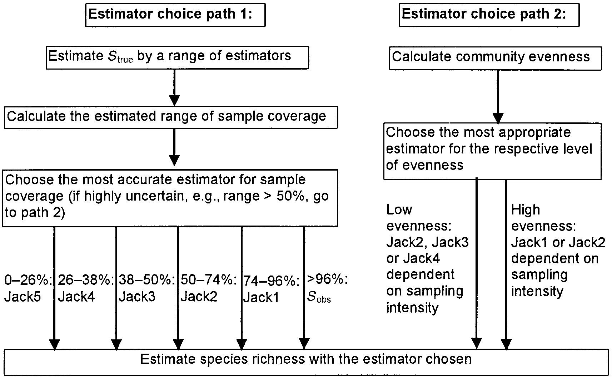
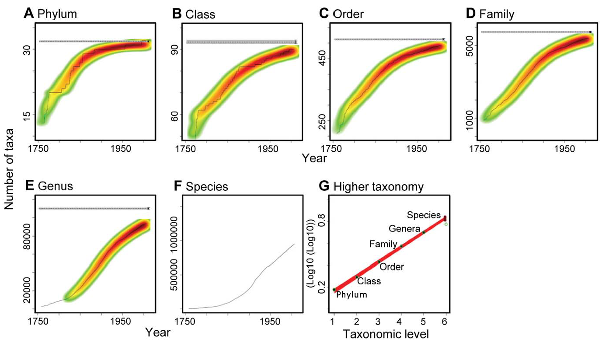
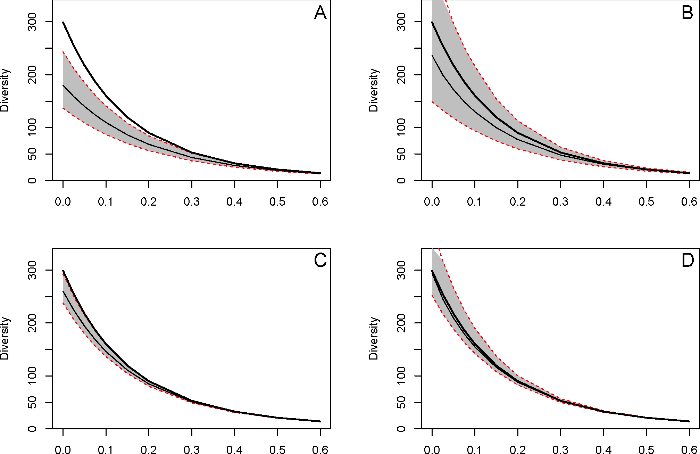
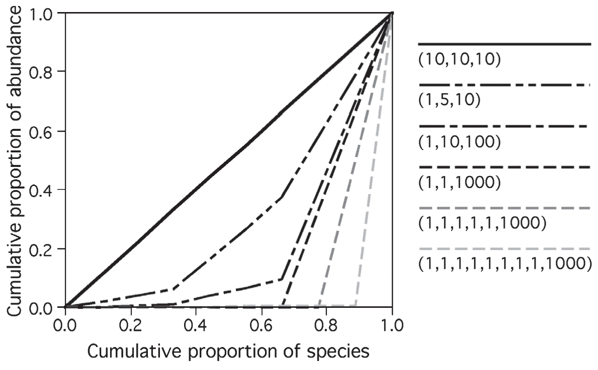

# (PART) Diversité neutre d’une communauté {-}

# Mesures neutres de la diversité $\alpha$ ou $\gamma$ {#chap-MesuresNeutres}

```{r, include=FALSE}
library("tidyverse")
library("gridExtra")
```


```{block, type='Summary'}
Les indices classiques de diversité sont ceux de Shannon et de Simpson, et la richesse spécifique.
Ils peuvent être estimés à partir des données d'inventaire.
L'estimation de la richesse est particulièrement difficile et fait l'objet d'une abondante littérature: les estimateurs non-paramétriques (Chao et Jackknife) sont les plus utilisés.
```

Les mesures classiques [@Peet1974] considèrent que chaque classe d'objets est différente de toutes les autres, sans que certaines soient plus ou moins semblables. 
Dans ce chapitre, les classes seront des espèces. 
Les mesures sont qualifiées de neutres (*species-neutral*) au sens où elles ne prennent en compte aucune caractéristique propre des espèces.
La diversité neutre est souvent appelée diversité taxonomique [@Devictor2010; @Stegen2011], même si le terme peut prêter à confusion avec la diversité phylogénétique, quand la phylogénie se réduit à une taxonomie [@Clarke2001; @Ricotta2003c].

Ce type de mesure n'a de sens qu'à l'intérieur d'un taxocène bien défini: sommer un nombre d'espèces d'insectes à un nombre d'espèces de mammifères a peu d'intérêt.
Ces méthodes ne sont donc pas forcément les plus adaptées à la conservation: à grande échelle, des indicateurs de biodiversité [@Balmford2003] peuvent être plus pertinents. 
D'autre part, les communautés sont considérées comme limitées, avec un nombre d'espèces fini: la courbe d'accumulation des espèces atteint donc théoriquement une asymptote quand l'effort d'inventaire est suffisant.
Cette approche est opposée à celle, traitée dans les chapitres \@ref(chap-Fisher) et suivants, qui considère que la diversité augmente indéfiniment avec la surface [@Williamson2001], que ce soit par changement d'échelle (élargir l'inventaire ajoute de nouvelles communautés) ou, plus théoriquement, parce que les communautés réelles sont considérées comme un tirage aléatoire parmi une infinités d'espèces [@Fisher1943].

Les mesures présentées ici sont les plus utilisées: richesse, indices de Shannon et de Simpson, et l'indice de Hurlbert. 
Elles sont sujettes à des biais d'estimation [@Mouillot1999], notamment (mais pas seulement) à cause des espèces non échantillonnées.

Au chapitre suivant, l'entropie HCDT permettra d'unifier ces mesures et les nombres de Hill, et de leur donner un sens intuitif.


## Richesse spécifique {#sec-Richesse}

La richesse est tout simplement le nombre d'espèces présentes dans le taxocène considéré.
C'est la mesure conceptuellement la plus simple mais pratiquement la plus délicate dans des systèmes très riches comme les forêts tropicales: même avec des efforts d'inventaire considérables, il n'est en général pas possible de relever toutes les espèces rares, ce qui implique de recourir à des modèles mathématiques pour en estimer le nombre.

On ne fait pas de supposition sur la forme de la SAD quand on utilise des méthodes d'estimation non paramétriques. 
Les estimateurs les plus connus sont ceux de @Chao1984 et le *jackknife* [@Burnham1979].

Une alternative consiste à inférer à partir des données les paramètres d'une SAD choisie, et particulièrement le nombre total d'espèces. 
Cette approche est bien moins répandue parce qu'elle suppose le bon choix du modèle et est beaucoup plus intensive en calcul.
Il n'existe pas de meilleur estimateur universel [@OHara2005] et il peut être efficace d'utiliser plusieurs méthodes d'estimation de façon concurrente sur les mêmes données [@Basset2012].


### Techniques d'estimation non paramétrique

Dans le cadre d'un échantillonnage de $n$ individus, on observe $s^{n}_{\ne 0}$ espèces différentes parmi les $S$ existantes. 
Chaque individu a une probabilité $p_s$ d'appartenir à l'espèce $s$.

On ne sait rien sur la loi des $p_s$. 
On sait seulement, comme les individus sont tirés indépendamment les uns des autres, que l'espérance du nombre $n_s$ d'individus de l'espèce $s$ observé dans l'échantillon est $np_s$. 
La probabilité de ne pas observer l'espèce est $(1-p_s)^n$.

Pour les espèces fréquentes, $np_s$ est grand, et les espèces sont observées systématiquement. 
La difficulté est due aux espèces pour lesquelles $np_s$, l'espérance du nombre d'observations, est petit. 
La probabilité de les observer est donnée par la loi binomiale: si $np_s$ est proche de 0, la probabilité d'observer un individu est faible.

Les estimateurs non paramétriques cherchent à tirer le maximum d'information de la distribution des abondances $n_s$ pour estimer le nombre d'espèces non observées. 
Une présentation détaillée du problème et des limites à sa résolution est fournie par @Mao2005 qui concluent notamment que les estimateurs ne peuvent fournir qu'une borne inférieure de l'intervalle des possibles valeurs du nombre réel d'espèces.


#### Chao1 et Chao2

@Chao1984 estime le nombre d'espèces non observées à partir de celles observées 1 ou 2 fois.

Dans un échantillon de taille $n$ résultant d'un tirage indépendant des individus, la probabilité que l'espèce $s$ soit observée $\nu$ fois est obtenue en écrivant la probabilité de tirer dans l'ordre $\nu$ fois l'espèce $s$ puis $n-\nu$ fois une autre espèce, multiplié par le nombre de combinaisons possible pour prendre en compte l'ordre des tirages:
\begin{equation}
  (\#eq:psnu)
  p^{n}_{s, \nu} = \binom{n}{\nu} {p_s^\nu \left( 1-p_s \right)^{n-\nu}}.
\end{equation}


L'espérance du nombre d'espèces observées $\nu$ fois, ${\mathbb E}(s^{n}_{\nu})$, est obtenue en sommant pour toutes les espèces la probabilité de les observer $\nu$ fois:
\begin{equation}
  (\#eq:Esnnu)
  {\mathbb E}\left( s^{n}_{\nu} \right) = \binom{n}{\nu} \sum_s{p_s^\nu \left( 1-p_s \right)^{n-\nu}}.
\end{equation}

Le carré de la norme du vecteur en $S$ dimensions dont les coordonnées sont $(1-p_s)^{n/2}$ est 
$$\sum_s{(1-p_s)^n},$$
c'est-à-dire ${\mathbb E}(s^{n}_{0})$, l'espérance du nombre d'espèces non observées.
Celui du vecteur de coordonnées $p_s (1-p_s)^{n/2-1}$ est 
$$\sum_s{p_s^2(1-p_s)^{n-2}}=\frac{2}{n(n-1)}{\mathbb E}(s^{n}_{2}).$$
Enfin, le produit scalaire des deux vecteurs vaut 
$$\sum_s{p_s(1-p_s)^{n-1}}=\frac{1}{n}{\mathbb E}(s^{n}_{1}).$$
  

L'inégalité de Cauchy-Schwarz (le produit scalaire est inférieur au produit des normes des vecteurs) peut être appliquée aux deux vecteurs (tous les termes sont au carré):
\begin{equation}
  (\#eq:CauchySchwarz)
  \left[ \sum_s{(1-p_s)^n} \right] \left[ \sum_s{p_s^2(1-p_s)^{n-2}} \right] 
   \ge \left[ \sum_s{p_s(1-p_s)^{n-1}} \right]^2,
\end{equation}


d'où
\begin{equation}
  (\#eq:Esn0)
  {\mathbb E}(s^{n}_{0}) 
  \ge \frac{n-1}{n}\frac{\left[ {\mathbb E}(s^{n}_{1}) \right]^2}{2 {\mathbb E}(s^{n}_{2})}.
\end{equation}


L'estimateur est obtenu en remplaçant les espérances par les valeurs observées:

\begin{equation}
  (\#eq:Chao1)
  {\hat{S}}_\mathit{Chao1} 
   = s^{n}_{\ne 0} + \frac{\left(n-1 \right){\left(s^{n}_{1}\right)}^2}{2n{s^{n}_{2}}},
\end{equation}

où $s^{n}_{\ne 0}$ est le nombre d'espèces différentes observé.

Il s'agit d'un estimateur minimum: l'espérance du nombre d'espèces est supérieure ou égale au nombre estimé.

@Beguinot2014 a montré que l'estimateur est sans biais si le nombre d'espèces non observées décroît exponentiellement avec la taille de l'échantillon:
\begin{equation}
  (\#eq:BiaisChao)
  s^{n}_{0} = S e^{-kn},
\end{equation}
où $k$ est un réel strictement positif.
Cette relation est cohérente avec un échantillonnage poissonien dans lequel la densité des individus est constante: voir le chapitre \@ref(chap-Accumulation).

Si aucune espèce n'est observée deux fois, l'estimateur est remplacé par
\begin{equation}
  (\#eq:Chao1sansf2)
  {\hat{S}}_\mathit{Chao1} = s^{n}_{\ne 0} + \frac{\left(n-1\right){s^{n}_{1}}\left(s^{n}_{1}-1\right)}{2n}.
\end{equation}

Si $n$ n'est pas trop petit, les approximations suivantes sont possibles:

\begin{equation}
  (\#eq:Chao1sansn)
  \hat{S}_\mathit{Chao1}
   = {s^{n}_{\ne 0}} + \frac{{\left(s^{n}_{1}\right)}^2}{2s^{n}_{2}}.
\end{equation}

Si aucune espèce n'est observée deux fois, l'estimateur est remplacé [@Chao2004] par

\begin{equation}
  (\#eq:Chao1sansnf2)
  {\hat{S}}_\mathit{Chao1} 
  = {s^{n}_{\ne 0}}+{s^{n}_{1}\left(s^{n}_{1}-1\right)}/{2}.
\end{equation}


La variance de l'estimateur est connue, mais pas sa distribution:

\begin{equation}
  (\#eq:VarChao1)
  \operatorname{Var}{\left({\hat{S}}_\mathit{Chao1}\right)} 
   = {s^{n}_{2}}\left[\frac{1}{2}{\left(\frac{s^{n}_{1}}{s^{n}_{2}}\right)}^2 + {\left(\frac{s^{n}_{1}}{s^{n}_{2}}\right)}^3 + \frac{1}{4}{\left(\frac{s^{n}_{1}}{s^{n}_{2}}\right)}^4\right].
\end{equation}

Si aucune espèce n'est observée deux fois:

\begin{equation}
  (\#eq:VarChao1sansf2)
  \operatorname{Var}{\left({\hat{S}}_\mathit{Chao1}\right)}
  = \frac{s^{n}_{1}\left(s^{n}_{1}-1\right)}{2}
  + \frac{s^{n}_{1}{\left(2s^{n}_{1} -1\right)}^2}{4}
  + \frac{{\left(s^{n}_{1}\right)}^4}{4s^{n}_{\ne 0}}.
\end{equation}

@Chao1987 donne une approximation de l'intervalle de confiance à 95\% en assumant une distribution normale: 

\begin{equation}
  (\#eq:ICChao1)
  s^{n}_{\ne 0}+\frac{{\hat{S}}_\mathit{Chao1}-{s^{n}_{\ne 0}}}{c}\le S\le {s^{n}_{\ne 0}}+\left({\hat{S}}_\mathit{Chao1}-{s^{n}_{\ne 0}}\right)c,
\end{equation}

où

\begin{equation}
  (\#eq:ICChao1c)
  c=e^{t^{n}_{1-{\alpha}/{2}}\sqrt{\ln\left(1+\frac{\operatorname{Var}\left({\hat{S}}_\mathit{Chao1}\right)}{{\left({\hat{S}}_\mathit{Chao1}-{s^{n}_{\ne 0}}\right)}^2}\right)}}.
\end{equation}

@Eren2012 [eq. 8] calculent un intervalle de confiance qui est plus petit quand la valeur maximum théorique du nombre d'espèces est connue, ce qui est rarement le cas en écologie.

@Chao1987 propose un estimateur du nombre d'espèces appliqué aux données de présence-absence (un certain nombre de relevés contiennent seulement l'information de présence ou absence de chaque espèce), appelé Chao2. Il est identique à Chao1 mais $n$ est le nombre de relevés, en général trop petit pour appliquer l'approximation de Chao1.

@Chiu2014a améliorent l'estimateur en reprenant la démarche originale de Chao mais en utilisant un estimateur plus précis du taux de couverture, \@ref(eq:CChao) au lieu de \@ref(eq:CGood):

\begin{equation}
  (\#eq:iChao1)
  {\hat{S}}_\mathit{iChao1} 
  = {\hat{S}}_\mathit{Chao1} 
  + \frac{s^{n}_{3}}{4s^{n}_{4}}\,
  \max\left(s^{n}_{1}-\frac{s^{n}_{2}s^{n}_{3}}{2s^{n}_{4}};0\right).
\end{equation}

@Chao2017 étendent l'applicabilité de l'estimateur Chao2 à des données dans lesquelles les espèces sont notées uniquement comme singletons ou doubletons et plus, sans distinction entre doubletons et espèces plus fréquentes.
Une relation entre le nombre de doubletons et les données disponibles est fournie; sa résolution numérique (le code R nécessaire est disponible avec l'article) permet d'estimer $s^{n}_{2}$ et de l'injecter dans l'estimateur Chao2.


#### L'estimateur ACE

@Chao1992 développent l'estimateur ACE (*Abundance-based coverage estimator*) à travers l'estimation du taux de couverture $C$. 
L'estimateur ACE utilise toutes les valeurs de $^{\nu }s$ correspondant aux espèces rares: concrètement, la valeur limite de $\nu$ notée $\kappa$ est fixée arbitrairement, généralement à 10.

L'estimateur prend en compte le coefficient de variation de la distribution des fréquences (${\hat{p}}_s$): plus les probabilités sont hétérogènes, plus le nombre d'espèces non observées sera grand. 
Finalement:

\begin{equation}
  (\#eq:ACE)
  \hat{S}_{\mathit{ACE}} = s^{n}_{>\kappa} + \frac{s^{n}_{\le\kappa}}{\hat{C}_\mathit{rares}}+\frac{s^{n}_{1}}{{\hat{C}}_\mathit{rares}}{\hat{\gamma}}_\mathit{rares}.
\end{equation}

$s^{n}_{>\kappa}$ est le nombre d'espèces dites abondantes, observées plus de $\kappa$ fois, $s^{n}_{\le\kappa}$ le nombre d'espèces dites rares, observées $\kappa$ fois ou moins. 
$\hat{C}_\mathit{rares}$ est le taux de couverture ne prenant en compte que les espèces rares.

L'estimateur du coefficient de variation est

\begin{equation}
  (\#eq:ACEcv)
  \hat{\gamma}^{2}_\mathit{rares} = \max\left(\frac{s^{n}_{\le\kappa}\sum^{\kappa}_{\nu=1}{\nu\left(\nu-1\right){s^{n}_{\nu}}}}{\hat{C}_\mathit{rares}\left(\sum^{\kappa}_{\nu=1}{\nu s^{n}_{\nu}}\right)\left(\sum^{\kappa}_{\nu=1}{\nu s^{n}_{\nu}}-1\right)}-1; 0\right).
\end{equation}

Lorsque l'hétérogénéité est très forte, un autre estimateur est plus performant:

\begin{equation}
  (\#eq:ACEcv2)
  \tilde{\gamma}^{2}_\mathit{rares} = \max\left({\widehat{\gamma}}^2_\mathit{rares}\left(1+\frac{\left(1-{\hat{C}}_\mathit{rares}\right)\sum^{\kappa}_{\nu=1}{\nu\left(\nu -1\right){s^{n}_{\nu}}}}{{\hat{C}}_\mathit{rares}\left(\sum^{\kappa}_{\nu =1}{\nu s^{n}_{\nu}-1}\right)}\right); 0 \right).
\end{equation}

@Chao2010a conseillent d'utiliser le deuxième estimateur dès que ${\widehat{\gamma}}^2_\mathit{rares}$ dépasse 0,8. 
L'estimateur ACE donne normalement une valeur plus grande que Chao1. 
Si ce n'est pas le cas, la limite des espèces rares $\kappa$ doit être augmentée.


#### L'estimateur jackknife

La méthode jackknife a pour objectif de réduire le biais d'un estimateur en considérant des jeux de données dans lesquels on a supprimé un certain nombre d'observations (ce nombre est l'ordre de la méthode). 
Burnham et Overton [-@Burnham1978; -@Burnham1979] ont utilisé cette technique pour obtenir des estimateurs du nombre d'espèces, appelés jackknife à l'ordre $j$, prenant en compte les valeurs de $s^{n}_{1}$ à $s^{n}_{j}$. 
Les estimateurs du premier et du deuxième ordre sont les plus utilisés en pratique:

\begin{equation}
  (\#eq:Jack1)
  \hat{S}_\mathit{J1} = {s^{n}_{\ne 0}} + \frac{\left(n-1\right){s^{n}_{1}}}{n},
\end{equation}

\begin{equation} 
  (\#eq:Jack2)
  \hat{S}_\mathit{J2} = {s^{n}_{\ne 0}} + \frac{\left(2n-3\right){s^{n}_{1}}}{n} - \frac{{\left(n-2\right)}^{2}s^{n}_{2}}{n\left(n-1\right)}.
\end{equation}

Augmenter l'ordre du jackknife diminue le biais mais augmente la variance de l'estimateur.

@Chao1984 a montré que les estimateurs jackknife pouvaient être retrouvés par approximation de l'indice Chao1.

La variance du jackknife d'ordre 1 est [@Heltshe1983]
\begin{equation} 
  (\#eq:VarJack1)
  \operatorname{Var}{\left( \hat{S}_\mathit{J1} \right)}
  = \frac{n-1}{n} \left( \sum_{j=1}^{n}{j^2 s^{n}_{j}} - \frac{\left( s^{n}_{\ne 0} \right)^2}{n} \right).
\end{equation}

L'estimateur est construit à partir de l'hypothèse selon laquelle le nombre d'espèces non observées est de la forme
$$s^{n}_{0} = \sum_{i=1}^{\infty}{\frac{a_i}{n^i}}.$$

Pour cette raison, @Cormack1989 affirme qu'il n'a pas de support théorique solide.
L'espérance du nombre d'espèces non observées est \@ref(eq:Esnnu) $\sum_s{(1-p_s)^n}$, qui décroît beaucoup plus rapidement que $\sum_{i}{{a_i}/{n^i}}$: l'hypothèse est bien fausse.
En revanche, pour une gamme de $n$ fixée (de la taille de l'inventaire à une taille suffisante pour approcher la richesse asymptotique par exemple), il est toujours possible d'écrire le nombre d'espèces non observées sous la forme d'une série de puissances négatives de $n$, comme dans l'illustration ci-dessous.

Une communauté log-normale, similaire à BCI (300 espèces, écart-type égal à 2) est simulée et un échantillon de 1000 individus est tiré.

```{r BiaisJack1}
library("entropart")
# Ecart-type
sdlog <- 2
# Nombre d'espèces
S <- 300
# Tirage des probabilités log-normales
Ps <- as.ProbaVector(rlnorm(S, 0, sdlog))
# Taille de l'échantillon
N <- 1000
# Tirage d'un échantillon
Ns <- rCommunity(1, size = N, NorP = Ps)
```

L'échantillon est présenté en figure \@ref(fig:BiaisJack1Fig).

Code de la figure \@ref(fig:BiaisJack1Fig):
```{r BiaisJack1Code, eval=FALSE}
autoplot(Ns, Distribution="lnorm")
```

```{r BiaisJack1Fig, echo=FALSE, results='hide', ref.label='BiaisJack1Code', fig.cap="Echantillon de 1000 individus tiré dans une communauté log-normale."}
```


Il est possible de vérifier que l'espérance du nombre d'espèces non observées correspond bien à la moyenne des observations.

```{r BiaisJack2}
# Espérance des espèces non vues
E0 <- (1-Ps)^N
(f0 <- sum(E0))
# Tirage de 1000 échantillons, nombre moyen d'espèces observées
(Sn <- mean(colSums(rmultinom(1000, N, Ps)>0)))
# Vérification: nombre d'espèces observées en moyenne et non observées
Sn+f0
# Nombre total d'espèces dans la communauté
(S <- length(Ps))
```

Le nombre d'espèces non observées peut être écrit sous la forme d'une série de puissances négatives de $n$, comme le prévoit le jackknife, entre deux valeurs de $n$ fixées.

```{r BiaisJack3}
# Echantillonnage de 500 à 5000 individus
n.seq <- 500:5000
# Calcul du nombre d'espèces non observées
Bias <- sapply(n.seq, function(n) sum((1-Ps)^n))
```

Le nombre d'espèces non observées, qui est le biais de l'estimateur de la richesse, est présenté en figure \@ref(fig:BiaisJack3Fig).

Code de la figure \@ref(fig:BiaisJack3Fig):
```{r BiaisJack3Code, eval=FALSE, tidy=FALSE}
ggplot(data.frame(n=n.seq, Biais=Bias, lm1=predict(lm1), 
        lm2=predict(lm2), lm4=predict(lm4)), aes(x=n)) +
  geom_line(aes(y=Biais), col="black", lty=1) +
  geom_line(aes(y=lm1), col="red", lty=2) +
  geom_line(aes(y=lm2), col="orange", lty=3) +
  geom_line(aes(y=lm4), col="blue", lty=4) +
  coord_cartesian(ylim = c(0, 250))
```

La courbe peut être approchée par une série de puissances négatives de $n$ dont quelques termes sont présentés sur la figure.

```{r BiaisJack4, tidy=FALSE}
# Ordre 1
lm1 <- lm(Bias ~ 0 +I(1/n.seq))
# Ordre 2
lm2 <- lm(Bias ~ 0 +I(1/n.seq) + I(1/n.seq^2))
# Ordre 4
summary(lm4 <- lm(Bias ~ 0 +I(1/n.seq) + I(1/n.seq^2) 
                  + I(1/n.seq^3) + I(1/n.seq^4)))
```


(ref:BiaisJack3Fig) Nombre d'espèces non obervées dans un échantillon de taille croissante et sa décomposition en séries de puissances négatives de $n$. Le nombre d'espèces non observées est représenté par la courbe continue noire. Les séries de puissances négatives d'ordre 1 (courbe rouge), 2 (courbe orange) et 4 (courbe bleue) sont représentées en pointillés. Les courbes d'ordre 6 et plus sont confondues avec la courbe noire.
```{r BiaisJack3Fig, echo=FALSE, results='hide', ref.label='BiaisJack3Code', fig.cap="(ref:BiaisJack3Fig)"}
```


L'ajustement est possible pour des valeurs de $n$ différentes mais les coefficients $a_i$ sont alors différents: la forme du biais n'est valide que pour une gamme de valeurs de $n$ fixée.


@Beguinot2016 apporte un autre argument important en faveur du jackknife. 
À condition que $n$ soit suffisamment grand, l'estimateur du nombre d'espèces non observées est une fonction linéaire du nombre d'espèces observées $\nu$ fois: $s^{n}_{1}$ pour le jackknife 1, $2 s^{n}_{1} - s^{n}_{2}$ pour le jackknife 2 et ainsi de suite pour les ordres suivants, contrairement à l'estimateur de Chao.
Grâce à cette propriété, l'estimateur du jackknife est additif quand plusieurs groupes d'espèces disjoints sont pris en compte: l'estimation du nombre d'espèces de papillons et de scarabées inventoriées ensemble est égale à la somme des estimations des deux groupes inventoriés séparément.
Ce n'est pas le cas pour l'estimateur de Chao.

L'estimateur du jackknife est très utilisé parce qu'il est efficace en pratique, notamment parce que son ordre peut être adapté aux données.


#### L'estimateur du bootstrap

L'estimateur du bootstrap [@Smith1984] est
\begin{equation} 
  (\#eq:Smith1984)
  \hat{S}_\mathit{b} = {s^{n}_{\ne 0}} + \sum_s{(1-p_s)^n}.
\end{equation}

Il est peu utilisé parce que le jackknife est plus performant [@Colwell1994]. 


#### Calcul

Ces estimateurs peuvent être calculés de façon relativement simple à l'aide du logiciel SPADE, dans sa version pour R [@Chao2016c].
Le guide de l'utilisateur présente quelques estimateurs supplémentaires et des directives pour choisir. 
Il est conseillé d'utiliser Chao1 pour une estimation minimale, et ACE pour une estimation moins biaisée de la richesse.

Les intervalles de confiance de chaque estimateur sont calculés par bootstrap: même quand la variance d'un estimateur est connue, sa loi ne l'est généralement pas, et le calcul analytique de l'intervalle de confiance n'est pas possible.

Les estimateurs et leurs intervalles de confiance peuvent également être calculés avec le package *vegan* qui dispose pour cela de deux fonctions: `specpool` et `estimateR`. 

`specpool` est basé sur les incidences des espèces dans un ensemble de sites d'observation et donne une estimation unique de la richesse selon les méthodes Chao2, jackknife (ordre 1 et 2) et bootstrap. 
L'écart-type de l'estimateur est également fourni par la fonction, sauf pour le jackknife d'ordre 2.

`estimateR` est basé sur les abondances des espèces et retourne un estimateur de la richesse spécifique par site et non global comme `specpool`.

#### Exemple

On utilise les données de Barro Colorado Island (BCI). 
La parcelle a été divisée en carrés de 1&nbsp;ha. 
Le tableau d'entrée est un `dataframe` contenant, pour chaque espèce d'arbres ($\mathit{DBH}\ge$ 10&nbsp;cm), ses effectifs par carré.

On charge le tableau de données:

```{r Richesse1}
library("vegan")
data(BCI)
```

On utilise la fonction `estimateR` pour calculer la richesse des deux premiers carrés:

```{r Richesse2}
estimateR(BCI[1:2,])
```

Le package *SPECIES* [@Wang2011] permet de calculer les estimateurs jackknife d'ordre supérieur à 2 et surtout choisit l'ordre qui fournit le meilleur compromis entre biais et variance.

Comparaison des fonctions sur l'ensemble du dispositif BCI ($s^{n}_{\ne 0}=225$, $s_{1}=19$):

```{r Richesse3, tidy=FALSE}
specpool(BCI)
library("SPECIES")
# Distribution du nombre d'espèces (vecteur: 
# noms = nombre d'individus
# valeurs = nombres d'espèces ayant ce nombre d'individus)
Ns <- colSums(BCI)
# Mise au format requis (matrice:
# colonne 1 = nombre d'individus
# colonne 2 = nombres d'espèces ayant ce nombre d'individus)
# par la fonction AbdFreqCount dans entropart
jackknife(AbdFreqCount(Ns))
```

Comparaison avec la valeur de l'équation \@ref(eq:Jack1):

```{r VerifJack1}
# Nombre d'espèces par efffectif observé
DistNs <- tapply(Ns, Ns, length)
# Calcul direct de Jack1
sum(DistNs)+DistNs[1]*(sum(BCI)-1)/sum(BCI)
```

La valeur du jackknife 1 fournie par `specpool` est fausse. 
La fonction `jackknife` de *SPECIES* donne le bon résultat, avec un intervalle de confiance calculé en supposant que la distribution est normale ($\pm$ 1,96 écart-type au seuil de 95\%).

L'estimateur du bootstrap est calculable simplement:
```{r Richesse4}
N <- sum(Ns)
Ps <- Ns/N
length(Ps) + sum((1-Ps)^N)
```


#### Choix de l'estimateur {#sec-ChoixEstimateur}

Des tests poussés ont été menés par @Brose2003 pour permettre le choix du meilleur estimateur de la richesse en fonction de la complétude de l'échantillonnage $s^{n}_{\ne 0}/{S}$. 
Les auteurs appellent cette proportion couverture (*coverage*). 
Le terme *completeness* a été proposé par @Beck2010 pour éviter la confusion avec le taux de couverture défini par Good (vu en section \@ref(sec-Couverture)). 
La complétude est inférieure à la couverture: toutes les espèces ont le même poids alors que les espèces manquantes sont plus rares et pénalisent moins le taux de couverture.

(ref:Brose2003) Arbre de décision du meilleur estimateur du nombre d'espèces.
```{r Brose2003, fig.cap="(ref:Brose2003)", echo=FALSE}

```


Dans tous les cas, les estimateurs jackknife sont les meilleurs. 
L'arbre de décision est en figure \@ref(fig:Brose2003) [@Brose2003, fig. 6]. 
Le choix dépend principalement de la complétude (*coverage* sur la figure). 
Une première estimation est nécessaire par plusieurs estimateurs. 
Si les résultats sont cohérents, choisir un estimateur jackknife d'ordre d'autant plus faible que la complétude est grande. 
Au-delà de 96\%, le nombre d'espèces observé est plus performant parce que les jackknifes surestiment $S$. 
S'ils sont incohérents (intervalle des estimations supérieur à 50\% de leur moyenne), le critère majeur est l'équitabilité (voir section \@ref(sec-Equitabilite)). 
Si elle est faible (de l'ordre de 0,5-0,6), les estimateurs jackknife 2 à 4 sont performants, l'ordre diminuant avec l'intensité d'échantillonnage (forte: 10\%, faible: 0,5\% de la communauté). 
Pour une forte équitabilité (0,8-0,9), on préférera jackknife 1 ou 2.

Pour BCI, le nombre d'espèces estimé par jackknife 1 est 244. 
La complétude est ${225}/{244}=92\%$, dans le domaine de validité du jackknife 1 (74\% à 96\%) qui est donc le bon estimateur.

La parcelle 6 de Paracou nécessite l'estimateur jackknife 2:
```{r ParacouJack}
library("SpatDiv")
jackknife(AbdFreqCount(as.AbdVector(Paracou6)))
# Complétude
as.numeric(Richness(Paracou6, Correction = "None")/Richness(Paracou6, Correction = "Jackknife"))
```

@Chiu2014a, à partir d'autres simulations, préfèrent l'utilisation de l'estimateur *iChao1*.
Quand l'échantillonnage est suffisant, les estimateurs de Chao ont l'avantage de posséder une base théorique solide et de fournir une borne inférieure du nombre d'espèces possible.
Dans ce cas, les estimations du jackknife d'ordre 1 sont cohérentes avec celles de Chao.
En revanche, quand l'échantillonnage est insuffisant, l'estimateur jackknife d'ordre supérieur à 1 permet de réduire le biais d'estimation, au prix d'une variance accrue [@Marcon2015a].

Enfin, Beguinot [-@Beguinot2015a; -@Beguinot2016] suggère d'utiliser en règle générale le jacknife 2 (mais ne traite pas les cas dans lesquels l'échantillonnage est trop faible pour justifier un ordre supérieur) tant que  le nombre de singletons est supérieur à $2-\sqrt(2) \approx 0,6$ fois le nombre de doubletons.
Le ratio des singletons sur les doubletons diminue quand l'échantillonnage approche de l'exhaustivité.
Quand le seuil de 0,6 est dépassé, la valeur de l'estimateur de Chao devient supérieur au jacknife 2 et doit être utilisé.
Ce seuil est cohérent avec les règles de @Brose2003.


#### Prédiction de la richesse d'un nouvel échantillon {#sec-Extrapol}

La prédiction du nombre d'espèces $\hat{S'}$ découvert dans une nouvelle placette d'un habitat dans lequel on a déjà échantillonné est une question importante, par exemple pour évaluer le nombre d'espèces préservées dans le cadre d'une mise en réserve, ou évaluer le nombre d'espèces perdues en réduisant la surface d'une forêt.

@Shen2003 proposent un estimateur et le confrontent avec succès à des estimateurs antérieurs. 
On note $\hat{S}^{n}_{0}$ l'estimateur du nombre d'espèces non observées dans le premier échantillon, et $\hat{C}$ l'estimateur de son taux de couverture. 
L'estimateur du nombre d'espèces du nouvel échantillon de $n'$ individus est

\begin{equation}
  \hat{S'} = \hat{S}^{n}_{0} \left[1-{\left(1-\frac{1-\hat{C}}{\hat{S}^{n}_{0}}\right)}^{n'}\right].
\end{equation}

$\hat{S}^{n}_{0}$ est obtenu par la différence entre les nombres d'espèces estimé et observé: $\hat{S}^{n}_{0}=\hat{S}-s^{n}_{\ne 0}$.

Exemple de BCI, suite: combien de nouvelles espèces seront découvertes en échantillonnant plus?

```{r NonObserve}
# Espèces non observées
(NonObs <- jackknife(AbdFreqCount(Ns))$Nhat-length(Ns))
# Taux de couverture
(C <- Coverage(Ns))
```


(ref:NonObsNFig) Nombre de nouvelles espèces découvertes en fonction de l'effort d'échantillonnage supplémentaire (données de BCI). Seulement 7 nouvelles espèces seront observées en échantillonnant 10000 arbres supplémentaires (environ 25 ha en plus des 50 ha de la parcelle qui contiennent 225 espèces).
```{r NonObsNFig, echo=FALSE, results='hide', ref.label='NonObsNCode', fig.cap="(ref:NonObsNFig)"}
```

Le taux de couverture de l'inventaire de BCI est très proche de 100\%, donc peu de nouvelles espèces seront découvertes en augmentant l'effort d'échantillonnage. 
La courbe obtenue est en figure \@ref(fig:NonObsNFig).

Le code R nécessaire pour réaliser la figure est:
```{r NonObsNCode, eval=FALSE, tidy=FALSE}
# Nouvelles espèces en fonction du nombre de nouveaux individus
Sprime <- function(Nprime) NonObs * (1 - (1 - (1 - C)/NonObs)^Nprime)
ggplot(data.frame(x = c(1, 10000)), aes(x)) + 
  stat_function(fun = Sprime) +
  labs(x = "n'", y = "S'")
```

La question de l'extrapolation de la richesse est traitée plus en détail dans les sections \@ref(sec-RarExtrapol) et \@ref(sec-Extrapolation).


### Inférence du nombre d'espèces à partir de la SAD

#### Distribution de Preston

@Preston1948 fournit dès l'introduction de son modèle log-normal une technique d'estimation du nombre total d'espèces par la célèbre méthode des octaves. 
Elle est disponible dans le package *vegan*:

```{r Preston}
veiledspec(colSums(BCI))
```

L'ajustement direct du modèle aux données, sans regroupement par octaves [@Williamson2005], est également possible (figure \@ref(fig:PrestonSansOFig)):

```{r PrestonSansO}
mod.ll <- prestondistr(colSums(BCI))
veiledspec(mod.ll)
```


(ref:PrestonSansOFig) Ajustement du modèle de Preston aux données de BCI.
```{r PrestonSansOFig, echo=FALSE, results='hide', ref.label='PrestonSansO2', fig.cap="(ref:PrestonSansOFig)"}
```

Le code R nécessaire pour réaliser la figure est:
```{r PrestonSansO2, eval=FALSE}
plot(mod.ll)
```


#### Maximum de vraisemblance d'une distribution de Fisher

@Norris1998 supposent que la distribution des espèces suit le modèle de Fisher (voir chapitre \@ref(chap-Fisher)) et infèrent le nombre d'espèces par maximum de vraisemblance non paramétrique (ils ne cherchent pas à inférer les paramètres de la loi de probabilité de $p_s$ mais seulement à ajuster au mieux le modèle de Poisson aux valeurs de ${\hat{p}}_s$ observées).

Le calcul est possible avec la librairie *SPECIES* de R:

```{r NorrisPollock}
# Distribution du nombre d'espèces (vecteur: 
# noms = nombre d'individus
# valeurs = nombres d'espèces ayant ce nombre d'individus)
Ns <- colSums(BCI)
# Mise au format requis (matrice:
# colonne 1 = nombre d'individus
# colonne 2 = nombres d'espèces ayant ce nombre d'individus)
DistNs.SPECIES <- AbdFreqCount(Ns)
# Regroupement de la queue de distribution: la longueur du vecteur est limitée à 25 pour alléger les calculs.
DistNs.SPECIES[25, 2] <- sum(DistNs.SPECIES[25: nrow(DistNs.SPECIES), 2])
DistNs.SPECIES <- DistNs.SPECIES[1:25,]
unpmle(DistNs.SPECIES)
```

Le problème de cette méthode d'estimation est qu'elle diverge fréquemment. 
Les calculs n'aboutissent pas si la queue de distribution n'est pas regroupée (il existe 108 valeurs différentes de $n_s$ dans l'exemple de BCI: aucune des fonctions de *SPECIES* ne fonctionne en l'état).

@Wang2005 ont amélioré sa stabilité en pénalisant le calcul de la vraisemblance:

```{r Wang}
pnpmle(DistNs.SPECIES)
```

Enfin, @Wang2010 perfectionne la technique d'estimation en supposant que les $p_s$ suivent une loi gamma et en estimant aussi ses paramètres. 
La souplesse de la loi gamma permet d'ajuster le modèle à des lois diverses et l'estimateur de Wang est très performant.

Il est disponible dans *SPECIES*: fonction `pcg`. 
Son défaut est qu'il nécessite un très long temps de calcul (plusieurs heures selon les données).

```{r Wang2010, eval=FALSE}
# Calcul long
pcg(DistNs.SPECIES)
```


### Inférence du nombre d'espèces à partir de courbes d'accumulation {#sec-RichesseSAC}

Cette approche consiste à extrapoler la courbe d'accumulation observée.

Le modèle le plus connu est celui de Michaelis-Menten [@Michaelis1913] proposé par @Clench1979. 
En fonction de l'effort d'échantillonnage $n$, évalué en temps (il s'agit de la collecte de papillons), le nombre d'espèces découvert augmente jusqu'à une asymptote égale au nombre d'espèces total:

\begin{equation} 
  S^{n} = S\frac{n}{K+n}.
\end{equation}

$K$ est une constante, que Clench relie à la difficulté de collecte.

L'estimation empirique du modèle de Michaelis-Menten peut être faite avec R^[ Fiche TD de J.R. Lobry: <http://pbil.univ-lyon1.fr/R/pdf/tdr47.pdf>]. 
Les 50 carrés de BCI sont utilisés pour fabriquer une courbe d'accumulation:

```{r Lobry1}
data(BCI)
# Cumul du nombre d'arbres
nArbres <- cumsum(rowSums(BCI))
# Cumul de l'inventaire
Cumul <- apply(BCI, 2, cumsum)
# Nombre d'espèces cumulées
nEspeces <- apply(Cumul, 1, function(x) sum(x>0))
```

Le modèle est ajusté par `nlsfit`. 
Des valeurs de départ doivent être fournies pour $K$ et $\hat{S}$. 
$K$ est la valeur de $n$ correspondant à $\hat{S}^{n} =\hat{S}/2$. 
Une approximation suffisante est $n/4$. 
Pour $\hat{S}$, le nombre total d'espèces inventoriées est un bon choix. 
Le résultat se trouve en figure \@ref(fig:SobLLorFig).

```{r Lobry2}
# Ajustement du modèle
(nlsfit <- nls(nEspeces ~ S * nArbres/(K + nArbres), data = list(nArbres, nEspeces), start = list(K = max(nArbres)/4, S = max(nEspeces))))
```


L'estimation précédente utilise la méthode des moindres carrés, qui suppose l'indépendance des résidus, hypothèses évidemment violée par une courbe d'accumulation [@Colwell1994]. 
L'estimation par le maximum de vraisemblance est plus convenable [@Raaijmakers1987].
Elle utilise la totalité des points de la courbe d'accumulation.
La courbe d'accumulation de BCI est présentée en figure \@ref(fig:specaccumFig).
Ses données sont utilisées ici:

```{r Raaijmakers1}
SAC <- specaccum(BCI, "random")
# Calculs intermédiaires
Yi <- SAC$richness
N <- length(Yi)
Xi <- Yi/(1:N)
Xbar <- mean(Xi)
Ybar <- mean(Yi)
Syy <- sum((Yi-Ybar)^2)
Sxx <- sum((Xi-Xbar)^2)
Sxy <- sum((Xi-Xbar)*(Yi-Ybar))
# Estimations
(Khat <- (Xbar*Syy - Ybar*Sxy)/(Ybar*Sxx - Xbar*Sxy))
(Shat <- Ybar + Khat*Xbar)
```

L'estimation précédente repose sur une approximation numérique.
Le paramètre $K$ peut être estimé plus précisément par résolution numérique de l'équation exacte du maximum de vraisemblance:

```{r Raaijmakers2}
# Equation que Khat doit annuler
f <- function(Khat) Sxy + Khat*Sxx - (Syy +2*Khat*Sxy +Khat*Khat*Sxx)*sum(Xi/(Yi+Khat*Xi)/N)
# Résolution numérique, l'intervalle de recherche doit être fourni
Solution <- uniroot(f, c(0, 1E+7))
(Khat <- Solution$root)
(Shat <- Ybar + Khat*Xbar)
```

Le nombre d'espèces estimé est `r round(Shat, 0)`, inférieur au nombre d'espèces observé.

Pour calculer l'intervalle de confiance, il est plus simple de passer par une transformation linéaire du modèle [@Lineweaver1934]:

\begin{equation}
  (\#eq:Lineweaver1934)
  \left[\frac{1}{\hat{S}^{n}}\right] = \frac{K}{\hat{S}}\left[\frac{1}{n}\right]+\frac{1}{\hat{S}} 
\end{equation}

Le nombre d'espèces est estimé par l'inverse de l'ordonnée à l'origine du modèle.

```{r Lineweaver1}
y <- 1/nEspeces
x <- 1/nArbres
lm1 <- lm(y ~ x)
(S <- 1/lm1$coef[1])
```


(ref:LineweaverFig) Ajustement du même modèle de Michaelis-Menten transformé selon Lineweaver et Burk.
```{r LineweaverFig, echo=FALSE, results='hide', ref.label='Lineweaver2', fig.cap="(ref:LineweaverFig)"}
```

On voit assez clairement que le modèle (figure \@ref(fig:LineweaverFig)) s'ajuste mal quand il est représenté sous cette forme [@Raaijmakers1987].

Le code R nécessaire pour réaliser la figure est:
```{r Lineweaver2, eval=FALSE, tidy = FALSE}
ggplot(data.frame(x, y), aes(x, y)) + 
  geom_point() +
  stat_smooth(method = "lm", col = "red") +
  labs(x = "1/n", y="1/S")
```


Le nombre d'espèces estimé est inférieur au nombre observé, qui ne se trouve même pas dans l'intervalle de confiance à 95\%. 
Le modèle de Michaelis-Menten ne convient pas.

@Soberon1993 développent un cadre théorique plus vaste qui permet d'ajuster la courbe d'accumulation à plusieurs modèles.
Ces modèles sont efficaces empiriquement mais manquent de support théorique pour justifier leur forme.
Le modèle le plus simple est exponentiel négatif.
Si la probabilité de trouver une nouvelle espèce est proportionnelle au nombre d'espèces non encore découvertes, la courbe d'accumulation suit la relation

\begin{equation} 
  (\#eq:Soberon1993a)
  S^{n} = S \left( 1 - e^{Kn} \right).
\end{equation}

Les paramètres peuvent être estimés par la méthode des moindres carrés:
```{r Holdridge}
(nlsexp <- nls(nEspeces ~ S * (1 - exp(K*nArbres)), data = list(nArbres, nEspeces), start = list(S = max(nEspeces), K=-1/1000)))
```


Ce modèle, proposé par @Holdridge1971, sous-estime la richesse parce que la probabilité de découvrir une nouvelle espèce diminue plus vite que le nombre d'espèces restant à découvrir: les dernières espèces sont plus rares et donc plus difficiles à détecter.

Un modèle plus réaliste définit cette probabilité comme une fonction décroissante du nombre d'espèces manquantes.
La fonction la plus simple est une exponentielle négative mais elle ne s'annule jamais et le nombre d'espèces n'a pas d'asymptote.
Un paramètre supplémentaire pour obtenir l'asymptote est nécessaire et aboutir à la relation

\begin{equation} 
  (\#eq:Soberon1993b)
  S^{n} = \frac{1}{z} \ln \left[ \frac{a}{c} - \frac{a-c}{c} e^{-czn} \right].
\end{equation}

Les paramètres à estimer sont $z$, $a$ et $c$. 

```{r Soberon}
(nlslog <- nls(nEspeces ~ 1/z * log(a/c -(a-c)/c*exp(-c*z*nArbres)), data = list(nArbres, nEspeces), start = list(z=.05, a=1, c=.001)))
# Nombre d'espèces
coefs <- coef(nlslog)
log(coefs["a"]/coefs["c"])/coefs["z"]
```


(ref:SobLLorFig) Ajustement des modèle de Michaelis-Menten (trait plein) et de de Soberón et Llorente (pointillés longs: modèle exponentiel négatif; pointillés courts: modèle à trois paramètres) aux données de BCI. Les cercles représentent le nombre d'espèces cumulées en fonction du nombre d'arbres. Le modèle exponentiel négatif (Holdridge) sous-estime la richesse, plus que celui de Michaelis-Menten (Clench). Le modèle à trois paramètres s'ajuste mieux aux données, mais il surestime probablement la richesse.
```{r SobLLorFig, echo=FALSE, results='hide', ref.label='SobLLor', fig.cap="(ref:SobLLorFig)"}
```


L'estimation est cette fois supérieure à celle du jackknife (`r round(SPECIES::jackknife(entropart::AbdFreqCount(Ns, CheckArguments=FALSE))$Nhat, 0)` espèces).

La figure \@ref(fig:SobLLorFig) présente les deux ajustements de modèle de Soberón et Llorente avec celui de Clench. 
L'estimation de la richesse par extrapolation est plus incertaine que par les méthodes non paramétriques. 
Elle est très peu utilisée.

Le code R nécessaire pour réaliser la figure est:
```{r SobLLor, eval=FALSE, tidy=FALSE}
x <- seq(from = 0, to = max(nArbres), length = 255)
NewData <- list(nArbres = x)
ggplot(data.frame(x, 
        MM = predict(nlsfit, newdata = NewData),
        Holdridge = predict(nlsexp, newdata = NewData),
        Soberon = predict(nlslog, newdata = NewData)), 
    aes(x)) +
  geom_point(aes(nArbres, nEspeces), data.frame(nArbres, nEspeces)) +
  geom_line(aes(y = MM)) +
  geom_line(aes(y = Holdridge), lty = 2) +
  geom_line(aes(y = Soberon), lty = 3) +
  labs(x = "Nombre d'arbres", y = "Nombre d'espèces")
```


### Diversité générique

La détermination des genres est plus facile et fiable que celle des espèces, le biais d'échantillonnage moins sensible (le nombre de singletons diminue rapidement en regroupant les données), et les coûts d'inventaire sont généralement largement réduits [@Balmford1996b].
Le choix d'estimer la diversité de taxons de rang supérieur (genres ou même familles au lieu des espèces) est envisageable [@Williams1994].

Empiriquement, la corrélation entre la richesse générique et la richesse spécifique (des angiospermes, des oiseaux et des mammifères) est bonne en forêt tropicale [@Balmford1996a], suffisante pour comparer les communautés, même si la prédiction de la richesse spécifique à partir de la richesse générique est très imprécise. 

@Cartozo2008 ont montré que le nombre de taxons de niveau supérieur (genre par rapport aux espèces, ordres par rapport aux sous-ordres) est universellement proportionnel au nombre de taxons du niveau immédiatement inférieur à la puissance 0,61. Cette relation est validée à l'échelle mondiale pour les systèmes végétaux. La loi de puissance reste valide pour des assemblages aléatoires, c'est donc la conséquence de propriétés mathématiques [@Caldarelli2002], mais la puissance de la relation est plus élevée (les communautés réelles sont plus agrégées du point de vue phylogénétique que sous l'hypothèse nulle d'un assemblage aléatoire) et varie entre les niveaux. 


### Combien y a-t-il d'espèces différentes sur Terre?

La question de l'estimation du nombre total d'espèces génère une abondante littérature. 
@Mora2011 en font une revue et proposent une méthode nouvelle.

Dans chaque règne, le nombre de taxons de niveaux supérieurs (phylums, classes, ordres, familles et même genres) est estimé par des modèles prolongeant jusqu'à leur asymptote les valeurs connues en fonction du temps. 
Cette méthode est applicable jusqu'au niveau du genre (figure \@ref(fig:Mora2011), A à E). 
Le nombre de taxon de chaque niveau est lié à celui du niveau précédent, ce qui est représenté par la figure \@ref(fig:Mora2011), G [@Mora2011, figure 1] sous la forme du relation linéaire entre le logarithme du logarithme du nombre de taxons et le rang (1 pour les phylums, 5 pour les genres). 
La droite est prolongée jusqu'au rang 6 pour obtenir le nombre d'espèces. 
Une façon alternative de décrire la méthode est de dire que le nombre de taxons du niveau $n+1$ est égal à celui du niveau $n$ à la puissance $k$. 
La pente de la droite de la figure est $\ln{k}$. 
Aucune justification de ce résultat majeur n'est donnée par les auteurs, si ce n'est leur vérification empirique.

Le nombre total d'espèces estimé est 8,7 millions, tous règnes confondus, dans la fourchette des estimations précédentes (de 3 à 100 millions), et nécessitant près de 500 ans d'inventaires au rythme actuel des découvertes [@May2011].


(ref:Mora2011) Évolution du nombre de taxons connus en fonction du temps et valeur estimée du nombre total (ligne horizontale grise, A à E). Le nombre d'espèces connues est trop faible pour utiliser cette méthode (F). Il est obtenu par extrapolation de la relation du nombre de taxons d'un niveau à celui du niveau supérieur (G).
```{r Mora2011, fig.cap="(ref:Mora2011)", echo=FALSE}

```

En se limitant aux arbres, l'estimation se monte à 16000 espèces pour l'Amazonie [@TerSteege2013], de l'ordre de 5000 pour l'Afrique et entre 40000 et 53000 pour l'ensemble des tropiques [@Slik2015] (donc pour l'ensemble de la planète, le nombre d'espèces non-tropicales étant négligeable).
Ces estimations sont obtenues par extrapolation du modèle en log-séries (chapitre \@ref(chap-Fisher)) et sont sujettes au paradoxe de Fisher: les espèces représentées par un très petit nombre d'individu dans le modèle, notamment les singletons, sont les plus nombreuses.
Une discussion approfondie est donnée par @Hubbell2015: les espèces récemment apparues au sens du modèle ne sont pas détectables avant plusieurs générations, créant un décalage entre le nombre d'espèces reconnues par la taxonomie et le modèle.

@Wilson2012 compilent les relevés du nombre d'espèces de plantes vasculaires en fonction de la surface et retiennent uniquement les plus riches à chaque échelle spatiale (du millimètre carré à l'hectare).
Ces relevés sont tous situés en forêt tropicale ou en prairie tempérée gérée (les perturbations régulières et modérées y favorisent la diversité, conformément à la théorie de la perturbation intermédiaire [@Connell1978]).
La relation entre le nombre d'espèces et la surface est celle d'Arrhenius.
Son extrapolation à la surface terrestre donne environ 220000 espèces, comparables à l'estimation de 275000 espèces rapportée par Mora et al.


## Indice de Simpson

### Définition

On note $p_s$ la probabilité qu'un individu tiré au hasard appartienne à l'espèce $s$. 
L'indice de @Simpson1949, ou Gini-Simpson, est

\begin{equation}
  (\#eq:SimpsonE)
  E =1-\sum^{S}_{s=1}{p^2_s}.
\end{equation}

Il peut être interprété comme la probabilité que deux individus tirés au hasard soient d'espèces différentes. 
Il est compris dans l'intervalle $\left[0;1\right[$. 
Sa valeur diminue avec la régularité de la distribution: $E=0$ si une seule espèce a une probabilité de 1, $E=1-{1}/{S}$ si les $S$ espèces ont la même probabilité $p_s={1}/{S}$. 
La valeur 1 est atteinte pour un nombre infini d'espèces, de probabilités nulles.

Deux autres formes de l'indice sont utilisées. 
Tout d'abord, la probabilité que deux individus soient de la même espèce, souvent appelée *indice de concentration de Simpson*, qui est celui défini dans l'article original de Simpson:

\begin{equation}
  (\#eq:SimpsonD)
  D =\sum^{S}_{s=1}{p^2_s}.
\end{equation}

L'indice de Simpson est parfois considéré comme une mesure d'équitabilité [@Olszewski2004] mais il varie avec la richesse: cette approche est donc erronnée.
@Hurlbert1971 l'a divisé par sa valeur maximale $1-{1}/{S}$ pour obtenir une mesure d'équitabilité valide généralisée plus tard par @Mendes2008, voir section \@ref(sec-Mendes).
Le nombre d'espèces doit être estimé par les méthodes présentées plus haut, pour ne pas dépendre de la taille de l'échantillon.


L'estimateur du maximum de vraisemblance de l'indice est

\begin{equation}
  (\#eq:EstEML)
  \hat{E} = 1-\sum^{s^{n}_{\ne 0}}_{s=1}{\hat{p}^2_s}.
\end{equation}

Le calcul de l'indice de Simpson peut se faire avec la fonction `diversity` disponible dans le package *vegan* de R ou avec la fonction `Simpson` du package *entropart*:

```{r Simpson}
data(BCI)
# as.ProbaVector() transforme les abondances en probabilités
Ps <- as.ProbaVector(colSums(BCI))
Simpson(Ps)
```

Un historique de la définition de l'indice, de @Gini1912 à Simpson, inspiré par Turing, est fourni par Ellerman [-@Ellerman2013].

### Estimation

Définissons l'indicatrice ${{\mathbf 1}}_{sh}$ valant 1 si l'individu $h$ appartient à l'espèce $s$, 0 sinon.
${{\mathbf 1}}_{sh}$ suit une loi de Bernoulli d'espérance $p_s$ et de variance $p_s\left(1-p_s\right)$. 
$E$ est la somme sur toutes les espèces de cette variance. 
Un estimateur non biaisé d'une variance à partir d'un échantillon est la somme des écarts quadratiques divisée par le nombre d'observation moins une. 
L'estimateur $\hat{E}$ est légèrement biaisé parce qu'il est calculé à partir des ${\hat{p}}_s$, ce qui revient à diviser la somme des écarts par $n$, et non $n-1$. 
Un estimateur non biaisé est [@Good1953; @Lande1996]

\begin{equation} 
  (\#eq:BiaisSimpson)
  \tilde{E} = \left(\frac{n}{n-1}\right)\left(1-\sum^{s^{n}_{\ne 0}}_{s=1}{{\hat{p}}^2_s}\right).
\end{equation}

La correction par ${n}/{\left(n-1\right)}$ tend rapidement vers 1 quand la taille de l'échantillon augmente: l'estimateur est très peu biaisé.

Le non-échantillonnage des espèces rares est pris en compte dans cette correction parce qu'elle considère que $\tilde{E}$ est l'estimateur de variance d'un échantillon et non d'une population complètement connue. 
Il est négligeable: si $p_s$ est petit, $p^2_s$ est négligeable dans la somme.

Simpson a fourni un estimateur non biaisé de $D$, à partir du calcul du nombre de paires d'individus tirés sans remise:

\begin{equation}
  (\#eq:EstSimpson1949)
  \tilde{D} = \frac{\sum^{S}_{s=1}{n_s\left(n_s -1\right)}}{n\left(n-1\right)}.
\end{equation}

L'argumentation est totalement différente, mais le résultat est le même: $\tilde{E}=1-\tilde{D}$.

La fonction `Simpson` de *entropart* accepte comme argument un vecteur d'abondances et propose par défaut la correction de Lande:

```{r Simpsonetntropart}
Simpson(colSums(BCI))
```


## Indice de Shannon

### Définition

L'indice de Shannon [@Shannon1948; @Shannon1963], aussi appelé indice de Shannon-Weaver ou Shannon-Wiener [@Spellerberg2003], ou simplement *entropie* est dérivé de la théorie de l'information:

\begin{equation}
  (\#eq:Shannon)
  H = -\sum^S_{s=1}{p_s\ln{p_s}}.
\end{equation}

Considérons une placette forestière contenant $S$ espèces végétales différentes. 
La probabilité qu'une plante choisie au hasard appartienne à l'espèce $s$ est notée $p_s$. 
On prélève $n$ plantes, et on enregistre la liste ordonnée des espèces des $n$ plantes. 
Si $n$ est suffisamment grand, le nombre de plantes de l'espèce $s$ est $np_s$. 
On note $L$ le nombre de listes respectant ces conditions:

\begin{equation}
  (\#eq:ShannonL)
  L = \frac{n!}{\prod^S_{i=1}{\left({np}_s\right)!}}.
\end{equation}

Ce résultat est obtenu en calculant le nombre de positions possibles dans la liste pour les individus de la première espèce: $\binom{n}{np_1}$. 
Le nombre de positions pour la deuxième espèce est $\binom{n-np_1}{np_2}$. 
Pour la $S$-ième espèce, le nombre est $\binom{n-np_1-\dots -np_{s-1}}{np_i}$.
Les produits de combinaisons se simplifient pour donner l'équation \@ref(eq:ShannonL).

On peut maintenant écrire le logarithme de $L$:
$$\ln{L}=\ln{n!}-\sum^S_{s=1}{\ln{np_s}!}.$$ 
On utilise l'approximation de Stirling, 
$$\ln{n!}\approx n\ln{n}-n,$$
pour obtenir après simplifications:

\begin{equation}
  (\#eq:ShannonlnL)
  \ln{L} = -n\sum^S_{s=1}{p_s \ln{p_s}}.
\end{equation}

$H=(\ln{L})/{n}$ est l'indice de Shannon. 
Ce résultat est connu sous le nom de formule de @Brillouin1962. 
À l'origine, Shannon a utilisé un logarithme de base 2 pour que $H$ soit le nombre moyen de questions binaires (réponse oui ou non) nécessaire pour identifier l'espèce d'une plante (un caractère utilisé dans une chaîne dans le contexte du travail de Shannon). 
Les logarithmes naturels, de base 2 ou 10 ont été utilisés par la suite [@Pielou1966a].

La formule \@ref(eq:ShannonlnL) est celle de l'indice de @Theil1967, présenté en détail par @Conceicao2000, à l'origine utilisé pour mesurer les inégalités de revenu puis pour caractériser les structures spatiales en économie. 
L'indice est proportionnel au nombre de plantes choisies, on peut donc le diviser par $n$ et on obtient l'indice de biodiversité de Shannon. 
Ces indices ont été définis en choisissant des lettres au hasard pour former des chaînes de caractères. 
Leur valeur est le nombre de chaînes de caractères différentes que l'on peut obtenir avec l'ensemble des lettres disponibles, c'est-à-dire la quantité d'information contenue dans l'ensemble des lettres. 
L'indice de Shannon donne une mesure de la biodiversité en tant que quantité d'information.

L'estimateur du maximum de vraisemblance de l'indice est

\begin{equation}
  (\#eq:EstShannonML)
  \hat{H} = -\sum^{s^{n}_{\ne 0}}_{s=1}{\hat{p}_s \ln{\hat{p}_s}}.
\end{equation}

Le calcul de l'indice de Shannon peut se faire avec la fonction `diversity` disponible dans le package *vegan* de R ou avec la fonction `Shannon` de *entropart*:

```{r Shannon}
Ps <- as.ProbaVector(colSums(BCI))
Shannon(Ps)
```

La distribution de l'estimateur est connue [@Hutcheson1970] mais elle est inutile en pratique à cause du biais d'estimation.

@Bulmer1974 établit une relation entre l'indice de Shannon et l'indice $\alpha$ de Fisher, à condition que la distribution de l'abondance des espèces soit log-normale:

\begin{equation}
  (\#eq:Bulmer1974)
  \hat{H} = \mathrm{\Psi}\left(\hat{\alpha}+1\right) - \mathrm{\Psi}\left(1\right).
\end{equation}

$\mathrm{\Psi}(\cdot)$ est la fonction digamma, et $\hat{\alpha}$ est l'estimateur de l'indice de Fisher \@ref(eq:AlphaFisher):

```{r Bulmer}
digamma(fisher.alpha(colSums(BCI))+1)-digamma(1)
```

La sous-estimation est assez sévère sur cet exemple.


### Estimation {#sec-BiaisShannon}

@Basharin1959 a montré que l'estimateur de l'indice de Shannon était biaisé parce que des espèces ne sont pas échantillonnées. 
Si $S$ est le nombre d'espèces réel et $n$ le nombre d'individus échantillonnés, le biais est

\begin{equation}
  (\#eq:Basharin1959)
  \mathbb{E}\left(\hat{H}\right)-H =-\frac{S-1}{2n} + O\left(n^{-2}\right).
\end{equation}

$O\left(n^{-2}\right)$ est un terme négligeable. 
La valeur estimée à partir des données est donc trop faible, d'autant plus que le nombre d'espèces total est grand mais d'autant moins que l'échantillonnage est important.
Comme le nombre d'espèces $S$ n'est pas observable, le biais réel est inconnu.

L'estimateur de Miller-Madow [@Miller1955] utilise l'information disponible, en sous-estimant le nombre d'espèces et donc l'entropie:
\begin{equation}
  (\#eq:MillerMadow)
  \tilde{H} = -\sum^{s^{n}_{\ne 0}}_{s=1}{\hat{p}_s \ln{\hat{p}_s}} + \frac{s^{n}_{\ne 0}-1}{2n}.
\end{equation}


@Chao2003 établissent un estimateur moins biaisé à partir du taux de couverture de l'échantillonnage $\hat{C}$:

\begin{equation}
  (\#eq:ChaoShen)
  \tilde{H} = -\sum_{s=1}^{s^{n}_{\ne 0}}{\frac{\hat{C}{\hat{p}}_s \ln\left(\hat{C}{\hat{p}}_s\right)}{1-\left(1-\hat{C}{\hat{p}}_s\right)^n}}.
\end{equation}

Multiplier les fréquences observées par le taux de couverture permet d'obtenir un estimateur non biaisé des probabilités conditionnellement aux espèces non observées [@Ashbridge2000].

Le terme au dénominateur est la correction de @Horvitz1952: chaque terme de la somme est divisé par la probabilité d'observer au moins une fois l'espèce correspondante. 
Il tend vers 1 quand la taille de l'échantillon augmente.

@Beck2010 montrent que la correction du biais est efficace, même à des niveaux de complétude de l'échantillonnage (voir section \@ref(sec-ChoixEstimateur)) très faibles. @Vu2007 étudient la vitesse de convergence de l'estimateur. 

@Zhang2012 définit l'indice de Simpson généralisé:

\begin{equation}
  (\#eq:zeta)
  \zeta_{u,v} = \sum^S_{s=1}{p^u_s{\left(1-p_s\right)}^v},
\end{equation}

où $\zeta_{u,v}$ est la somme sur toutes les espèces de la probabilité de rencontrer $u$ fois l'espèce dans un échantillon de taille $u+v$. 
L'indice de Shannon peut s'exprimer en fonction de $\zeta_{1,v}$:

\begin{equation}
  (\#eq:HzetaInf)
  H = \sum^{\infty}_{v=1}{\frac{1}{v} \zeta_{1,v}}.
\end{equation}

Les premiers termes de la somme, jusqu'à $v=n-1$ peuvent être estimés à partir des données, les suivants constituent le biais de l'estimateur, qui est caculé en pratique par

\begin{equation}
  (\#eq:Hzetanu)
  H_z = \sum^{n-1}_{v=1}{\frac{1}{v}\left\{\frac{n^{v+1}\left[n-\left(v+1\right)\right]!}{n!}\sum^{s^{n}_{\ne 0}}_{s=1}{p_s\prod^{v-1}_{j=0}{\left(1-{\hat{p}}_s-\frac{j}{n}\right)}}\right\}}.
\end{equation}

@Zhang2013a montre que le biais de l'estimateur $H_z$ est asymptotiquement normal et calcule sa variance. 
@Zhang2013 améliorent l'estimateur en le complétant par un estimateur de son biais, mais les calculs deviennent excessivement complexes. 
@Vinck2012 appliquent la même démarche avec un estimateur bayesien du biais, utilisant un prior aussi plat que possible pour la valeur de l'entropie (et non un prior plat sur les probabilités, qui tire l'estimateur vers l'entropie maximale).
Cet estimateur nécessite de connaître le nombre d'espèces, ce qui empêche son utilisation sur des données d'écologie.

@Pielou1966 a développé une autre méthode de correction de biais lorsque de nombreux relevés de petite taille sont disponibles. 
$\ln{L}$ est calculé pour un relevé choisi aléatoirement puis les données du premier relevé sont ajoutées à celles d'un autre, puis un autre jusqu'à ce que $H=(\ln{L})/{n}$ n'augmente plus: la diversité augmente dans un premier temps mais se stabilise quand l'effet des espèces ajoutées est compensé par celui de la diminution de l'équitabilité due aux espèces présentes dans tous les relevés. 
À partir de ce seuil, l'augmentation de $\ln{L}$ par individu ajouté est calculée pour chaque relevé supplémentaire. 
Son espérance, estimée par sa moyenne calculée en ajoutant tous les relevés disponibles, est $\tilde{H}$.

@Chao2013 utilisent l'estimateur de la pente de la courbe de raréfaction, calculé précédemment [@Chao2012b] pour estimer la richesse spécifique, pour fournir un estimateur extrêmement performant:

\begin{align}
  (\#eq:Chao2013)
  \tilde{H}
  = &-\sum_{s=1}^{s^{n}_{\ne 0}}
    {\frac{n_s}{n}\left(\mathrm{\Psi}\left(n\right) - \mathrm{\Psi}\left(n_s\right)\right)} \\
  &-\frac{s_{1}}{n} {\left(1-A\right)}^{1-n} \left(-{\ln\left( A \right)}-\sum^{n-1}_{r=1}{\frac{1}{r}{\left( 1-A \right)}^r}\right),
\end{align}

où $\mathrm{\Psi}\left(\cdot\right)$ est la fonction digamma et $A$ vaut:

* $2s_{2}/{\left[\left(n-1\right) s_{1} +2s_{2}\right]}$ en présence de singletons et doubletons;
* $2/{\left[\left(n-1\right)\left(s_{1} -1\right)+2\right]}$ en présence de singletons seulement;
* $1$ en absence de singletons et doubletons.

Enfin, la littérature de physique statistique s'est abondamment intéressée à cette question (@Bonachela2008 en font une revue). 
Le problème traité est la non-linéarité de l'indice de Shannon par rapport aux probabilités qui entraine un biais d'estimation. 
La fonction logarithme fournit un exemple simple: l'espérance de $\ln(p_s)$ n'est pas le logarithme de l'espérance de $p_s$ parce que la fonction $\ln$ est concave. 
Chaque estimateur ${\hat{p}}_s$ fluctue autour de $p_s$ mais vaut $p_s$ en moyenne. 
À cause de la concavité, $\ln({\hat{p}}_s)$ est en moyenne inférieur à $\ln(p_s)$: cette relation est connue sous le nom d'inégalité de @Jensen1906. 
L'indice de Shannon est concave (figure \@ref(fig:ShannonFig)) donc son estimateur \@ref(eq:Shannon) est biaisé négativement, même sans prendre en considération les espèces non observées.

(ref:ShannonFig) Courbe de $x\ln x$ entre 0 et 1.
```{r ShannonFig, echo=FALSE, results='hide', message=FALSE, ref.label='ShannonCode',  fig.cap="(ref:ShannonFig)"}
```

Code de la figure \@ref(fig:SACFig):
```{r ShannonCode, eval=FALSE, tidy=FALSE}
ggplot(data.frame(x = c(0.0001, 1)), aes(x)) + 
    stat_function(fun = function(x) -x*log(x)) +
    labs(x = "p", y = "H(p)")
```


Le biais peut être évalué par simulation: 10000 tirages sont réalisés dans une loi normale d'espérance $p_s$ choisie et d'écart-type 0.01. 
Le biais est la différence entre ${-p}_s{\ln  p_s}$ (connu) et la moyenne des 1000 valeurs de $-\hat{p}_s{\ln{\hat{p}}_s}$ (la probabilité est estimée par sa réalisation à chaque tirage). 
La valeur du biais en fonction de $p_s$ est en figure \@ref(fig:ShannonBiaisFig).
Le biais de l'indice de Shannon est la somme des biais pour toutes les probabilités spécifiques de la communauté étudiée, et son calcul est toujours l'objet de recherches.


(ref:ShannonBiaisFig) Biais de $\hat{p}_s \ln\hat{p}_s$ entre 0 et 1.
```{r ShannonBiaisFig, echo=FALSE, results='hide', message=FALSE, ref.label='ShannonBiaisCode',  fig.cap="(ref:ShannonBiaisFig)"}
```

Code de la figure \@ref(fig:ShannonBiaisFig):
```{r ShannonBiaisCode, eval=FALSE, tidy=FALSE}
Biais.p <- function (p) {
    Ps <-rnorm(10000, p, 0.01)
    p * log(p) - mean(Ps * log(Ps))
  }
  Biais <- function (Ps) {
    # Applique Biais.p à chaque valeur de Ps
    sapply(Ps, Biais.p)
  }
  ggplot(data.frame(x = c(0.05, 0.95)), aes(x)) + 
    stat_function(fun = Biais) +
    geom_hline(yintercept = 0, lty = 2) +
    labs(x = "p", y = "Biais")
```


@Grassberger1988 a fourni la correction de référence:

\begin{equation}
  (\#eq:Grassberger1988)
  \tilde{H}
  = -\sum^{s^{n}_{\ne 0}}_{s=1}
  {\frac{n_s}{n}\left(\ln\left(n\right)-\mathrm{\Psi}\left(n_s\right)-\frac{{\left(-1\right)}^{n_s}}{n_s+1}\right)}.
\end{equation}


@Grassberger2003 l'a perfectionnée:

\begin{equation}
  (\#eq:Grassberger2003)
  \tilde{H} 
  = -\sum^{s^{n}_{\ne 0}}_{s=1}
    {\frac{n_s}{n} \left(\mathrm{\Psi}\left(n\right)-\mathrm{\Psi}\left(n_s\right)-{\left(-1\right)}^{n_s}\int^1_0{\frac{t^{n_s-1}}{1+t}\mathop{dt}}\right)}.
\end{equation}

Enfin, @Schurmann2004 l'a généralisée pour définir une famille de corrections dépendant d'un paramètre $\xi$:

\begin{equation}
  (\#eq:Schurmann2004)
  \tilde{H} = -\sum^{s^{n}_{\ne 0}}_{s=1}
    {\frac{n_s}{n} \left(\mathrm{\Psi}\left(n\right)-\mathrm{\Psi}\left(n_s\right)-{\left(-1\right)}^{n_s}\int^{\frac{1}{\xi}-1}_0{\frac{t^{n_s-1}}{1+t}\mathop{dt}}\right)}.
\end{equation}

Le biais d'estimation diminue avec $\xi$ mais l'erreur quadratique augmente. 
Schürmann suggère d'utiliser $\xi=e^{-{1}/{2}}$ comme meilleur compromis.

La fonction `Shannon` permet toutes ces corrections. 
Elle accepte comme argument un vecteur d'abondances (et non de probabilités):

```{r bcShannon}
Shannon(colSums(BCI), Correction = "ChaoWangJost")
Shannon(colSums(BCI), Correction = "Grassberger")
Shannon(colSums(BCI), Correction = "Grassberger2003")
Shannon(colSums(BCI), Correction = "Schurmann")
Shannon(colSums(BCI), Correction = "ZhangHz")
```

D'autres estimateurs peu utilisés en écologie sont disponibles dans le package *entropy* [@Hausser2009]. 
La contraction de Stein [@James1961] consiste à estimer la distribution des probabilités d'occurence des espèces par la pondération optimale entre un estimateur à faible biais et un estimateur à faible variance. 
L'estimateur $\hat{p}_s$ est sans biais mais a une variance importante. 
L'estimateur ${1}/{S}$, si $S$ est connu, est de variance nulle mais est très biaisé. 
Comme le nombre d'espèces est en général inconnu, il doit être estimé par une méthode quelconque, mais de préférence le surestimant plutôt que le sous-estimant. 
L'estimateur de James-Stein (*shrinkage estimator*) optimal est
\begin{equation}
  (\#eq:JamesStein1)
  \tilde{p}_s = \hat{\lambda}\frac{1}{\hat{S}} + \left( 1-\hat{\lambda} \right)\hat{p}_s,
\end{equation}

où
\begin{equation}
  (\#eq:JamesStein2)
  \hat{\lambda} = \frac{1-\sum^{s^{n}_{\ne 0}}_{s=1}{\left( \hat{p}_s \right)^2}}
                  {\left( n-1 \right) \sum^{s^{n}_{\ne 0}}_{s=1}{\left( \frac{1}{\hat{S}} - \hat{p}_s \right)^2}}.
\end{equation}


L'entropie est ensuite simplement estimée par l'estimateur plug-in: $\tilde{H} = -\sum^{s^{n}_{\ne 0}}_{s=1}{\tilde{p}_s \ln{\tilde{p}_s}}$. 
Le calcul sous R est le suivant:

```{r James-Stein1}
library("entropy")
entropy.shrink(colSums(BCI))
```

Le principe même de l'estimation rapproche la distribution de l'équiprobabilité des espèces et donc augmente l'entropie. 
L'estimation précédente ignore les espèces non observées. 
Pour les inclure, le vecteur des abondance doit être allongé par autant de zéros que d'espèces estimées:

```{r James-Stein2}
(S0 <- jackknife(AbdFreqCount(Ns))$Nhat - ncol(BCI))
entropy.shrink(c(colSums(BCI), rep(0, S0)))
```

Les fréquences sont estimées par la fonction `freqs.shrink`. 
Leur utilisation dans l'estimateur plug-in donne le même résultat:
```{r James-Stein3}
PsJS <- freqs.shrink(c(colSums(BCI), rep(0, S0)))
Shannon(as.ProbaVector(PsJS))
```

Appliqué à des données de biodiversité aquatique, l'estimateur de James-Stein obtient de meilleurs résultats que celui de Chao et Shen [@Liu2015] quand l'échantillonnage est réduit.


## Indice de Hurlbert {#sec-Hurlbert}

### Définition

L'indice de @Hurlbert1971 est l'espérance du nombre d'espèces observées dans un échantillon de taille $k$ choisie:

\begin{equation}
  (\#eq:HurlbertSk)
  _{k}S = \sum^S_{s=1}{\left[1-{\left(1-p_s\right)}^k\right]}.
\end{equation}

Chaque terme de la somme est la probabilité d'observer au moins une fois l'espèce correspondante.

L'augmentation de la valeur de $k$ permet de donner plus d'importance aux espèces rares.

L'indice peut être converti en nombre équivalent d'espèces [@Dauby2012], c'est-à-dire le nombre d'espèces équiprobables nécessaire pour obtenir la même diversité, notés $_{k}D$ à partir de la relation

\begin{equation}
  (\#eq:HurlbertD)
  _{k}S = {_{k}D} \left[1-{\left(1-\frac{1}{_{k}D}\right)}^k\right].
\end{equation}

L'équation doit être résolue pour obtenir $_{k}D$ à partir de la valeur de $_{k}S$ estimée, numériquement pour $k>3$.

Dans deux cas particuliers, les nombres équivalents d'espèces de Hurlbert sont identiques aux nombres de Hill: $_{2}D ={^{2}\!D}$ et $_{\infty}D={^{0}\!D}$.

Pour les autres ordres entiers de diversité, il existe une correspondance parfaite entre les deux mesures [@Chao2014, Annexe S2]: la connaissance de l'une permet d'obtenir l'autre. Pour $k>1$, on a [@Leinster2012]

\begin{equation}
  (\#eq:HurlbertDq)
  _{k}S = k + \sum_{q=2}^{k}{\binom{k}{q} (-1)^{q+1} (^{q}\!D)^{1-q}}.
\end{equation}

On a vu que $^{0}\!D$ égale $_{\infty}D$, donc $_{\infty}S={^{0}\!D}$ \@ref(eq:HurlbertD).

Inversement, pour $q>1$:

\begin{equation}
  (\#eq:DqHurlbert)
  (^{q}\!D)^{1-q} = q + \sum_{k=2}^{q}{\binom{q}{k} (-1)^{k+1} {_{k}S}}.
\end{equation}

Pour $q=1$, la relation est [@Mao2007]
\begin{equation}
  (\#eq:Mao2007)
  ^{1}\!H = -1 + \sum_{k=2}^{\infty}{\frac{_{k}S}{k(k-1)}}.
\end{equation}


### Estimation

Hurlbert fournit un estimateur non biaisé de son indice ($n$ est la taille de l'échantillon, $n_s$ le nombre d'individus de l'espèce $s$):

\begin{equation}
  (\#eq:EstHurlbert)
  _k{\tilde{S}}
  = \sum_{s=1}^{s^{n}_{\ne 0}}{\left[1-{\binom{n-n_s}{k}}/{\binom{n}{k}}\right]}.
\end{equation}

@Dauby2012 montrent que cet estimateur est très peu sensible à la taille de l'échantillon, et obtient de meilleurs résultats sur ce point que les estimateurs de Chao et Shen pour l'indice de Shannon ou du nombre d'espèces.
@Smith1977 ont calculé sa variance.

Le calcul de la diversité de Hurlbert est possible dans *entropart*:
```{r Hurlbert}
# Indice de Hurlbert (probabilités)
Hurlbert(as.ProbaVector(colSums(BCI)), k=2)
# Estimateur sans biais (abondances)
Hurlbert(colSums(BCI), k=2)
# Nombre effectif d'espèces
HurlbertD(colSums(BCI), k=2)
```


# Entropie

```{block, type='Summary'}
  L'entropie est la surprise moyenne apportée par l'observation des individus d'une communauté, d'autant plus grande qu'un individu appartient à une espèce plus rare.
  L'entropie HCDT permet d'unifier les indices classiques de diversité: son paramètre, appelé ordre, fixe l'importance donnée aux espèces rares. L'entropie d'ordre 0 est la richesse; celle d'ordre 1, l'indice de Shannon; celle d'ordre 2, celui de Simpson.
  L'entropie est la moyenne du logarithme déformé de la rareté des espèces, définie comme l'inverse de leur probabilité.
  
  L'entropie va de pair avec la diversité au sens strict (Nombres de Hill): le nombre d'espèces équiprobables dont l'entropie est la même que celle de la communauté réelle.
  La diversité est l'exponentielle déformée de l'entropie.
  Les profils de diversité représentent la diversité en fonction de son ordre et permettent la comparaison de communautés.
  
  L'estimation de la diversité est difficile pour des ordres inférieurs à $0,5$ dans des taxocènes très divers comme les arbres des forêts tropicales.
```


L'entropie peut être entendue comme la surprise moyenne fournie par l'observation d'un échantillon. 
C'est intuitivement une bonne mesure de diversité [@Pielou1975]. 
Ses propriétés mathématiques permettent d'unifier les mesures de diversité dans un cadre général.

## Définition de l'entropie

Les textes fondateurs sont @Davis1941 et surtout @Theil1967 en économétrie, et Shannon [-@Shannon1948; -@Shannon1963] pour la mesure de la diversité. 
Une revue est fournie par @Maasoumi1993.

Considérons une expérience dont les résultats possibles sont $\left\{r_1,r_2,\dots ,\ r_S\right\}$. 
La probabilité d'obtenir $r_s$ est $p_s$, et $\mathbf{p}=(p_1,p_2,\dots,p_S)$ est le vecteur composé des probabilités d'obtenir chaque résultat. 
Les probabilités sont connues *a priori*. 
Tout ce qui suit est vrai aussi pour des valeurs de $r$ continues, dont on connaîtrait la densité de probabilité.

On considère maintenant un échantillon de valeurs de $r$. 
La présence de $r_s$ dans l'échantillon est peu étonnante si $p_s$ est grande: elle apporte peu d'information supplémentaire par rapport à la simple connaissance des probabilités. 
En revanche, si $p_s$ est petite, la présence de $r_s$ est surprenante. 
On définit donc une fonction d'information, $I(p_s)$, décroissante quand la probabilité augmente, de $I(0)>0$ (éventuellement $+\infty$) à $I(1)=0$. 
Chaque valeur observée dans l'échantillon apporte une certaine quantité d'information, dont la somme est l'information de l'échantillon. 
@Patil1982 appellent l'information "rareté".

La quantité d'information attendue de l'expérience est $\sum^S_{s=1}{p_s I(p_s) = H(\mathbf{p})}$. 
Si on choisit $I\left(p_s\right)=-\ln\left(p_s\right)$, $H\left(\mathbf{p}\right)$ est l'indice de Shannon, mais bien d'autres formes de $I\left(p_s\right)$ sont possibles. 
$H\left(\mathbf{p}\right)$ est appelée *entropie*. 
C'est une mesure de l'incertitude (de la volatilité) du résultat de l'expérience. 
Si le résultat est certain (une seule valeur $p_S$ vaut 1), l'entropie est nulle. 
L'entropie est maximale quand les résultats sont équiprobables.


Si $\mathbf{p}$ est la distribution des probabilité des espèces dans une communauté, @Patil1982 montrent que:

  * Si $I\left(p_s\right) = (1-p_s)/{p_s}$, alors $H\left(\mathbf{p}\right)$ est le nombre d'espèces $S$ moins 1;
  * Si $I\left(p_s\right)=-\ln\left(p_s\right)$, alors $H\left(\mathbf{p}\right)$ est l'indice de Shannon;
  * Si $I\left(p_s\right)=1-p_s$, alors $H\left(\mathbf{p}\right)$ est l'indice de Simpson.


(ref:IFig) Fonctions d'information utilisées dans le nombre d'espèces (trait plein), l'indice de Shannon (pointillés longs) et l'indice de Simpson (pointillés). L'information apportée par l'observation d'espèces rares décroît du nombre d'espèces à l'indice de Simpson.
```{r IFig, echo=FALSE, results='hide', message=FALSE, ref.label='ICode', fig.cap="(ref:IFig)"}
```

Ces trois fonctions d'information sont représentées en figure \@ref(fig:IFig).

Le code R nécessaire pour réaliser la figure est:
```{r ICode, eval=FALSE}
I0 <- function(p) (1-p)/p
I1 <- function(p) -log(p)
I2 <- function(p) 1-p
ggplot(data.frame(x=c(0, 1)), aes(x)) + 
    stat_function(fun=I0) +
    stat_function(fun=I1, lty=2) +
    stat_function(fun=I2, lty=3) +
    coord_cartesian(ylim=c(0, 10)) +
    labs(x = "p", y="I(p)")
```


(ref:EntropieFig) Valeur de $p_{s}I(p_s)$ dans le nombre d'espèces (trait plein), l'indice de Shannon (pointillés longs) et l'indice de Simpson (pointillés). Les espèces rares contribuent peu, sauf pour le nombre d'espèces.
```{r EntropieFig, echo=FALSE, results='hide', message=FALSE, ref.label='EntropieCode', fig.cap="(ref:EntropieFig)"}
```


La contribution de chaque espèce à la valeur totale de l'entropie est représentée figure \@ref(fig:EntropieFig).

Code R:
```{r EntropieCode, eval=FALSE}
H0 <- function(p) 1-p
H1 <- function(p) -p*log(p)
H2 <- function(p) p*(1-p)
ggplot(data.frame(x=c(0.001, 1)), aes(x)) + 
    stat_function(fun=H0) +
    stat_function(fun=H1, lty=2) +
    stat_function(fun=H2, lty=3) +
    labs(x = "p", y="H(p)")
```


## Entropie relative

Considérons maintenant les probabilités $q_s$ formant l'ensemble $\mathbf{q}$ obtenues par la réalisation de l'expérience. 
Elles sont différentes des probabilités $p_s$, par exemple parce que l'expérience ne s'est pas déroulée exactement comme prévu. 
On définit le gain d'information $I(q_s,p_s)$ comme la quantité d'information supplémentaire fournie par l'observation d'un résultat de l'expérience, connaissant les probabilités *a priori*. 
La quantité totale d'information fournie par l'expérience, $\sum^S_{s=1}{q_sI(q_s,p_s)}=H(\mathbf{q},\mathbf{p})$, est souvent appelée entropie relative. 
Elle peut être vue comme une distance entre la distribution *a priori* et la distribution *a posteriori*. 
Il est possible que les distributions $\mathbf{p}$ et $\mathbf{q}$ soit identiques, que le gain d'information soit donc nul, mais les estimateurs empiriques n'étant pas exactement égaux entre eux, des tests de significativité de la valeur de $\hat{H}(\mathbf{q},\mathbf{p})$ seront nécessaires.

Quelques formes possibles de $H(\mathbf{q},\mathbf{p})$ sont:

* La divergence de Kullback-Leibler [@Kullback1951] connue par les économistes comme l'indice de dissimilarité de @Theil1967:
\begin{equation}
  (\#eq:Theil)
  T = \sum^S_{s=1}{q_{s}\ln\frac{q_s}{p_s}};
\end{equation}
* Sa proche parente, appelée parfois deuxième mesure de Theil [@Conceicao2000], qui inverse simplement les rôles de $p$ et $q$:
\begin{equation}
  (\#eq:Theil2)
  L = \sum^S_{s=1}{p_{s}\ln\frac{p_s}{q_s}}.
\end{equation}


(ref:KullbackLeiblerFig) Valeur de $q\ln(q/p)$ en fonction de $p$ et $q$. La divergence de Kullback-Leibler est la somme de cette valeur pour toutes les espèces
```{r KullbackLeiblerFig, echo=FALSE, message=FALSE, results='hide', ref.label='KullbackLeiblerCode', fig.cap="(ref:KullbackLeiblerFig)", fig.asp=1}
```


L'entropie relative est essentielle pour la définition de la diversité $\beta$ présentée dans le chapitre \@ref(chap-DedompHCDT). 
En se limitant à la diversité $\alpha$, on peut remarquer que l'indice de Shannon est la divergence de Kullback-Leibler entre la distribution observée et l'équiprobabilité des espèces [@Marcon2012a]. 
Les valeurs de chaque terme de la divergence sont représentées en figure \@ref(fig:KullbackLeiblerFig).

Le code R nécessaire pour réaliser la figure est:
```{r KullbackLeiblerCode, eval=FALSE, message=FALSE, fig.asp=1}
p <- q <- seq(0.01, 1, .01)
KB <- function(p, q) p*log(p/q)
xyz <- t(outer(p, q, FUN = "KB"))
library("sp")
image(xyz, col=bpy.colors(n = 100, cutoff.tails = 0.3, alpha = .6), 
      xlab="q", ylab="p", asp=1)
contour(xyz, levels = c(seq(-.3, 0, .1), c(.2, .5), seq(1, 4, 1)), 
        labcex = 1, add=T)
```


## L'appropriation de l'entropie par la biodiversité

@MacArthur1955 est le premier à avoir introduit la théorie de l'information en écologie [@Ulanowicz2001]. 
MacArthur s'intéressait aux réseaux trophiques et cherchait à mesurer leur stabilité: l'indice de Shannon qui comptabilise le nombre de relations possibles lui paraissait une bonne façon de l'évaluer. 
Mais l'efficacité implique la spécialisation, ignorée dans $H$ qui est une mesure neutre (toutes les espèces y jouent le même rôle). 
MacArthur a abandonné cette voie.

Les premiers travaux consistant à généraliser l'indice de Shannon sont dus à @Renyi1961. 
L'entropie d'ordre $q$ de Rényi est

\begin{equation}
^{q}\!R =\frac{1}{1-q\ln\sum^S_{q=1}{p^q_s}}.
\end{equation}

Rényi pose également les axiomes pour une mesure d'entropie $R\left(\mathbf{p}\right)$, où $\mathbf{p}=(p_1,p_2,\dots,p_S)$:

* La symétrie: les espèces doivent être interchangeables, aucune n'a de rôle particulier et leur ordre est indifférent;
* La mesure doit être continue par rapport aux probabilités;
* La valeur maximale est atteinte si toutes les probabilités sont égales.

Il montre que $^{q}\!R$ respecte les 3 axiomes.

@Patil1982 ont montré de plus que:

* L'introduction d'une espèce dans une communauté augmente sa diversité (conséquence de la décroissance de $g(p_s)$);
* Le remplacement d'un individu d'une espèce fréquente par un individu d'une espèce plus rare augmente l'entropie à condition que $R(\mathbf{p})$ soit concave. 
Dans la littérature économique sur les inégalités, cette propriété est connue sous le nom de Pigou-Dalton [@Dalton1920].

@Hill1973 transforme l'entropie de Rényi en *nombres de Hill*, qui en sont simplement l'exponentielle:

\begin{equation}
  (\#eq:Hill1973)
  ^{q}\!D = {\left(\sum^S_{s=1}{p^q_s}\right)}^{\frac{1}{1-q}}.
\end{equation}

Le souci de Hill était de rendre les indices de diversité intelligibles après l'article remarqué de @Hurlbert1971 intitulé "le non-concept de diversité spécifique". 
Hurlbert reprochait à la littérature sur la diversité sa trop grande abstraction et son éloignement des réalités biologiques, notamment en fournissant des exemples dans lesquels l'ordre des communautés n'est pas le même selon l'indice de diversité choisi. 
Les nombres de Hill sont le nombre d'espèces équiprobables donnant la même valeur de diversité que la distribution observée. 
Ils sont des transformations simples des indices classiques:

* $^{0}\!D$ est le nombre d'espèces;
* $^{1}\!D=e^H$, l'exponentielle de l'indice de Shannon;
* $^{2}\!D={1}/{\left(1-E\right)}$, l'inverse de l'indice de concentration de Simpson, connu sous le nom d'indice de @Stoddart1983.

Ces résultats avaient déjà été obtenus avec une autre approche par @MacArthur1965 et repris par @Adelman1969 dans la littérature économique.

Les nombres de Hill sont des "nombres effectifs" ou "nombres équivalents". 
Le concept a été défini rigoureusement par @Gregorius1991, d'après @Wright1931 (qui avait le premier défini la taille effective d'une population): étant donné une variable caractéristique (ici, l'entropie) fonction seulement d'une variable numérique (ici, le nombre d'espèces) dans un cas idéal (ici, l'équiprobabilité des espèces), le nombre effectif est la valeur de la variable numérique pour laquelle la variable caractéristique est celle du jeu de données. 

@Gregorius2014 montre que de nombreux autres indices de diversité sont acceptables dans le sens où ils vérifient les axiomes précédents et, de plus, que la diversité d'un assemblage de communautés est obligatoirement supérieure à la diversité moyenne de ces communautés (l'égalité n'étant possible que si les communautés sont toutes identiques). 
Cette dernière propriété sera traitée en détail dans la partie consacrée à la décomposition de la diversité. 
Ces indices doivent vérifier deux propriétés: leur fonction d'information doit être décroissante, et ils doivent être une fonction strictement concave de $p_s$. 
Parmi les possibilités, $I(p_s) = \cos{(p_s {\pi}/{2})}$ est envisageable par exemple: le choix de la fonction d'information est virtuellement illimité, mais seules quelques unes seront interprétables clairement.

Un nombre équivalent d'espèces existe pour tous ces indices, il est toujours égal à l'inverse de l'image de l'indice par la réciproque de la fonction d'information:

\begin{equation}
  (\#eq:Gregorius2014)
  D = \frac{1}{I^{-1}\left(\sum^S_{s=1}{p_s I(p_s)}\right)}.
\end{equation}

D'autres entropies ont été utlisées, avec plus ou moins de succès.
Par exemple, @Ricotta2003c proposent d'utiliser la fonction d'information $I(p_s)=-\ln(k_s)$ où $k_s$ est la dissimilarité totale de l'espèce $s$ avec les autres (par exemple, la somme des distances aux autres espèces dans un arbre phylogénétique, voir section \@ref(sec-Dphylo)), normalisée pour que $\sum_s{k_s}=1$.
Ainsi, les espèces les plus originales apportent peu d'information, ce qui n'est pas très intuitif.
Les auteurs montrent que leur mesure est la somme de l'entropie de Shannon et de la divergence de Kullback-Leibler entre les probabilités et les dissimilarités des espèces.
@Ricotta2006b ont défini plus tard une entropie augmentant avec l'originalité de chaque espèce, présentée au chapitre \@ref(chap-LeinsterCobbold).


## Entropie HCDT

@Tsallis1988 propose une classe de mesures appelée entropie généralisée, définie par @Havrda1967 pour la première fois et redécouverte plusieurs fois, notamment par @Daroczy1970, d'où son nom *entropie HCDT* (voir @Mendes2008, page 451, pour un historique complet):

\begin{equation}
  (\#eq:HCDT)
  ^{q}\!H = \frac{1}{q-1}\left(1-\sum^S_{s=1}{p^q_s}\right).
\end{equation}

Tsallis a montré que les indices de Simpson et de Shannon étaient des cas particuliers d'entropie généralisée, retrouvant, sans faire le rapprochement [@Ricotta2005], la définition d'un indice de diversité de @Patil1982.

Ces résultats ont été complétés par d'autres et repris en écologie par @Keylock2005 et Jost [-@Jost2006; -@Jost2007]. 
Là encore:

* Le nombre d'espèces moins 1 est $^{0}\!H$;
* L'indice de Shannon est $^{1}\!H$;
* L'indice de Gini-Simpson est $^{2}\!H$.

L'entropie HCDT est particulièrement attractive parce que sa relation avec la diversité au sens strict est simple, après introduction du formalisme adapté (les logarithmes déformés). 
Son biais d'estimation peut être corrigé globalement, et non seulement pour les cas particuliers (nombre d'espèces, Shannon, Simpson). 
Enfin, sa décomposition sera présentée en détail dans le chapitre \@ref(chap-DedompHCDT).

### Logarithmes déformés

L'écriture de l'entropie HCDT est largement simplifiée en introduisant le formalisme des logarithmes déformés [@Tsallis1994]. 
Le logarithme d'ordre $q$ est défini par
\begin{equation}
  (\#eq:lnq)
  \ln_q{x} = \frac{x^{1-q}-1}{1-q},
\end{equation}
dont la forme est identique à la transformation de @Box1964 utilisée en statistiques pour normaliser une variable.

Le logarithme déformé converge vers le logarithme naturel quand $q\to 1$ (figure \@ref(fig:lnqFig)).

Le code R nécessaire pour réaliser la figure est:
```{r lnqCode, eval=FALSE, tidy=FALSE}
ln0 <- function(p) lnq(p, 0)
ln2 <- function(p) lnq(p, 2)
lnm1 <- function(p) lnq(p, -1)
ggplot(data.frame(x = c(0, 1)), aes(x)) + 
    stat_function(fun = log) +
    stat_function(fun = ln0, lty = 2, col = "red") +
    stat_function(fun = ln2, lty = 3, col = "blue") +
    stat_function(fun = lnm1, lty = 4, col = "green") +
    coord_cartesian(ylim = c(-4, 0)) +
    labs(x = "p", y = expression(ln[q](p)))
```


Sa fonction inverse est l'exponentielle d'ordre $q$:

\begin{equation}
  (\#eq:expq)
  e^x_q = \left[ 1+\left( 1-q \right)x \right]^{\frac{1}{1-q}}.
\end{equation}


(ref:lnqFig) Valeur du logarithme d'ordre $q$ de probabilités entre 0 et 1 pour différentes valeurs de $q$: $q = 0$ (pointillés longs rouges), la courbe est une droite; $q = 1$ (trait plein): logarithme naturel; $q = 2$ (pointillés courts bleus): la courbe a la même forme que le logarithme naturel pour les valeurs positives de $q$; $q =-1$ (pointillés alternés verts): la courbe est convexe pour les valeurs négatives de $q$.
```{r lnqFig, echo=FALSE, results='hide', ref.label='lnqCode', fig.cap="(ref:lnqFig)"}
```


Enfin, le logarithme déformé est subadditif:

\begin{equation}
  (\#eq:lnqsubadd)
  \ln_q\left(xy\right)=\ln_q{x}+\ln_q{y}-\left(q-1\right)\left(\ln_q{x}\right)\left(\ln_q{y}\right).
\end{equation}

Ses propriétés sont les suivantes:

\begin{equation}
  (\#eq:lnqinv)
  \ln_q\frac{1}{x}=-x^{q-1}\ln_qx;
\end{equation}

\begin{equation}
  (\#eq:lnqprod)
  \ln_q\left(xy\right)=\ln_q{x}+x^{1-q}\ln_q{y};
\end{equation}

\begin{equation}
  (\#eq:lnqdiv)
  \ln_q\left(\frac{x}{y}\right)=\ln_q{x}-{\left(\frac{x}{y}\right)}^{1-q}\ln_q{y};
\end{equation}

et

\begin{equation}
  (\#eq:expqsum)
  e^{x+y}_q = e_q^x e^{\frac{y}{1+\left(1-q\right)x}}_q.
\end{equation}

Si $q>1$, ${\mathop{\lim}_{x\to +\infty} \left(\ln_q{x}\right)={1}/{\left(q-1\right)}}$, donc $e^x_q$ n'est pas définie pour $x>{1}/{\left(q-1\right)}$.

La dérivée du logarithme déformé est, quel que soit $q$,
\begin{equation}
  (\#eq:lnqprime)
  \ln'_q\left(x\right) = x^{-q}.
\end{equation}

Les dérivées première et seconde de l'exponentielle déformée sont, quel que soit $q$:
\begin{equation}
  (\#eq:expqprime)
  \exp'_q\left(x\right) = \left( e_q^x \right)^{q};
\end{equation}
\begin{equation}
  (\#eq:expqsec)
  \exp''_q\left(x\right) = \left( e_q^x \right)^{2q-1}.
\end{equation}

Ces fonctions sont implémentées dans le package *entropart*: `lnq(x, q)` et `expq(x, q)`.

L'entropie d'ordre $q$ s'écrit

\begin{equation}
  (\#eq:EntropieHCDT)
  ^{q}\!H = \frac{1}{q-1}\left(1-\sum^S_{s=1}{p^q_s}\right)=-\sum_s{p^q_s}\ln_q{p_s}=\sum_s{p_s}\ln_q\frac{1}{p_s}.
\end{equation}

Ces trois formes sont équivalentes mais les deux dernières s'interprètent comme une généralisation de l'entropie de Shannon [@Marcon2014a].

Le calcul de $^{q}\!H$ peut se faire avec la fonction `Tsallis` de la librairie *entropart*:

```{r Tsallis}
Ps <- as.ProbaVector(colSums(BCI))
q <- 1.5
Tsallis(Ps, q)
```


### Entropie et diversité

On voit immédiatement que l'entropie de Tsallis est le logarithme d'ordre $q$ du nombre de Hill correspondant, comme l'entropie de Rényi en est le logarithme naturel:

\begin{equation}
  (\#eq:HlnD)
  ^{q}\!H = \ln_q{^{q}\!D};
\end{equation}

\begin{equation}
  (\#eq:DexpH)
  ^{q}\!D = e_q^{^{q}\!H}.
\end{equation}

L'entropie est utile pour les calculs: la correction des biais d'estimation notamment.
Les nombres de Hill, ou *nombres équivalents d'espèces* ou *nombres effectif d'espèces* permettent une appréhension plus intuitive de la notion de biodiversité [@Jost2006]. 
En raison de leurs propriétés, notamment de décomposition (voir le chapitre \@ref(chap-DedompHCDT)), @Jost2007 les appelle "vraie diversité". 
@Hoffmann2008 critiquent cette définition totalitaire et fournissent une revue historique plus lointaine sur les origines de ces mesures.
@Jost2009 reconnaît qu'un autre terme aurait pu être choisi ("diversité neutre" ou "diversité mathématique" par exemple).

@Dauby2012 écrivent "diversité au sens strict"; @Gregorius2010 "diversité explicite".

Quoi qu'il en soit, les nombres de Hill respectent le principe de réplication (voir @Chao2010, section 3 pour une discussion et un historique): si $I$ communautés de même taille, de même niveau de diversité $D$, mais sans espèces en commun sont regroupées dans une méta-communauté, la diversité de la méta-communauté doit être $I\times D$.

L'intérêt de ces approches est de fournir une définition paramétrique de la diversité, qui donne plus ou moins d'importance aux espèces rares:

* $^{-\infty}\!D={1}/{\min(p_S)}$ est l'inverse de la proportion de la communauté représentée par l'espèce la plus rare (toutes les autres espèces sont ignorées).
Le biais d'estimation est incontrôlable: l'espèce la plus rare n'est pas dans l'échantillon tant que l'inventaire n'est pas exhaustif;
* $^{0}\!D$ est le nombre d'espèces (alors que $^{0}\!H$ est le nombre d'espèces moins 1). C'est la mesure classique qui donne le plus d'importance aux espèces rares: toutes les espèces ont la même importance, quel que soit leur effectif en termes d'individus.
Il est bien adapté à une approche patrimoniale, celle du collectionneur qui considère que l'existence d'une espèce supplémentaire a un intérêt en soi, par exemple parce qu'elle peut contenir une molécule valorisable. 
Comme les espèces rares sont difficiles à échantillonner, le biais d'estimation est très important, et sa résolution a généré une littérature en soi;
* $^{1}\!D$ est l'exponentielle de l'indice de Shannon donne la même importance à tous les individus. 
Il est adapté à une approche d'écologue, intéressé par les interactions possibles: le nombre de combinaisons d'espèces en est une approche satisfaisante.
Le biais d'estimation est sensible;
* $^{2}\!D$ est l'inverse de l'indice de concentration de Gini-Simpson donne moins d'importance aux espèces rares. 
@Hill1973 l'appelle "le nombre d'espèces très abondantes". 
Il comptabilise les interactions possibles entre paires d'individus: les espèces rares interviennent dans peu de paires, et influent peu sur l'indice. 
En conséquence, le biais d'estimation est très petit; de plus, un estimateur non biaisé existe;
* $^{\infty}\!D={1}/{d}$ est l'inverse de l'indice de Berger-Parker [@Berger1970] qui est la proportion de la communauté représentée par l'espèce la plus abondante: $d=\max(\mathbf{p})$. 
Toutes les autres espèces sont ignorées.

Le calcul de $^{q}\!D$ peut se faire avec la fonction `Diversity` de la librairie *entropart*:

```{r Dq}
Ps <- as.ProbaVector(colSums(BCI))
q <- 1.5
Diversity(Ps, q)
```

Les propriétés mathématiques de la diversité ne sont pas celles de l'entropie. 
L'entropie doit être une fonction concave des probabilités comme on l'a vu plus haut, mais pas la diversité (un exemple de confusion est fourni par @Gadagkar1989, qui reproche à $^{2}\!D$ de ne pas être concave). 
L'entropie est une moyenne pondérée par les probabilités de la fonction d'information, c'est donc une fonction linéaire des probabilités, propriété importante pour définir l'entropie $\alpha$ (section \@ref(sec-defalpha)) comme la moyenne des entropies de plusieurs communautés, ou l'entropie phylogénétique (chapitre \@ref(chap-Phyloentropie)) comme la moyenne de l'entropie sur les périodes d'un arbre. 
La diversité n'est pas une fonction linéaire des probabilités: la diversité moyenne n'est en général pas la moyenne des diversités.


### Synthèse

L'inverse de la probabilité d'une espèce, $1/p_s$, définit sa rareté.
L’entropie est la moyenne du logarithme de la rareté:

\begin{equation}
  (\#eq:EntropieRarete)
  ^{q}\!H = \frac{1}{q-1}\left(1-\sum^S_{s=1}{p^q_s}\right)=\sum_s{p_s}\ln_q\frac{1}{p_s}.
\end{equation}

La diversité est son exponentielle:

\begin{equation}
  (\#eq:DexpHSynthese)
  ^{q}\!D = e_q^{^{q}\!H}.
\end{equation}


## Profils de diversité

@Leinster2012, après @Hill1973, @Patil1982, @Tothmeresz1995 et @Kindt2006, recommandent de tracer des profils de diversité, c'est-à-dire la valeur de la diversité $^{q}\!D$ en fonction de l'ordre $q$ (figure \@ref(fig:ProfilDivFig)) pour comparer plusieurs communautés.
Une communauté peut être déclarée plus diverse qu'une autre si son profil de diversité est au-dessus de l'autre pour toutes les valeurs de $q$. 
Si les courbes se croisent, il n'y a pas de relation d'ordre [@Tothmeresz1995].

@Lande2000 montrent que si la diversité de Simpson et la richesse de deux communautés n'ont pas le même ordre, alors les courbes d'accumulation du nombre d'espèces en fonction du nombre d'individus échantillonnés se croisent aussi.

(ref:ProfilDivFig) Profil de diversité calculé pour deux parcelles de Paracou (Parcelle 6: trait plein et Parcelle 18: trait pointillé). La correction du biais d'estimation est celle de Chao et Jost.
```{r ProfilDivFig, echo=FALSE, results='hide', ref.label='ProfilDivCode', fig.cap="(ref:ProfilDivFig)"}
```

Code R pour réaliser la figure \@ref(fig:ProfilDivFig):
```{r ProfilDivCode, eval=FALSE, tidy=FALSE}
q.seq <- seq(0, 2, .1)
  P6D<- CommunityProfile(Diversity, Paracou618.MC$Nsi[, 1], q.seq)
  P18D<- CommunityProfile(Diversity, Paracou618.MC$Nsi[, 2], q.seq)
  autoplot(P6D, xlab = "q", ylab = "Diversité") +
    geom_line(aes(x, y), as.data.frame.list(P18D), lty = 2)
```

@Pallmann2012 ont développé un test statistique pour comparer la diversité de deux communautés pour plusieurs valeurs de $q$ simultanément.

@Liu2006 nomment *séparables* des communautés dont les profils ne se croisent pas.
Ils montrent que des communautés peuvent être séparables en selon un profil de diversité de $^{q}\!D$ sans l'être forcément selon un profil de diversité de Hurlbert (section \@ref(sec-Hurlbert)), et inversement.
Ils montrent que les communautés séparables selon un troisième type de profil, celui de la queue de distribution [@Patil1982], le sont dans tous les cas.
Le profil de la queue de distribution est construit en classant les espèces de la plus fréquente à la plus rare et en traçant la probabilité qu'un individu appartienne à une espèce plus rare que l'espèce en abscisse (figure \@ref(fig:ProfilQueueFig)).


(ref:ProfilQueueFig) Profil de queue de distribution calculé pour les deux parcelles de Paracou (Parcelle 6: trait plein et Parcelle 18: trait pointillé). En abscisse: rang de l'espèce dans le classement de la plus fréquente à la plus rare; en ordonnée: probabilité qu'un individu de la communauté appartienne à une espèce plus rare.
```{r ProfilQueueFig, echo=FALSE, results='hide', ref.label='ProfilQueueCode', fig.cap="(ref:ProfilQueueFig)"}
```

Code R:
```{r ProfilQueueCode, eval=FALSE}
# Elimination des espèces absentes des deux parcelles
  Psi <- as.data.frame(Paracou618.MC$Psi[Paracou618.MC$Ps>0,])
  Psi[,1] %<>% sort %>% cumsum %>% rev
  Psi[,2] %<>% sort %>% cumsum %>% rev
  Psi$x <- 1:nrow(Psi)
  ggplot(Psi, aes(x)) +
    geom_path(aes(y=P006)) +
    geom_path(aes(y=P018), lty=2) +
    labs(x="Espèces", y="Fréquence") +
    scale_x_log10()
```

Les coordonnées des points du profil sont définies par
\begin{equation}
  (\#eq:ProfilQueue)
  y(x) = \sum_{s=x+1}^{S}{p_{[s]}},\ x\in \{0, 1, \dots, S\}.
\end{equation}

$p_{[s]}$ est la probabilité de l'espèce $s$; les espèces sont classées par probabilité décroissante.

Ce profil est exhaustif (toutes les espèces sont représentées) alors que les autres profils de diversité ne sont représentés que pour un intervalle restreint du paramètre et qu'un croisement de courbes peut se produire au-delà.
En revanche, il ne prend pas en compte les espèces non observées.

@Fattorini1999 proposent un test pour comparer deux profils de queue de distribution à partir d'échantillonnages multiples (nécessaires pour évaluer la variance de chacune des probabilités) mais qui néglige les espèces non observées.


## Estimation de l'entropie

### Zhang et Grabchak

@Zhang2014 montrent que toutes les mesures d'entropie usuelles sont des combinaisons linéaires de ${\zeta}_{u,v}$ \@ref(eq:zeta). 
À partir des estimateurs de ${\zeta}_{u,v}$ [@Zhang2010], l'estimateur suivant est proposé pour $h_q=\sum^S_{s=1}{p^q_s}$:

\begin{equation}
  (\#eq:Zhang2014hq)
  \tilde{h}_q = 1+\sum^{s^{n}_{\ne 0}}_{s=1}{\frac{n_s}{n}\sum^{n-n_s}_{v=1}{\left[\prod^v_{i=1}{\frac{i-q}{i}}\right]\left[\prod^v_{j=1}{\left(1-\frac{n_s-1}{n-j}\right)}\right]}}.
\end{equation}

$\tilde{h}_q$ peut ensuite être utilisé pour l'estimation de l'entropie HCDT:
\begin{equation}
  (\#eq:HqZhang)
  ^q\!{\tilde{H}}
  = \frac{1-\tilde{h}_q}{q-1}.
\end{equation}

L'estimateur est asymptotiquement normal et son biais décroit exponentiellement vite.

$\tilde{h}_q$ n'est défini que pour $q\ne 1$. 
L'estimateur corrigé de $^{1}\!H$ est

\begin{equation}
  (\#eq:H1Zhang)
  ^1\!{\tilde{H}} =\sum^{s^{n}_{\ne 0}}_{s=1}{\frac{n_s}{n}\sum^{n-n_s}_{v=1}{\frac{1}{v}\left[\prod^v_{j=1}{1-\frac{n_s-1}{n-j}}\right]}}.
\end{equation}

Cet estimateur est différent de $H_z$ [@Zhang2012].
Il a été également obtenu par d'autres auteurs [@Mao2007; @Vinck2012; @Chao2013, Annexe S1] avec d'autres approches. 

Dans *entropart*, utiliser `Tsallis` et `Diversity`:

```{r bcDiversity}
Tsallis(Paracou618.MC$Ns, q=1, Correction="ZhangGrabchak")
Diversity(Paracou618.MC$Ns, q=1, Correction="ZhangGrabchak")
```


### Chao et Jost {#sec-BiaisHCDT}

@Chao2015 complètent cet estimateur par une estimation du biais résiduel, selon la même démarche que pour l'entropie de Shannon [@Chao2013].
$h_q$ s'écrit sous la forme de la somme infinie des entropies de Simpson généralisées: $h_q = \sum_{k=0}^{\infty}{\binom{q-1}{k}(-1)^k\zeta_{1,k}}$.
Alors que l'estimateur de Zhang et Grabchak ne prend en compte que les $n-1$ premiers termes de la somme pour un estimateur sans biais; @Chao2015, eqn 5, le complètent par une estimation, forcément biaisée, des termes suivants pour obtenir:

\begin{align}
  (\#eq:HqChaoJost)
  ^q\!{\tilde{H}} = 
  &\frac{1}{q-1} \\
  &\left[ 1 -\tilde{h}_q -\frac{s_{1}}{n} {\left( 1-A \right)}^{1-n} \left( A^{q-1} -\sum^{n-1}_{r=0}{ \binom{q-1}{r} {\left(A-1\right)}^r} \right) \right].
\end{align}

La formule du nombre de combinaisons est généralisée aux valeurs de $q-1$ non entières, et vaut par convention 1 pour $r=0$. $A$ vaut:

* $2s_{2}/{\left[\left(n-1\right) s_{1} +2s_{2}\right]}$ en présence de singletons et doubletons;
* $2/{\left[\left(n-1\right)\left(s_{1} -1\right)+2\right]}$ en présence de singletons seulement;
* $1$ en absence de singletons et doubletons.

Cet estimateur est le plus performant. Quand $q \to 1$, il tend vers l'estimateur de l'entropie de Shannon de @Chao2013, équation \@ref(eq:Chao2013).
Quand $q=0$, l'estimateur se réduit à Chao1. Pour toutes les valeurs entières de $q$ supérieures ou égales à 2, il se réduit à l'estimateur \@ref(eq:HqZhang), identique à l'estimateur de Lande pour $q=2$, et est sans biais.

L'estimateur est obtenu à partir de celui du taux de couverture extrapolé (section \@ref(sec-Couverture)) fourni par @Chao2012b, annexe E, sans le détail de la démonstration présenté ici.
L'espérance conditionnelle du taux de couverture dans un échantillon de taille $n+m$ compte-tenu des effectifs observés, notés $\{n_s\}$, est

\begin{equation}
  (\#eq:EspCnm)
  {\mathbb E}\left(C^{n+m} | \{n_s\} \right)
  = C^{n} + \sum_s{p_s [1-(1-p_s)^m] \mathbf{1}(n_s=0)}.
\end{equation}

Le taux de couverture $C^{n}$ est augmenté par l'échantillonnage de $m$ individus supplémentaires si les espèces non échantillonnées (vérifiant $\mathbf{1}(n_s=0)$) sont découvertes (la probabilité de le faire est $1-(1-p_s)^m$).

$\hat{C}^{n} + \sum_s{p_s \mathbf{1}(n_s=0)}$ vaut par définition 1.

Le deuxième terme de la somme est estimé en posant $\hat{p}_s = \hat{\alpha}_0$ pour toutes les espèces non observées, ce qui constitue la même approximation que pour l'estimation de la relation de Good-Turing, équation \@ref(eq:GoodTuring2014).
Alors, $(1-p_s)^m$ est estimé par $(1-\hat{\alpha}_0)^m$ et peut sortir de la somme qui ne contient plus que le terme $\sum_s{p_s}\mathbf{1}(n_s=0)$, estimé par $\hat{\alpha}_0 {s^{n}_{0}} = \frac{s^{n}_{1}}{n}(1 - \hat{\alpha}_1)$.

Les deux estimateurs $\hat{\alpha}_1$ et $\hat{\alpha}_0$ sont égaux à $A$ si le nombre d'espèces non échantillonnées est estimé par l'estimateur Chao1.
On obtient

\begin{align} 
  (\#eq:Cnm)
  {\mathbb E}\left(C^{n+m} \right)
  &= 1-\frac{s^{n}_{1}}{n} 
    \left[ \frac{\left(n-1\right)s^{n}_{1}}{\left(n-1\right)s^{n}_{1}+2s^{n}_{2}} \right]^{n+m} \\
  &= 1-\frac{s^{n}_{1}}{n} \left( 1-A \right)^{m+1}.
\end{align}

L'espérance du taux de couverture est directement liée à l'indice de Simpson généralisé [@Good1953]: ${\mathbb E}(C^{n+m}) = 1 - \zeta_{1,n+m}$.
L'estimateur de $h_q$ est obtenu en remplaçant les termes $\zeta_{1,k}$ de la somme infinie $\sum_{k=n}^{\infty}{\binom{q-1}{k}(-1)^k \zeta_{1,k}}$ par la valeur de $1 -{\mathbb E}(C^{n+m})$ calculée dans l'équation \@ref(eq:Cnm).
La formule obtenue contient le développement en série entière de $[1 - (1-A)^{q-1}]$, ce qui permet d'éliminer la somme infinie et d'obtenir l'estimateur de l'équation \@ref(eq:HqChaoJost) après simplifications [@Chao2015, Appendix S1, Theorem S1.2d].


### Autres méthodes

Deux autres approches sont possibles [@Marcon2014a]:

* Celle de @Chao2003, étendue au-delà de l'entropie de Shannon qui prend en compte les espèces non observées;
* Celle de @Grassberger1988 qui prend en compte la non-linéarité de l'estimateur.

Le domaine de validité des deux corrections est différent. 
Quand $q$ est petit, les espèces rares non observées ont une grande importance alors que $^{q}\!H$ est presque linéaire: la correction de Grassberger disparaît quand $q=0$. 
Quand $q$ est grand (au-delà de 2), l'influence des espèces rares est faible, la correction de Chao et Shen devient négligeable alors que la non-linéarité augmente. 
Un compromis raisonnable consiste à utiliser le plus grand des deux estimateurs.

L'estimateur de Chao et Shen est

\begin{equation}
  (\#eq:HqChaoShen)
  ^q\!{\tilde{H}} =-\sum^{s^{n}_{\ne 0}}_{s=1}{\frac{\hat{C}{\hat{p}}_s \ln_q\left(\hat{C}{\hat{p}}_s\right)}{1-{\left(1-\hat{C}{\hat{p}}_s\right)}^n}}.
\end{equation}

Celui de Grassberger est

\begin{equation}
  (\#eq:Grassberger)
  ^q\!{\tilde{H}}
  = \frac{1-\sum^{s^{n}_{\ne 0}}_{s=1}{\widetilde{p^q_s}}}{q-1},
\end{equation}

où

\begin{equation}
  (\#eq:Estpqs)
  \widetilde{p^q_s}
  = {n_s}^{-q} \left(
    \frac{\mathrm{\Gamma}\left(n_s +1\right)}{\mathrm{\Gamma}\left(n_s -q+1\right)}
    + \frac{{\left(-1\right)}^n \mathrm{\Gamma}\left(1+q\right)\sin{\pi q}}{\pi\left(n+1\right)}  \right).
\end{equation}

$\mathrm{\Gamma}\left(\cdot\right)$ est la fonction gamma. 
L'estimateur est linéaire par rapport à $\widetilde{p^q_s}$: le problème original est donc résolu par la construction de l'estimateur de $p^q_s$, mais celui-ci est biaisé également.

L'estimateur de Chao et Shen peut être amélioré [@Marcon2015a] en estimant mieux les probabilités.
@Chao2014c ont développé un estimateur de la distribution des probabilités à partir de l'estimation du taux de couverture généralisé.
$\hat{C}{\hat{p}}_s$ peut être remplacé par cet estimateur pour réduire le biais de l'estimateur de Chao et Shen.

Enfin, la distribution des espèces non échantillonnées peut être ajoutée en estimant leur nombre et en choisissant une loi.
@Chao2014c ont utilisé l'estimateur Chao1 et une distribution géométrique.
L'estimateur jackknife [@Burnham1979] est plus versatile parce que son ordre peut être adapté aux données quand l'effort d'échantillonnage est trop faible pour que l'estimateur Chao1 soit performant [@Brose2003].
Un simple estimateur plug-in, appelé "estimateur révélé", peut ensuite être appliqué à cette distribution révélée [@Marcon2015a].

L'estimateur du taux de couverture généralisé ne fait aucune hypothèse sur les espèces non observées, et n'utilise que le taux de couverture et la technique de Horvitz-Thompson pour estimer leur contribution.
L'estimateur révélé ne tente aucune correction mais utilise l'estimation la meilleure possible pour la distribution des probabilités.


### Biais des estimateurs

Étant donné la distribution des probabilités des espèces dans la communauté, l'échantillon 
inventorié peut être considéré comme un tirage dans une loi multinomiale, qui contient pas toutes les espèces.
Par simulation à partir d'une distribution connue, il est possible de tirer un grand nombre d'échantillons et de répéter l'estimation de la diversité sur chacun d'eux.
La distribution de la valeur de l'échantillon permet de juger ses performances: son biais moyen (mesuré par rapport à la valeur de référence calculée à partir des probabilités choisies), et sa variabilité (évaluée par sa variance empirique sur les simulations).
Un estimateur performant doit être peu biaisé mais aussi peu variable.
L'erreur quadratique moyenne, somme du carré du biais et de la variance, ou sa racine carrée dont la dimension est celle des données (*root mean square error*: RMSE), est un bon critère de test [voir par exemple @Chao2013, figure 1].

@Haegeman2013 proposent deux estimateurs de la diversité $^{q}\!D$ à partir des courbes de raréfaction et d'extrapolation du nombre d'espèces.
Les deux estimateurs bornent la vraie valeur de $^{q}\!D$ (leur variabilité n'est pas prise en compte, mais elle est négligeable dans le cadre utilisé).
L'estimateur minimal est très proche de celui de Chao et Jost, à la différence que les termes estimant le biais résiduel sont évalués par une approximation numérique.
L'estimateur maximal suppose que tous les individus non échantillonnés appartiennent à une espèce nouvelle, ce qui est effectivement le pire cas possible.
Les deux estimateurs sont appliqués à la diversité de communautés microbiennes (jusqu'à un million d'espèces distribuées selon une loi géométrique) et très sous-échantillonnées (un individu sur $10^{10}$ dans le pire des cas).

Les résultats présentent de très grands intervalles d'estimation (de plusieurs ordres de grandeur) entre la borne inférieure et la borne supérieure, ce qui montre que la méthode est inutilisable pour $q<1$ approximativement.
L'estimateur minimal, qui correspond à l'état de l'art, sous-estime sévèrement la diversité quand l'échantillonnage est faible.
L'estimateur maximal est excessivement conservateur (il est conçu pour borner l'estimation dans la pire hypothèse).

Aux ordres de diversité supérieurs, les estimateurs convergent: même avec de petits échantillons, même en supposant que la richesse de la communauté est la plus grande possible, l'estimation de la diversité est précise dès $q=1$.

Dans des conditions moins difficiles, correspondant à des communautés moins riches (typiquement des forêts tropicales), l'estimation est précise dès $q=0,5$ [@Marcon2015a].
Ces résultats sont développés plus loin.


### Intervalle de confiance des estimateurs

À partir de données d'inventaire, l'estimation du biais est impossible (sinon, le biais serait simplement ajouté à l'estimateur pour le rendre sans biais).
La variabilité de l'estimateur peut être évaluée en générant des communautés par bootstrap et en estimant leur diversité comme dans la méthode précédente.
Les communautés peuvent être simulées par tirage dans une loi multinomiale respectant les probabilités observées [@Marcon2012a; @Marcon2014a].
L'inconvénient est que les espèces dont les probabilités sont petites ne sont pas tirées, ce qui entraîne un nouveau biais d'estimation.
L'estimateur le corrige en partie, le biais d'estimation dû au non échantillonnage des espèces rares de la communauté (corrigé par l'estimateur appliqué aux données réelles) n'est pas accessible.
Il est donc nécessaire de recentrer les valeurs obtenues par simulation autour de la valeur obtenue sur les données.

@Chao2015 proposent une méthode plus élaborée qui consiste à reconstituer la distribution des probabilités de la communauté réelle le mieux possible avant d'en tirer les échantillons simulés.
L'estimateur naïf de la probabilité d'une espèce observée $s$ est $\hat{p}_s = {n_s}/{n}$.
$\hat{p}_s$ est sans biais mais comme on ne dispose que d'une réalisation de la loi, il est préférable de chercher un estimateur sans biais conditionnellement aux espèces observées.
Il est obtenu par @Chao2013 à partir de l'espérance conditionnelle de ${N_s}/{n}$:

\begin{equation}
  (\#eq:Chao2013ENs)
  {\mathbb E} \left( \frac{N_s}{n} | n_s>0 \right)
  = \frac{p_s}{1-(1-p_s)^n}.
\end{equation}

L'estimateur de $p_s$ obtenu est

\begin{equation}
  (\#eq:Chao2013ps)
  \tilde{p}_s
  = \frac{n_s}{n} \left[ {1-\hat{\lambda}\left(1-\frac{n_s}{n}\right)^n} \right],
\end{equation}

où

\begin{equation}
  (\#eq:Chao2013lambda)
  \hat{\lambda}
  = \frac{1-\hat{C}}{\sum_{s=1}^{s^{n}_{\ne 0}} {\frac{n_s}{n} \left(1-\frac{n_s}{n}\right)^n}}.
\end{equation}

$\lambda$ est un paramètre d'un modèle permettant d'estimer les valeurs de $p_i$ à partir de leur espérance conditionnelle et des données. 
Le modèle complet est présenté par @Chao2014c.

Les probabilités des espèces non observées sont considérées comme égales par souci de simplification et parce qu'elles influencent peu la variance des estimateurs.
Leur somme est égale au déficit de couverture, et leur nombre estimé par Chao1.

L'intervalle de confiance de l'estimateur obtenu par cette technique à partir des données permet de connaître sa variabilité, mais pas son biais.
Il n'est absolument pas garanti (et peu probable si l'échantillonnage est faible et $q$ petit) que la vraie valeur de la diversité se trouve dans l'intervalle de confiance.


### Pratique de l'estimation

La conversion de l'estimateur de l'entropie en estimateur de la diversité pose un nouveau problème puisque $^{q}\!D$ n'est pas une transformation linéaire de $^{q}\!H$. 
Ce dernier biais peut être négligé [@Grassberger1988] parce que $^{q}\!H$, l'entropie, est la valeur moyenne de l'information de nombreuses espèces indépendantes et fluctue donc peu à cause de l'échantillonnage, contrairement aux estimateurs des probabilités.

Des simulations menées sur des distributions log-normale ou géométrique de richesse diverses avec des efforts d'échantillonnage variés permettent de tester les estimateurs dans des cas théoriques réalistes [@Marcon2015a].
Un résultat représentatif est donné ici. 

(ref:Estimation) Estimation de la diversité d'une communauté log-normale de 300 espèces. Un inventaire de 500 (en bas) ou 5000 (en haut) individus est répété 1000 fois et la diversité estimée à chaque fois par l'estimateur de Chao-Wang-Jost (à gauche) ou l'estimateur révélé (à droite). La courbe noire en gras représente la vraie diversité de la communauté. La courbe maigre est la moyenne de l'estimation, l'enveloppe grise limitée par les pointillés rouges contient 95\% des valeurs simulées. A: 5000 individus, estimateur de Chao-Wang-Jost. B: 5000 individus, estimateur révélé. C: 500 individus, estimateur de Chao-Wang-Jost. D: 500 individus, estimateur révélé.
```{r Estimation, fig.cap="(ref:Estimation)", echo=FALSE, out.width='100%'}

```


La figure \@ref(fig:Estimation) compare les résultats des deux meilleurs estimateurs à la vraie valeur de la diversité d'une communauté de 300 espèces, dont la distribution log-normale (avec un écart-type dont le logarithme vaut 2) mime une forêt tropicale similaire à Barro-Colorado.
L'effort d'inventaire simulé est de 500 ou 5000 individus (de l'ordre d'un ou dix hectares pour les arbres de diamètre supérieur ou égal à 10&nbsp;cm).
L'estimation ne pose pas de problème avec 5000 individus, bien que Chao-Wang-Jost sous-estime un peu le nombre d'espèces.
L'estimateur révélé est centré sur la vraie valeur, mais avec une plus grande variabilité.

En limitant l'échantillonnage à 500 individus, l'estimateur de Chao-Wang-Jost sous-estime le nombre d'espèces de moitié.
L'estimateur révélé sous-estime beaucoup moins la diversité d'ordre faible, mais son intervalle de confiance est très large.

Dès $q=0,5$, l'estimation est très précise dans tous les cas, même en réduisant l'échantillonnage à 200 individus ou pour des communautés dont la queue de distribution est beaucoup plus longue (résultats non présentés ici).

Les conclusions de ce travail d'évaluation tiennent en deux points.
Dans des conditions réalistes d'inventaire d'arbres en forêt tropicale, les estimateurs de diversité les plus performants sont celui de Chao, Wang et Jost et l'estimateur révélé.
Le premier a une variance plus faible pour les valeurs de $q$ proches de 0 mais est limité par son estimation du nombre d'espèces par l'estimateur Chao1.
Le second est préférable quand le nombre d'espèces estimé par l'estimateur jackknife d'ordre optimal est clairement supérieur (c'est-à-dire, en pratique, quand l'ordre du jacknife optimal est supérieur à 1).
Son biais est alors bien inférieur, au prix d'une variance plus grande.

Dans tous les cas, l'estimation de la diversité aux ordres inférieurs à 0,5 est imprécise, sauf à disposer d'inventaires de taille considérable (de l'ordre de la dizaine d'hectares au moins).

Les fonctions `Tsallis` et `Diversity `de *entropart* acceptent comme argument un vecteur d'abondances (et non de probabilités) et proposent par défaut la correction de Chao et Jost:

```{r bcTsallis}
Tsallis(colSums(BCI), q=1)
Diversity(colSums(BCI), q=1)
```


### MSOM et MSAM

L'utilisation de modèles hiérarchiques bayesiens fondés sur des modèles d'occupation multispécifiques (MSOM) ou des modèles d'abondance multispécifiques (MSAM) progresse dans la littérature récente. 
Ils nécessitent de choisir une loi de probabilité d'observation des espèces compatible avec un échantillonnage non exhaustif, par exemple une loi ZIP (*zero-inflated Poisson*) [@Zhang2014c], dans laquelle l'espérance de la présence de chaque espèce peut être modélisée à son tour comme la conséquence de variables environnementales. 
Une approche alternative consiste à modéliser la probabilité d'observation comme la combinaison d'une probabilité de présence et d'une probabilité de détection [@Broms2014]. 
Ces méthodes ont l'avantage de fournir une distribution de probabilité des paramètres des modèles, et donc de la diversité qui est calculée comme une quantité dérivée. Leur faiblesse est qu'ils dépendent de la loi choisie. Une revue complète est fournie par @Iknayan2014


### Raréfaction et extrapolation {#sec-RarExtrapol}

@Chao2014 étendent l'approche de @Gotelli2001 aux nombres de Hill et fournissent les méthodes nécessaires au calcul de courbes de raréfaction et d'extrapolation de l'estimateur de $^{q}\!D$ en fonction de la taille de l'échantillon ou du taux de couverture.

Les courbes de raréfaction sont obtenues à partir de l'échantillon disponible en simulant la diminution de sa taille. 
Les courbes d'extrapolation simulent l'augmentation de la taille de l'échantillon. 
Elles sont en réalité calculées par raréfaction d'un échantillon hypothétique de taille infinie: un estimateur de $^{q}\!D$ corrigé du biais d'estimation est nécessaire. 
L'article se limite aux valeurs de $q$ égales à 0, 1 ou 2 ou non entières mais supérieures à 2.
Le package *iNEXT* [@Hsieh2014] implémente ces calculs dans R comme le package *entropart* qui améliore l'estimation des ordres non entiers de diversité.


## Autres approches

### L'entropie de Rényi

L'entropie d'ordre $q$ de @Renyi1961 est

\begin{equation}
  (\#eq:Renyi)
  ^{q}\!R =\frac{1}{1-q\ln\sum^S_{q=1}{p^q_s}}.
\end{equation}

C'est le logarithme naturel des nombres de @Hill1973 qui ont été définis à partir d'elle.
L'entropie de Rényi a connu un succès important en tant que seule mesure d'entropie généralisée jusqu'à la diffusion de l'entropie HCDT.
Son défaut est qu'elle n'est pas forcément concave [@Beck2009], ce qui empêche sa décomposition (voir chapitre \@ref(chap-DedompHCDT)).


### L'entropie généralisée des mesures d'inégalité


L'entropie généralisée des économistes, d'ordre $q$, est définie comme

\begin{equation}
  (\#eq:HqEco)
  H_q = \frac{1}{q\left(q-1\right)} \left[\frac{1}{S}\sum^S_{s=1}{\left(\frac{n_s}{\bar{n_s}}\right)^{q}}-1\right].
\end{equation}


C'est en réalité une entropie relative, qui mesure l'écart entre la distribution observée $\{n_s\}$ et sa valeur moyenne. Elle tend vers l'entropie de Theil quand $q \to 1$ et la moyenne des $\ln(\frac{n_s}{\bar{n_s}})$ quand $q \to 0$.
Elle a été conçue pour mesurer les inégalités [@Cowell2000], puis utilisée par exemple pour mesurer la concentration spatiale [@Brulhart2005].

@Maasoumi1993 explicite cet usage et pour comparer la distribution de probabilité observée $\{q_s\}$ à une distribution attendue $\{p_s\}$, plutôt qu'à la distribution uniforme dont toutes les valeurs seraient $\frac{1}{S}$. En posant $r=q-1$, en transformant les abondances $\{n_s\}$ en probabilités $\{q_s\}$ et en choisissant $\{p_s\}$ arbitrairement, on obtient

\begin{equation}
  (\#eq:Maasoumi1993)
  H_r\left(\mathbf{q},\mathbf{p}\right) = \frac{1}{r\left(r+1\right)}\left[\sum^S_{s=1}{q_s{\left(\frac{q_s}{p_s}\right)}^{r}}-1\right].
\end{equation}


@Cressie1984 ont défini une mesure généralisée de qualité d'ajustement (*Goodness of Fit*) de la distribution $\{q_s\}$ à celle de $\{p_s\}$. 
Elle est identique à l'entropie généralisée (à un coefficient 2 près) bien que développée indépendamment pour d'autres motivations.
La statistique de Cressie et Read d'ordre 1 est la divergence de @Kullback1951, celle d'ordre 2 le $\chi^2$ de @Pearson1900.

@Studeny2011 définissent une mesure d'équitabilité comme la divergence entre la distribution observée $\{p_s\}$ et la distribution uniforme, ce qui les ramène à l'entropie de Cowell:

\begin{equation}
  (\#eq:Studeny2011)
  I_r 
  = \frac{1}{r\left(r+1\right)} \left[\sum^S_{s=1}{p_s \left(\frac{p_s}{1/S} \right)^{r}-1 } \right].
\end{equation}


Cette mesure inclut à la fois l'équitabilité et la richesse de la distribution.
Il s'agit donc d'une mesure de diversité, qui est, à une normalisation près, l'écart entre la valeur de l'entropie HCDT d'ordre $q=r+1$ et sa valeur maximale. 
Elle généralise donc l'indice de @Theil1967:

\begin{equation}
  (\#eq:TheilGen)
  I_r = \frac{1}{q S^{1-q}}\left( \ln_q{S} - ^{q}\!H \right).
\end{equation}


### L'entropie de Simpson généralisée {#sec-SimpsonG}

L'entropie de Simpson généralisée a été introduite dans une classe d'indices plus générale \@ref(eq:zeta) par @Zhang2010 et étudiée en détail par @Zhang2014.
L'entropie d'ordre $r>0$ est
\begin{equation}
  (\#eq:zetar)
  \zeta_r = \sum_{s=1}^S p_s (1-p_s)^r.
\end{equation}

Elle se réduit à l'entropie de Simpson pour $r=1$.

La fonction d'information de l'entropie de Simpson généralisée $I(p)=(1-p)^r$ représente la probabilité de n'observer aucun individu de l'espèce de probabilité $p$ dans un échantillon de taille $r$: c'est une mesure intuitive de la rareté.
@Chao2013 ont interprété $\zeta_r$ comme la probabilité qu'un individu échantillonné au rang $r+1$ appartienne à une espèce nouvelle dans une SAC.
$(r+1)\zeta_r$ est aussi l'espérance du nombre de singletons dans un échantillon de taille $(r+1)$.

L'intérêt majeur de cette entropie est qu'elle dispose d'un estimateur non biaisé pour toutes les valeurs de $r$ strictement inférieures à la taille de l'échantillon.
C'est une mesure de diversité valide pour les ordres $r$ strictement inférieurs au nombre d'espèces [@Grabchak2016].
Au-delà, elle ne respecte plus l'axiome d'équitabilité: sa valeur maximale n'est pas obtenue quand les espèces sont équiprobables.

Son nombre effectif d'espèces est
\begin{equation}
  (\#eq:Dzeta)
  ^{r}\!D^{\zeta} = \frac{1}{1 - \zeta_r^{\frac{1}{r}}}.
\end{equation}

L'existence d'un estimateur sans biais et d'un intervalle de confiance calculable analytiquement permet de comparer des profils de diversité de façon robuste quand l'échantillonnage est limité et la richesse élevée.

La figure \@ref(fig:comProfilzetaFig)a montre les profils de diversité (en nombre effectifs d'espèces) des deux parcelles 6 et 18 de Paracou: 1&nbsp;ha inventorié, respectivement 681 et 483 arbres, pour une richesse estimée à 254 et 309 espèces par les estimateurs jackknife d'ordres 2 et 3:
```{r Paracou618S}
NsP6 <- as.AbdVector(Paracou618.MC$Nsi[, 1])
(S6 <- Richness(NsP6, Correction="Jackknife"))
NsP18 <- as.AbdVector(Paracou618.MC$Nsi[, 2])
(S18 <- Richness(NsP18, Correction="Jackknife"))
S <- min(S6, S18)
```

En comparaison, la figure \@ref(fig:comProfilzetaFig)b montre les profils de diversité HCDT des mêmes parcelles.
Ils se chevauchent pour les petits ordres de diversité, ce qui ne permet pas de conclure.


(ref:comProfilzetaFig) Comparaison des profils de diversité des parcelles 6 et 18 de Paracou avec leur intervalle de confiance à 95\%. La parcelle 18 est tracée en rouge, lignes continues, et la 6 en vert, lignes pointillées. (a) Diversité généralisée de Simpson (nombres effectif d'espèces): les profils sont distincts, ce qui permet de conclure que la parcelle 6 est plus diverse que la parcelle 18. (b) Diversité HCDT: les profils se chevauchent jusqu'à $q \approx 0,7$.
```{r comProfilzetaFig, echo=FALSE, results='hide', message=FALSE, ref.label='comProfilzetaCode', fig.cap="(ref:comProfilzetaFig)", out.width='100%', fig.asp=0.5}
```

La diversité est donc estimée jusqu'à l'ordre 253.

Code R pour réaliser la figure \@ref(fig:comProfilzetaFig):
```{r comProfilzetaCode, eval=FALSE, tidy=FALSE}
# Profil P6
library("EntropyEstimation")
zeta6 <- CommunityProfile(GenSimpson, NsP6, 1:(S - 1))
sigma6 <- sapply(1:(S - 1), function(r) GenSimp.sd(NsP6, r))
ic6 <- qnorm(1 - 0.05/2) * sigma6/sqrt(sum(NsP6))
zeta6$low <- zeta6$y - ic6
zeta6$high <- zeta6$y + ic6
# Profil P18
zeta18 <- CommunityProfile(GenSimpson, NsP18, 1:(S - 1))
sigma18 <- sapply(1:(S - 1), function(r) GenSimp.sd(NsP18, r))
ic18 <- qnorm(1 - 0.05/2) * sigma18/sqrt(sum(NsP18))
zeta18$low <- zeta18$y - ic18
zeta18$high <- zeta18$y + ic18
# Transformation en diversité
zeta6D <- zeta6
zeta6D$y <- 1/(1 - (zeta6$y)^(1/zeta6$x))
zeta6D$low <- 1/(1 - (zeta6$low)^(1/zeta6$x))
zeta6D$high <- 1/(1 - (zeta6$high)^(1/zeta6$x))
zeta18D <- zeta18
zeta18D$y <- 1/(1 - (zeta18$y)^(1/zeta18$x))
zeta18D$low <- 1/(1 - (zeta18$low)^(1/zeta18$x))
zeta18D$high <- 1/(1 - (zeta18$high)^(1/zeta18$x))
# Figure
gga <- ggplot() + 
  geom_ribbon(aes(x, ymin = low, ymax = high), 
              as.data.frame.list(zeta18D), alpha = 0.3) +
  geom_line(aes(x, y), as.data.frame.list(zeta18D), col = "red") +
  geom_ribbon(aes(x, ymin = low, ymax = high), 
              as.data.frame.list(zeta6D), alpha = 0.3) +
  geom_line(aes(x, y), as.data.frame.list(zeta6D), col = "darkgreen") +
  labs(x = "Ordre de diversité", 
       y = "Diversité de Simpson généralisée") +
  labs(tag = "a")
# Calcul des profils HCDT
D6 <- CommunityProfile(Diversity, NsP6, NumberOfSimulations = 10,
q.seq=q.seq, Correction = "UnveilJ")
D18 <- CommunityProfile(Diversity, NsP18, NumberOfSimulations = 10,
q.seq=q.seq, Correction = "UnveilJ")
# Figure
ggb <- ggplot(data.frame(x = D6$x, D6$y, D18$y)) +
  geom_ribbon(aes(x, ymin = low, ymax = high), as.data.frame.list(D6), 
              alpha = 0.3) +
  geom_line(aes(x, D6.y), col = "darkgreen", lty = 2) + 
  geom_ribbon(aes(x, ymin = low, ymax = high), as.data.frame.list(D18), 
              alpha = 0.3) +
  geom_line(aes(x, D18.y), col = "red") + 
  labs(x = "Ordre de diversité", y = "Nombre de Hill") +
  labs(tag = "b")
grid.arrange(gga, ggb, ncol = 2)
```


La distribution statistique de la différence d'entropie est connue, et peut donc être tracée (figure \@ref(fig:zetaDiffFig)).
Son intervalle de confiance ne contient jamais la valeur 0, ce qui permet de conclure que la parcelle 18 est plus diverse.


(ref:zetaDiffFig) Différence entre les entropies de Simpson généralisées des parcelles 18 et 6 de Paracou avec son intervalle de confiance à 95\%. La ligne horizontale représente l'hypothèse nulle d'égalité entre les entropies, qui peut être rejetée.
```{r zetaDiffFig, echo=FALSE, results='hide', ref.label='zetaDiffCode', fig.cap="(ref:zetaDiffFig)"}
```

Code R pour réaliser la figure:
```{r zetaDiffCode, eval=FALSE, tidy=FALSE}
# Calcul de P18-P6 avec IC
  Difference <- list(x = zeta18$x, y = zeta18$y-zeta6$y)
  class(Difference) <- class(zeta18)
  icDifference <- qnorm(1-0.05/2)*sqrt(sigma6^2/sum(NsP6) 
                                       + sigma18^2/sum(NsP18))
  Difference$low <- Difference$y - icDifference
  Difference$high <- Difference$y + icDifference
  # Plot
  autoplot(Difference, xlab = "Ordre de diversité", 
           ylab = "Différence d'entropie") + 
    geom_hline(yintercept = 0, col = "blue", lty = 2)
```


La prise en compte des espèces rares est limitée par la valeur maximale de l'ordre $r$ (limité à $S-1$).
Les espèces plus rares ne peuvent pas être prises en compte: le profil de diversité s'arrête là.
Le nombre effectif d'espèces maximum correspond au nombre de Hill d'ordre 0,5 environ.
Les espèces plus rares sont prises en compte dans la partie du profil de diversité HCDT d'ordre inférieur à 0,5 mais son incertitude est grande et son biais très important quand l'échantillonnage est aussi réduit [@Marcon2015a].

L'entropie de Simpson généralisée est donc l'outil le plus approprié pour comparer des profils de diversité de communautés riches et sous-échantillonnées.


### L'entropie par cas

@Rajaram2016 décomposent la diversité de Shannon en produit des contributions de chaque catégorie et proposent une mesure cumulative de la diversité d'une communauté prenant en compte une partie des espèces classées selon un critère pertinent, décrivant leur complexité: par exemple, la diversité des mammifères classés par taille croissante, ou la position dans l'évolution.

La fraction de la communauté dont le cumul des probabilités égale $c$ est prise en compte.
La diversité cumulée est:
\begin{equation}
  (\#eq:Rajaram2016Dc)
  \mathit{D_c} = \prod_c{p_s^{-p_s}}.
\end{equation}

La mesure normalisée est appelée *case-based entropy* en anglais et vaut 
\begin{equation}
  (\#eq:Rajaram2016Cc)
  \mathit{C_c} = \frac{100 D_c}{^{1}\!D}.
\end{equation}

$\mathit{D_c}={^{1}\!D}$ quand toute la communauté est prise en compte ($c=1$).
Les auteurs s'intéressent principalement à la courbe de $C_c$ en fonction de $c$ pour montrer [@Castellani2016] que la contribution à la diversité totale des 40\% des composants les moints complexes de systèmes très divers ("des galaxies au gènes ") atteint toujours au moins 60\%, ce résultat étant interprété comme une loi universelle de limitation de la complexité.

Cette mesure peut être étendue à l'entropie HCDT sans difficulté:
\begin{equation}
  (\#eq:Ccq)
  \mathit{^{q}\!C_{c}} = {\left(\sum_c{p^q_s}\right)}^{\frac{1}{1-q}}.
\end{equation}

La méthode peut être appliquée pour évaluer la contribution de n'importe quel partie de la communauté à la diversité totale.
Il ne s'agit pas d'une décomposition de la diversité au sens classique du terme, qui consiste à partitionner la diversité totale en diversité intra et inter-groupes, mais plutôt d'une façon de prendre en compte les caractéristiques des espèces dans une approche non-neutre.


# Équitabilité {#sec-Equitabilite}

```{block, type='Summary'}
  L'équitabilité mesure l'écart entre la distribution observée et une distribution uniforme.
  
  L'indice de Pielou est la mesure d'équitabilité la plus connue. Il a été généralisé pour permettre de pondérer plus ou moins les espèces rares, de la même façon que l'entropie HCDT.
```


La régularité d'une distribution est une notion intuitivement assez simple: la faiblesse de l'écart entre la distribution réelle et une distribution parfaitement régulière [@Lloyd1964], vérifiant $p_s={1}/{S}$.
Des difficultés apparaissent quand il s'agit de comparer l'équitabilité de communautés de richesses différentes.
L'approche axiomatique est présentée, puis les différents indices de la littérature et enfin la généralisation de l'indice de Pielou, en cohérence avec l'entropie HCDT.


## Approche axiomatique

Une approche axiomatique a été développée par la littérature, revue par @Jost2010 ou @Tuomisto2012 Les propriétés fondamentales sont les critères de @Dalton1920:

* L'équitabilité augmente quand un individu est transféré d'une espèce fréquente à une espèce rare;
* L'équitabilité diminue quand une espèce rare est ajoutée;
* Invariance d'échelle: l'équitabilité ne dépend que des fréquences, pas des abondances absolues.


(ref:Tuomisto2012) Courbes de Lorenz de plusieurs jeux de données. Les espèces sont classées par fréquence croissante, et la courbe représente la fréquence cumulée des espèces. Plus la courbe est loin de la bissectrice, plus le jeu de données est inéquitable.
```{r Tuomisto2012, fig.cap="Tuomisto2012", echo=FALSE}

```

Un critère supplémentaire établi par @Smith1996, complété par @Gosselin2001 est la compatibilité avec la courbe de @Lorenz1905, construite en classant les espèces de la moins fréquente à la plus fréquente, et en traçant le cumul des fréquences en fonction du rang [figure \@ref(fig:Tuomisto2012), @Tuomisto2012]: une communauté parfaitement équitable est représentée par la bissectrice.
La surface entre la courbe réelle et la bissectrice est très utilisée en économie pour mesurer l'inégalité sous le nom d'"indice de Gini" [@Gini1912; @Ceriani2012]:

* Compatibilité avec la courbe de Lorenz: l'équitabilité augmente pour une communauté si sa courbe de Lorenz est plus proche de la bissectrice. 
Si les courbes de deux communautés se croisent, l'ordre de leurs équitabilités est imprévisible.

Ce critère est remis en cause par @Ricotta2004: il est incompatible [@Routledge1983] avec le critère de continuité retenu pour les mesures de diversité: l'introduction d'une espèce supplémentaire avec une probabilité infinitésimale peut modifier considérablement l'équitabilité.

L'invariance par réplication est une propriété nécessaire (mais pas suffisante) à la compatibilité avec la courbe de Lorenz [@Ricotta2004]:

  * Invariance par réplication: l'équitabilité ne change pas si chaque espèce est remplacée par plusieurs nouvelles espèces ayant la même abondance.

Cette propriété est retenue par Tuomisto mais rejetée par Jost comme par Ricotta et d'autres.
L'argumentation de Jost est la plus convaincante: une communauté d'une richesse donnée dans laquelle tous les individus (à l'exception d'un nombre négligeable) sont concentrés dans une seule espèce atteint le niveau minimum d'équitabilité. 
Si elle est dupliquée, les individus seront répartis dans deux espèces et non une: la nouvelle communauté n'atteindra pas le niveau minimum d'équitabilité, il est donc souhaitable que la mesure d'équitabilité augmente.


## Indice classiques

### Indice de Bulla

L'indice d'équitabilité de @Bulla1994 respecte les critères de Smith et Wilson:
\begin{equation}
  (\#eq:Bulla)
  O = \sum_s{\min(p_s,\frac{1}{S})}.
\end{equation}

Il mesure l'écart entre la distribution réelle et une distribution parfaitement équitable.
Bulla le normalise pour qu'il soit compris entre 0 et 1:
\begin{equation}
  (\#eq:BullaNorm)
  E_O = \frac{O - \min{O}}{1 - \min{O}}.
\end{equation}

La valeur minimale de $O$ est ${1}/{S}$.
Bulla considère que ce n'est pas le cas si les effectifs sont entiers et fournit une valeur exacte dépendant du nombre d'espèces.


### Indice de Gini

L'indice de Gini est le double de la surface comprise entre la courbe de Lorenz et la bissectrice (figure \@ref(fig:Tuomisto2012)).


### Rapports de moyennes

@Taillie1979 propose le rapport de la moyenne géométrique ou de la moyenne harmonique à la moyenne arithmétique des probabilités.

### Ratios de Hill

@Hill1973 utilise les rapports entre nombres effectifs d'espèces d'ordres différents comme mesure d'équitabilité.
$E_{1,0} = {^{1}\!D}/{^{0}\!D}$ avait déjà été proposé par @Sheldon1969.
@Peet1974 le normalise en retirant au numérateur et au dénominateur leur valeur minimale, c'est-à-dire 1.

La version normalisée de $E_{2,1}$ est recommandée par @Alatalo1981.

### Synthèse

@Ricotta2001 testent ces indices sur 65 jeux de données différents pour observer leurs corrélations.
Tous sont compatibles avec la courbe de Lorenz.
Ils concluent que les indices se répartissent en deux groupes: la plupart sont sensibles aux abondances relatives des espèces rares.
$E_{\infty,0}$ et, dans une moindre mesure, $E_{2,0}$ sont plus sensibles aux espèces fréquentes.


## Indice alternatifs

### Variance de la rareté

@Engen1977 définit comme mesure d'équitabilité la variance de la rareté (la fonction d'information) de l'entropie de Shannon ($-\ln p$):
\begin{equation}
  (\#eq:Engen1977)
  E_\mathit{VS} = \sum_{s}{p_s(\ln p_s)^2}-(\sum_s{p_s \ln p_s})^2.
\end{equation}

Sa valeur est nulle si les espèces sont équiprobables.

@Ricotta2003b généralise cette mesure aux autres fonctions d'information.
Toutes peuvent être utilisées:

\begin{equation}
  (\#eq:Ricotta2003b)
  E_\mathit{VR} = \sum_{s}{p_s I(p_s)^2}-[\sum_s{p_s I(p_s)}]^2.
\end{equation}

Ces mesures ne sont pas invariantes par réplication mais sont continues par rapport aux probabilités.


### Non-spécificité

@Ricotta2004 propose un indice fondé sur les ensembles flous, utilisant les mesures de spécificité [@Yager1992].
Les espèces sont classées par probabilité décroissante. La mesure de non-spécificité utilisable comme mesure d'équitabilité est

\begin{equation}
  (\#eq:Ricotta2004)
  E_\mathit{NSp} = \sum_{s=1}^{S-1}{\frac{p_s-p_{s+1}}{s}}.
\end{equation}

Cet indice n'est pas invariant par réplication mais est continu par rapport aux probabilités.


## Indice de Pielou

Une expression de l'équitabilité est souvent donnée à partir de l'indice de Shannon [@Lloyd1964; @Sheldon1969; @Pielou1966a; @Pielou1975]. 
La valeur maximale de l'indice de Shannon est obtenue quand la distribution est parfaitement régulière. 
Alors: $H_{\max}=\ln S$. 
On a donc défini l'indice, souvent appelé "indice de Pielou":

\begin{equation}
  (\#eq:JPielou)
  J = \frac{H}{H_{\max}} = \frac{H}{\ln S}.
\end{equation}

$J$ est compris entre 0 (une seule espèce a une probabilité de 1) et 1 (toutes les espèces ont la même probabilité).


## Généralisation de l'indice de Pielou

### Mendes et al. {#sec-Mendes}

@Mendes2008 généralisent l'indice de Pielou en remplaçant l'indice de Shannon par l'entropie de Tsallis. 
Ils définissent

\begin{equation}
  (\#eq:JMendes2008)
  ^{q}\!J^{*} = \frac{^{q}\!H}{^{q}H_{\max}} = \frac{^{q}\!H}{\ln_q{S}}
\end{equation}

et tracent des profils d'équitabilité, c'est-à-dire la valeur de $^{q}\!J^{*}$ en fonction de $q$. 
Ils observent que l'équitabilité est minimale pour une valeur particulière de $q$ qu'ils notent $q^*$ et montrent sur des exemples simulés que $q^*$ diminue avec la richesse de la communauté, mais sans en explorer complètement les propriétés.

$^{2}\!J^{*}$ est l'indice d'équitabilité dérivé de l'indice de diversité de Simpson par @Hurlbert1971.

### Tuomisto

Tuomisto argumente en faveur d'une définition stricte de l'équitabilité (*evenness* en anglais, *equitability* pouvant être utilisé dans un sens plus large) en tant que ratio de Hill:

\begin{equation}
  (\#eq:TuomistoEq)
  ^{q}\!E = E_{q,0}
  = \frac{^{q}\!D}{^{0}\!D}
  = \frac{^{q}\!D}{S}.
\end{equation}

L'équitabilité d'ordre $q$ est le rapport de la diversité d'ordre $q$ sur la richesse.

L'idée fondamentale de la notion d'équitabilité est que la mesure de la diversité doit pouvoir être partitionnée en deux composantes indépendantes: la richesse et l'équitabilité [@Smith1996]. 

### Jost


(ref:ProfilIneqFig) Profil d'inéquitabilité de BCI: L'inéquitabilité augmente quand on néglige de plus en plus les espèces rares. Pour q=2, la forêt de BCI est aussi inéquitable qu'une communauté de 6 espèces dans laquelle une seule serait représentée au-delà d'un nombre négligeable d'individus.
```{r ProfilIneqFig, echo=FALSE, results='hide', ref.label='ProfilIneqCode', fig.cap="(ref:ProfilIneqFig)"}
```

@Jost2010 montre que l'indépendance est impossible dans le cadre de la décomposition multiplicative: si $^{q}\!E={^{q}\!D/{S}}$, sa valeur minimale est contrainte par le nombre d'espèces, une communauté pauvre ne peut pas être aussi inéquitable qu'une communauté riche (propriété déjà montrée par @Sheldon1969 ou @Alatalo1981).
En revanche, la richesse peut être partitionnée de façon indépendante en diversité et inéquitabilité: $S={^{q}\!D}/{^{q}\!E}$.

L'inéquitabilité $1/{^{q}\!E}$ (figure \@ref(fig:ProfilIneqFig)) est un nombre effectif d'espèces: c'est la richesse d'une communauté du même niveau d'équitabilité que la communauté réelle dans laquelle tous les individus (sauf un nombre négligeable) appartiendraient à une seule espèce.

Code R pour la figure \@ref(fig:ProfilIneqFig):
```{r ProfilIneqCode, eval=FALSE}
# Estimation du nombre d'espèces
Ns <- colSums(BCI)
UBNs <- jackknife(AbdFreqCount(Ns), k=1)$Nhat
# Profil
Inq <- DivPrf <- CommunityProfile(Diversity, Ns)
Inq$y <- UBNs/DivPrf$y
autoplot(Inq, xlab="Ordre de diversité", ylab="Inéquitabilité")
```


### Synthèse

L'indice de Pielou est le plus utilisé [@Tuomisto2012] mais n'est pas invariant par réplication parce qu'il ne normalise pas une diversité mais une entropie. 
Il est rejeté pour cette raison [@Smith1996; @Tuomisto2012] par une partie de la littérature. 
@Jost2010 argumente au contraire en sa faveur: $^{q}\!E$ dépend de la richesse et ne peut donc pas être comparé entre communautés de richesse différente. 
Le logarithme de $^{q}\!E$ normalisé est une meilleure généralisation de l'indice de Pielou que celle de Mendes et al.:

\begin{equation}
  (\#eq:PielouJq)
  ^{q}\!J
  = \frac{\ln\left({^{q}\!D}\right)}{\ln S}
  = \frac{^{q}\!R}{\ln S}.
\end{equation}

$^{q}\!J$ varie entre 0 et 1 et est une transformation monotone de $^{q}\!E$ contrairement au $^{q}\!J^{*}$ de Mendes et al. 
Il est égal au rapport de l'entropie de Rényi sur le logarithme du nombre d'espèces.

L'estimation de l'équitabilité repose lourdement sur l'estimation du nombre d'espèces, quelle que soit la valeur du paramètre $q$. 
La solution la plus évidente consiste à corriger le mieux possible le biais d'estimation du nombre d'espèces et celui de l'entropie d'ordre $q$:

\begin{equation}
  (\#eq:EstJq)
  ^q\!{\tilde{J}}= \frac{\ln\left(e_q^{^q{\tilde{H}}} \right)}{\ln\tilde{S}}.
\end{equation}


(ref:BCIEqFig) Profil d'équitabilité de BCI. L'équitabilité est ici normalisée selon Jost.
```{r BCIEqFig, echo=FALSE, results='hide', ref.label='BCIEqCode', fig.cap="(ref:BCIEqFig)"}
```


Un profil d'équitabilité calculé de cette façon est présenté en figure \@ref(fig:BCIEqFig), représentation alternative de la figure \@ref(fig:ProfilIneqFig).

Code R supplémentaire:
```{r BCIEqCode, eval=FALSE}
Inq$y <- log(DivPrf$y)/log(UBNs)
  autoplot(Inq, xlab="Ordre de diversité", ylab="Indice de Pielou")
```


## Relations empiriques entre richesse et équitabilité

Au-delà de la question des contraintes mathématiques entre richesse et équtabilité traitées précédemment, il s'agit ici des relations entre les deux aspects de la diversité dans des communautés réelles.

@Wilsey2005 passent en revue l'argument selon lequel richesse et équitabilité seraient toujours positivement corrélés.
S'il est valide, la richesse peut être considérée comme une mesure suffisante de la diversité.
À partir d'inventaires de prairies, ils montrent la très faible relation entre les deux valeurs.
Le suivi temporel de communautés de papillons [@MacDonald2016] met en évidence une relation négative.
Les auteurs de l'étude critiquent un peu naïvement l'utilisation des nombres de Hill pour mesurer la diversité parce qu'ils confondent les effets de la richesse et de l'équitabilité: c'est justement leur but.

D'un point de vue plus théorique, @DeBenedictis1973 étudie les contraintes numériques sur l'intervalle des valeurs possibles de l'entropie de Shannon et de l'équitabilité en fonction de la richesse.
Il ne prouve pas de corrélation entre ces valeurs pour des communautés réelles mais simplement un lien positif quand les échantillons sont de petite taille et l'effectif minimum de chaque espèce égal à 1: ces contraintes se relâchent si les donnnées sont des probabilités, pouvant tendre vers 0 pour les espèces rares, ou des abondances dans de grands échantillons.
Cette approche est similaire à celle de @Jost2010, plus aboutie.

@May1975 montre que dans le cadre d'une distribution log-normale, la richesse, l'entropie de Simpson et l'équitabilité de Pielou sont positivement corrélées.
Ce résultat a été étendu par @Stirling2001 aux distributions en log-séries et testé dans des communautés réelles avec des conclusions contrastées, notamment des corrélations négatives ntre richesse et équitabilité dans des communautés très riches.

Des simulations permettent de comprendre les corrélations dans des cas simples.

La figure \@ref(fig:SJLogNormaleFig) montre que l'entropie et l'équitabilité sont corrélées positivement à la richesse dans des communautés log-normales de même variance.

(ref:SJLogNormaleFig) Relations entre l'entropie de Shannon (a), l'indice d'équitabilité de Pielou (b), l'entropie de Simpson (c), l'équitabilité de Hurlbert (d) et la richesse de communautés log-normales similaires (même écart-type des probabilités, seule la richesse varie).
```{r SJLogNormaleFig, ref.label='SJLogNormaleCode', fig.cap="(ref:SJLogNormaleFig)", echo=FALSE, results='hide', out.width='100%'}
```


Code R pour réaliser les figures:
```{r SJLogNormaleCode, eval=FALSE, tidy=FALSE}
# Communautés de 30 à 300 espèces
S <- 30:300
# Tirage de communautés log-normales de 10000 individus
rcl <- lapply(S, function(S) rCommunity(1, 10000, S=S))
# Richesse et Shannon
Sobs <- sapply(rcl, Richness)
H <- sapply(rcl, Shannon)
ggH <- ggplot(data.frame(S, H), aes(S, H)) +
  geom_point() + scale_x_log10() + 
  labs(x="S (échelle logarithmique)") +
  labs(tag = "a")
# Equitabilité de Pielou
J <- H/log(S)
ggJ <- ggplot(data.frame(S, J), aes(S, J)) +
  geom_point() + labs(tag = "b")
E <- sapply(rcl, Simpson)
ggE <- ggplot(data.frame(S, E), aes(S, E)) +
  geom_point() + labs(tag = "c")
J2 <- E/(1-1/S)
ggJ2 <- ggplot(data.frame(S, J2), aes(S, J2)) +
  geom_point() + labs(tag = "d")
grid.arrange(ggH, ggJ, ggE , ggJ2, ncol = 2, nrow = 2)
```


En revanche, dans une communauté log-normale de richesse fixe mais insuffisamment échantillonnée, les corrélations sont négatives (figure \@ref(fig:NJLogNormaleFig)).
Le sous-échantillonnage a un effet plus sévère sur la richesse que sur les entropies d'ordres supérieurs.
La non observation des espèces les plus rares augmente aussi l'équitabilité.


(ref:NJLogNormaleFig) Relations entre l'entropie de Shannon (a), l'indice d'équitabilité de Pielou (b), l'entropie de Simpson (c), l'équitabilité de Hurlbert (d) et la richesse d'échantillons de taille variable d'une même communauté log-normale.
```{r NJLogNormaleFig, ref.label='NJLogNormaleCode', fig.cap="(ref:NJLogNormaleFig)", echo=FALSE, results='hide', out.width='100%'}
```


Code R pour réaliser les figures:
```{r NJLogNormaleCode, eval=FALSE, tidy=FALSE}
# Communautés de taille 10 à 1000 individus; 300 sp.
rmc <- MetaCommunity(sapply(10:1000, function(n) rCommunity(1, n)))
# Richesse et Shannon
S <- apply(rmc$Psi, 2, Richness)
H <- apply(rmc$Psi, 2, Shannon)
ggH <- ggplot(data.frame(S, H), aes(S, H)) +
  geom_point() + scale_x_log10() + 
  labs(x="S (échelle logarithmique)") +
  labs(tag = "a")
# Equitabilité de Pielou
J <- H/log(S)
ggJ <- ggplot(data.frame(S, J), aes(S, J)) +
  geom_point() + labs(tag = "b")
E <- apply(rmc$Psi, 2, Simpson)
ggE <- ggplot(data.frame(S, E), aes(S, E)) +
  geom_point() + labs(tag = "c")
J2 <- E/(1-1/S)
ggJ2 <- ggplot(data.frame(S, J2), aes(S, J2)) +
  geom_point() + labs(tag = "d")
grid.arrange(ggH, ggJ, ggE , ggJ2, ncol = 2, nrow = 2)
```


La corrélation entre richesse et équitabilité est donc positive si la richesse varie entre communautés, mais négative si ce n'est qu'un effet de l'échantillonnage.
Les résultats sont similaires avec des communautés en log-séries: la corrélation est positive quand $\alpha$ varie, négative quand l'échantillonnage varie.
