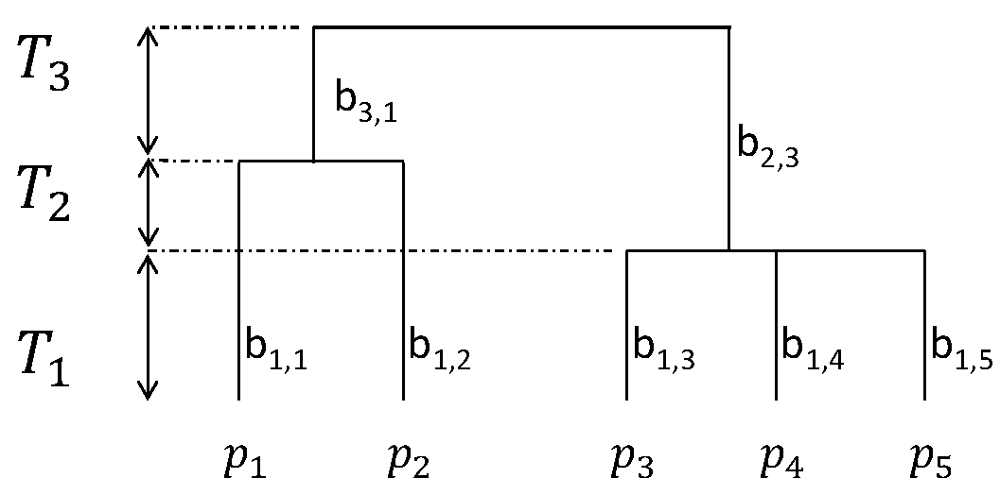
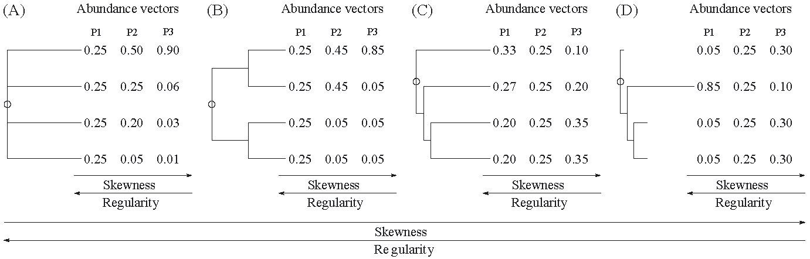
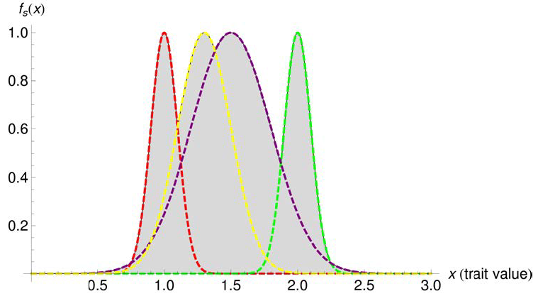
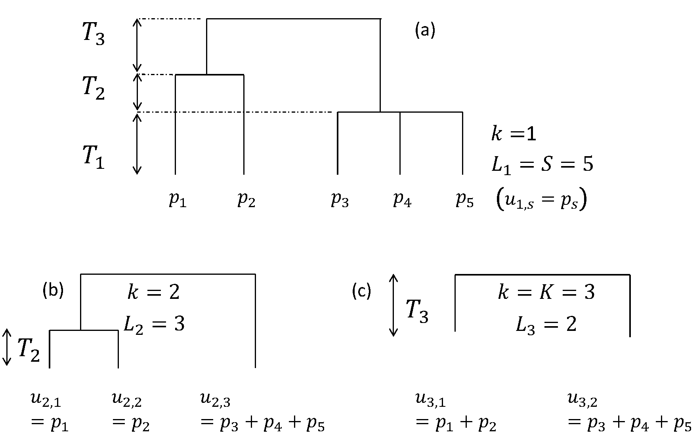
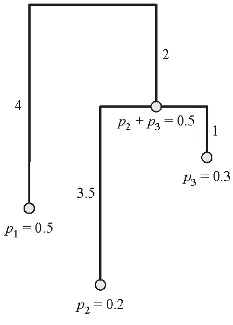
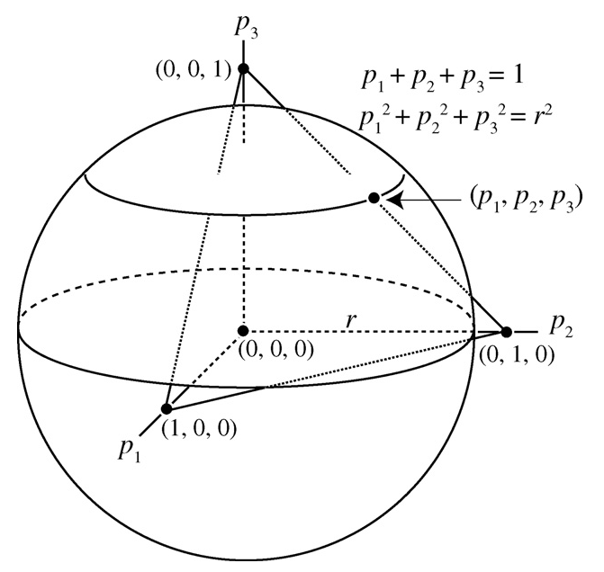

# (PART) Diversité fonctionnelle et phylogénétique {-}

# Cadre {#chap-cadrephyfonc}

```{r, include=FALSE}
library("tidyverse")
library("gridExtra")
```


```{block, type='Summary'}
La diversité fonctionnelle ou phylogénétique prend en compte la proximité des espèces entre elles.
  Généralement, la distance entre espèces est évaluée dans l'espace des traits, approximation de l'espace des niches, pour la diversité fonctionnelle et dans un dendrogramme représentant la phylogénie ou la taxonomie pour la diversité phylogénétique.
```


Les mesures neutres de la diversité considèrent que toutes les classes auxquelles les objets appartiennent sont différentes, sans que certaines soient plus différentes que d'autres. 
Par exemple, toutes les espèces sont équidistantes les unes des autres, qu'elles appartiennent au même genre ou à des familles différentes. 
Intuitivement, l'idée qu'une communauté de $S$ espèces toutes de genres différents est plus diverse qu'une communauté de $S$ espèces du même genre est satisfaisante.
@Walker1992 argumente en faveur de la protection de groupes fonctionnels plutôt que de celle de chacune des espèces qui les constitue pour maintenir le bon état des écosystèmes.

Il s'agit donc de caractériser la différence entre deux classes d'objets, puis de construire des mesures de diversité en rapport [@Pielou1975; @May1990a; @Cousins1991].
En écologie, ces différences sont fonctionnelles ou phylogénétiques, définissant la diversité fonctionnelle [@Tilman1997] ou la diversité phylogénétique (*phylodiversity*) [@Webb2006].

Les premières propositions de ce type d'indices sont dues à @Rao1982 (voir section \@ref(sec-Rao)) puis, avec nettement moins de succès, @Vane-Wright1991 et @Warwick1995. 
@Chave2007 montrent que la diversité neutre prédit mal la diversité phylogénétique (calculée par l'entropie quadratique de Rao).

De nombreuses mesures de diversité ont été créées et plusieurs revues permettent d'en faire le tour. [@Ricotta2007; @Vellend2010]
Les mesures présentées ici sont les plus utilisées, et notamment celles qui peuvent être ramenées aux mesures classiques en fixant une distance égale entre toutes les espèces.
Le cadre méthodologique dans lequel ces mesures ont été développées est présenté dans ce chapitre, suivi par une revue des nombreuses mesures de diversité fonctionnelles et phylogénétiques de la littérature.
L'entropie phylogénétique et la diversité de Leinster et Cobbold sont ensuite développées en détail, suivies d'une synthèse et de considérations sur la mesure de la diversité individuelle plutôt que spécifique.

Des exemples montrent comment calculer cette diversité, principalement à l'aide du package *entropart*. 
Le package contient les données d'inventaire de deux hectares du dispositif de Paracou et la taxonomie des espèces concernées:

```{r entropart}
library("entropart")
# Chargement du jeu de données
data(Paracou618)
```

## Dissimilarité et distance

Une similarité ou dissimilarité est toute application à valeurs numériques qui permet de mesurer le lien entre les individus d'un même ensemble ou entre les variables. 
Pour une similarité le lien est d'autant plus fort que sa valeur est grande.

Une dissimilarité vérifie ($k$, $l$ et $m$ sont trois individus):

* La dissimilarité d'un individu avec lui-même est nulle: $d\left(k,k\right)=0$;
* La dissimilarité entre deux individus différents est positive: $d\left(k,l\right)\ge 0$;
* La dissimilarité est symétrique: $d\left(k,l\right)=d\left(l,k\right)$.

Une distance vérifie en plus:

* La distance entre deux individus différents est strictement positive: $d\left(k,l\right)=0\Rightarrow k=l$;
* L'inégalité triangulaire: $d\left(k,m\right)\le d\left(k,l\right)+d\left(l,m\right)$.
De nombreux indices de dissimilarité ne vérifient pas cette propriété.

Une distance est euclidienne si elle peut être représentée par des figures géométriques. 
On peut rendre toute distance euclidienne par ajout d'une constante [@Lingoes1971; @Cailliez1983]. 
Dans R, utiliser `is.euclid()` pour vérifier qu'une distance est euclidienne, et `cailliez()` ou `lingoes()` pour la transformation.

Enfin, une distance est ultramétrique si $d\left(k,m\right) \le \max\left(d\left(k,l\right),d\left(l,m\right)\right)$. 
Les distances obtenues en mesurant les longueurs des branches d'un dendrogramme (arbre) résultant d'une classification hiérarchique sont ultramétriques.


(ref:ArbreA1) Arbre phylogénétique ou fonctionnel hypothétique. 5 espèces sont présentes ($S=5$), leurs probabilités notées $p_1$ à $p_5$. Les noms des branches sont affichés.
```{r ArbreA1, fig.cap="(ref:ArbreA1)", echo=FALSE}

```

La façon exacte de mesurer les longueurs de branche est illustrée par la figure \@ref(fig:ArbreA1): la distance entre les espèces 1 et 2 est $T_1+T_2$, elle est égale à $T_1$ entre les espèces 4 et 5. 
La distance est la hauteur du premier noeud commun.

## Distance phylogénétique {#sec-Dphylo}

La façon la plus évidente de définir une distance entre espèces est d'utiliser la taxonomie [@Clarke2001, Warwick2001], en attribuant une distance arbitraire (par exemple 1) à deux espèces du même genre, une autre (par exemple 2) à deux espèces de la même famille, etc. 
La distance définie est ultramétrique.

La taxonomie peut être remplacée avantageusement par une phylogénie.
La phylogénie idéale contiendrait l'histoire évolutive de toutes les espèces et les distances seraient les temps de divergence depuis le premier ancêtre commun. 
En pratique, les phylogénies sont établies à partir d'un nombre de marqueurs génétiques limités, sans datation précise (mais avec des calages partiels à partir de fossiles), et ne sont pas toujours ultramétriques. 
Elles peuvent prendre en compte chaque individu, sans regroupement par espèce. 
Une méthode pour dater une phylogénie est fournie par @Chave2007
@Zanne2014 fournissent une phylogénie datée de plus de 32000 espèces.
@Ricotta2012a montrent sur des exemples que la diversité calculée à partir de phylogénies datées est très corrélée à celle calculée à partir de simples taxonomies.


Dans tous les cas, la distance est une mesure de la divergence évolutive. 
Du point de vue de la biologie de la conservation, chaque espèce accumule une quantité d'évolution, interprétée comme une quantité d'information [@Crozier1997] dont le maximum doit être préservé.

L'entropie phylogénétique (voir chapitre \@ref(chap-Phyloentropie)) utilise un arbre phylogénétique pour mesurer la diversité.


## Distance fonctionnelle {#sec-DFonctionnelle}

L'approche fonctionnelle est différente. 
Chaque espèce ou individu est représenté par ses valeurs de traits dans un espace multidimensionnel. 
Le vecteur de traits est considéré comme un proxy de la niche écologique [@Westoby2002]. 
Les individus proches dans l'espace des traits sont donc considérés comme proches écologiquement. 
Les distances entre les points peuvent être calculées directement dans l'espace des traits ou, fréquemment, un arbre est construit par classification automatique hiérarchique.

La première étape consiste donc à choisir un ensemble de traits pertinents et à les mesurer de façon standardisée [@Cornelissen2003]. 
Toute la stratégie relative à la photosynthèse peut être par exemple assez bien résumée par la masse surfacique des feuilles [@Wright2004], mais, en forêt tropicale, ce trait est décorrélé de la densité du bois [@Baraloto2010]. 
Les valeurs manquantes peuvent être complétées en utilisant toute l'information disponible par MICE (*multiple imputation by chained equations*) [@VanBuuren2006], disponible sous R dans le package `mice` [@VanBuuren2011].

La prise en compte de variables qualitatives ou de rang et la possibilité de données manquantes pose un problème pratique de construction de la matrice de dissimilarité, traité par @Gower1971. 
La formule de Gower, étendue par @Podani1999 puis @Pavoine2009b à d'autres types de variables, calcule la dissimilarité entre deux espèces par la moyenne des dissimilarités calculées pour chaque trait, dont la valeur est comprise entre 0 et 1:

* Pour une variable quantitative, la différence de valeur entre deux espèces est normalisée par l'étendue des valeurs de la variable;
* Les variables ordonnées sont remplacées par leur rang et traitées comme les variables quantitatives;
* Pour des variables qualitatives, la dissimilarité vaut 0 ou 1;
* Les valeurs manquantes sont simplement ignorées et n'entrent pas dans la moyenne.

Une matrice de distances entre espèces est construite de cette façon. 
@Podani2006 suggèrent d'utiliser ensuite une classification hiérarchique par UPGMA [@Sokal1958] qu'ils montrent être la plus robuste (pour le calcul de FD, voir section \@ref(sec-PDFD)) à l'ajout ou au retrait d'un trait ou d'une espèce.
@Mouchet2008 suggèrent plutôt d'appliquer toutes les méthodes de classification et de retenir à la fin l'arbre dont la distribution des distances entre espèces dans l'arbre est la plus proche de la distribution des distances dans la matrice de dissimilarités: cette proximité est mesurée par la corrélation cophénétique, c'est-à-dire le coefficient de corrélation entre les valeurs de distances [@Sokal1962; @Legendre2012].
Un arbre consensus [@Felsenstein2004] est souvent plus proche de la matrice de distance.

Un dendrogramme fonctionnel n'a pas d'interprétation aussi claire qu'un arbre phylogénétique qui représente le processus de l'évolution. 
Il peut être interprété comme la représentation à des échelles de plus en plus grossières en allant vers le haut de l'arbre de regroupements fonctionnels dans des niches de plus en plus vastes.

La transformation d'une matrice (non ultramétrique) en dendrogramme déforme la topologie des espèces [@Pavoine2005a; @Podani2007]: une mesure de diversité qui utilise directement la matrice est préférable, c'est un intérêt de la  diversité de Leinster et Cobbold (voir chapitre \@ref(chap-LeinsterCobbold)).
@Maire2015 ont défini une mesure de qualité d'un espace fonctionnel, *mSD*, comme l'écart quadratique moyen entre les distances fonctionnelles entre espèces dans l'espace utilisé (par exemple les distances cophénétiques dans un dendrogramme fonctionnel) et les distances originales (dans la matrice de distance à partir de laquelle l'arbre a été obtenu).
Dans la matrice originale, les valeurs de traits sont centrées et réduites, et la hauteur du dendrogramme est fixée pour que la distance cophénétique maximale soit égale à la distance originale maximale.

@Villeger2017 ont montré que l'utilisation de dendrogrammes fonctionnels dans une étude de @Sobral2016 amène à sous-estimer les changements de niveau de biodiversité liés à l'arrivée d'espèces invasives d'oiseaux.
Dans la très grande majorité des dendrogrammes utilisés, la transformation de la matrice de distance a entraîné un écart moyen de plus de 10\% par rapport aux valeurs originales (une valeur de *mSD*, l'écart quadratique moyen, supérieure à 1\%).
Cette déformation est suffisante pour largement invalider les résultats obtenus.


## Équivalence des deux diversités

L'approche fonctionnelle étant particulièrement complexe et lourde à mettre en oeuvre (notamment pour la mesure des traits sur chaque individu), la tentation a été grande de considérer que la phylogénie contenait plus d'information fonctionnelle que ce qui pouvait être mesuré, et donc de considérer la diversité phylogénétique comme proxy de la diversité fonctionnelle.

Du point de vue théorique, le modèle le plus simple de l'évolution de la valeur d'un trait hypothétique au cours du temps est le mouvement brownien: à chaque génération, la valeur du trait varie un peu, sans mémoire.
Dans ce cadre [@Felsenstein1985], la variance de la valeur actuelle du trait pour une espèce donnée est proportionnelle à la durée de l'évolution et la covariance entre deux espèces à celle de l'âge de leur ancêtre commun.
Deux espèces proches dans l'arbre phylogénétique décrivant l'évolution doivent donc avoir des valeurs de trait corrélées.

@Webb2000 a montré que des communautés d'arbres tropicaux avaient une moins grande diversité phylogénétique locale qu'attendue sous l'hypothèse nulle d'une distribution aléatoire des espèces, et a supposé que la cause en était le filtrage environnemental local, agissant sur les traits et observables par la phylogénie, sous l'hypothèse de conservation phylogénétique des traits fonctionnels. 
La discipline appelée *écologie phylogénétique des communautés* cherche encore à comprendre quels traits sont conservés et lesquels sont convergents [@Cavender-Bares2009].

@Swenson2009 ont montré que la relation entre les deux diversités était faible. 
L'utilisation de la diversité phylogénétique comme proxy de la diversité fonctionnelle n'est pas satisfaisante [@Pavoine2011]. Pour optimiser la conservation, les deux aspects de la diversité, souvent divergents, doivent être pris en compte [@Devictor2010].

## Typologie des mesures

À partir de la littérature [@Ricotta2007; @Pavoine2011], une typologie des mesures de diversité émerge. 
Elle étend les notions classiques de richesse et équitabilité.

La richesse est l'accumulation de classes différentes dans les mesures classiques. 
Dans un arbre phylogénétique, la longueur des branches représente un temps d'évolution: la richesse en est la somme. 
FD et PD sont des mesures de richesse.


(ref:Pavoine2011) Régularité contre irrégularité. Les arbres de A à D sont de plus en plus irréguliers. L'arbre A, parfaitement régulier, est le cadre des mesures classiques de la diversité. La phylogénie étant donnée, trois vecteurs d'abondance (P1 à P3) sont de moins en moins réguliers: dans les cas C et D, la régularité maximale n'est pas obtenue pour des effectifs identiques, mais en augmentant les effectifs des espèces originales.
```{r Pavoine2011, fig.cap="(ref:Pavoine2011)", echo=FALSE}

```

La régularité mesure la façon dont les espèces occupent uniformément l'espace des niches [@Pavoine2011]. 
Cette notion est simple dans un espace multidimensionnel (par exemple, l'espace des traits fonctionnels). 
Dans un arbre phylogénétique (figure \@ref(fig:Pavoine2011), @Pavoine2011), la régularité de l'arbre [@Mooers1997] est un premier critère, complété éventuellement par les abondances. 
Dans un arbre parfaitement régulier, la régularité se réduit à l'équitabilité.

Les mesures de divergence sont des fonctions croissantes de la dissimilarité entre les espèces, généralement considérées par paires. 
Certaines sont pondérées par les abondances, d'autres non. 
Dans un arbre parfaitement régulier, l'indice de Simpson est une mesure de divergence pondérée. 
Ces mesures sont influencées par la richesse et la régularité.

Face à la profusion des mesures de diversité fonctionnelle, @Ricotta2005d, en complément de @Solow1994 établit un certain nombre d'axiomes:

1. Monotonicité d'ensemble: la diversité ne doit pas diminuer quand une espèce est ajoutée avec une faible probabilité (qui ne modifie pas la structure de la communauté existante), quelles que soient ses caractéristiques fonctionnelles;
2. Jumelage [@Weitzman1992]: l'introduction d'une espèce identique à une espèces existante ne doit pas augmenter la diversité. De façon moins triviale, une espèce infiniment proche ne doit pas augmenter la diversité: il s'agit donc d'un axiome de continuité dans l'espace des niches.
3. Monotonicité de distance: la diversité ne doit pas diminuer quand la distance entre espèces est augmentée.
4. Décomposabilité: les mesures de divergence doivent être décomposables en diversité $\alpha$, $\beta$ et $\gamma$, ce qui implique leur concavité par rapport aux probabilités.

L'entropie phylogénétique permet d'unifier ces notions, mais de nombreuses mesures ont été proposées.
Elles sont détaillées au chapitre suivant.


# Mesures particulières

```{block, type='Summary'}
  De nombreuses mesures de diversité fonctionnelle ou phylogénétique ont été développées pour combiner le mieux possible la richesse et la régularité de la distribution des espèces dans l'espace des niches ou la phylogénie.
  Certaines (PD, FD, l'entropie quadratique de Rao, $H_p$ et $I_1$) seront unifiées au chapitre suivant dans le cadre de l'entropie phylogénétique.
```

Un certain nombre de mesures de diversité phylogénétiques a émergé dans la littérature. 
Elles sont passées en revue ici, en commençant par la diversité fonctionnelle envisagée dans l'espace multidimensionnel des traits.
Les sections suivantes envisagent les espèces dans un arbre phylogénétique.

## Richesse, équitabilité et divergence fonctionnelle

@Mason2005 postulent que la diversité fonctionnelle peut être abordée dans trois dimensions indépendantes (@Jost2010 montrera que l'indépendance n'est pas assurée):

* la richesse fonctionnelle, qui indique l'étendue de l'espace des niches fonctionnelles occupé par la communauté;
* l'équitabilité de la distribution des espèces dans ces niches (appelée régularité par @Pavoine2011);
* la divergence fonctionnelle, qui mesure comment la distribution des espèces dans l'espace des niches maximise la variabilité des caractéristiques fonctionnelles dans la communauté et combine richesse et équitabilité.

@Schleuter2010 font une revue des mesures utilisées dans ce cadre.
Les notations des indices utilisées ici sont les leurs.

Différents traits numériques sont connus pour toutes les espèces de la communauté.
La matrice $\mathbf{X}$ les contient: l'élément $x_{t,s}$ est la valeur moyenne du trait $t$ pour l'espèce $s$.
On note $\mathbf{T}_s$ le vecteur des valeurs moyennes de chaque trait de l'espèce $s$.

### Richesse fonctionnelle

#### Étendue fonctionnelle

L'étendue fonctionnelle [@Mason2005] mesure l'étendue des valeurs d'un trait occupée par une communauté, normalisée par l'étendue maximale possible:
\begin{equation}
  (\#eq:FRR)
  \mathit{FR}_R = \dfrac{\max_s(x_{t,s}) - \min_s(x_{t,s})}{X_{t,max} - X_{t,min}},
\end{equation}

où $\max_s(x_{t,s})$ est la valeur maximale pour toutes les espèces de la matrice de la valeur du trait $t$, $X_{t,max}$ est sa valeur maximale absolue (les notations sont identiques pour les minima).
Les extrêmes absolus peuvent être ceux de l'ensemble des communautés comparées.
Ils sont toujours sous-estimés: il est toujours possible théoriquement de trouver des valeurs plus extrêmes en augmentant l'effort d'échantillonnage.
L'étendue fonctionnelle peut être moyennée sur plusieurs traits.

Schleuter et al. développent l'indice $\mathit{FR}_{Is}$ pour prendre en compte la variabilité intraspécifique et les valeurs de traits non occupées par des espèces dans l'étendue fonctionnelle.
Les valeurs de traits individuelles sont nécessaires: l'étendue des valeurs d'un trait est définie comme l'union des étendues des valeurs de chaque espèce. 


(ref:Schleuter2010) Fonction d'appartenance de l'espace des niches de Schleuter et al., en une dimension. $x$, en ordonnée, est la valeur du trait considéré. Chaque espèce est considérée comme un ensemble flou dans l'espace des traits. Quatre espèces sont représentées, avec leur fonction d'appartenance $f_s(x)$. Le volume de l'espace des traits occupé, $\mathit{FR}_{Im}$, est obtenu en intégrant les fonctions d'appartenance: c'est la zone grisée de la figure.
```{r Schleuter2010, fig.cap="(ref:Schleuter2010)", echo=FALSE}

```

#### Volume de niches

La définition de la niche écologique de @Hutchinson1957 est l'hypervolume, dans l'espace des ressources environnementales, qu'une espèce peut occuper.
L'espace des traits fonctionnels peut être considéré comme une approximation de l'espace des ressources.
Le volume de l'enveloppe convexe de l'espace des traits occupé par la communauté (*convex hull volume*) est donc une mesure de richesse fonctionnelle multidimensionnelle.
La prise en compte des trous, c'est-à-dire la restriction du volume à l'espace réellement occupé à l'intérieur de cette enveloppe, est possible grâce à une méthode d'estimation d'hypervolume plus élaborée, implémentée dans le package *hypervolume* pour R [@Blonder2014].

De même que pour l'étendue fonctionnelle, Schleuter et al. développent une mesure proche, $\mathit{FR}_{Im}$, prenant en compte la variabilité intraspécifique et les espaces non occupés.
Chaque espèce est supposée occuper un espace autour de sa position moyenne dans l'espace des traits, avec une fonction d'appartenance [@Zadeh1965] gaussienne multidimensionnelle (une représentation unidimensionnelle se trouve en figure \@ref(fig:Schleuter2010), @Schleuter2010): la fonction d'appartenance, issue de la logique floue, peut être vue comme une densité de probabilité non normalisée.

Les variances et covariances intraspécifiques des traits (rassemblés dans la matrice carrée $\mathbf{\Sigma}_s$ de dimension $t$ pour chaque espèce $s$) sont nécessaires.
La fonction d'appartenance de l'espèce $s$ dans l'espace des traits est, pour le vecteur $\mathbf{T}$ de valeur de l'ensemble des traits:
\begin{equation}
  f_s(\mathbf{T})= e^{-\frac{1}{2} \left(\mathbf{T}-\mathbf{T}_s \right)^\top \mathbf{\Sigma}_s^{-1}  \left(\mathbf{T}-\mathbf{T}_s \right)}.
\end{equation}

La richesse fonctionnelle est l'intégrale des valeurs maximales de $f_s$ dans l'ensemble de l'espace des traits:
\begin{equation}
  (\#eq:FRIm)
  \mathit{FR}_{Im} = \int \max_s\left(f_s(\mathbf{T}) \right) \mathop{d\mathbf{T}}.
\end{equation}

Après transformation de la matrice de distance en dendrogramme fonctionnel, éventuellement sous la forme d'un arbre-consensus [@Mouchet2008], la longueur totale des branches, FD [@Petchey2002], est une autre mesure de richesse multidimensionnelle.


### Equitabilité fonctionnelle

L'équitabilité fonctionnelle, ou régularité [@Pavoine2011], rend compte de l'homogénéité de l'occupation des niches. 

L'indice d'équitabilité de @Mouillot2005a, que les auteurs nomment "indice de régularité fonctionnelle", est inspiré de l'indice d'équitabilité de Bulla \@ref(eq:Bulla).
C'est un indice unidimensionnel: un seul trait est pris en compte.
Les espèces sont classées par valeur croissante du trait.
L'équitabilité maximale est obtenue si l'écart entre deux valeurs de traits est proportionnel aux abondances cumulées des deux espèces.
La statistique fondamentale est appelée équitabilité pondérée (*weighted evenness*).
Pour l'intervalle entre l'espèce $s$ et l'espèce $s+1$:

\begin{equation}
  (\#eq:EWs)
  \mathit{EW}_{s} = \frac{T_{s+1}-T_{s}}{N_{s+1}+N_{s}}.
\end{equation}

Cette valeur est normalisée: $\mathit{PEW}_{s}={\mathit{EW}_{s}}/{\sum_s{\mathit{EW}_{s}}}$.
Sa valeur de $\mathit{PEW}_{s}$ attendue pour le maximum d'équitabilité est ${1}/{(S-1)}$.
L'indice est celui de Bulla, appliqué aux $S-1$ intervalles entre espèces:

\begin{equation}
  (\#eq:FEs)
  \mathit{FE}_{s} = \sum_{s=1}^{S-1}{\min(\mathit{PEW}_{s},\frac{1}{S-1})}.
\end{equation}


L'indice $\mathit{FE}_{s}$ a été étendu pour être multidimensionnel par @Villeger2008a.
L'arbre recouvrant de longueur minimum (*minimum spanning tree*) est d'abord calculé à partir des distances euclidiennes entre les espèces dans l'espace des traits: il s'agit de l'arbre de longueur totale minimale reliant tous les points.
La longueur des branches est ensuite traitée de la même façon que $\delta T_s$ précédemment.

Un autre indice, ${\Lambda}^+$ [@Clarke2001], mesure la variance des distances entre paires d'espèces:

\begin{equation}
  (\#eq:Clarke2001)
  {\Lambda}^+ =\frac{\sum_s{\sum_t{{\left(d_{s,t}-\hat{d}\right)}^2}}}{S\left(S-1\right)}.
\end{equation}


Comme le montrent @Merigot2011, les mesures de régularité n'ont absolument pas les mêmes propriétés que les mesures de diversité: elles peuvent par exemple augmenter quand on retire des espèces originales.


### Divergence fonctionnelle

Les mesures de divergence fonctionnelle décrivent la variabilité de position des espèces dans l'espace des traits.
Ce sont tout simplement des mesures de diversité au sens classique du terme.

Quand un seul trait est considéré, la mesure la plus simple est sa variance.
@Mason2003 effectuent une transformation logarithmique de la valeur du trait et pondèrent le calcul de la variance par les probabilités $p_s$.
Ils transforment finalement le résultat en son arc-tangente pour qu'il soit compris entre 0 et 1.

Schleuter et al. proposent d'utiliser la différence entre le troisième et le premier quartile de la valeur du trait, normalisée par son étendue maximale possible.

FAD a été proposé par @Walker1999, à partir d'une matrice de distances dans l'espace des traits. 
$d_{s,t}$ est la distance entre deux espèces indicées par $s$ et $t$, alors:

\begin{equation}
  (\#eq:FAD)
  \mathit{FAD}=\sum_s{\sum_t{d_{s,t}}}.
\end{equation}

FAD est très sensible au nombre d'espèces.
Sa version normalisée, MFAD [@Schmera2009] est

\begin{equation}
  (\#eq:MFAD)
  \mathit{MFAD}=\frac{\sum_s{\sum_t{d_{s,t}}}}{S}.
\end{equation}

Les deux indices violent l'axiome de jumelage.
À un facteur de normalisation près, ce sont des cas particuliers de l'indice de Rao pour des effectifs égaux.

Le calcul sous R est immédiat avec un arbre au format `phylog` du package *ade4*.
Un arbre au format `phylo` du package *ape* nécessite une conversion: la fonction `Preprocess.Tree` du package *entropart* la réalise.

```{r MFAD}
phyTree <- Paracou618.Taxonomy
# La conversion as.hclust() double les distances. Il faut donc les diviser par deux.
phyTree$edge.length <- phyTree$edge.length/2
library("ape")
# Conversion au format hclust
hTree <- as.hclust.phylo(phyTree)
# Conversion au format phylog
library("ade4")
Tree <- hclust2phylog(hTree)
# Tree$Wdist contient les valeurs de sqrt(2*distance)
(FAD <- sum(Tree$Wdist^2/2))
(MFAD <- FAD/length(Tree$leaves))
```


@Kader2007 regroupent les valeurs de trait par catégories et calculent l'entropie de Simpson des catégories.

Enfin, @Villeger2008a utilisent la distance euclidienne moyenne des espèces au centre de gravité de la communauté plutôt que la variance.
Précisément, le centre de gravité de la communauté (sans pondération par les fréquences) est calculé.
La distance euclidienne de l'espèce $s$ au centre de gravité est $dG_s$; la moyenne pour toutes les espèces $\bar{dG}$.
L'écart moyen des individus de la communauté à la distance moyenne est $\Delta d=\sum_s{p_s(dG_s - \bar{dG})}$.
L'écart moyen absolu est $\Delta |d|=\sum_s{p_s|dG_s - \bar{dG}|}$.

L'indice est
\begin{equation}
  (\#eq:FDm)
  \mathit{FD}_{m} = \frac{\Delta d + \bar{dG}}{\Delta |d| +\bar{dG}}.
\end{equation}

Sa forme lui permet d'être compris entre 0 et 1.

@Laliberte2010 généralisent $\mathit{FD}_{m}$ en proposant l'usage de n'importe quelle dissimilarité entre espèces, obtenue à partir de la méthode de Gower (vue en section \@ref(sec-DFonctionnelle)), autorisant des variables qualitatives et des données manquantes, au-delà de la seule distance euclidienne entre traits quantitatifs.
Ils fournissent le package *FD* pour calculer leur indice $\mathit{FDis}$ et ceux de 
@Villeger2008a.


## Originalité, richesse et équitabilité phylogénétique

La littérature de la diversité phylogénétique s'est intéressée tôt à l'originalité taxonomique des espèces parce que les questions traitées concernaient la conservation, concernée par la valeur de l'héritage évolutif [@Faith2008].

### Mesures spécifiques d'originalité

@Vane-Wright1991 définissent la distinction taxonomique (*taxonomic distinctness*) $\mathit{TD}_s$ de chaque espèce comme l'inverse du nombre de noeuds entre elle et la racine de l'arbre phylogénétique, normalisé pour que $\sum_s{\mathit{TD}_s} = 1$.
Dans l'arbre de la figure \@ref(fig:ArbreA4), les valeurs de TD non normalisées sont ${1}/{2}$ pour les deux premières espèces et ${1}/{3}$ pour les trois autres: la racine de l'arbre est comptabilisée dans le nombre de noeuds.
Les valeurs de $\mathit{TD}_s$ sont respectivement ${1}/{4}$ et ${1}/{6}$ après normalisation.


(ref:ArbreA4) Arbre phylogénétique ou fonctionnel hypothétique. L'arbre comprend 5 espèces dont les probabilités sont notées $p_s$, 3 périodes de durées $T_k$ délimitées par les noeuds. Les branches sont notées $b$ et indicées par la période à laquelle elles se terminent et un numéro d'ordre.
```{r ArbreA4, fig.cap="(ref:ArbreA4)", echo=FALSE}

```


La particularité évolutive [@Isaac2007] (*evolutive distinctiveness*, $\mathit{ED}_s$) de l'espèce $s$ est la somme de la longueur des branches qui la relient à la racine de l'arbre, partagées entre tous les descendants de chaque branche.
Pour l'espèce 3 de la figure \@ref(fig:ArbreA4), $\mathit{ED}_3$ est égal à $l(b_{1,3})$, la longueur de la branche terminale propre à l'espèce 3, plus un tiers de la longueur de la branche qui relie la racine de l'arbre à la polytomie dont l'espèce 3 est issue.
Clairement, la diversité phylogénétique PD (section \@ref(sec-PDFD)) est la somme des particularités évolutives de toutes les espèces de l'arbre.


### Originalité taxonomique de Ricotta {#sec-OrigTax}

(ref:HurlbertCFig) Contribution des espèces à l'indice de Hurlbert. Les contributions de 4 espèces d'une communauté à l'indice sont représentées en fonction de la taille de l'échantillon $n$. Les fréquences des espèces sont lisibles pour $n = 1$: une espèce fréquente (probabilité égale à 0,7, supérieure à $1/S$), deux espèces peu fréquentes (0,19 et 0,1), et une espèce rare (0,01). Quand $n$ est assez grand, toutes les contributions tendent vers $1/S = 1/4$ (ligne horizontale).
```{r HurlbertCFig, echo=FALSE, results='hide', ref.label='HurlbertCCode', fig.cap="(ref:HurlbertCFig)"}
```

@Ricotta2004a construit un indice paramétrique (permettant de donner plus ou moins d'importance aux espèces rares) à partir de l'espérance du nombre d'espèces tirées dans un échantillon de taille $n$ fixée (l'indice de @Hurlbert1971):

\begin{equation}
  (\#eq:ESn)
  {\mathbb E}\left( S^n \right)
  = \sum_s{\left[ 1-\left( 1-p_s \right)^n  \right]}.
\end{equation}

Ricotta pondère cette espérance par l'originalité taxonomique de chaque espèce, notée $w_s$ et normalise la mesure:
\begin{equation}
  (\#eq:Ricotta2004a)
  ^n{T}
  = \frac{\sum_s{w_s \left[ 1-\left( 1-p_s \right)^n  \right]}}{{\mathbb E}\left( S^n \right)}.
\end{equation}

L'originalité taxonomique est définie comme la distance phylogénétique moyenne entre l'espèce $s$ et les autres: $w_s={\sum_s{d_{s,t}}}/{(S-1)}$.

@Weikard2006 montrent que cette définition de $w_s$ ne permet pas de satisfaire l'axiome de monotonicité d'ensemble.
La définition correcte de $w_s=\sum_s{d_{s,t}}$, validée par @Ricotta2006.

L'interprétation de $^n{T}$ est plus intuitive en inversant la logique de sa construction.

$w_s$ est l'originalité de l'espèce $s$.
${[1-(1-p_s)^n]}/{{\mathbb E}(S^n)}$ est la contribution de l'espèce $s$ à l'espérance du nombre d'espèces, comprise entre 0 et 1. 
$^n{T}$ est donc l'originalité moyenne des espèces de la communauté, pondérée par la contribution de chaque espèce à l'espérance du nombre d'espèces observé, dans un échantillon de taille $n$.
Cette contribution est présentée en figure \@ref(fig:HurlbertCFig).

Quand $n=1$, c'est simplement la fréquence des espèces.
Quand $n$ augmente, le poids des espèces fréquentes (dont la proabilité est supérieure à $\frac{1}{S}$) diminue alors que celui des espèces intermédiaires augmente.
Ce dernier atteint ${1}/{{\mathbb E}(S^n)}$ (une espèce est échantillonnée à coup sûr dès que l'échantillon est assez grand) d'autant plus rapidement que $p_s$ est grand.
Il baisse ensuite alors que les espèces rares atteignent à leur tour progressivement leur poids maximal.

Quand $n \to +\infty$, le numérateur tend vers FAD, et le dénominateur tend vers le nombre d'espèces: $^n{T}$ tend vers MFAD.

Code R pour la figure \@ref(fig:HurlbertCFig):
```{r HurlbertCCode, eval=FALSE, tidy=FALSE}
Ps <- c(0.7, 0.19, 0.1, 0.01)
S <- length(Ps)
nRange <- 1:500
# Indice de Hurlbert
ESn <- c(1, sapply(nRange[-1], function(n) Hurlbert(Ps, n)))
# Préparation du graphique
Xlab <- "Taille de l'échantillon"
Ylab <- "Contribution des espèces"
# Contribution de chaque espece à chaque valeur de n
Csn <- sapply(1:S, function(s) sapply(nRange, 
              function(n) (1-(1-Ps[s])^n))/ESn)
# Dataframe contenant les données
df <- as.data.frame(cbind(nRange, Csn))
colnames(df) <- c("n", "s07", "s019", "s01", "s001")
# Graphique
ESnplot <- ggplot(gather(df, Sp, Contribution, -n), aes(x=n)) +
  geom_line(aes(y = Contribution, lty=Sp)) +
  geom_hline(yintercept=1/4, col="red") +
  scale_x_log10() +
  labs(x = Xlab, y = Ylab) +
  theme(legend.position = "none")
ESnplot
```


### Richesse phylogénétique

La particularité taxonomique moyenne [@Warwick1995] (*Average Taxonomic Distinctiveness, AvTD*) est la distance moyenne dans l'arbre entre deux espèces choisies au hasard.
C'est donc l'équivalent taxonomique de MFAD.
La variabilité phylogénétique des espèces [@Helmus2007] (*Phylogenetic Species Variability, PSV*) est la même mesure, obtenue à partir du modèle d'évolution suivant un mouvement brownien [@Felsenstein1985].
La distance moyenne entre deux espèces est dans ce cadre proportionnelle à la covariance de leurs traits fonctionnels.
La richesse phylogénétique des espèces, PSR, est PSV multipliée par le nombre d'espèces: c'est l'équivalent taxonomique de FAD.

La diversité FD de Faith (section \@ref(sec-PDFD)), égale à la somme des longueurs des branches de l'arbre, semble avoir fait consensus, d'où un moindre développement des mesures de richesse que dans la littérature fonctionnelle.


### Indices de Cadotte

@Cadotte2010 proposent un ensemble de mesure phylogénétiques: équitabilité, déséquilibre d'abondance et diversité de la particularité evolutive.

#### Equitabilité phylogénétique

Les branches terminales de l'arbre phylogénétique sont ici à la base de la définition de l'équitabilité.
figure \@ref(fig:ArbreA3), les branches $b_{1,s}$ sont les segments terminés par une feuille (au bas de l'arbre), c'est-à-dire que leur longueur est la partie de l'arbre que les espèces ne partagent pas.
La mesure d'équitabilité est
\begin{equation}
  \mathit{PAE} = \frac{\mathit{PD} + \sum_s{l(b_{1,s})(n_s-1)}}{\mathit{PD} + (\frac{n}{S}-1)\sum_s{l(b_{1,s})} }.
\end{equation}

```{r ArbreA3, fig.cap="Arbre phylogénétique ou fonctionnel hypothétique.", echo=FALSE}

```

$\mathit{PAE}$ vaut 1 quand les espèces sont sont distribuées équitablement pour la longueur des branches.
Une valeur plus grande est obtenue quand les espèces sont concentrées au bout des longues branches, et inversement si $0<\mathit{PAE}<1$.


#### Déséquilibre d'abondance

L'équilibre d'abondance est défini par une distribution aléatoire des espèces par division de l'effectif total à partir de la racine de l'arbre phylogénétique.
En figure \@ref(fig:ArbreA3), en partant de la racine, la moitié des individus est supposée se répartir sur chaque branche.
À la période 2, les effectifs de la branche de gauche se partagent en deux parties égales.
À partir du nombre total d'individus de la communauté, $n$, le nombre attendu d'individus $n_s^0$ de l'espèce $s$ est une fraction de $n$ correspondant au nombre de noeuds et au nombre de branches partant de chaque noeud.
On note $y_{k,s}$ le nombre de branches partant du noeud ancestral de l'espèce $s$ à la période $k$, s'il existe, $y_{k,s}=1$ sinon:
\begin{equation}
  n_s^0 = \frac{n}{\prod_{k=2}^{K}{y_{k,s}}}.
\end{equation}

En figure \@ref(fig:ArbreA3), pour l'espèce 3, $y_{1,3}=3$ (l'espèce est issue d'une polytomie), $y_{2,3}=1$ (absence de noeud) et $y_{3,3}=2$ (la racine de l'arbre est dichotomique).
On s'attend donc à ce que l'espèce 3 soit représentée par un sixième des individus.

L'indice de déséquilibre d'abondance mesure l'écart à cette distribution théorique:
\begin{equation}
  (\#eq:IAC)
  \mathit{IAC} = \frac{\sum_s{|n_s - n_s^0|}}{\nu}.
\end{equation}

$\nu$ est le nombre de noeuds de l'arbre (3 dans l'exemple de la figure \@ref(fig:ArbreA3)).


#### Diversité de la particularité évolutive

L'entropie de Shannon peut être appliquée pour mesurer la diversité des particularités évolutives:
\begin{equation}
  (\#eq:HED)
  H_{\mathit{ED}} = -\sum_s{\frac{\mathit{ED}_s}{\mathit{PD}} \ln\frac{\mathit{ED}_s}{\mathit{PD}}}.
\end{equation}

L'équitabilité des particularités évolutives est celle de Pielou:

\begin{equation}
  (\#eq:EED)
  E_{\mathit{ED}} = \frac{H_{\mathit{ED}}}{\ln{S}}.
\end{equation}

Ces mesures ne prennent pas en compte les abondances des espèces.
Pour y remédier, il suffit d'ajouter une période de durée nulle à chaque feuille de l'arbre, correspondant à une polytomie entre les $n_s$ individus de chaque espèce.
La particularité évolutive $\mathit{AED}_s$ des individus de l'espèce $s$, est calculée en partageant la longueur de chaque branche ancestrale entre le nombre d'individus qui en descendent (et non le nombre d'espèces).
Alors $\mathit{PD} = \sum_s{n_s \mathit{AED}_s}$.
L'entropie devient
\begin{equation}
  (\#eq:HAED)
  H_{\mathit{AED}} = -\sum_s{\frac{n_s \mathit{AED}_s}{\mathit{PD}} \ln\frac{n_s \mathit{AED}_s}{\mathit{PD}}}
\end{equation}
et l'équitabilité correspondante est
\begin{equation}
  (\#eq:EAED)
  E_{\mathit{AED}} = \frac{H_{\mathit{AED}}}{\ln{N}}.
\end{equation}

Ces indices ne mesurent pas la diversité phylogénétique au sens des autres mesures présentées dans ce chapitre.
Ils mesurent la diversité de le particularité évolutive, autrement dit du temps d'évolution accumulé par chaque espèce ou chaque individu.
Pour un nombre d'espèces fixé, $E_{\mathit{ED}}$ atteint son maximum quand les valeurs de $\mathit{ED}_s$ sont toutes identiques.
Un arbre phylogénétique composé d'une seule branche depuis la racine terminé par une polytomie de longueur nulle portant toutes les espèces correspond à cette description.
Dans cet exemple, les espèces ont une divergence évolutive nulle, mais $E_{\mathit{ED}} = S$, son maximum possible.


## Diversité de Scheiner

@Scheiner2012 développe un cadre unifié pour mesurer la diversité spécifique, phylogénétique ou fonctionnelle, séparément ou simultanément.
L'idée générale est que toute quantité partagée par les espèces (le nombre d'individus, le temps d'évolution accumulé, la taille des niches écologique) peut être traduite en nombre de Hill.

La diversité spécifique est simplement $^{q}\!D$. Scheiner la note $^{q}\!D(A)$, pour diversité d'abondance.

La diversité phylogénétique $^{q}\!D(P)$ ne prend pas en compte les abondances mais mesure la diversité de la divergence évolutive des espèces. 
La divergence totale dans un arbre phylogénétique (pas forcément ultramétrique) est la longueur totale des branches (c'est-à-dire FD). 
Elle est répartie entre toutes les espèces: la longueur de chaque branche (représentant une quantité d'évolution) est partagée à parts égales entre les espèces qui en descendent.
La divergence de l'espèce 1 de la figure \@ref(fig:Arbre) est $T1+T2$, la longueur de la branche terminale, plus ${T3}/{2}$, parce que la branche est partagée par les espèces 1 et 2. 
La divergence de l'espèce 1, est donc $L_1 = T1+T2+{T3}/{2}$. 
La part de la divergence de l'espèce $s$ est $l_s = {L_s}/{FD}$.
La diversité phylogénétique est le nombre de Hill des divergences:

\begin{equation}
  (\#eq:HillDivergences)
  ^{q}\!D = {\left(\sum^S_{s=1}{l_s^q}\right)}^{\frac{1}{1-q}}.
\end{equation}

La diversité fonctionnelle $^{q}\!D(F)$ est la diversité des tailles des niches. La taille de la niche est définie par Scheiner comme le volume de l'hypersphère (dans l'espace des traits fonctionnels de dimension $m$) centrée sur chaque espèce dont le rayon est la moitié de la distance à l'espèce la plus proche pour que les sphères ne se superposent pas.
Une meilleure définition [@Presley2014] de la taille de la niche est la somme des distances aux autres espèces: $t_s = \sum_t{d_{s,t}}$. La part de chaque espèce est $f_s={t_s}/{\sum_t{t_t}}$ et la définition de la diversité fonctionnelle est

\begin{equation}
  (\#eq:DqT)
  ^{q}\!D(T) = {\left(\sum^S_{s=1}{f_s^q}\right)}^{\frac{1}{1-q}}.
\end{equation}

La diversité peut prendre en compte plusieurs composantes, pas exemple l'abondance et la phylogénie pour définir

\begin{equation}
  (\#eq:qDAP)
  ^{q}\!D(AP) = {\left(\sum^S_{s=1}{\left(\frac{n_s L_s}{\sum^S_{t=1}{n_t L_t}}\right)^q}\right)}^{\frac{1}{1-q}}.
\end{equation}

La diversité d'abondance et phylogénétique est la diversité des divergences pondérées par les effectifs des espèces. 
La mesure de biodiversité de Scheiner, incluant les trois composantes, est

\begin{equation}
  (\#eq:qDAF)
  ^{q}\!D(APF) = {\left(\sum^S_{s=1}{\left(\frac{n_s L_s t_s}{\sum^S_{t=1}{n_t L_t t_t}}\right)^q}\right)}^{\frac{1}{1-q}}.
\end{equation}

Son interprétation est moins immédiate.
Chaque espèce est associée à une fraction d'une des trois dimensions de la diversité (abondance, temps d'évolution cumulé, taille des niches).
Elle occupe un parallélépipède de dimensions $(p_s, l_s, f_s)$ dans le cube de dimension 1 qui les contient toutes.
Cette représentation ne donne pas d'importance particulière à l'abondance, et peut être appliquée à un nombre quelconque de dimensions.
La mesure de biodiversité est la diversité des volumes occupés par les espèces, normalisés par leur somme (qui n'est pas égale à 1).

En se limitant à deux dimensions pour la lisibilité, la figure \@ref(fig:ScheinerPsfsFig) présente les rectangles correspondant à la diversité d'abondance et fonctionnelle occupés par les espèces de la méta-communauté `Paracou618`, classées par fréquences décroissantes.


(ref:ScheinerPsfsFig) Rectangles de surface fréquence $\times$ taille de niche des espèces de la méta-communauté `Paracou618`. La diversité de Scheiner $^{q}\!D(AF)$ est la diversité de leur surface.
```{r ScheinerPsfsFig, echo=FALSE, results='hide', fig.width=6, fig.height=6, ref.label='ScheinerPsfsCode', fig.cap="(ref:ScheinerPsfsFig)"}
```

Code R:
```{r ScheinerPsfsCode, eval=FALSE, tidy=FALSE}
# Probabilités
Ps <- Paracou618.MC$Ps[Paracou618.MC$Ps>0]
Ps <- sort(Ps, decreasing = TRUE)
# Fréquences cumulées
PsCum <- cumsum(Ps)
Xgauche <- c(0, PsCum)
Xdroite <- c(PsCum, 1)
# Matrice de distances fonctionnelles
DistanceMatrix <- as.matrix(Paracou618.dist)
# Mise en correspondance de la matrice et du vecteur de probabilités
DistanceMatrix <- DistanceMatrix[names(Ps), names(Ps)]
# Taille des niches
ts <- rowSums(DistanceMatrix)
fs <- ts/sum(ts)
# Fréquences cumulées
fsCum <- cumsum(fs)
Ybas <- c(0, fsCum)
Yhaut <- c(fsCum, 1)
# Rectangles occupés par chaque espèce
ggplot(data.frame(Xgauche, Ybas, Xdroite, Yhaut)) +
  geom_rect(aes(xmin= Xgauche, xmax= Xdroite, ymin= Ybas, ymax= Yhaut), 
             color = "black", fill = "white") +
  coord_fixed() +
  labs(x = "Fréquence", y="Niche")
```


La diversité d'abondance et fonctionnelle est la diversité de la surface des rectangles:
```{r ScheinerDqAF}
Surface <- Ps*fs
Rs <- Surface/sum(Surface)
Diversity(Rs, q=2)
```

Le profil de diversité d'abondance et fonctionnelle est en figure \@ref(fig:ProfilDqAFFig). 


(ref:ProfilDqAFFig) Profil de diversité d'abondance et fonctionnelle de Scheiner de la méta-communauté `Paracou618`. Pointillés longs: diversité d'abondance; pointillés courts: diversité fonctionnelle; trait plein: diversité d'abondance et fonctionnelle.
```{r ProfilDqAFFig, echo=FALSE, results='hide', ref.label='ProfilDqAFCode', fig.cap="(ref:ProfilDqAFFig)"}
```

  Code R:
```{r ProfilDqAFCode, eval=FALSE, tidy=FALSE}
autoplot(CommunityProfile(Diversity, Rs), 
         xlab="Ordre de diversité", ylab="Diversité") +
geom_line(data = as.data.frame.list(CommunityProfile(Diversity, Ps)), 
          mapping = aes(x, y), lty = 2) +
geom_line(data = as.data.frame.list(CommunityProfile(Diversity, fs)),
          mapping = aes(x, y), lty=3)
```

La notion de diversité phylogénétique ou fonctionnelle traitée par Scheiner est assez différente de celles vues précédemment parce qu'elle considère toutes les dimensions de façon symétrique: l'ordre de diversité, $q$, s'applique à toutes les dimensions.
Si $q$ est grand, les espèces dont le produit des dimensions de la diversité est petit (que l'espèce soit rare, ait une divergence phylogénétique faible ou une niche étroite) sont négligées, alors que $q$ n'affecte que la fréquence dans le cadre de la phylodiversité $^{q}\!\bar{D}$ ou la banalité pour $^q\!D^{\mathbf{Z}}$.


## Diversité de Solow et Polasky

@Solow1994 relient la richesse fonctionnelle ou phylogénétique à la probabilité de trouver au moins une espèce intéressante (par exemple, capable de fournir une molécule utile) dans une communauté.

Les distances entre espèces sont supposées connues, qu'elles soient fonctionnelle, phylogénétique ou autre.
La probabilité qu'une espèce quelconque soit intéressante est fixée à $p$, par exemple à partir de l'expérience passée (si une espèce criblée sur 100 fournit une molécule utile, $p=1\%$).
En absence d'information sur les espèces, $p$ est *a priori* identique pour toutes mais on suppose une corrélation entre les probabilités dépendant de la distance entre les espèces.
Formellement, une fonction de similarité entre les espèces $s$ et $t$ est définie: $z_{s,t}=f(d_{s,t})$.
Cette fonction est décroissante entre 1 (quand la distance est nulle) et 0 (à distance infinie); par exemple $f(d_{s,t}) = e^{-u d_{s,t}}$ où $u$ est une constante strictement positive.
La matrice $\mathbf{Z}$ réunit les éléments $z_{s,t}$.

On définit ensuite la variable de Bernoulli $B_s$ (d'espérance $p_s$) qui vaut 1 si l'espèce $s$ est intéressante.
$z_{s,t}$ est, par construction du modèle, la corrélation entre $B_s$ et $B_t$: deux espèces très proches ont la même probabilité d'être intéressante, deux espèces très éloignées ont des probabilités indépendantes.
La probabilité qu'au moins une espèce soit intéressante est minorée par $p^2 \mathbf{1}_S' \mathbf{Z}^{-1} \mathbf{1}_S$, où $\mathbf{1}_S$ est le vecteur de longueur $S$ ne contenant que des 1, $'$ indique la transposée et $\mathbf{Z}^{-1}$ est la matrice inverse de $\mathbf{Z}$ (son existence est garantie puisque $\mathbf{Z}$ est une matrice de variance-covariance).
La valeur de $p$ est incertaine et sans grand intérêt.

$V = \mathbf{1}_S' \mathbf{Z}^{-1} \mathbf{1}_S$ est la mesure de diversité de Solow et Polasky.
Elle rend compte de la dispersion des espèces: moins les espèces sont similaires, plus la probabilité que l'une d'elle au moins soit intéressante est élevée, conditionnellement au nombre d'espèces et à $p$.
Si les espèces sont infiniment éloignées les unes des autres, $\mathbf{Z}$ est la matrice identité et la diversité est égale à la richesse: $V$ est donc un nombre effectif d'espèces, c'est-à-dire le nombre d'espèces totalement dissimilaires nécessaires pour obtenir la diversité observée.
À l'opposé, si toutes les espèces sont identiques, $\mathbf{Z}$ ne contient que des 1 et la diversité vaut 1.


## FD et PD {#sec-PDFD}

(ref:Arbre) Arbre phylogénétique ou fonctionnel hypothétique. (a) Arbre complet. 5 espèces sont présentes ($S = 5$). Une période de l'arbre est définie entre deux noeuds successifs: l'arbre contient $K = 3$ périodes. Les hauteurs des périodes sont notées $T_k$. À chaque période correspond un arbre plus simple: (b) pour la période 2, (c) pour la période 3 dans lequel les espèces originales sont regroupées. Le nombre de feuilles de ces arbres est noté $L_k$. Les probabilités pour un individu d'appartenir à une feuille sont notées $u_{k,l}$.
```{r Arbre, fig.cap="(ref:Arbre)", echo=FALSE}

```

Si la dissimilarité entre les espèces est représentée par un dendrogramme, les indices de diversité les plus simples sont la diversité phylogénétique [@Faith1992] et sa transposition, la diversité fonctionnelle [@Petchey2002].

Étant donné un arbre contenant toutes les espèces ou tous les individus étudiés, PD ou FD sont égaux à la somme de la longueur des branches (figure \@ref(fig:Arbre): $\mathit{PD}=5\times T_1 + 3\times T_2 + 2\times T_3)$.
Si les noeuds de l'arbre phylogénétique sont datés, PD peut être considéré comme une accumulation de temps d'évolution par la communauté étudiée: @Sol2017 montrent par exemple que les milieux urbanisés ont un déficit de 450 millions d'années d'évolution dans les communautés d'oiseaux relativement aux environnements naturels voisins.

Dans le cas particulier ou toutes les branches sont de longueur 1, c'est-à-dire que toutes les espèces sont liées à la même racine (on dira que l'arbre est parfaitement régulier), PD et FD sont égales à la richesse spécifique.

Le package *entropart* fournit la fonction `PDFD`:

```{r PDFD}
# Vecteur des probabilités
Ps <- Paracou618.MC$Ps
PDFD(Ps, Paracou618.Taxonomy)
```

@Chao2014b fournissent un estimateur de PD (ou FD) permettant de l'estimer sans biais pour un échantillon plus petit que celui observé et de façon fiable pour un échantillon de taille double au maximum. Ces estimateurs permettent de tracer des courbes de raréfaction et d'extrapolation.

En même temps que Faith, @Weitzman1992 a établi une fonction de diversité identique à PD. 
À partir d'une matrice de dissimilarités entre espèces, un arbre est construit par la méthode suivante.
Les deux espèces les plus proches sont rassemblées.
L'une d'elles, celle qui diminue le moins la longueur totale des branches de l'arbre final en la retirant, est l'espèce de *lien*, l'autre est l'espèce *représentative* du clade.
L'espèce de lien est retirée et le regroupement poursuivi entre les deux nouvelles espèces les plus proches.
À chaque étape, l'espèce de lien est retirée jusqu'au regroupement final entre les deux dernières espèces.
La difficulté est que l'arbre final n'est pas connu aux premiers stades de regroupement donc tous les arbres doivent être testés pour trouver la solution unique.
La diversité est la somme des distances entre les espèces de lien et leur espèce représentative, c'est-à-dire la longueur totale des branches de l'arbre obtenu.
L'application à la conservation est que les espèces représentatives doivent être favorisées par rapport aux espèces de lien; en d'autres termes, les espèces dont les branches sont les plus courtes dans l'arbre sont celles qui apportent le moins de diversité.
Ce résultat est assez évident quand on dispose d'un arbre phylogénétique.
L'originalité de la méthode de Weitzman est de fournir un algorithme pour créer l'arbre à partir d'une matrice de distances qui est cohérent avec la mesure de diversité appliquée.

La mesure de diversité peut être combinée avec une probabilité d'extinction de chaque espèce (à dire d'expert) pour calculer l'espérance de la diversité à une échéance donnée [@Weitzman1993]: $2^S$ arbres peuvent être construit en faisant disparaître certaines des $S$ espèces de la communauté, la probabilité de chaque arbre est calculable à partir des probabilités d'extinction de chaque espèce (supposées indépendantes) et l'espérance de diversité est simplement la moyenne des diversités de chaque arbre pondérée par sa probabilité.
L'espérance de la perte de diversité peut être calculée de façon plus simple [@Witting1995], comme la moyenne de la longueur des branches pondérée par la probabilité de leur disparition, qui est le produit de la probabilité de disparition de toutes les espèces descendant de la branche.

Diverses optimisations économiques sont possibles, dont le choix des espèces à protéger à partir de l'élasticité de la diversité, c'est-à-dire le gain de diversité entraîné par la diminution de la probabilité de disparition de chaque espèce: les espèces ayant la plus grande élasticité sont celles sur lesquelles les efforts auront les plus grands résultats.


## Indice de Rao {#sec-Rao}

L'indice de Rao est une mesure de divergence pondérée. Son utilisation s'est largement développée depuis le début des années 2000 [@Izsak2000; @Shimatani2001a;  @Botta-Dukat2005; @Escalas2013] en raison de ses propriétés particulièrement intéressantes.

### Principe

À partir de relevés fournissant la fréquence de chaque espèce par communauté et d'une matrice de dissimilarité entre paires d'espèces, l'indice de @Rao1982 donne la dissimilarité moyenne entre deux individus choisis au hasard.

L'indice de Rao est souvent appelé "entropie quadratique" en raison de sa forme mathématique.

### Formalisation

Les espèces sont prises deux à deux et sont donc notées ici $s'$ et $s''$.

On note $\mathbf{\Delta}$ la matrice de dissimilarité dont les éléments sont $\delta_{s's''}$, la dissimilarité entre l'espèce $s'$ et l'espèce $s''$. 
Il n'est pas nécessaire à ce stade que $\mathbf{\Delta}$ soit une distance. 
$\mathbf{p}$ est le vecteur des probabilités dont $p_{s'}$ et $p_{s''}$ sont des éléments:

L'indice de Rao est

\begin{equation}
  (\#eq:Rao)
  H_{\mathbf{\Delta}}\left(\mathbf{p}\right)=\sum_{s'}{\sum_{s''}{p_{s'}}}p_{s''}\delta_{s's''}.
\end{equation}


### Propriétés

La définition de la distance est essentielle:

* en fixant $\delta_{s's''}=1$ si deux espèces sont différentes, on obtient l'indice de Simpson. 
Sa valeur peut être interprétée comme la probabilité qu'une paire d'individus choisie au hasard soit de deux espèces différentes;
* Dans un espace unidimensionnel où la valeur $y_s$ associée à l'espèce $s$ est une variable quantitative $Y$, choisir $\delta_{s's''}={{\left(y_k-y_l\right)}^2}/{2}$ rend l'indice de Rao égal à la variance de $Y$.

@Pavoine2005c ont montré que l'utilisation de distances ordinaires fait que la valeur maximale de l'entropie quadratique pour un effectif donné est obtenue en éliminant les espèces intermédiaires en ne retenant que les espèces extrêmes (le résultat est évident en une dimension: la variance est maximale en ne retenant que les valeurs extrêmes d'un échantillon). 
Ce résultat est contraire aux propriétés attendues d'un indice de diversité. 
Les auteurs ont établi que l'utilisation de distances ultramétriques corrige ce défaut. 
L'indice atteint alors son maximum pour des fréquences d'autant plus grandes que l'espèce est originale [@Pavoine2005a].

L'estimation empirique de l'indice se fait simplement en estimant les probabilités par les fréquences. 
Le biais d'estimation est très faible [@Marcon2014a]: par analogie avec l'estimateur de l'indice de Simpson, les espèces rares interviennent peu.

### Calcul sous R

Le package *entropart* fournit la fonction `Rao`:

```{r Rao}
# Vecteur des probabilités
Ps <- Paracou618.MC$Ps
Rao(Ps, Paracou618.Taxonomy)
```

Le package *ADE4* permet le calcul avec la fonction `divc` qui utilise un format différent pour les probabilités et surtout la matrice des racines carrées du double des distances de l'objet `phylog` (chaque élément de `\$Wdist` vaut $\sqrt{2\delta_{s's''}}$.
Cette particularité d'*ADE4* vient de l'analyse multivariée [@Champely2002]: l'entropie quadratique de Rao peut être représentée dans l'espace euclidien engendré par une matrice de distances $\mathbf{D}$ entre espèces (par une Analyse en Coordonnées Principales, PCoA).
L'inertie des points représentants les espèces, précisément la moyenne des carrés des distances entre les espèces et leur centre de gravité (les probabilités $\mathbf{p}$ des espèces constituent leur poids), est alors égale à l'entropie de Rao $H_{\mathbf{\Delta}}\left(\mathbf{p}\right)$, où la matrice de distances $\mathbf{\Delta}$ est ${\mathbf{D}^{\circ2}}/{2}$: les valeurs de  $\mathbf{\Delta}$ valent la moitié du carré de celles de $\mathbf{D}$.
Cette représentation est étendue dans la double analyse en composantes principales de @Pavoine2004, section \@ref(sec-RaoDisc).

Dans *ADE4*, les arbres phylogénétiques sont donc stockés sous la forme d'objets de type `phylog` où la matrice des distances (`\$Wdist`) est $\mathbf{D}$ mais les longueurs des branches de l'arbre (`\$droot`) correspondent aux valeurs de $\mathbf{\Delta}$.


```{r divc, message=FALSE}
library("ade4")
divc(as.data.frame(Ps), Paracou618.Taxonomy$Wdist)
```

`divc` peut traiter plusieurs communautés simultanément; `Rao` peut être utilisé avec la fonction `apply`:

```{r divcRao}
divc(as.data.frame (Paracou618.MC$Psi), Paracou618.Taxonomy$Wdist)
apply(Paracou618.MC$Psi, 2, Rao, Tree=Paracou618.Taxonomy)
```

### Maximum théorique {#sec-MaxTheorique}

@Pavoine2005a ont défini l'originalité d'une espèce comme sa fréquence maximisant l'entropie quadratique, sachant la matrice de distances entre espèces. 
Les espèces les plus originales sont celles ayant le moins d'espèces proches dans la classification.

L'originalité n'est pas intéressante dans une taxonomie: une phylogénie doit être créée pour illustrer cette notion. 
Le fichier `rao.traits.csv` contient une espèce par ligne, identifiée par le champ `Code`, et un certain nombre de valeurs de traits en colonnes.

```{r Originalite1}
# Lecture des données: traits pour 34 espèces
read.csv2 ("data/rao.traits.csv", row.names=1, header=T)-> traits
```

Le résultat est un *data frame* nommé `traits` à 8 lignes (espèces) et 6 colonnes (traits):

```{r Originalite2}
# Aperçu
traits[1:4, 1:3]
```

La matrice de distances est créée par classification automatique hiérarchique.

```{r Originalite3}
# ACP sur les traits foliaires
pcaf <- dudi.pca(traits, scale=T, scannf=FALSE, nf=2)
```


```{r PCAFFig, echo=FALSE, results='hide', ref.label='PCAFCode', fig.cap="Analyse en composante principale des traits foliaires"}
```


`pcaf` (figure \@ref(fig:PCAFFig)) est une liste qui contient les résultats de l'ACP, à utiliser pour la classification:

```{r Originalite4}
# CAH Ward des traits foliaires
hf <- hclust(dist(pcaf$tab), "ward.D")
```

Code R pour la figure \@ref(fig:PCAFFig):
```{r PCAFCode, eval=FALSE}
scatter(pcaf)
```


```{r HclustFig, echo=FALSE, results='hide', ref.label='HclustCode', fig.cap="Arbre phylogénétique issu de la classification automatique."}
```


Le résultat de la classification est un objet `hclust` (figure \@ref(fig:HclustFig) qui doit être transformé en `phylog` pour la suite de l'analyse:

```{r Originalite5}
# Transformation de l'arbre du format hclust au format phylog
phyf <- hclust2phylog(hf)
```

Code R pour la figure \@ref(fig:HclustFig):
```{r HclustCode, eval=FALSE}
plot(hf, h=-1)
```

Le résultat est en figure \@ref(fig:PhylogRaoFig).

(ref:PhylogRaoFig) Présentation de l'arbre phylogénétique avec la contribution de chacune des variables.
```{r PhylogRaoFig, echo=FALSE, results='hide', ref.label='PhylogRaoCode', fig.cap="(ref:PhylogRaoFig)"}
```

Code R pour la figure \@ref(fig:PhylogRaoFig):
```{r PhylogRaoCode, eval=FALSE}
table.phylog(pcaf$tab[names (phyf$leaves),], phyf)
```


La limite des distances ultramétriques est leur tendance à déformer le jeu de points [@Pavoine2005a]. 
Dans cet exemple, les deux premiers axes de l'ACP rendent compte de presque toute l'inertie. 
Le nuage de points est pratiquement contenu dans un plan alors que sa représentation en distance ultramétrique est une hypersphère en 7 dimensions.

Le calcul de l'originalité des espèces utilise la fonction `originality` (figure \@ref(fig:originalityFig)).

```{r originalityFig, echo=FALSE, results='hide', ref.label='originalityCode', fig.cap="Originalité des espèces."}
```

Code R pour la figure \@ref(fig:originalityFig):
```{r originalityCode, eval=FALSE}
dotchart.phylog(phyf, originality(phyf, 5))
```

La fonction a pour paramètres l'objet `phylog` contenant la classification et le numéro de la méthode de calcul à utiliser, 5 pour l'entropie quadratique. 
Sa représentation graphique est faite par `dotchart.phylog`:

L'originalité ne repose que sur l'arbre, pas sur la fréquence des espèces.

Si la distance utilisée n'est pas ultramétrique, il existe plusieurs distributions possibles d'espèces qui maximisent la diversité [@Pavoine2009], le concept d'originalité n'a pas de sens dans ce cas.

La valeur de l'entropie quadratique dépend de la hauteur de l'arbre.
Plusieurs normalisations ont été proposées: par sa valeur maximale ou par la diversité de Simpson (correspondant à un arbre dont toutes les espèces seraient équidistantes) [@Ricotta2005c], ou en fixant la hauteur de l'arbre à 1 [@Marcon2014b].


## Diversité et moyenne

@Garnier2004 définissent la moyenne pondérée d'un trait à l'échelle de la communauté (CWM: *Community Weigthed Mean*), simplement égal à la moyenne de la valeur du trait pondérée par la fréquence des espèces:

\begin{equation}
  (\#eq:CWM)
  \mathit{CWM} = \sum_s{p_s y_s}.
\end{equation}

CWM n'est pas une mesure de diversité fonctionnelle, bien qu'il ait été utilisé parfois en tant que tel [@Lavorel2008], mais une mesure de la composition de la communauté.
CWM peut être étendu à plusieurs traits: le vecteur formé par les valeurs de CWM pour chaque trait correspond au centre de gravité de la communauté représentée dans l'espace des traits.
L'entropie quadratique de Rao mesure la dispersion des espèces autour de ce point: les deux mesures se complètent donc [@Ricotta2011].


## Variations sur l'entropie quadratique

@Izsak2011 proposent deux variantes de l'indice de Rao dans lesquelles la distance entre espèces dépend de leurs probabilités:

\begin{equation}
  (\#eq:L1)
  L_1 = \sum_{s}{\sum_{t}{p_{s}p_{t}{\left(p_{s}-p_{t}\right)}^2}};
\end{equation}

\begin{equation}
  (\#eq:L2)
  L_2=\sum_{s}{\sum_{t}{p_{s}p_{t}{\left(\ln{p_{s}}-\ln{p_{t}}\right)}^2}}.
\end{equation}

Ces indices sont proposés pour leurs propriétés mathématiques, assurant l'existence de sa décomposition, sans support écologique bien établi.

$\mathbf{\Delta}$ est la matrice de dissimilarité dont les éléments sont $\delta_{s,t}$, la dissimilarité entre l'espèce $s$ et l'espèce $t$.
R. C. Guiasu et S. Guiasu [-@Guiasu2011; -@Guiasu2012] proposent l'indice $\mathit{{GS}_{D}}$ pour ses propriétés mathématiques et fournissent sa décomposition:

\begin{equation}
  (\#eq:Guiasu)
  \mathit{{GS}_{D}}=\sum_{s}{\sum_{t}{\delta_{s,t}p_{s}}}p_{t}\left(1-p_{s}p_{t}\right).
\end{equation}


## Diversité fonctionnelle de Chiu et Chao

@Chiu2014b proposent de pondérer l'entropie quadratique par la distance entre les paires d'espèces et obtiennent un nombre de Hill permettant de mesurer la diversité fonctionnelle à partir d'une matrice de dissimilarité:

\begin{equation}
  (\#eq:Chiu2014bDq)
  ^{q}\!D\left(Q\right)
  = \left[\sum_s{\sum_t{\frac{\delta_{s,t}}{Q}\left(p_s p_t\right)^q}}\right]^\frac{1}{2\left(1-q\right)};
\end{equation}

\begin{equation}
  (\#eq:Chiu2014bD1)
  ^{1}\!D\left(Q\right)
  = e^{\frac{1}{2}\left[\sum_s{\sum_t{p_s p_t\frac{\delta_{s,t}}{Q}\ln{p_s p_t}}}\right]}.
\end{equation}

La notation $^{q}\!D(Q)$ fait référence à l'entropie quadratique $Q = {^{2}\!\bar{H}}(T)$. 
Une approche complémentaire est développée ci-dessous. 
Chiu et Chao notent que $\mathit{{GS}_{D}} = Q - ^{q}\!D(Q)$.

La définition de Chiu et Chao revient à calculer l'entropie des paires d'individus à partir de la fonction d'information
$$I(p_s p_t) = \ln_q[\frac{(\frac{\delta_{s,t}}{Q})^{\frac{1}{1-q}}}{p_s p_t}]$$
pour $q \ne 1$ et 
$$I(p_s p_t) = \ln[\frac{1}{(p_s p_t)^{\frac{\delta_{s,t}}{Q}}}]$$
pour $q=1$.
Le nombre effectif de paires est $[^{q}\!D(Q)]^2$. Le nombre effectif d'espèces est donc $^{q}\!D(Q)$.

Le nombre effectif de paires est le nombres de paires équifréquentes dont la distance entre les deux espèces est $Q$. Le problème de cette approche est que les paires constituées de la même espèce doivent aussi avoir une distance $\delta_{s,s}$ égale à $Q$. Chiu et Chao considèrent ce point comme la possibilité de prendre en compte la variabilité intraspécifique, mais elle doit être identique à la variabilité interspécifique, ce qui n'est pas très convaincant. En absence de variabilité intraspécifique, Chiu et Chao redéfinissent la distance de référence: $\delta_{s,s}=0$ et $\delta_{s,t}=(\frac{D}{D-1})Q$. Il n'est donc pas possible de comparer le nombre effectif d'espèces de deux communautés différentes puisque la définition même du nombre effectif dépend de la diversité, ce qui invalide cette définition de la diversité fonctionnelle.

Enfin, cette définition de la diversité ne respecte pas le principe de @Solow1993 selon lequel le remplacement d'une partie des effectifs d'une espèce par le même nombre d'individus d'une espèce différente mais fonctionnellement identique ne doit pas faire varier la diversité [@Botta-Dukat2017].


## $H_p$ et $I_1$ {#sec-HpI1}

Simultanément, @Pavoine2009a et @Allen2009 ont proposé la généralisation de l'indice de Shannon à la diversité phylogénétique. 
La présentation de Allen et al. est donnée ici, celle de Pavoine et al., plus générale, sera détaillée dans le paragraphe suivant.

```{r ArbreA2, fig.cap="Arbre phylogénétique ou fonctionnel hypothétique.", echo=FALSE}

```

Étant donné une phylogénie, comme celle de la figure \@ref(fig:ArbreA2), on définit une branche $b_{k,l}$ comme un segment terminé par une feuille (au bas de l'arbre) ou un noeud (dans l'arbre). 
$k$ indique la période de l'arbre à laquelle la branche se termine, $l$ le numéro d'ordre.
Une branche n'existe que si elle se termine effectivement par un noeud ou une feuille: il n'y a pas de branche $b_{2,1}$ par exemple. 
Sa probabilité $p(b_{k,l})$ est la somme des probabilités des feuilles de la branche, c'est-à-dire $u_{k,l}$, et $l(b)$ est sa longueur. 
Sur la figure, la branche commençant en haut de l'arbre et se terminant au noeud réunissant les espèces 3 à 5 a une valeur $p(b_{2,3})$ égale à la somme des probabilités d'occurrence des espèces 3 à 5 alors que $p(b_{1,1})$ est seulement la probabilité de l'espèce 1. 
Leurs longueurs respectives sont $T_2+T_3$ et $T_1+T_2$. 
L'arbre possède 7 branches.

L'indice d'entropie phylogénétique est

\begin{equation}
  (\#eq:Hp)
  H_p =-\sum_{b}{l(b)p(b)\ln{p}(b)}.
\end{equation}

Dans un arbre parfaitement régulier, toutes les branches sont de longueur 1 et $H_p$ est l'indice de Shannon.


# Entropie phylogénétique {#chap-Phyloentropie}

```{block, type='Summary'}
  L'entropie phylogénétique est la moyenne de l'entropie HCDT le long d'un arbre phylogénétique.
  Son estimation est simplement celle de l'entropie HCDT à chaque période de l'arbre.
  Elle va de pair avec la diversité phylogénétique qui est son nombre effectif d'espèces, c'est-à-dire le nombre d'espèces équiprobables, dans un arbre où toutes les espèces descendraient d'un ancêtre unique, dont l'entropie serait la même que celle de la communauté réelle.
  Dans un tel arbre, la diversité phylogénétique se réduit à la diversité neutre.
```

L'entropie HCDT peut être étendue pour définir une mesure de diversité prenant en compte l'histoire évolutive des espèces.

## Généralisation de l'entropie HCDT

@Pavoine2009 découpent l'arbre phylogénétique en périodes. 
À partir de la racine de l'arbre, une nouvelle période est définie à chaque ramification d'une branche quelconque. 
Les débuts et fins de périodes sont notés $t_k$, la racine de l'arbre est fixée à $t_0=0$. 
L'arbre est ultramétrique.

Nous suivrons plutôt les notations de @Chao2010 en numérotant les périodes à partir du présent et en notant $T_k$ leur durée. 
Figure \@ref(fig:Arbre), la première période se termine quand les branches des espèces 3 à 5 se rejoignent. 
L'arbre comprend $K=3$ périodes.


(ref:ArbreA5) Arbre phylogénétique ou fonctionnel hypothétique. 5 espèces sont présentes ($S=5$), leurs probabilités notées $p_1$ à $p_5$. Les noms des branches sont affichés.
```{r ArbreA5, fig.cap="(ref:ArbreA5)", echo=FALSE}

```

L'entropie HCDT ($^{q}\!H$ de l'équation \@ref(eq:HCDT)) est calculée à chaque période. 
Figure \@ref(fig:ArbreA5), à la deuxième période ($T_2$), l'arbre a trois feuilles, avec des probabilités égales à celle des espèces 1 et 2 et la somme de celles des espèces 3 à 5. 
$^{q}\!H$ peut être calculée avec ces valeurs de probabilités. 
On notera cette valeur d'entropie $^{q}_{k}\!H$ où $k$ est le quantième de la période.

L'indice $I_q$ de Pavoine et al. est la somme des $^{q}_{k}\!H$ pondérée par la durée de chaque période. 
Nous le normalisons par la hauteur totale de l'arbre ($T$) pour définir $^{q}\!\bar{H}(T)$:

\begin{equation}
  (\#eq:Hbarq)
  ^{q}\!\bar{H} \left( T \right)=\sum_{k=1}^K{\frac{T_k}{T}^{q}_{k}\!H}.
\end{equation}

Dans un arbre parfaitement régulier, toutes les branches sont de longueur 1, il n'y a qu'une seule période, et $I_q={^{q}\!H}$.

@Shimatani2001 puis @Ricotta2005e avaient montré que l'indice de Rao est la somme pondérée sur chaque période de l'indice de Simpson, c'est-à-dire l'égalité \@ref(eq:Hbarq) pour le cas particulier $q=2$.

Les indices $^{q}\!\bar{H}(T)$ généralisent les mesures d'entropie classique à la diversité phylogénétique: $T[^{0}\!\bar{H}(T)+1]$ est égal à PD ou FD, $^{1}\!\bar{H}(T)$ est $H_p$ et $^2{\bar{H}(T)}$ est l'indice de Rao. 
On peut les interpréter intuitivement comme une somme pondérée par la longueur des périodes des valeurs de l'entropie à chaque période. 
À la dernière période (près des feuilles), toutes les classes sont présentes, la diversité est donc maximale. 
En remontant dans l'arbre, les classes se confondent et la diversité diminue progressivement. 
Deux classes peu distantes, comme les espèces 3 à 5 de la figure \@ref(fig:ArbreA5), apportent peu de diversité supplémentaire par rapport à une situation où les deux espèces seraient confondues (et leurs effectifs ajoutés), contrairement aux espèces 1 et 2.

## Estimation {#sec-phyloEstimation}

La correction du biais d'estimation applicable à l'entropie généralisée l'est aussi à chaque période de l'arbre. 
Les biais sont de moins en moins importants quand on se rapproche de la racine de l'arbre: il est de moins en moins probable de ne pas observer une classe quand les classes sont de plus en plus vastes. 


Le package *entropart* fournit la fonction `PhyloEntropy` pour calculer $^{q}\!\bar{H}(T)$ à partir d'un vecteur de probabilité ou d'abondances. 
Dans le dernier cas, la correction de `Tsallis` est appliquée à chaque période.

Exemple: le package contient les données d'inventaire de deux hectares du dispositif de Paracou et la taxonomie des espèces concernées. 
Le calcul de l'indice de Rao, corrigé du biais d'estimation utilise le code suivant:

```{r bcRao}
data(Paracou618)
PhyloEntropy(Paracou618.MC$Ns, 2, Paracou618.Taxonomy)
```

La fonction retourne la valeur de $^{q}_{k}\!H$ dans chaque intervalle (l'arbre est ici une taxonomie espèce-genre-famille, correspondant aux limites des périodes (`Cuts`) 1, 2 et 3 dont l'entropie va en décroissant) et la valeur de $^{q}\!\bar{H}(T)$.

## Entropie et diversité {#sec-phyloEntopieDiv}

La diversité phylogénétique est le nombre d'espèces équifréquentes et dont la distance à toutes les autres dans la phylogénie est maximale, dont l'entropie serait égale à l'entropie observée.

La possibilité de choisir comme distance de référence entre espèces une valeur inférieure à la distance maximale est discutée par @Ricotta2014a pour la diversité fonctionnelle: sa signification biologique est liée à l'espace fonctionnel disponible pour la communauté, qui peut être trop réduit pour permettre la coexistence d'espèces dont la dissimilarité serait maximale.

L'entropie $^{q}\!\bar{H}(T)$ peut être transformée en diversité [@Marcon2014a] de la même façon que $^{q}\!D = e^{^{q}\!H}$:

\begin{equation}
  (\#eq:DbarqT)
  ^{q}\!\bar{D}\left(T\right)=e^{^{q}\!\bar{H}\left(T\right)}_q.
\end{equation}

Le nombre effectif d'espèces de l'entropie de Rao, ${^{2}\!\bar{D}}(T)=\frac{1}{[1-{^{2}\!\bar{H}}(T)]}$ a été établi par @Ricotta2009.

@Chao2010 obtiennent ce résultat sans recourir explicitement à l'entropie, mais en faisant le même calcul:

\begin{equation}
  (\#eq:DbarqChao)
  {^{q}\!\bar{D}} \left( T \right)
  =\left( \sum_b{\frac{l(b)}{T} p(b)^q} \right)^{\frac{1}{1-q}}.
\end{equation}

La somme est sur l'ensemble des branches de l'arbre, défini de façon identique à celle de @Allen2009 \@ref(sec-HpI1).

Les entropies ont un comportement linéaire: elles s'additionnent tout au long de l'arbre pour donner $^{q}\!\bar{H}(T)$. 
Les diversités $^{q}_{k}\!D$ calculées à chaque période ne peuvent pas être sommées sur le modèle de l'équation \@ref(eq:Hbarq): $^{q}\!\bar{D}(T)$ n'est *pas* la moyenne pondérée des diversités aux différentes périodes, sauf dans le cas particulier $q=1$ où, comme pour la décomposition de l'indice de Shannon, il en est la moyenne géométrique pondérée.

La fonction `PhyloDiversity` de *entropart* permet de calculer $^{q}\!\bar{D}(T)$ avec ou sans correction de biais, selon qu'elle traite un vecteur d'abondances ou de probabilités. 
À la suite de l'exemple précédent, les résultats sont présentés sous forme de diversité au lieu d'entropie:

```{r bcPhyloDiversity}
PhyloDiversity(Paracou618.MC$Ns, 2, Paracou618.Taxonomy)
```


## Diversité individuelle

La construction de la diversité fonctionnelle ou phylogénétique n'implique pas de regrouper les individus par espèces: chaque catégorie peut se réduire à un individu si des données individuelles moléculaires ou de traits sont disponibles.

Le regroupement des individus en une espèce revient simplement à considérer leur distance comme nulle. 
Diviser une espèce en deux espèces infiniment proches revient seulement à créer une période supplémentaire dans l'arbre, de longueur infinitésimale; en d'autres termes, la mesure de diversité est continue face au regroupement. 
Cette propriété permet de limiter les conséquences du problème de l'espèce: séparer les individus d'une espèce en deux espèces proches dans l'arbre n'a que peu d'effet sur la diversité.


## Arbres non ultramétriques

```{r Chao2010, fig.cap="Arbre phylogénétique hypothétique non ultramétrique", echo=FALSE, out.width='40%'}

```

@Chao2010 définissent la diversité phylogénétique selon l'équation \@ref(eq:DbarqChao) quelle que soit la forme de l'arbre, y compris s'il n'est pas ultramétrique. 
Dans ce cas, $T$ est remplacé par $\bar{T}$, la longueur moyenne des branches pondérée par la fréquence des espèces. 
Cette généralisation est très discutable: son sens n'est pas clair sur le plan de la mesure de la diversité au-delà du parallélisme de la forme mathématique.

L'arbre de la figure \@ref(fig:Chao2010) [@Chao2010, figure 1b] peut être découpé en périodes mais les deux premières ($T_1$: seule l'espèce 2 est présente; $T_2$: les espèces 1 et 2 sont présentes) sont incomplètes au sens où la somme des probabilités n'y est pas égale à 1 donc ${\left(\sum{p^q_i}\right)}^{\frac{1}{1-q}}$ ne définit pas une diversité à ces périodes.

@Pavoine2009 traitent en détail les résultats aberrants que cause un arbre non ultramétrique dans le cas particulier de l'entropie de Rao. 
@Leinster2012 montrent qu'un arbre non ultramétrique implique que la dissimilarité entre les espèces dépende de leur fréquence, ce qui est contradictoire avec le cadre dans lequel la diversité phylogénétique a été définie.

Dans l'état actuel des connaissances, aucune méthode n'est applicable de façon satisfaisante aux arbres non ultramétriques.


# Diversité de Leinster et Cobbold {#chap-LeinsterCobbold}


```{block, type='Summary'}
  La diversité de Leinster et Cobbold est l'inverse de la banalité moyenne des espèces, qui est elle-même la similarité moyenne d'une espèce aux autres.
  Elle va de pair avec l'entropie de Ricotta et Szeidl, dont la fonction d'information est le logarithme déformé de l'inverse la banalité.
  La diversité peut être calculée directement à partir de la distance entre espèces, sans recourir à un dendrogramme intermédiaire qui déformerait la topologie des espèces.
```


À partir de la théorie mathématique des catégories [@Leinster2013], @Leinster2012 ont proposé une mesure de diversité applicable à une communauté dont la position des espèces dans un espace multidimensionnel euclidien est connue.
C'est donc une mesure applicable à la diversité fonctionnelle.

## Définitions

@Leinster2012 proposent une unification des mesures de diversité à partir de la définition de la banalité des espèces. 
Une matrice carrée de dimension égale au nombre d'espèces, $\mathbf{Z}$, décrit par ses valeurs $z_{s,t}$ la similarité entre l'espèce $s$ et l'espèce $t$ comprises entre 0 et 1 ($z_{s,s}=1$).

La banalité d'une espèce $s$ est définie par $\sum_t{p_t z_{s,t}}$, c'est-à-dire la moyenne pondérée de sa similarité avec toutes les autres espèces: au minimum $p_s$ si elle est totalement différente des autres (approche de la diversité neutre, $\mathbf{Z}$ est la matrice identité $\mathbf{I}_s$), au maximum 1 si toutes les espèces sont totalement similaires ($\mathbf{Z}$ ne contient que des 1). 
Une espèce rare totalement différente des autres est peu banale.

La moyenne généralisée d'ordre $r$ [@Hardy1952], *generalized mean* ou *power mean* en anglais, est définie pour une distribution de valeurs de $x_s$ dont la probabilité d'occurrence est $p_s$ par

\begin{equation}
  (\#eq:Hardy1952)
  \bar{x}={\left(\sum_s{p_s x^r_s}\right)}^{\frac{1}{r}}.
\end{equation}

(ref:MoyenneHardyFig) Moyenne généralisée d'ordre $r$ (en abscisse) d'une distribution uniforme de 10000 valeurs tirées entre 0 et 1. La moyenne arithmétique 0,5 est obtenue pour $r=1$. La moyenne généralisée tend vers la plus petite valeur (près de 0) quand $r\to -\infty$, et vers la plus grande valeur (près de 1) quand $r\to +\infty$.
```{r MoyenneHardyFig, echo=FALSE, results='hide', ref.label='MoyenneHardyCode', fig.cap="(ref:MoyenneHardyFig)"}
```


La moyenne généralisée se réduit à la moyenne arithmétique pondérée pour $r=1$. 
Elle donne un fort poids aux petites valeurs de $x_s$ dans la moyenne pour les faibles valeurs de $r$ (qui peuvent être négatives), et un fort poids aux grandes valeurs quand $r$ est grand (figure \@ref(fig:MoyenneHardyFig)).

Le code R nécessaire pour réaliser la figure est:
```{r MoyenneHardyCode, eval=FALSE, tidy=FALSE}
X <- runif(10000)
# La moyenne n'est pas définie à r=0, décalage de 10^-8
r <- seq(-5, 10, .1) + 1E-8
# Préparation des données
df <- data.frame(r, Moyenne = sapply(r, function(r) (mean(X^r))^(1/r)))
ggplot(df, aes(x = r, y = Moyenne)) +
  geom_line() +
  geom_hline(yintercept = .5, lty = 2) +
  geom_vline(xintercept = 1, lty = 2)
```


La banalité peut s'écrire sous forme matricielle en notant $\mathbf{p}$ le vecteur des probabilités $p_s$, on note alors ${\left(\mathbf{Zp}\right)}_s=\sum_t{p_{t}z_{s,t}}$. 


La banalité moyenne des espèces de la communauté est calculée en prenant $r=q-1$:

\begin{equation}
  (\#eq:barZp)
  \left(\overline{{\mathbf{Zp}}}\right)
  = {\left(\sum_s{p_s{\left(\mathbf{Zp}\right)}^{q-1}_s}\right)}^{\frac{1}{q-1}}.
\end{equation}


La diversité de la communauté est simplement l'inverse de la banalité moyenne des espèces:

\begin{equation}
  (\#eq:Dqz)
  ^q\!D^{\mathbf{Z}}={\left(\sum_s{p_s{\left(\mathbf{Zp}\right)}^{q-1}_s}\right)}^{\frac{1}{1-q}}.
\end{equation}

$^q\!D^{\mathbf{Z}}$ converge vers $^1\!D^{\mathbf{Z}}$ quand $q$ tend vers 1:

\begin{equation}
  (\#eq:D1z)
  ^1\!D^{\mathbf{Z}} = \frac{1}{\prod_s{{\left(\mathbf{Zp}\right)}^{p_s}_s}}.
\end{equation}


## Diversité neutre

Leinster et Cobbold montrent que la diversité HCDT est un cas particulier de $^q\!D^{\mathbf{Z}}$, pour la matrice identité:

\begin{equation}
  (\#eq:DqI)
  ^{q}\!D={^q\!D^{\mathbf{I}}}.
\end{equation}


## Diversité non neutre

Une mesure de diversité non neutre est obtenue en utilisant une matrice $\mathbf{Z}$ qui contient l'information sur la similarité entre les espèces. 
La dissimilarité entre espèces peut être obtenue à partir des arbres. 
L'exemple suivant utilise les données du calcul d'originalité, section \@ref(sec-MaxTheorique). 
Pour un arbre de classe `hclust`, la fonction `cophenetic` fournit une demi-matrice de distances (classe `dist`).

```{r DqZ1}
print(cophenetic(hf), digits = 4)
```

La matrice doit être normalisée puis transformée en matrice de similarité. 
Une transformation simple est 1 moins la dissimilarité (préalablement normalisée pour être comprise entre 0 et 1):

```{r DqZ2}
Dis <- cophenetic(hf)
print((Z <- 1-as.matrix(Dis/max(Dis))), digits = 4)
```

La diversité peut être calculée par la fonction `Dqz` de *entropart*:

```{r DqZ3}
# Vecteur contenant 8 espèces...
(read.csv2("data/rao.effectifs.csv", row.names=1, header=T)-> effectifs)
Ps <-rowSums(effectifs)/sum(effectifs)
Dqz(Ps, q=2, Z)
```

Dans le cas particulier $q=2$, $^2\!D^{\mathbf{Z}}$ est égal à $^{2}\!\bar{D}(T)$:

```{r DqZ4}
PhyloDiversity(Ps, q=2, phyf)$Total
```

Mais ce n'est pas le cas en général.

## Entropie de Ricotta et Szeidl

@Ricotta2006b ont montré une similitude entre les entropies de Shannon et de Rao en généralisant l'entropie de Shannon en deux temps. 
Tout d'abord en remarquant que la probabilité d'occurrence d'une espèce est 1 moins la somme de celle des autres, d'où

\begin{equation}
  (\#eq:Ricotta2006bH1)
  ^{1}\!H = -\sum_s{p_s\ln\left(1-\sum_{t\ne s}{p_t}\right)}.
\end{equation}

$1-\sum_{t\ne s}{p_t}$ est la banalité de l'espèce $s$ si on mesure la diversité neutre. 
De façon plus générale, ${(\mathbf{Zp})}_s$ peut exprimer cette banalité. 
Enfin, l'entropie HCDT peut généraliser l'entropie de Shannon pour définir une mesure $Q_{\alpha}$ que nous noterons $^q\!H^{\mathbf{Z}}$ pour la cohérence de nos notations ($q=\alpha$):

\begin{equation}
  (\#eq:Ricotta2006bHZ)
  ^q\!H^{\mathbf{Z}} = \sum_s{p_{s}\ln_q{\frac{1}{\left(\mathbf{Zp}\right)_s}}}.
\end{equation}

De façon plus rigoureuse, on peut remarquer que ${(\mathbf{Zp})}_s$ décroît quand $p_s$ décroît parce que la similarité d'une espèce avec elle-même est maximale. 
Une entropie définie à partir d'une fonction d'information de $p_s$ reste donc une entropie quand on utilise la même fonction d'information sur ${(\mathbf{Zp})}_s$: la fonction reste décroissante et vaut 0 pour $p_s=1$ puisque ${(\mathbf{Zp})}_s=1$ dans ce cas. 
$^q\!H^{\mathbf{Z}}$ est donc bien une entropie. 
La fonction d'information $\ln_q(1/p_s)$ de l'entropie HCDT \@ref(eq:EntropieHCDT) est simplement remplacée par $\ln_q(1/{(\mathbf{Zp})}_s)$.

L'entropie de Ricotta et Szeidl étend l'entropie HCDT en utilisant une fonction d'information plus générale, dépendant de la banalité de l'espèce plutôt que de sa seule probabilité, les deux étant égales dans le cas particulier de la diversité neutre. 
L'ordre de la diversité $q$ permet de donner un plus ou moins grand poids aux espèces banales (et non aux espèces fréquentes: $p_s$ est à la puissance 1). 
La fréquence et la banalité se confondent seulement pour la diversité neutre.

Le logarithme d'ordre $q$ de $^q\!D^{\mathbf{Z}}$ est $^q\!H^{\mathbf{Z}}$:

\begin{equation}
  (\#eq:DqZHqZ)
  \ln_q{^q\!D^{\mathbf{Z}}} = ^q\!H^{\mathbf{Z}}.
\end{equation}


## Définition de la similarité

La transformation d'une matrice de dissimilarité en une matrice de similarité nécessite une fonction strictement décroissante, dont le résultat est compris entre 0 et 1. 
La plus simple est
$$z_{s,t} = 1 - \frac{d_{s,t}}{\max{(d_{s,t})}}.$$
Leinster et Cobbold argumentent en faveur d'une transformation exponentielle négative, déjà utilisée par @Nei1972.


(ref:LineaireZpsqFig) Approximation de ${(\mathbf{Zp})}_{s}^{q-1}$ par son développement limité au premier ordre pour (a) $q=1.5$ ($r=q-1$) et (b) $q=0.5$
```{r LineaireZpsqFig, fig.cap = "(ref:LineaireZpsqFig)", out.width='100%', echo = FALSE, ref.label='LineaireZpsqCode', fig.asp=.4}
```

Le problème majeur de la diversité $^q\!D^{\mathbf{Z}}$ est qu'elle fournit souvent des valeurs presque indépendantes de $q$ quand on l'applique à une matrice de similarité fonctionnelle [@Chiu2014b]. 
De nombreux exemples, y compris dans l'article original de Leinster et Cobbold, montrent une très faible décroissance de la diversité de $q=0$ à $q=2$. 
Ce n'est pas un problème théorique mais numérique. 
Si la banalité de l'espèce $s$ est proche de 1, sa puissance $q$ peut être approchée par son développement limité au premier ordre:
$${(\mathbf{Zp})}_{s}^{q-1} \approx 1 + (q-1)[{(\mathbf{Zp})}_{s} - 1].$$ 
Cette approximation linéaire implique que
$$\sum_s{p_s{\left(\mathbf{Zp}\right)}^{q-1}_s} \approx [\sum_s{p_s{\left(\mathbf{Zp}\right)}_s}]^{q-1}.$$ 
La puissance $q-1$ disparaît donc dans le calcul de la diversité et l'équation \@ref(eq:Dqz) devient
$$^q\!D^{\mathbf{Z}} \approx \bar{z}$$
où $\bar{z} = \sum_s{p_s (\mathbf{Zp})_s}$.
Dans les faits, cette approximation vaut pour des valeurs de banalité assez éloignées de 1 (Figure \@ref(fig:LineaireZpsqFig)).

Si une majorité des espèces (au sens de la somme de leurs probabilités respectives) a une banalité supérieure à 0,5, l'approximation linéaire est assez bonne et la moyenne généralisée de la banalité est proche de sa moyenne arithmétique. 
Ce n'est pas un problème pour la comparaison de profils de diversité de communautés différentes calculés à partir de la même matrice de similarité mais l'interprétation de la diversité en termes de nombres effectifs d'espèces dépendant de $q$ n'est pas très intuitive.

Le code R nécessaire pour réaliser la figure est:
```{r LineaireZpsqCode, eval=FALSE}
r <- 0.5
seqZp <- seq(0, 1, 0.001)
gga <- ggplot(data.frame(r=seqZp, xr=seqZp^r), aes(r, xr)) +
  geom_line() +
  geom_abline(intercept=1-r, slope=r, col="red", lty=2) +
  labs(y=expression(x^r)) +
  labs(tag = "a")
r <- -0.5
ggb <- ggplot(data.frame(r=seqZp, xr=seqZp^r), aes(r, xr)) +
  geom_line() +
  geom_abline(intercept=1-r, slope=r, col="red", lty=2) +
  labs(y=expression(x^r)) +
  labs(tag = "b")
grid.arrange(gga, ggb, ncol = 2)
```

La transformation exponentielle négative,
$$z_{s,t} = e^{-u \frac{d_{s,t}}{\max{(d_{s,t})}}},$$
est justifiée par @Leinster2013. 
$u$ est une constante positive. 
Plus $u$ est grand, plus la transformation est convexe: les similarités sont tassées vers 0 (figure \@ref(fig:EchelleFig)).

(ref:EchelleFig) Transformation des distances (en abscisse) en similarités (en ordonnées) selon la valeur de $u$. Trait plein: $u=1$; pointillés longs: $u=2$; pointillés: $u=10$. Plus $u$ est grand, plus les similarités sont tassées vers 0.
```{r EchelleFig, echo=FALSE, results='hide', ref.label='EchelleCode', fig.cap="(ref:EchelleFig)"}
```

Le code R nécessaire pour réaliser la figure est:
```{r EchelleCode, eval=FALSE, tidy=FALSE}
ggplot(data.frame(x = seq(0, 1, by = .01)), aes(x)) + 
  stat_function(fun = function(x) exp(-x)) +
  stat_function(fun = function(x) exp(-2*x), lty = 2) +
  stat_function(fun = function(x) exp(-10*x), lty = 3) +
  labs(y = expression(exp(-ux)))
```

Augmenter la valeur de $u$ diminue les similarités et donc la banalité des espèces, ce qui règle (arbitrairement) le problème de la faible sensibilité de la diversité au paramètre $q$.

Du point de vue théorique, l'ordre des valeurs de la matrice des distances est justifié (par les différences entre traits fonctionnels par exemple) mais leur distribution ne l'est pas: elle n'est que la conséquence de la méthode de calcul. 
Le choix de $u$ ne change pas l'ordre des distances mais déforme la distribution des similarités.
La distance étant normalisée, $u$ fixe l'échelle des distances avant la transformation.

Leinster relie la valeur de $^q\!D^{\mathbf{Z}}$ à la magnitude de l'espace des espèces (espace dans lequel les espèces sont des points dont les distances deux à deux sont décrites par la matrice $\Delta$, qui doit être euclidienne): la magnitude de l'espace est la valeur maximale que peut atteindre la diversité. 
La magnitude est une propriété qui décrit la taille d'un espace dans le cadre de la théorie des catégories. 
Modifier $u$ modifie la magnitude de l'espace selon une relation non triviale: $u$ est un paramètre au même titre que $q$. 
Quand $u \to +\infty$, $\mathbf{Z} \to \mathbf{I}_s$: la diversité tend vers la diversité neutre. 
Leinster et Cobbold suggèrent de comparer les profils de diversité en fonction à la fois de $q$ et de $u$.


## Estimation {#sec-dqzEstimation}

Comme les autres mesures de diversité, $^q\!D^{\mathbf{Z}}$ est sujette au biais d'estimation. 
Deux estimateurs réduisant le biais existent [@Marcon2014e]. 
Le premier utilise la technique de @Chao2003 déjà vue pour la correction du biais de l'entropie de Shannon \@ref(eq:ChaoShen). 
L'estimateur de $^q\!H^{\mathbf{Z}}$ est

\begin{equation}
  (\#eq:EstHqz)
  ^q\!{\tilde{H}}^{\mathbf{Z}}
  = \sum_s{\frac{\hat{C}\hat{p}_s \ln_q \frac{1}{{\left(\widetilde{\mathbf{Zp}}\right)}_s}}{1-{\left(1-\hat{C}\hat{p}_s\right)}^n}},
\end{equation}

où

\begin{equation}
  (\#eq:EstZp)
  {\left(\widetilde{\mathbf{Zp}}\right)}_s
  = \sum_t{{\hat{C}\hat{p}}_t z_{s,t}} +\left(1-\hat{C}\right)\bar{z}.
\end{equation}


L'estimateur de la diversité est $^q\!{\tilde{D}}^{\mathbf{Z}} = e^{^q\!{\tilde{H}}^{\mathbf{Z}}}_q$. 

L'autre estimateur suppose que la similarité des espèces non observées avec toutes les autres est la similarité moyenne observée. 
L'estimation utilise la technique de @Zhang2014, qui consiste à développer l'estimateur en série entière au voisinage de $p_s=1$. 
L'estimateur de $^q\!D^{\mathbf{Z}}$ est, pour $q\ne 1$,

\begin{equation}
  (\#eq:EstDqz)
  ^q\!{\tilde{D}}^{\mathbf{Z}}
  = {\left\{\hat{K}+\hat{V}
    -\sum_{s\le s_{\ne 0}}{\hat{C}\hat{p}_s{\left[\bar{z}\left(1-\hat{C}\hat{p}_s\right)+\hat{C}\hat{p}_s\right]}^{q-1}}\right\}}
      ^{\frac{1}{1-q}}
\end{equation}
  
où

\begin{equation}
   (\#eq:EstKDqz)
 \hat{K}=\sum_{s\le s_{\ne 0}}{\hat{C}\hat{p}_s{\left[\left(\sum_{t\le s_{\ne 0}}{\hat{C}\hat{p}_t z_{s,t}}\right)+\left(1-\hat{C}\right)\bar{z}\right]}^{q-1}}
\end{equation}

et

\begin{equation}
  (\#eq:EstVDqz)
  \hat{V}=1+\sum_{s\le s_{\ne 0}}{\frac{n_s}{n}\sum^{n-n_s}_{v=1}{{\left(1-\bar{z}\right)}^v\left[\prod^v_{i=1}{\frac{i-q}{i}}\right]\left[\prod^v_{j=1}{\left(1-\frac{n_s-1}{n-j}\right)}\right]}}.
\end{equation}

L'estimateur de $^q\!H^{\mathbf{Z}}$ est

\begin{equation}
  (\#eq:EstHqz2)
  ^q\!{\tilde{H}}^{\mathbf{Z}}
  = \frac{\hat{K}+\hat{V}-\sum_{s\le s_{\ne 0}}{\hat{C}\hat{p}_s{\left[\bar{z}\left(1-\hat{C}\hat{p}_s\right)+\hat{C}\hat{p}_s\right]}^{q-1}}-1}{1-q}.
\end{equation}
 
Pour $q=1$,

\begin{equation}
  (\#eq:EstH1z2)
  ^1\!{\tilde{H}}^{\mathbf{Z}}
  = \hat{L}+\hat{W}+\sum_{s\le s_{\ne 0}}{\hat{C}\hat{p}_s\ln\left[\bar{z}\left(1-\hat{C}\hat{p}_s\right)+\hat{C}\hat{p}_s\right]},
\end{equation}
\begin{equation}
  ^1\!{\tilde{D}}^{\mathbf{Z}}=e^{^1\!{\tilde{H}}^{\mathbf{Z}}},
\end{equation}

où

\begin{equation}
  (\#eq:EstLHqz2)
  \hat{L}=-\sum_{s\le s_{\ne 0}}{\hat{C}\hat{p}_s \ln\left[\left(\sum_{t\le s_{\ne 0}}{{\hat{C}\hat{p}}_jz_{s,t}}\right)+\left(1-\hat{C}\right)\bar{z}\right]},
\end{equation}
\begin{equation}
  \hat{W}=\sum_{s\le s_{\ne 0}}{\frac{n_s}{n}\sum^{n-n_s}_{v=1}{\frac{{\left(1-\bar{z}\right)}^v}{v}\left[\prod^v_{j=1}{\left(1-\frac{n_s-1}{n-j}\right)}\right]}}.
\end{equation}

Le package *entropart* fournit les fonctions `Dqz` et `HqZ` pour calculer ces estimateurs.

```{r bcDqz}
data(Paracou618)
# Matrice de distances fonctionnelles
DistanceMatrix <- as.matrix(Paracou618.dist)
# Matrice de similarité
Z <- 1 - DistanceMatrix/max(DistanceMatrix)
# Calcul de la diversité
Dqz(Paracou618.MC$Ns, q=1, Z)
```


## Diversité phylogénétique

(ref:ArbreA6) Arbre phylogénétique ou fonctionnel hypothétique. 5 espèces sont présentes ($S=5$), leurs probabilités notées $p_1$ à $p_5$. Les noms des branches sont affichés.
```{r ArbreA6, fig.cap="(ref:ArbreA6)", echo=FALSE}

```

La diversité phylogénétique $^{q}\!\bar{D}(T)$ appliquée à un arbre ultramétrique est un cas particulier de $^q\!D^{\mathbf{Z}}$ pour une matrice $\mathbf{Z}$ dont les lignes et colonnes sont la similarité des "espèces historiques" [@Leinster2012, proposition A7], c'est-à-dire les couples (espèce actuelle; branche ancestrale).

(ref:MatricePhylo) Matrice de similarité correspondant à l'arbre phylogénétique en exemple. Les noms des lignes et colonnes sont les couples (espèce actuelle; branche ancestrale).
```{r MatricePhylo, echo=FALSE, size="scriptsize"}
Matrice <- data.frame(
  lignes = c("$(1;b_{1,1})$", "$(1;b_{3,1})$", "$(2;b_{1,2})$", "$(2;b_{3,1})$", "$(3;b_{1,3})$", "$(3;b_{2,3})$", "$(4;b_{1,4})$", "$(4;b_{2,3})$", "$(5;b_{1,5})$", "$(5;b_{2,3})$"),
  b111 = c(1, 1, 0, 1, 0, 0, 0, 0, 0, 0),
  b311 = c(1, 1, 0, 1, 0, 0, 0, 0, 0, 0),
  b122 = c(0, 1, 1, 1, 0, 0, 0, 0, 0, 0),
  b312 = c(0, 1, 1, 1, 0, 0, 0, 0, 0, 0),
  b133 = c(0, 0, 0, 0, 1, 1, 0, 1, 0, 1),
  b233 = c(0, 0, 0, 0, 1, 1, 0, 1, 0, 1),
  b144 = c(0, 0, 0, 0, 0, 1, 1, 1, 0, 1),
  b234 = c(0, 0, 0, 0, 0, 1, 1, 1, 0, 1),
  b155 = c(0, 0, 0, 0, 0, 1, 0, 1, 1, 1),
  b235 = c(0, 0, 0, 0, 0, 1, 0, 1, 1, 1)
)
names(Matrice) <- c("", "$(1;b_{1,1})$", "$(1;b_{3,1})$", "$(2;b_{1,2})$", "$(2;b_{3,1})$", "$(3;b_{1,3})$", "$(3;b_{2,3})$", "$(4;b_{1,4})$", "$(4;b_{2,3})$", "$(5;b_{1,5})$", "$(5;b_{2,3})$")
knitr::kable(Matrice, caption="(ref:MatricePhylo)", longtable = FALSE, booktabs = TRUE, escape = FALSE) %>%
  kableExtra::kable_styling(font_size = 10, bootstrap_options = "striped", full_width = TRUE)
```

Par exemple, l'espèce 1 et les branches $b_{1,1}$ et $b_{3,1}$ fournissent les deux premières lignes et colonnes de la matrice; l'espèce 5 et les branches $b_{1,5}$ et $b_{2,3}$, les deux dernières.  

La diversité phylogénétique $^{q}\!\hat{D}(T)$ est obtenue quand les éléments de la matrice $\mathbf{Z}$ suivent les règles suivantes: les éléments de toutes les colonnes correspondant à une espèce donnée (par exemple les deux premières colonnes qui correspondent à l'espèce 1) valent 1 pour toutes les lignes correspondant à une branche dont l'espèce descend (les trois lignes correspondant aux branches $b_{1,1}$ et $b_{3,1}$); les éléments dont l'espèce en colonne ne descend pas de la branche en ligne valent 0. 
La matrice n'est donc pas symétrique, mais c'est une matrice de similarité dont la diagonale vaut 1.

La probabilité de chaque espèce historique est la somme de celles des espèces actuelles qui en descendent, multipliée par la longueur de la branche normalisée par la hauteur de l'arbre.
Dans l'exemple, la hauteur totale de l'arbre est $T=T_1 + T_2 + T_3$.
Les probabilités des espèces historiques sont
$$(p_1 \frac{l(b_{1,1})}{T}, (p_1 + p_2) \frac{l(b_{3,1})}{T}, p_2 \frac{l(b_{1,2})}{T}, \dots, (p_3 + p_4 + p_5) \frac{l(b_{2,3})}{T}).$$

Les dimensions de la matrice de similarité et du vecteur de probabilités deviennent rapidement très grandes et leur écriture pénible: il est bien plus simple de calculer la diversité phylogénétique à partir des distances dans l'arbre et des probabilités des espèces.
Cette équivalence de méthodes n'a donc pas d'intérêt pratique mais montre que la diversité de Leinster et Cobbold généralise la diversité phylogénétique.
Cependant, le calcul de $^q\!{\hat{D}}^{\mathbf{Z}}$ à partir d'une matrice $\mathbf{Z}$ qui serait la simple transformation des distances de l'arbre phylogénétique, c'est-à-dire 1 moins les distances normalisées par la hauteur de l'arbre, ne donne pas la valeur de la diversité phylogénétique $^{q}\!\bar{D}(T)$, sauf dans le cas particulier de la diversité de Rao, $q=2$.

Pour un arbre non ultramétrique, il est possible de définir une matrice $\mathbf{Z}$ similaire à celle de la table \@ref(tab:MatricePhylo), mais ses valeurs non nulles ne sont pas égales à 1.
Elles sont égales au rapport de $\bar{T}$, la longueur moyenne des branches pondérée par la fréquence des espèces, sur la longueur de la branche: elles dépendent donc des fréquences des espèces et empêchent par conséquent la comparaison de la diversité entre communautés différentes.


## Diversité individuelle

La diversité $^q\!D^{\mathbf{Z}}$ et tous ses cas particuliers (phylodiversité et diversité neutre) peuvent être envisagés au niveau individuel plutôt qu'au niveau de l'espèce.

Le calcul de la diversité n'est pas affecté par le remplacement d'une espèce par deux espèces identiques.
La ligne et la colonne de la matrice $\mathbf{Z}$, correspondant à l'espèce $s$ sont remplacées par deux lignes et colonnes identiques correspondant aux espèces $s'$ et $s''$, dont la similarité avec les autres espèces est la même que celle de l'espèce $s$ et la similarité entre elles égale à 1, les probabilités vérifiant $p_s=p_{s'}+p_{s''}$. 
L'opération peut être répétée jusqu'à la désagrégation complète de la matrice où chaque ligne correspondrait à un individu et les probabilités seraient égales à ${1}/{N}$. 
Il n'y donc pas de différence entre la mesure de la diversité individuelle et celle de la diversité spécifique qui n'est qu'une façon pratique de regrouper des individus ayant la même banalité. 
Dit autrement, l'entropie d'une communauté est la somme des entropie de ses espèces, qui n'est que la somme pondérée des entropies individuelles si tous les individus d'une espèce ont la même entropie.

La variabilité intraspécifique peut être traitée par un raisonnement similaire.
L'idée d'intégrer aux mesures de diversité la possibilité que tous les individus d'une espèce ne soient pas semblables émerge dans la littérature [@Pavoine2014b; @Chiu2014b].
Mais si des individus de la même espèce ne sont pas totalement similaires, ils ne peuvent pas être regroupés en prenant pour similarité de l'espèce avec elle-même une valeur unique qui résumerait la similarité entre les individus (au lieu de 1) pour tous les ordres de diversité.

Formellement, si l'espèce $s$ est composée de deux groupes $s'$ et $s''$, la banalité du groupe $s'$ est
$${\left(\mathbf{Zp}\right)}_{s'}=\sum_{t \ne s', s''}{p_{t}z_{s',t}} + p_{s'} + p_{s''}z_{s',s''},$$
celle du groupe $s''$ est
$${\left(\mathbf{Zp}\right)}_{s''}=\sum_{t \ne s', s''}{p_{t}z_{s'',t}} + p_{s'}z_{s',s''} + p_{s''}.$$
Les similarités avec les autres espèces sont identiques: $z_{s,t}=z_{s',t}=z_{s'',t}$. 
La contribution à la diversité des deux groupes
$$\sum_{s'}{p_{s'}{\left(\mathbf{Zp}\right)}^{q-1}_{s'}}+\sum_{s''}{p_{s''}{\left(\mathbf{Zp}\right)}^{q-1}_{s''}}$$
est remplacée après regroupement par
$$\sum_{s}{p_{s}{\left(\mathbf{Zp}\right)}^{q-1}_{s}}.$$
Puisque $p_s=p_{s'}+p_{s''}$, le regroupement n'est possible quel que soit $q$ que si les banalités des deux groupes sont identiques, ce qui interdit toute variabilité intraspécifique: $z_{s',s''}$ est obligatoirement égal à 1. 
La non-linéarité de la moyenne généralisée ne permet pas de définir une matrice de similarité intégrant la variabilité intraspécifique.

Dans le cas de la diversité de Rao ($q=2$), on peut chercher la valeur de $z_{s,s}$, différente de 1, définissant la similarité de l'espèce avec elle même pour prendre en compte sa variabilité. 
La résolution de l'équation
$$\sum_{s'}{p_{s'}{\left(\mathbf{Zp}\right)}_{s'}}+\sum_{s''}{p_{s''}{\left(\mathbf{Zp}\right)}_{s''}} = \sum_{s}{p_{s}{\left(\mathbf{Zp}\right)}_{s}}$$
permet de trouver
$$z_{s,s}=1+ \frac{2 p_{s'} p_{s''}(z_{s',s''}-1)}{p_s^2}.$$
Dans le cas le plus simple où $p_{s'}=p_{s''}$, la similarité intraspécifique est ${(1+z_{s',s''})}/{2}$. 
La valeur de $z_{s,s}$ peut être cherchée pour n'importe quelle valeur de $q$, mais la résolution de l'équation est en général impossible analytiquement, et $z_{s,s}$ varie avec $q$.
Se limiter à $q=2$ simplifie le problème.

L'exemple suivant considère deux espèces, dont une comprenant deux groupes:
```{r VarIntraspecifique}
# Similarité entre les deux groupes
zs12 <- .9
# Probabilités des deux groupes
ps1 <- 1/5
ps2 <- 1/5
# Matrice de similarité
(Z2s <- matrix(c(1,zs12,.5, zs12,1,.5, .5,.5,1), nrow = 3))
# Probabilités
(P2s <- c(ps1, ps2, 1-ps1-ps2))
# Diversité
Dqz(P2s, 2, Z2s)

# Similarité intraspécifique après regroupement
(zss <- 1+2*ps1*ps2/(ps1+ps2)^2*(zs12-1))
# Matrice de similarité après regroupement
(Z1s <- matrix(c(zss,.5, .5,1), nrow = 2))
# Probabilité après regroupement
(P1s <- c(ps1+ps2, 1-ps1-ps2))
# Diversité
Dqz(P1s, 2, Z1s)
```


En pratique, si les similarités entre individus ou groupes sont connues, le regroupement n'a aucun intérêt. 
Mais en absence de données individuelles, il est possible de choisir arbitrairement une similarité intraspécifique différente de 1 (ou de façon équivalente une distance différente de 0) pour calculer une diversité d'ordre fixé, de préférence 2.


## Diversité des valeurs propres

L'approche de @Pavoine2014 permet de prendre en compte la variabilité intraspécifique de façon rigoureuse.
Pour mesurer la diversité neutre, les espèces sont placées dans un espace multidimensionnel, de dimension $S$. 
Chaque espèce est représentée par un vecteur de longueur $p_s$ sur son axe.
Cette représentation a été utilisée par @Campos2009 qui ont relié la diversité de Simpson au volume de la sphère sur laquelle se trouve le point définissant la communauté (figure \@ref(fig:Campos2009)).

(ref:Campos2009) Représentation d'une communauté dans un espace multidimensionnel dont chaque axe correspond à une espèce. La communauté est composée de trois espèces. Le point représentant la communauté se trouve sur la sphère de rayon $r=\sqrt{\sum_s{p_s^2}}$. Le plan (qui est en réalité un hyperplan de dimension $S-1$) d'équation $\sum_s{p_s}=1$ est représenté par un triangle.
```{r Campos2009, fig.cap="(ref:Campos2009)", echo=FALSE, out.width='50%'}

```

La matrice de similarité entre les espèces $\mathbf{Z}$ permet d'affiner la représentation. 
Soit la matrice $\mathbf{C}=\sqrt{\mathbf{Z}}$.
Chaque espèce $s$ est maintenant représentée par le vecteur dont la coordonnée sur l'axe $t$ est $\sqrt{p_s p_t}c_{s,t}$. 
Les axes correspondent aux espèces "pures", totalement dissimilaires, les vecteurs des espèces réelles prennent en compte la similarité. 
Dans le cas extrême de la diversité neutre, $\mathbf{C}=\mathbf{I}$, chaque espèce est située uniquement sur son axe. 
Dans l'autre cas extrême de totale similarité, où $\mathbf{C}$ ne contient que des 1, toutes les espèces sont colinéaires.

Il est possible de calculer les $S$ valeurs propres notées $\lambda_s$ de la matrice des coordonnées des espèces et de les normaliser: $\mu_s={\lambda_s}/{\sum_s{\lambda_s}}$.
La communauté peut maintenant être représentée par ses valeurs propres $\mu_s$ correspondant à la proportion d'une "espèce composite" pure sur chaque axe généré par les vecteurs propres: cette transformation est une ACP non centrée, non réduite.
La diversité HCDT des valeurs propres est la diversité de la communauté, qui sera notée ici $^q\!D^{\mathbf{Z}}(\Lambda)$.

La définition de cette diversité autorise toute matrice $\mathbf{C}$ symétrique, dont les valeurs de similarité sont positives ou nulles, strictement positives sur la diagonale.
Si $\mathbf{C}$ est la racine carrée d'une matrice de similarité au sens strict $\mathbf{Z}$, c'est-à-dire contenant des valeurs comprises entre 0 et 1 et dont les éléments de la diagonale sont tous égaux à 1, alors $^2\!D^{\mathbf{Z}}(\Lambda)$ est égale à la diversité de Rao appliquée à une matrice de distances $\mathbf{D}=1-\mathbf{Z}$.
La définition de $\mathbf{C}$ comme racine carrée de $\mathbf{Z}$ se justifie par des raisons géométriques: la norme de chaque vecteur représentant une espèce est la racine carrée de la somme des carrés de ses coordonnées.
Le carré de la norme du vecteur de l'espèce $s$ est donc $p_s$ multiplié par la banalité de l'espèce.

Si $\mathbf{Z}=\mathbf{I}_s$, l'ACP ne modifie pas le nuage de points original et $^q\!D^{\mathbf{Z}}(\Lambda)={^{q}\!D}$.

L'exemple suivant calcule la diversité de la méta-communauté `Paracou618` selon la matrice de distances `Paracou618.dist`.
```{r DqZLambda}
# Probabilités
Ps <- Paracou618.MC$Ps[Paracou618.MC$Ps>0]
# Matrice de distances fonctionnelles
DistanceMatrix <- as.matrix(Paracou618.dist)
# Mise en correspondance de la matrice et du vecteur de probabilités
D <- DistanceMatrix[names(Ps), names(Ps)]
# Normalisation
D <- D/max(D)
# Transformation en matrice de similarité
Z <- 1 - D
# Matrice diagonale contenant les probabilités
Q <- diag(Ps)
# Matrice des espèces (les lignes de Sp sont les coordonnées des vecteurs)
Sp <- sqrt(Q) %*% sqrt(Z) %*% sqrt(Q)
# Valeurs propres normalisées
Lambda <- svd(Sp)$d
Mu <- Lambda/sum(Lambda)
# Comparaison des valeurs à q=2
Diversity(Mu, 2)
# Diversité de Rao
Dqz(Ps, 2, Z)
# La valeur à q=0 est le nombre d'espèces
Diversity(Mu, 0)
length(Ps)
```

La valeur de la diversité des valeurs propres est différente de celle de la diversité de Rao à cause des approximations numériques liées au calcul des valeurs propres (qui nécessitent l'inversion d'une matrice carrée de dimension $S$).
La valeur exacte est celle donnée par `Dqz()`.

Le profil de diversité se trouve en figure \@ref(fig:DqZLambdaFig).


(ref:DqZLambdaFig) Profil de diversité des valeurs propres de la méta-communauté `Paracou618`.
```{r DqZLambdaFig, echo=FALSE, results='hide', ref.label='DqZLambdaCode', fig.cap="(ref:DqZLambdaFig)"}
```


Code R pour la figure:
```{r DqZLambdaCode, eval=FALSE}
DqZLambda<- CommunityProfile(Diversity, Mu)
Xlab <- "Ordre de diversité"
Ylab <- "Diversité"
autoplot(DqZLambda, xlab=Xlab, ylab=Ylab) +
  scale_y_log10()
```

La diversité des valeurs propres permet de ramener le problème de la diversité d'espèces partiellement similaires au calcul de la diversité neutre d'une communauté d'espèces composites totalement dissimilaires.

Les éléments de la diagonale de la matrice de similarité ne sont pas forcément égaux à 1: des valeurs inférieures correspondent à la variabilité intraspécifique, selon le mécanisme de regroupement traité au paragraphe précédent.
Les raisons qui empêchent d'utiliser des valeurs de similarité intraspécifique différentes de 1 dans le calcul de la diversité de Leinster et Cobbold ne s'appliquent pas ici: quelle que soit la valeur de $q$, les valeurs propres sont les mêmes.

Les limites de la diversité des valeurs propres sont cependant nombreuses. 
La première est numérique: son calcul est imprécis dans des communautés très riches. 
L'inversion d'une matrice de dimension 200 ou plus est toujours problématique. 

Les espèces non échantillonnées entraînent un biais d'estimation: le nombre de dimensions est sous-estimé. 
Comme les espèces manquantes ont une faible probabilité, leur vecteur est petit et n'influe pas beaucoup sur la diagonalisation de la matrice.
Les valeurs propres manquantes sont donc petites.
Elles influent sur la diversité pour les faibles valeurs de $q$, notamment la diversité d'ordre 0 qui est le nombre de dimensions de la matrice des espèces (en général, le nombre d'espèces, ou une valeur inférieure si des espèces sont colinéaires). 
Il n'existe pas de technique pour corriger ce biais d'estimation.

La composition de la communauté en espèces composites dépend à la fois de la matrice de similarité et des probabilités des espèces réelles. 
Elle est donc unique pour chaque communauté, ce qui empêche toute décomposition de la diversité selon les méthodes présentées plus loin.


## Synthèse {#sec-dqzSynthese}

$^{q}\!D(T)$ est l'exponentielle d'ordre $q$ de la moyenne pondérée de l'entropie HCDT calculée à chaque période de l'arbre phylogénétique.

$^q\!D^{\mathbf{Z}}$ est l'exponentielle d'ordre $q$ de l'entropie de Ricotta et Szeidl, mais aussi l'inverse de la banalité moyenne des espèces de la communauté.

$^q\!D^{\mathbf{Z}}$ et $^{q}\!D$ sont des nombres effectifs d'espèces, respectent toutes les propriétés demandées à une mesure de diversité dont le principe de réplication. 
Leurs valeurs sont identiques pour $q=2$ (diversité de Rao). 
$^q\!D^{\mathbf{Z}}$ est moins sensible au paramètre $q$ que $^{q}\!D(T)$: la figure \@ref(fig:ComparaisonDqFig) compare les deux mesures.

Le rôle du paramètre est assez différent: dans $^q\!D^{\mathbf{Z}}$, la banalité des espèces est à la puissance $q$ alors que leur probabilité est à la puissance 1.
Le paramètre détermine l'importance donnée aux espèces *originales*, c'est-à-dire dont la banalité est petite, et non aux espèces *rares*.
Les deux notions se confondent quand la diversité neutre est considérée: la banalité d'une espèce se réduit alors à sa fréquence.


(ref:ComparaisonDqFig) Diversité phylogénétique (l'arbre est une taxonomie) d'ordre $q$ de deux hectares de forêt de Paracou: $^q\!D^{\mathbf{Z}}$ (trait plein) et $^{q}\!\hat{D}(T)$ (pointillé).
```{r ComparaisonDqFig, echo=FALSE, results='hide', ref.label='ComparaisonDqCode', fig.cap="(ref:ComparaisonDqFig)"}
```

Le code R nécessaire pour réaliser la figure est:
```{r ComparaisonDqCode, eval=FALSE}
q <- c(seq(0, 3, 0.1))
# Réutilisation de Paracou618.Taxonomy au format phylog (cf. calcul de FAD)
DistanceMatrix <- as.matrix(Tree$Wdist^2/2)
Z <- 1 - DistanceMatrix/max(DistanceMatrix)
Divqz <- sapply(q, function(q) Dqz(Paracou618.MC$Ps, q, Z))
Divq <- sapply(q,
     function(q) ChaoPD(Paracou618.MC$Ps, q=q, PhyloTree=Paracou618.Taxonomy))
ggplot(data.frame(q, Divq, Divqz), aes(q)) +
  geom_line(aes(y=Divqz)) +
  geom_line(aes(y=Divq), lty=2) +
  labs(y="Diversité")
```


$^q\!D^{\mathbf{Z}}$ est particulièrement intéressante pour mesurer la diversité fonctionnelle, souvent définie à partir d'une matrice de distances entre les espèces. 
La transformation d'une matrice en un arbre phylogénétique déforme les données [@Pavoine2005a; @Podani2006; @Podani2007].
La diversité de Leinster et Cobbold est calculée directement à partir de la matrice.

Si l'arbre phylogénétique n'est pas ultramétrique, le calcul de la diversité est possible, mais la matrice $\mathbf{Z}$ contient alors des valeurs comprises entre 0 et 1 qui dépendent des effectifs des espèces actuelles (ils interviennent dans le calcul de la hauteur de l'arbre qui est la moyenne de la longueur des branches). 
La dépendance entre similarité et fréquence des espèces constitue un problème théorique qui empêche d'interpréter la diversité calculée à partir d'un arbre non ultramétrique.

Enfin, il est possible de désagréger les données jusqu'au niveau individuel si la distance entre paires d'individus est connue.
En revanche, la prise en compte de la variabilité intraspécifique par une similarité intraspécifique inférieure à 1 n'est possible que pour un ordre de diversité fixé: il n'est pas possible d'obtenir un profil de diversité de cette façon.
