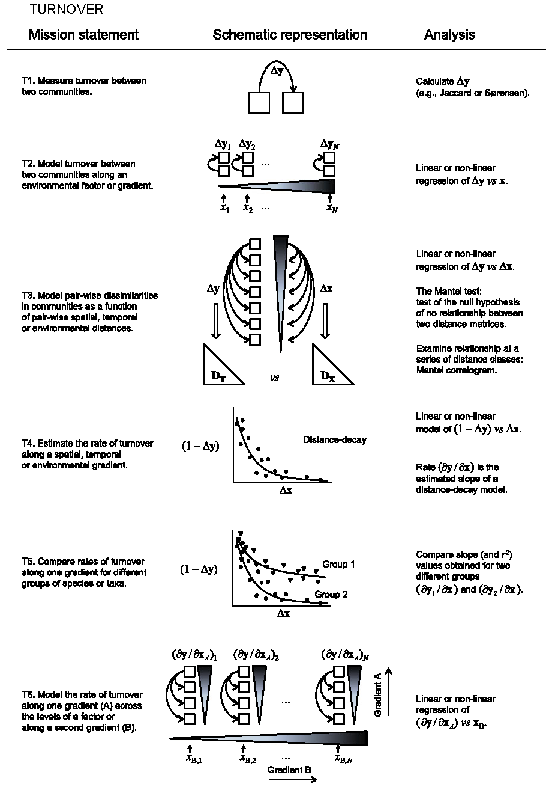
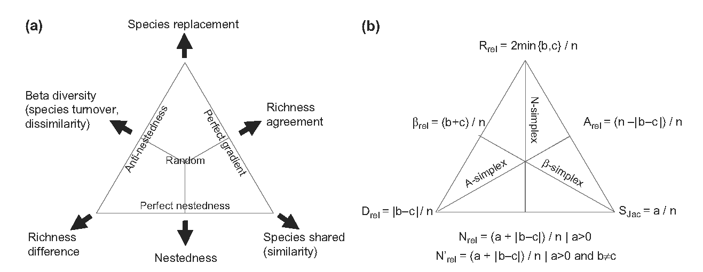

# (PART) Diversité beta et décomposition {-}

# Cadre

```{r, echo=FALSE, message=FALSE}
library("tidyverse")
```


```{block, type='Essentiel'}
  La diversité $\beta$ désigne la différentiation entre communautés, c'est-à-dire une mesure de divergence de composition spécifique entre elle, ou bien la divergence entre elles et leur assemblage, appelée diversité proportionnelle.
  La conciliation de ces deux définitions fait toujours l'objet de recherches.
```

La notion de diversité $\beta$ a été introduite par  @Whittaker1960, page 320, comme le niveau de changement dans la composition des communautés, ou le degré de différenciation des communautés, en relation avec les changements de milieu.
La traduction de cette notion intuitive en une définition sans ambiguïté est encore une question de recherche et de débats.

@Anderson2011 fournissent une revue des analyses utiles de la diversité $\beta$ en forme de guide à destination des écologues reprise ici en introduction.
La distinction entre diversité de différenciation et diversité proportionnelle est présentée ensuite.


Pour simplifier l'exposé, les individus seront échantillonnés dans des communautés, appartenant à une méta-communauté. 
Le tableau \@ref(tab:Notations) résume les notations.

Des exemples montrent comment calculer cette diversité, principalement à l'aide du package *entropart*. 
Le package contient les données d'inventaire de deux hectares du dispositif de Paracou.
Les données sont organisées dans le package sous la forme d'un objet `MetaCommunity` qui contient notamment la matrice des $n_{s,i}$. 
Les parcelles de Paracou sont dans l'objet `Paracou618.MC`.

```{r Paracou618.MC}
library(entropart)
summary(Paracou618.MC)
```


(ref:Notations) Notations des effectifs, tableau espèces-communautés.
```{r Notations, echo=FALSE, warning=FALSE, size="scriptsize"}
Notations <- data.frame(
  Especes=c("Espèce $s$", "$\\dots$", "Total"),
  Communaute=c("$n_{s,i}$: nombre d'individus de l'espèce $s$ dans la communauté $i$. $\\hat{p}_{s|i}=n_{s,i}/n_{+i}$ est l'estimateur de la probabilité $p_{s|i}$ qu'un individu de la communauté $i$ soit de l'espèce $s$.", 
               "",
               "$n_{s+}=\\sum_i{n_{s,i}}$. $p_s=\\sum_i{w_{i}p_{s|i}}$"),
  Espace=c("", 
           "", 
           ""),
  Total=c("$n_{s+}=\\sum_i{n_{s,i}}$. $p_s=\\sum_i{w_{i}p_{s|i}}$", 
          "", 
          "$n$: nombre total d'individus échantillonnés ")
  )
names(Notations) <- c("", "Communauté $i$", "$\\dots$", "Total: méta-communauté")
knitr::kable(Notations, caption="(ref:Notations)", longtable = FALSE, booktabs = TRUE, escape = FALSE) %>%
  kableExtra::kable_styling(bootstrap_options = "striped", full_width = TRUE)
```


## Définition de la diversité $\beta$ par objectifs

@Anderson2011 proposent une revue des définitions de la diversité $\beta$ selon les analyses écologiques auxquelles elles peuvent contribuer plutôt que selon leurs propriétés mathématiques.


Deux types de diversité $\beta$ peuvent être définies [@Vellend2001] en accord avec les notions originales de Whittaker: le *remplacement* (*turnover*) des espèces le long d'un gradient environnemental, spatial ou temporel et la *variation* de la composition spécifique entre communautés, qui diffèrent de la méta-communauté et entre elles.
Ces deux définitions sont présentées sur les figures \@ref(fig:Anderson2011a) et \@ref(fig:Anderson2011b) [@Anderson2011].

(ref:Anderson2011a) Diversité $\beta$ liée au remplacement des espèces le long d'un gradient. $\Delta{y}$ est la mesure de la dissimilarité entre deux communautés. $\mathbf{x}$ est un gradient environnemental, spatial ou temporel. $\Delta{x}$ est l'écart entre deux points du gradient.
```{r Anderson2011a, fig.cap="(ref:Anderson2011a)", echo=FALSE}

```

(ref:Anderson2011b) Diversité $\beta$ liée à la variation de la composition spécifique. $\beta_W$ est le rapport entre la diversité $\gamma$ et la diversité $\alpha$, $\beta_{Add}$ leur différence. $d_{ij}$ est la dissimilarité entre les communautés $i$ et $j$. $\hat{\sigma}^2$ est la variance de cette dissimilarité, $\bar{d}$ sa moyenne. Si $d$ est une distance euclidienne, $\bar{d}_{cen}$ est la distance moyenne des communautés à leur centre de gravité.
```{r Anderson2011b, fig.cap="(ref:Anderson2011b)", echo=FALSE}
knitr::include_graphics('images/Anderson2011B.png')
```

Les mesures de remplacement ne sont pas traitées en détail dans ce chapitre mais simplement présentées ici.

La plus simple (figure \@ref(fig:Anderson2011a), T1) est la dissimilarité entre deux communautés notée $\Delta{y}$.
De nombreuses mesures de dissimilarité existent, elles sont détaillées dans le chapitre \@ref(chap:BetaPaires).
Whittaker n'envisageait que la présence ou l'absence des espèces, mais leur abondance peut être prise en compte.

Cette dissimilarité peut être analysée en fonction du gradient de référence. 
La dissimilarité entre des paires de communautés présentant la même différence (par exemple ayant subi ou non un traitement) situées le long d'un gradient (par exemple la fertilité du sol) peut être analysée en fonction de ce gradient (figure \@ref(fig:Anderson2011a), T2).
Plus classiquement, la diversité $\beta$ peut être régressée contre la valeur du gradient (T3).
La dissimilarité de chaque paire de communautés est confrontée à son écart sur le gradient.
Les deux analyses précédentes peuvent être combinées pour mesurer le remplacement des espèces selon deux gradients emboîtés (T6).

Une variation sur le modèle T2 consiste à le représenter sous la forme d'un modèle de décroissance en fonction de la distance [@Nekola1999], éventuellement pour plusieurs groupes de communautés (figure \@ref(fig:Anderson2011a), T4 et T5). 
L'indice de Simpson spatialement explicite (Section \@ref(sec:SimpsonSpatial)) entre dans ce cadre bien qu'il soit construit différemment.

Les mesures de variation (figure \@ref(fig:Anderson2011b), V1) concernent la dissimilarité entre plusieurs communautés ou entre chaque communauté et la méta-communauté.
L'équivalence de ces deux concepts n'est pas évidente: elle a été montrée pour les mesures de dissimilarité entre paires de communautés par @Legendre1999; @Legendre2001; @Legendre2005 et pour l'entropie de Rao par @Pavoine2004 mais reste une question ouverte pour l'entropie HCDT en général.

La diversité $\beta$ peut être mesurée pour un assemblage de communautés au choix comme la moyenne des dissimilarités entre les paires de communautés  ou à partir des diversités $\gamma$ et $\alpha$, c'est-à-dire en tant que mesure dérivée.
Cette dernière approche est traitée dans ce chapitre, où il sera montré que la mesure dérivée est aussi une dissimilarité moyenne entre communautés et méta-communauté.

Si la diversité est mesurée comme moyenne des dissimilarités, elle peut être analysée par des méthodes d'ordination indirectes (figure \@ref(fig:Anderson2011b), V2) ou directes (V3). Elle peut aussi être comparée entre méta-communautés ou modélisée en fonction d'un gradient environnemental (V4), de façon similaire au modèle T6.

La diversité $\beta$ peut être décomposée en niveaux hiérarchiques emboîtés (V5). Des tests statistiques sont nécessaires pour comparer les niveaux: par exemple, montrer que la diversité (inter) entre des communautés supposées différentes est significativement plus grande que celle (intra) des placettes d'échantillonnage de chacune d'entre elles, à la manière d'une analyse de variance (V6).
D'autres analyses sont bien sûr envisageables, comme la comparaison de la forme de la courbe de dissimilarité moyenne entre paires de communautés en fonction de la distance à des patrons connus, issus de simulation de processus à identifier [@Rejou-Mechain2011].


## Typologie des mesures

Cette approche utilitaire est complétée par le cadre théorique de @Jurasinski2009 qui distinguent plusieurs types de mesures de diversité:

* La diversité d'inventaire (*inventory diversity*), qui traite des données récoltées sur une unité spatiale, ce qui correspond à la définition des diversités$\ \alpha$ et $\gamma$;
* La diversité de différenciation (*differentiation diversity*), qui mesure à quel point les unités spatiales sont différentes, ce qui correspond à la définition littérale de la diversité $\beta$ de Whittaker;
* La diversité proportionnelle (*proportional diversity*), diversité $\beta$ qui se construit par différence ou rapport des diversités $\gamma$ et $\alpha$. @Marcon2014a ont montré qu'avec une décomposition appropriée de la diversité, la diversité proportionnelle est aussi la divergence entre la distribution des communautés locales et celle de la méta-communauté: la diversité $\beta$ mesure alors à quel point les unités spatiales sont différentes de leur assemblage plutôt qu'entre elles.

Dans son article fondateur, @Whittaker1960 définit la diversité $\beta$ comme le niveau de changement dans la composition des communautés, la nomme "diversité secondaire " et lui attribue la lettre $\beta$ en référence à la diversité "primaire " mesurable par l'indice $alpha$ de Fisher [@Fisher1943] (voir le chapitre \@ref(chap:Fisher).
Il illustre cette définition par une mesure de différentiation: l'indice de Jaccard, mais utilise ensuite une mesure proportionnelle: le rapport des indice $alpha$ de l'assemblage des communautés à sa moyenne sur les communautés.
La conciliation des deux approches n'est pas simple.
@Gregorius2016 montre notamment que les mesures habituelles de diversité proportionnelle ne rendent pas compte correctement de la différentiation.


## Décomposition de la diversité

La façon de décomposer la diversité, aboutissant donc à une diversité $\beta$ proportionnelle, ne fait pas consensus.
Les éléments du débat sont présentés ici.

### Définitions de la diversité $\beta$, mesure dérivée

@Tuomisto2010a passe en revue l'ensemble des définitions de la diversité $\beta$ dérivée des diversités $\gamma$ et $\alpha$. 
Toutes ont en commun:

* Une définition de la mesure de diversité, appliquée à la diversité $\gamma$, qui est généralement une des mesures vues dans le chapitre \@ref(chap:MesuresNeutres);
* Une définition de la diversité $\alpha$, qui peut être par exemple:
    * La diversité locale mesurée dans chaque communauté, indépendamment de toute référence hors de la communauté;
    * De façon équivalente, le nombre d'espèces effectives dans les communautés.
    * Une façon de combiner les diversités $\gamma$ et $\alpha$ pour obtenir la diversité $\beta$, par exemple:
        * $\beta={\gamma}/{\alpha}$;
        * $\beta=\gamma-\alpha$.
  
L'utilisation des nombres de Hill, la mesure locale de la diversité $\alpha$ et la définition de la diversité $\beta$ comme rapport des diversités $\gamma$ et $\alpha$ permet de définir la "vraie diversité" [@Jost2006; @Jost2007] $\beta$ qui est un nombre de communautés équivalentes (*compositionnal units*) similaire au nombre d'espèces équivalentes des diversités $\alpha$ et $\gamma$. 
@Tuomisto2011 milite pour que le terme diversité soit réservé à la vraie diversité (homogène à un nombre d'espèces) et que les autres mesures soient appelées différemment: "entropie" de Shannon ou "probabilité" de Gini-Simpson notamment.

### Le débat sur la décomposition {#sec:DebatDecomposition}

L'objectif est de décomposer la diversité totale, notée $\gamma$ en une composante inter-groupes, notée $\beta$ et une composante intra-groupes notée $\alpha$.

Whittaker [-@Whittaker1960; -@Whittaker1972] est l'auteur de ce concept. 
Il a posé le principe que la diversité $\gamma$ devait être le produit des diversités $\alpha$ et $\beta$.

@Lande1996 a une approche additive et postule que les mesures de diversité doivent être concaves: la diversité d'un jeu de données regroupant plusieurs communautés doit être supérieure ou égale à la somme pondérée des diversités dans chaque communauté. 
De cette façon, il est possible de définir une diversité totale égale à la somme pondérée des diversités $\alpha$ (intra-communautés) et $\beta$ (inter-communautés), toutes les diversités étant positives ou nulles. 
Il note que "la partition serait plus facilement interprétable si les différentes composantes de la diversité pouvaient être exprimés au moyen de la même formule" (ce qui n'est en fait jamais le cas). 
Une revue sur les avantages de la décomposition additive est proposée par @Veech2002.

Un débat assez stérile a découlé de l'opposition entre les deux approches, principalement dû à la transformation logarithmique [@Ricotta2005a], à des définitions imprécises et des démonstrations empiriques remises en question [@Baselga2010a; @Veech2010a]. 
Il reste que la décomposition multiplicative permet seule la définition de la diversité $\beta$ en tant que diversité au sens strict [@Chao2012a].


@Marcon2012a montrent que l'entropie de Shannon $H_{\beta}$ est une mesure de diversité de différenciation en donnant sa définition indépendamment de $H_{\alpha}$ et $H_{\gamma}$, comme l'avaient fait Ricotta et Marignani pour l'entropie quadratique de Rao [@Ricotta2007a].
C'est également une diversité proportionnelle, comme toutes les mesures passées en revue par Tuomisto: la diversité de Shannon permet d'unifier les deux approches.

L'indice de Shannon, couplé à son expression sous forme de nombre de Hill, respecte finalement tous les critères imposés ou souhaités. 
Sa décomposition est détaillée ci-dessous. 
Enfin, @Marcon2014a généralisent ce résultat à toutes les mesures de diversités dérivées de l'entropie généralisée de Tsallis.


### Décomposition multiplicative de la diversité

@Jost2007 et @Chao2012a ont montré que la décomposition des nombres de Hill en éléments indépendants est multiplicative:

\begin{equation}
  (\#eq:DecompDq)
  ^{q}\!D_{\gamma} = ^{q}\!D_{\alpha} ^{q}\!D_{\beta}.
\end{equation}

$^{q}\!D_{\alpha}$ et $^{q}\!D_{\gamma}$ sont les nombres de Hill d'ordre $q$ égaux aux diversités $\alpha$ et $\gamma$. 
Ce sont des nombres équivalents d'espèces. 
$^{q}\!D_{\beta}$ est le "nombre de communautés effectives" ou "nombre équivalent de communautés ", c'est-à-dire le nombre de communautés de poids égal ne possédant aucune espèce en commun (et dont la dissimilarité entre les espèces de communautés différentes est maximale quand la diversité est phylogénétique ou fonctionnelle) [@Pavoine2015a], qui fourniraient la même valeur de diversité $\beta$.

La diversité $\beta$ est indépendante de la diversité $\alpha$ si les poids des communautés sont égaux. 
L'*indépendance* signifie que la valeur de $^{q}\!D_{\beta}$ n'est pas contrainte par celle de $^{q}\!D_{\alpha}$. 
Cette propriété est souvent considérée comme importante [@Wilson1984; @Gregorius2010], et sera discutée largement ici.


### Définitions de la diversité $\alpha$ {#sec:defalpha}

La diversité $\alpha$ est calculée pour chaque communauté, et notée $^q_iD_{\alpha}$ (l'entropie correspondante est notée $^{q}_{i}\!H_{\alpha}$). 
La diversité $\alpha$ de la méta-communauté est intuitivement la moyenne de celle des communautés. 
En raison de leurs propriétés mathématiques, il est plus simple de considérer la moyenne des entropies $\alpha$.

Le poids de chaque groupe est $w_i$, souvent choisi égal au nombre d'individus de la communauté divisé par le nombre total ou à la surface de chaque groupe, mais qui peut être arbitraire, tant que $p_s=\sum_i{w_i p_{s|i}}$. 
Deux façons de pondérer la somme émergent de la littérature [@Chao2012a]. 
La définition classique est selon @Routledge1979

\begin{equation}
  (\#eq:RoutledgeHalpha)
  ^{q}\!H_{\alpha} = \sum_i{w_i {^{q}_{i}\!H_{\alpha}}};
\end{equation}

\begin{equation}
  (\#eq:RoutledgeDalpha)
  ^{q}\!D_{\alpha}={\left(\sum_s{\sum_i{w_i p^q_{s|i}}}\right)}^{1/{\left(1-q\right)}}.
\end{equation}

La pondération proposée par @Jost2007 est

\begin{equation}
  (\#eq:JostHalpha)
  ^{q}\!H_{\alpha} = \sum_i{\frac{w^q_i}{\sum_i{w^q_i}} ^{q}_{i}\!H_{\alpha}};
\end{equation}

\begin{equation}
  (\#eq:JostDalpha)
  ^{q}\!D_{\alpha} = {\left(\sum_s{\sum_i{\frac{w^q_i}{\sum_i{w^q_i}}p^q_{s|i}}}\right)}^{{1}/{\left(1-q\right)}}.
\end{equation}

La première est la pondération naturelle. 
La seconde, qui utilise les poids à la puissance $q$, donne donc d'autant moins d'importance que $q$ est grand aux communautés dont le poids est faible. 
Les deux définitions se confondent pour $q=1$.

Si les poids sont différents, @Jost2007 a montré que l'indépendance n'est possible que si la diversité $\alpha$ est définie selon sa pondération. 
En revanche, cette pondération ne garantit pas que la diversité $\gamma$ soit supérieure à la diversité $\alpha$ si $q$ n'est égal ni à 0 ni à 1. 
Jost conclut donc que la décomposition n'est possible que pour des communautés de même poids ou pour $q=0$ ou $q=1$.
@Ricotta2009b contourne cette difficulté en proposant une méthode de ré-échantillonnage qui permet d'égaliser les poids.

@Chiu2014 établissent une nouvelle définition de la diversité $\alpha$ qui permet d'assurer l'indépendance et garantit que la diversité $\beta$ est positive quels que soient les poids des communautés:

\begin{equation}
  (\#eq:Chiualpha)
  ^{q}\!D_{\alpha}=\frac{1}{I}{\left(\sum_s{\sum_i{{\left(w_ip_{s|i}\right)}^q}}\right)}^{{1}/{\left(1-q\right)}}.
\end{equation}

Cette définition pose problème: alors que le choix de $q$ a pour but de donner une importance plus ou moins grande aux espèces rares, son effet est le même sur la taille des communautés La diversité dépendra essentiellement des espèces rares dans les communautés de faible poids si $q$ est petit, définissant une diversité bi-dimensionnelle. 
Cette question est traitée en détail au chapitre \@ref(chap:DiversiteJointe).

@Marcon2014a préfèrent la définition de Routledge qui est plus intuitive que garantit que la diversité $\gamma$ est supérieure à la diversité $\alpha$. 
La dépendance entre $^{q}\!D_{\beta}$ et $^{q}\!D_{\alpha}$ est le prix à payer.


# Diversité de différentiation {#chap:BetaPaires}

```{block, type='Essentiel'}
  La diversité $\beta$ de différentiation mesure la dissimilarité entre communautés, généralement considérées par paires.
  Les dissimilarités les plus connues sont celles de Jaccard ou de Sørensen.
  Ces mesures peuvent prendre en compte la seule présence ou absence des espèces, leur abondance ou même la similarité entre les espèces, peuvent être traitées par l'analyse multivariée et être testées contre l'hypothèse de nullité de la dissimilarité.
```


La littérature des indices de similarité est bien antérieure à celle de la biodiversité.
De nombreuses mesures de dissimilarité entre paires de communautés existent donc, et leurs propriétés ont été bien étudiées.
Elles seront présentées ici en fonction des types de données qu'elles traitent: présence-absence, abondance ou abondance et similarité des espèces.
Enfin, des tests statistiques ont été construits pour rejeter l'hypothèse que les communautés sont issues d'une même méta-communautés par un simple tirage multinomial des espèces.

Une limite importante des mesures de dissimilarité est qu'elles sont très sensibles à la taille des communautés échantillonnées [@Wolda1981].


## Données de présence-absence

### Indices de similarité

Les indices les plus simples et probablement les plus connus pour calculer la diversité $\beta$ sont l'indice de @Jaccard1901 et de Sørensen [@Czekanowski1913; @Dice1945; @Sorensen1948]. 
Ils sont définis pour deux communautés et comptent la proportion d'espèces qu'elles partagent. 
Plus elle est faible, moins la composition spécifique des communautés est semblable, plus la diversité $\beta$ est considérée comme grande.

Précisément, notons $s_{1,1}$ les espèces observées dans les deux communautés, $s_{1,0}$ celles observées dans la première communauté mais pas la deuxième (et de même  $s_{0,1}$). 
L'indice de Jaccard est le rapport entre le nombre d'espèces communes et le nombre d'espèces total:

\begin{equation}
  (\#eq:Jaccard)
  S_3 = \frac{s_{1,1}}{s_{1,1}+s_{1,0}+s_{0,1}}.
\end{equation}

L'indice de Sørensen vaut deux fois le nombre d'espèces communes divisé par la somme du nombre d'espèces des deux communautés:

\begin{equation}
  (\#eq:S7)
  S_7 = \frac{2s_{1,1}}{2s_{1,1}+s_{1,0}+s_{0,1}}.
\end{equation}

Les notations $S_n$ correspondent à celles de l'article de référence de @Gower1986 qui fait la revue de ces indices de similarité (13 autres sont traités) et en étudie les propriétés. 
Certains indices prennent en compte les espèces absentes des deux communautés mais qui auraient pu être observées $s_{0,0}$.

Deux autres indices sont mentionnés ici, celui de @Sokal1963 et celui d'Ochiai [-@Ochiai1957]:

\begin{equation}
  (\#eq:S5)
  S_5 = \frac{s_{1,1}}{s_{1,1}+2 \left(s_{1,0}+s_{0,1}\right)};
\end{equation}
\begin{equation}
  (\#eq:S12)
  S_{12} = \frac{s_{1,1}}{\sqrt{\left(s_{1,1}+s_{1,0}\right)\left(s_{1,1}+s_{0,1}\right)}}.
\end{equation}

Une propriété importante est la possibilité de comparer plusieurs communautés en calculant la matrice de leurs dissimilarités deux à deux et en en faisant une représentation graphique. 
Pour cela, la similarité est transformée en dissimilarité $D_n=1-S_n$ (les similarités sont construites pour être comprises entre 0 et 1). 
$D_n$ n'est pas toujours une distance euclidienne, mais $\sqrt{D_n}$ l'est pour la majorité des indices. 
On utilisera donc généralement la matrice de distances euclidiennes $\Delta$ dont chaque élément $d_{i,j}$ est la racine de la dissimilarité $\sqrt{D_n}$ calculée entre les communautés $i$ et $j$.

Exemple: l'indice de Jaccard peut être calculé pour tous les carrés de BCI comparés deux à deux. 
La fonction `dist.binary` du package *ade4* calcule $\sqrt{D_n}$ pour 10 indices de similarité étudiés par Gower et Legendre (voir l'aide de la fonction). 
Le résultat est une demi-matrice de distances de classe `dist`.

```{r Jaccard}
library("vegan")
data(BCI)
library("ade4")
DistJaccard <- dist.binary(BCI, method = 1)
```


(ref:JaccardFig) Distribution des indices de Jaccard calculés pour les 50 carrés de BCI deux à deux.
```{r JaccardFig, echo=FALSE, results='hide', ref.label='JaccardCode', fig.cap="(ref:JaccardFig)"}
```

La distribution des valeurs de l'indice de Jaccard $S_3=1-D_3^2$ est en figure \@ref(fig:JaccardFig). 
Le mode est proche de 0,5: la moitié des espèces sont communes entre deux carrés.

Code R pour la figure:
```{r JaccardCode, eval=FALSE}
ggplot(data.frame(Jaccard=as.numeric(1-DistJaccard^2))) +
  geom_density(aes(x=Jaccard))
```

Pour afficher l'indice de Jaccard entre les carrés 1 et 2, il faut transformer la demi-matrice des distances en matrice de similarité:
```{r Jaccard2}
Jaccard <- 1-(as.matrix(DistJaccard))^2
Jaccard[1,2]
```


### Biais d'estimation

Tous les indices de similarité vus plus haut sont sensibles au biais d'estimation.
@Chao2004a fournissent un estimateur de la probabilité qu'un individu de la première communauté appartienne à une espèce commune aux deux communautés:

\begin{equation}
  (\#eq:Chao2004a)
  \hat{U} = \sum_{s}^{s_{1,1}}{\frac{n_{s,1}}{n}} + \frac{n_{+2}-1}{n_{+2}} \frac{s_1^{(2)}}{2 s_2^{(2)}} \sum_{s}^{s_{1,1}}{\frac{n_s}{n}{\mathbf 1}\left( n_{s,2}=1 \right)}.
\end{equation}

Les sommes s'entendent pour toutes les espèces communes, indicées de 1 à $s_{1,1}$.
Le premier terme de la somme est donc la probabilité qu'un individu de la première communauté appartienne à une espèce commune aux deux communautés.
$n_{+2}$ est le nombre d'individus de la deuxième communauté.
$s_1^{(2)}$ et $s_2^{(2)}$ sont le nombre d'espèces communes qui sont des singletons et doubletons dans la deuxième communauté.
L'indicatrice ${\mathbf 1}(n_{s,2}=1)$ vaut 1 si l'espèce $s$ est un singleton dans la deuxième communauté: la dernière somme est donc la probabilité qu'un individu de la première communauté appartienne à une espèce commune qui soit un singleton dans la deuxième communauté.
S'il n'y a pas de doubletons dans la deuxième communauté, leur nombre est remplacé par 1.
Enfin, il est possible que l'estimateur soit supérieur à 1, il est alors fixé à 1.

L'estimateur de la probabilité qu'un individu de la deuxième communauté appartienne à une espèce commune est noté $\hat{V}$ et est calculé de façon symétrique à $\hat{U}$.
Le nombre d'espèces communes $s_{1,1}$ est estimé par $\hat{U}\hat{V}$, $s_{1,0}$ par $(1-\hat{U})\hat{V}$ et $s_{1,0}$ par $\hat{U}(1-\hat{V})$. 
L'estimateur de l'indice de Jaccard est donc

\begin{equation}
  (\#eq:EstS3)
  \hat{S}_3 = \frac{\hat{U}\hat{V}}{\hat{U}+\hat{V}-\hat{U}\hat{V}}.
\end{equation}

L'estimateur de l'indice de Sørensen est

\begin{equation}
  (\#eq:EstS7)
  \hat{S}_7 = \frac{2\hat{U}\hat{V}}{\hat{U}+\hat{V}}.
\end{equation}

La matrice de dissimilarité corrigée est assez différente de l'originale. L'indice de Jaccard entre les deux premiers carrés devient:

```{r ChaoJaccard1}
# Calcul de U et V, N2Col est une matrice ou un dataframe de deux colonnes contenant les effectifs de chaque parcelle
ChaoUV <- function(N2Col) {
  NCommunity <- colSums(N2Col)
  Common <- (N2Col[, 1] > 0) & (N2Col[, 2] > 0)
  Single <- N2Col == 1
  NSingleCommon <- colSums(Common & Single)
  Double <- N2Col == 2
  NDoubleCommon <- colSums(Common & Double)
  NsCommon <- N2Col[Common,]
  PsCommon <- t(t(NsCommon)/colSums(N2Col))
  U <- sum(PsCommon[, 1]) + (NCommunity[2]-1)/NCommunity[2] * NSingleCommon[2]/2/max(NDoubleCommon[2], 1) * sum(PsCommon[, 1][(NsCommon == 1)[, 2]]) 
  V <- sum(PsCommon[, 2]) + (NCommunity[1]-1)/NCommunity[1] * NSingleCommon[1]/2/max(NDoubleCommon[1], 1) * sum(PsCommon[, 2][(NsCommon == 1)[, 1]]) 
return (list(U=U, V=V))
}

# Indice de Jaccard corrigé
bcJaccard <- function(N2Col) {
  ChaoEst <- ChaoUV(N2Col)
  return (min(ChaoEst$U * ChaoEst$V / (ChaoEst$U + ChaoEst$V - ChaoEst$U*ChaoEst$V), 1))
}

# Calcul de l'indice entre les carrés i et j de BCI, i<j.
BCIjaccard <- function(i,j) {
  if (i>=j) 
    return(NA)
  else
    return(bcJaccard(t(BCI[c(i,j),])))
}

# Calcul de la matrice de dissimilarité entre les 50 carrés
ChaoJaccard <- sapply(1:50, function(i) {sapply(1:50, function(j) BCIjaccard(i,j))})

# Indice de Jaccard, carrés 1 et 2, corrigé
BCIjaccard(1,2)
```

La distribution des valeurs de l'indice corrigé se trouve en figure \@ref(fig:ChaoJaccardFig). 


(ref:ChaoJaccardFig) Distribution des indices de Jaccard corrigés du biais d'etimation pour les 50 carrés de BCI deux à deux.
```{r ChaoJaccardFig, echo=FALSE, results='hide', ref.label='ChaoJaccardCode', fig.cap="(ref:ChaoJaccardFig)"}
```

La majorité des paires de carrés a une similarité supérieure à 0,8 après correction.

Code R pour la figure:
```{r ChaoJaccardCode, eval=FALSE, tidy=FALSE}
ggplot(data.frame(ChaoJaccard = as.numeric(ChaoJaccard))) +
  geom_density(aes(x=ChaoJaccard))
```

@Plotkin2002 founissent des estimateurs de la similarité de Sørensen pour les SAD les plus courantes: lognormale, broken-stick, géométrique, log-séries et même gamma, une généralisation de la distibution broken-stick.
Ils traitent le cas d'un échantillonnage dans lequel les individus sont indépendants les uns des autres, et le cas de l'agrégation spatiale.
Ils montrent que la similarité augmente beaucoup avec la taille des placettes échantillonnées et est nettement plus faible en cas d'agrégation spatiale.


### Représentation graphique

La matrice de distances peut être représentée par une analyse en coordonnées principales (PCoA) [@Gower1966]:
```{r JaccardPCO}
DistChaoJaccard <- as.dist(sqrt(1-ChaoJaccard))
PcoChaoJaccard <- dudi.pco(DistChaoJaccard, scannf = FALSE)
```


(ref:JaccardPCOFig) Représentation des 50 carrés de BCI dans une analyse en coordonnées principale fondée sur les distances de Jaccard.
```{r JaccardPCOFig, echo=FALSE, results='hide', ref.label='JaccardPCOCode', fig.cap="(ref:JaccardPCOFig)"}
```

La représentation de l'analyse est en figure \@ref(fig:JaccardPCOFig). 
Les 50 carrés de BCI sont représentés sur le plan des deux premiers facteurs. 
Les valeurs propres sont représentées dans le cartouche en haut à gauche de la figure. 
Les distances entre les points sont les valeurs de $\sqrt{D_3}$, projetées sur le plan.
La matrice de distances n'est pas euclidienne à cause des approximations de l'estimation mais les conséquences sont faibles sur les premiers axes.

Code R pour la figure:
```{r JaccardPCOCode, eval=FALSE}
scatter(PcoChaoJaccard, posieig = "bottomright")
```


## Données d'abondance

La distance la plus évidente entre communautés quand les effectifs des espèces sont connus est simplement la distance euclidienne, éventuellement normalisée par le nombre d'espèces (Dissimilarité $D_1$ de @Gower1986).
Son problème principal est qu'elle est très sensible aux ordres de grandeurs relatifs des variables.

La dissimilarité de Steinhaus [@Motyka1947], plus connue sous le nom de Bray-Curtis [@Odum1950; @Bray1957] (voir l'analyse historique de  @Legendre2012, note de bas de page, eq. 7.58,), qui pourrait être attribuée à @Renkonen1938, est très utilisée (par défaut dans plusieurs analyses du package *vegan* par exemple):

\begin{equation}
  (\#eq:BrayCurtis)
  D_{8} = \frac{\sum_s{\left| n_{s,1}-n_{s,2} \right|}}{\sum_s{\left( n_{s,1}+n_{s,2}. \right)}}
\end{equation}

$n_{s,1}$ et $n_{s,2}$ sont le nombre d'individus de l'espèce $s$ dans la première et la deuxième communauté.
La racine carrée de la dissimilarité de Bray-Curtis est euclidienne.

@Gower1971 propose une extension de la dissimilarité de Bray-Curtis:
\begin{equation}
  (\#eq:Gower1971)
  D_{G} = \frac{\sum_s{w_s\left| n_{s,1}-n_{s,2} \right|}}{R_s\sum_s{w_s}}.
\end{equation}

$R_s$ est l'étendue ou l'écart-type de l'abondance de l'espèce $s$, qui permet de ne pas surpondérer l'effet des espèces très abondantes.
$w_s$ est le poids attribué à l'espèce $s$, qui peut être utilisé pour éliminer les doubles absences ($w_s=0$ si l'espèce est absente des deux communautés, 1 sinon).

@Anderson2006 proposent une mesure de dissimilarité (de Gower modifiée) donnant le même poids à une différence d'un ordre de grandeur entre les abondances qu'à la différence entre présence et absence, qui permet donc de se passer de la normalisation par $R_s$.
Les effectifs sont transformés de la façon suivante: $x_s=\log n_s +1$ si $n_s \ne 0$, $x_s=1$ sinon (le logarithme est décimal).
La dissimilarité est
\begin{equation}
  (\#eq:MG)
  D_{\mathit{MG}} = \frac{\sum_s{w_s\left| x_{s,1}-x_{s,2} \right|}}{\sum_s{w_s}}.
\end{equation}

Elle n'est pas euclidienne.

Les dissimilarités de Jaccard et de Sørensen se généralisent aux données d'abondance.
Le nombre d'espèces communes aux deux sites $s_{1,1}$ est remplacé par le nombre d'individus de même espèce présents sur les deux sites: $n_{1,1}=\sum_s{\min(n_{s,1}, n_{s,2})}$; le nombre d'espèces seulement présentes sur le premier site $s_{1,0}$ est remplacé par le nombre d'individus, sommé sur toutes les espèces, présents uniquement sur le site: $n_{1,0}=\sum_s{\max(0, n_{s,1}-n_{s,2})}$; de même, $s_{0,1}$ est remplacé par $n_{0,1}=\sum_s{\max(0, n_{s,2}-n_{s,1)}}$.

La dissimilarité de @Ruzicka1958 généralise celle de Jaccard:

\begin{equation}
  (\#eq:Ruzicka)
  D_3 = 1-\frac{n_{1,1}}{n_{1,1}+n_{1,0}+n_{0,1}}.
\end{equation}

La différence de pourcentage (*percentage difference*) généralise la dissimilarité de Sørensen:

\begin{equation}
  (\#eq:percentdiff)
  D_7 = 1- \frac{2n_{1,1}}{2n_{1,1}+n_{1,0}+n_{0,1}}.
\end{equation}

La plupart des dissimilarités sont implémentées par la fonction `dist.ldc` du package *adespatial*.


## Emboîtement et substitution

L'indice de Sørensen et les indices similaires prennent en compte deux types de dissimilarité: l'emboîtement des composition spécifiques (*nestedness*) et la substitution d'espèces (*turnover*).
On parle d'emboîtement quand une communauté diffère d'une autre parce que sa composition est un sous-ensemble des espèces de l'autre.
La substitution correspond au remplacement de certaines espèces d'une communauté par de nouvelles espèces.
@Baselga2010 montre que la diversité $\beta$ de longicornes en Europe du nord est similaire à celle observée en Europe du sud, mais pour des raisons totalement différentes. 
En Europe du nord, les communautés perdent des espèces avec la latitude: leur dissimilarité est due principalement à l'emboîtement.
En Europe du sud, les communautés sont composées d'espèces différentes: la diversité $\beta$ est due à la substitution des espèces.
Baselga décompose l'indice de dissimilarité de Sørensen, $1-S_7$, en un terme mesurant la substitution et un mesurant l'emboîtement.

Le premier composant est l'indice de dissimilarité de @Simpson1943:
\begin{equation}
  (\#eq:Simpson1943)
  D_{sim} = \frac{\min(s_{1,0},s_{0,1})}{s_{1,1}+\min(s_{1,0},s_{0,1})}.
\end{equation}

Il vaut 0 quand les communautés sont emboîtées.
Son complément $D_{nes}$ prend en compte la partie de la dissimilarité due à l'emboîtement:
\begin{equation}
  (\#eq:DNesReplBS)
  D_{nes} 
  = \frac{s_{1,0} + s_{0,1}}{2s_{1,1} + s_{1,0} + s_{0,1}}
  - D_{sim}.
\end{equation}

Ces mesures de dissimilarité sont généralisées au-delà de deux communautés: les formules sont disponibles dans l'article de Baselga.

@Baselga2012 étend cette décomposition à la dissimilarité de Jaccard:

\begin{align}
  (\#eq:DNesReplBJ)
  D_3
  &= D_{sim} + D_{nes} \\
  &= \frac{2\min(s_{1,0},s_{0,1})}{s_{1,1}+2\min(s_{1,0},s_{0,1})}
  + \frac{s_{1,1}}{s_{1,1}+2\min(s_{1,0},s_{0,1})}\frac{|s_{1,0}-s_{0,1}|}{s_{1,1}+s_{1,0}+s_{0,1}}.
\end{align}


Le premier terme de la somme est le terme lié à la substitution et le second celui lié à l'emboîtement.

(ref:Podani2011) Triangle du simplex Similarité-Substitution-Emboîtement. (a) Similarité, emboîtement et substitution somment à 1 donc les trois composantes peuvent être représentées dans un triangle et combinées deux à deux. La dissimilarité est par exemple représentée par la proximité au côté gauche du triangle, somme de l'emboîtement et de la substitution (ses sommets adjacents) et complément à 1 de la dissimilarité (le sommet opposé). (b) Les formules de calcul dont données pour la similarité de Jaccard. Avec ces notations classiques, $a$ est le nombre d'espèces communes $s_{1,1}$, $b$ et $c$ sont les espèces propres à chaque communauté, $s_{0,1}$ et $s_{1,0}$, et $n$ est le nombre total d'espèces $a+b+c$.
```{r Podani2011, fig.cap="(ref:Podani2011)", echo=FALSE, out.width='100%'}

```

@Podani2011 défendent un point de vue différent sur la façon de comptabiliser les deux composantes de la décomposition de la dissimilarité de Jaccard.
Le terme de substitution comptabilise les espèces présentes sur un seul site, en nombre égal: $2\min(s_{1,0},s_{0,1})$ plutôt que l'indice de dissimilarité de Simpson..
Ainsi, le terme d'emboîtement comptabilise la différence de richesse entre les deux sites: $|s_{1,0}-s_{0,1}|$.

Après normalisation par le nombre total d'espèce, la décomposition est

\begin{equation}
  (\#eq:DNesReplPJ)
  D_3
  = \frac{2\min(s_{1,0},s_{0,1})}{s_{1,1} + s_{1,0} + s_{0,1}}
  + \frac{|s_{1,0}-s_{0,1}|}{s_{1,1} + s_{1,0} + s_{0,1}}.
\end{equation}

La controverse entre les deux décompositions perdure [@Podani2016].

Comme la dissimilarité est la somme de l'emboîtement et de la substitution et que la dissimilarité est le complément à 1 de la similarité, la somme de la similarité, de l'emboîtement et de la substitution vaut 1.
@Podani2011 représentent cette égalité dans un triangle dont les sommets correspondent aux trois termes (Figure \@ref(fig:Podani2011)).

@Podani2013 étendent cette approche à des mesures de dissimilarité prenant en compte les abondances, particulièrement la dissimilarité de Ružička.
La décomposition est identique à celle de l'équation \@ref(eq:DNesReplPJ) après remplacement de chaque terme.

@Legendre2014 considère cette décomposition de la diversité $\beta$ en emboîtement et substitution comme une décomposition de variance et lui applique des méthodes d'ordination pour la relier aux variables environnementales par exemple.

Les mesures de diversité $\beta$ fondées sur l'entropie HCDT (chapitre \@ref(chap:DedompHCDT)) ne permettent pas de distinguer directement emboîtement et substitution.
La variabilité des contributions $^{q}_{i}\!H_{\beta}$ des communautés à l'entropie $\beta$ augmente avec l'emboîtement, mais cette voie n'a pas été explorée.


## Données d'abondance et similarité des espèces

### Dissimilarité minimale moyenne

@Ricotta2010 définissent une mesure de dissimilarité paramétrique entre deux communautés.
Une matrice de dissimilarité est définie entre toutes les paires d'espèces.
$\min{d_{s,2}}$ désigne la dissimilarité entre l'espèce $s$ présente dans la première communauté et l'espèce la plus proche d'elle dans la deuxième communauté.
$\min{d_{t,1}}$ est la même notation pour l'espèce $t$ de la deuxième communauté et l'espèces la plus proche dans la communauté 1.
Ces valeurs sont nulles pour toutes les espèces communes.

$\pi_{s(n)}$ désigne la contribution de l'espèce $s$ à l'indice de Hurlbert, déjà vue dans le cadre de l'originalité taxonomique (Section \@ref(sec:OrigTax)).
La contribution des espèces rares augmente avec le paramètre $n$ (figure \@ref(fig:HurlbertCFig)).
Pour chaque communauté, la moyenne des dissimilarités minimales entre chaque espèce et l'autre communauté est calculée, pondérée par la contribution de l'espèce à l'indice de Hurlbert.

La dissimilarité pondérée (W pour *weighted*) entre les deux communautés (C pour *community*) en est la moyenne entre les deux communautés:
\begin{equation}
  (\#eq:CWn)
  d_{\mathit{CW}(n)} = \frac{1}{2}\left(\sum_s{\pi_{s(n)} \min{d_{s,2}}} + \sum_t{\pi_{t(n)} \min{d_{t,1}}} \right).
\end{equation}

Sa version non pondérée (U pour *unweighted*) par les abondances est [@Ricotta2008]
\begin{equation}
  (\#eq:CU)
  d_{\mathit{CU}} = \frac{\sum_s{\min{d_{s,2}}} + \sum_t{\min{d_{t,1}}}}{2s_{1,1}+s_{1,0}+s_{0,1}}.
\end{equation}

Ces mesures sont des évolutions de mesures plus anciennes, avec des pondérations différentes.
Dans l'indice de @Clarke1998, la moyenne est calculée dans chaque communauté, sans pondération:
\begin{equation}
  (\#eq:CW)
  d_{\mathit{CW}} = \frac{1}{2}\left( \frac{\sum_s{\min{d_{s,2}}}}{s_{1,1}+s_{1,0}} + \frac{\sum_t{\min{d_{t,1}}}}{s_{1,1}+s_{0,1}} \right),
\end{equation}

mais avec pondération par l'abondance des espèces chez @Ricotta2008 :
\begin{equation}
  (\#eq:Ricotta2008)
  d_{\mathit{RB}} = \frac{1}{2}\left( \sum_s{p_{s|1}\min{d_{s,2}}} + \sum_t{p_{t|2}\min{d_{t,1}}} \right),
\end{equation}

alors qu'elle l'est globalement dans l'indice de @Izsak2001 :
\begin{equation}
  (\#eq:Izsak2001)
  d_{\mathit{IP}} = \frac{\sum_s{\min{d_{s,2}}} + \sum_t{\min{d_{t,1}}}}{s_{1,1}+s_{1,0}+s_{1,1}+s_{0,1}},
\end{equation}

redécouvert et nommé *COMDISTNN* par @Webb2008.


### Similarité moyenne entre individus

@Pavoine2014b définissent une famille de similarités entre communautés construite à partir de la similarité moyenne entre les paires d'individus de chaque communauté et les paires intercommunautaires. 
Une matrice de similarité $\mathbf{Z}$ est définie entre les paires d'espèces: $z_{s,t}$ est la similarité entre l'espèce $s$ et l'espèce $t$, comprise entre 0 et 1 de la même façon que pour le calcul de la diversité $^q\!D^{\mathbf{Z}}$ (chapitre \@ref(chap:LeinsterCobbold)). 
La matrice $\mathbf{Z}$ doit de plus être semi-définie positive, ce qui implique que $\sqrt{1-\mathbf{Z}}$ est euclidienne: de cette façon, les espèces peuvent être représentées graphiquement par une PCoA. 
Les fréquences des espèces dans les deux communautés sont $\mathbf{p}$ et $\mathbf{q}$. 
La similarité moyenne dans chaque communauté est $\sum_{s,t}{p_s p_t z_{s,t}}$ et $\sum_{s,t}{q_s q_t z_{s,t}}$. 
La similarité moyenne des paires d'individus de communautés différentes est $\sum_{s,t}{p_s q_t z_{s,t}}$.

La dissimilarité entre communautés de Rao (Section \@ref(sec:RaoDisc)) peut être normalisée (en la divisant par sa valeur maximale pour qu'elle soit comprise entre 0 et 1) puis transformée en similarité (en prenant son complément à 1) pour obtenir

\begin{equation}
  (\#eq:SorensenAbd)
  S_{\mathit{Sorensen}} = \frac{\sum_{s,t}{p_s q_t z_{s,t}}}{\frac{1}{2}\sum_{s,t}{p_s p_t z_{s,t}} + \frac{1}{2}\sum_{s,t}{q_s q_t z_{s,t}}}.
\end{equation}

Les probabilités peuvent être remplacées par n'importe quel vecteur de valeurs positives, par exemple les abondances ou des valeurs 1 et 0 pour des données de présence-absence. 
Dans ce dernier cas, et  si $\mathbf{Z}$ est la matrice identité $\mathbf{I}$ (la similarité de deux espèces différentes est nulle et $z_{s,s}=1$), $S_{\mathit{Sorensen}}$ se réduit à l'indice de Sørensen vu plus haut.

La généralisation de l'indice de Jaccard aux données d'abondances est

\begin{equation}
  (\#eq:JaccardAbd)
  S_{\mathit{Jaccard}} = \frac{\sum_{s,t}{p_s q_t z_{s,t}}}{\sum_{s,t}{p_s p_t z_{s,t}} + \sum_{s,t}{q_s q_t z_{s,t}} - \sum_{s,t}{p_s q_t z_{s,t}}}.
\end{equation}

Il se réduit à l'indice de Jaccard original pour les données de présence-absence et $\mathbf{Z} = \mathbf{I}$. 


L'indice de Sokal et Sneath se généralise par

\begin{equation}
  (\#eq:SokalAbd)
  S_{\mathit{Sokal}} = \frac{\sum_{s,t}{p_s q_t z_{s,t}}}{2 \sum_{s,t}{p_s p_t z_{s,t}} + 2 \sum_{s,t}{q_s q_t z_{s,t}} - 3 \sum_{s,t}{p_s q_t z_{s,t}}},
\end{equation}

celui d'Ochiai par:

\begin{equation}
  (\#eq:OchiaiAbd)
  S_{\mathit{Ochiai}} = \frac{\sum_{s,t}{p_s q_t z_{s,t}}}{\sqrt{\sum_{s,t}{p_s p_t z_{s,t}}} \sqrt{\sum_{s,t}{q_s q_t z_{s,t}}}}.
\end{equation}

Ces quatre similarités permettent une représentation des communautés par PCoA de la même façon que l'indice de Jaccard traité plus haut.

@Ricotta2014b ont aussi proposé de mesurer la dissimilarité par la somme des différences (en valeur absolue) de banalité des espèces des deux communautés, normalisée par la banalité totale:
\begin{equation}
  (\#eq:Ricotta2014b)
  D_{\mathit{RBP}} 
  = \frac{\sum_{s}{|\sum_{t}{(p_s-q_t)z_{s,t}}}|}{\sum_{s}{\sum_{t}{(p_s+q_t)z_{s,t}}}}.
\end{equation}


D'autres similarités ont été proposées mais ont des propriétés qui empêchent de les utiliser [@Ricotta2014b]: leur valeur n'est pas toujours nulle pour deux communautés identiques.
Ce sont l'indice proposé par @Rao1982,
\begin{equation}
  (\#eq:Rao1982Q12)
  Q_{\mathit{12}} = \sum_{s,t}{p_s q_t z_{s,t}},
\end{equation}

comme les indices de @Swenson2011:
\begin{equation}
  (\#eq:Swenson2011a)
  d_{\mathit{pw}} = \frac{1}{2}\left( \frac{\sum_s{\bar{d_{s,2}}}}{s_{1,1}+s_{1,0}} + \frac{\sum_t{\bar{d_{t,1}}}}{s_{1,1}+s_{0,1}} \right),
\end{equation}

et
\begin{equation}
  (\#eq:Swenson2011b)
  d_{\mathit{pw}}' = \frac{1}{2}\left( \sum_s{p_s\bar{d_{s,2}}} + \sum_t{q_t\bar{d_{t,1}}} \right), 
\end{equation}

où $\bar{d_{s,2}}$ est la dissimilarité moyenne entre l'espèce $s$ de la communauté 1 et toutes les espèces de la communauté 2.


## Distance entre paires de communautés et diversité $\beta$ proportionnelle

Dans certains cas présentés ici, la diversité de différentiation est parfaitement conciliable avec la diversité proportionnelle.


### Diversité de Simpson

(ref:BCIPCAFig) Représentation des deux premiers axes factoriels de l'ACP des 50 carrés de BCI. Les données sont les probabilités des espèce, ni centrées ni réduites pour l'ACP. Les carrés sont représentés avec les espèces. Les carrés 35 et 40 ont une diversité faible et sont associés aux espèces *Gustavia superba* et *Alseis blackiana*.
```{r BCIPCAFig, echo=FALSE, results='hide', out.width='100%', ref.label='BCIPCACode', fig.cap="(ref:BCIPCAFig)"}
```


@terBraak1983 a le premier rapproché l'entropie de Simpson et l'Analyse en Composantes Principales [@Pearson1901]. 
En représentant les communautés dans l'espace des espèces, la norme du vecteur de la communauté $i$ est ${\sum_s{p_{s|i}^2}}$, c'est-à-dire 1 moins l'entropie de Simpson. 
La représentation graphique de l'ACP (non centrée, non réduite) montre les communautés les moins diverses (les plus éloignées de l'origine du repère). 
Ter Braak *définit* la diversité $\beta$ comme la distance entre deux communautés (et la moyenne des distances entre paires de communautés si leur nombre est supérieur à 2). 
Cette "définition" est valide puisque cette distance est la composante inter de la décomposition de l'entropie $\beta$ de Simpson \@ref(eq:SimpsonNei).

L'ACP non centrée des 50 carrés de BCI est en figure \@ref(fig:BCIPCAFig).

Code R pour la figure:
```{r BCIPCACode, eval=FALSE}
pcaBCI <- dudi.pca(BCI/rowSums(BCI), scannf = FALSE, nf = 2, center = FALSE, scale = FALSE)
  scatter(pcaBCI, posieig = "bottomleft")
```

(ref:BCIPCA2Fig) ACP centrée des 50 carrés de BCI pour visualiser la diversité $\beta$.
```{r BCIPCA2Fig, echo=FALSE, results='hide', out.width='100%', ref.label='BCIPCA2Code', fig.cap="(ref:BCIPCA2Fig)"}
```


L'ACP centrée (mais non réduite, figure \@ref(fig:BCIPCA2Fig)) permet de mieux représenter la diversité $\beta$ : la distance de chaque carré au centre du repère est sa contribution.

Code R:
```{r BCIPCA2Code, eval=FALSE}
pcaBCI <- dudi.pca(BCI/rowSums(BCI), scannf = FALSE, nf = 2, center = TRUE, scale = FALSE)
  scatter(pcaBCI, clab.col = 0)
```


### Généralisation

@Legendre1999 ont montré plus largement que si les communautés sont représentées dans l'espace vectoriel des espèces, la moyenne des carrés des distances euclidiennes entre communautés égale la somme des carrés des écarts à la moyenne des distributions des espèces:

\begin{equation}
  (\#eq:Legendre1999)
  \frac{1}{I} \sum_{i=1}^{I-1}{\sum_{j=i+1}^{I}{d_{i,j}^2}}
  = \sum_{s=1}^{S}{\sum_{i=1}^{I}{\left(y_{s|i}-y_s \right)^2}}.
\end{equation}

$y_{s|i}$ peut être le nombre d'individus $n_{s,i}$ ou la probabilité $p_{s|i}$. 
Les communautés ont ici le même poids, $y_s$ est la moyenne des valeurs de l'espèce $s$ dans chaque communauté. 
La somme des carrés des écarts est une mesure de diversité $\beta$. 
Si $y_{s|i}$ est la probabilité $p_{s|i}$, il s'agit de l'entropie $\beta$ de Simpson.

Ce résultat peut être étendu à toute matrice de distances euclidiennes entre communautés [@Legendre2005] : l'argument est qu'il existe une matrice de $y_{s|i}$, transformation des $p_{s|i}$, telle que la distance entre les communautés est cette matrice de distances.
La moyenne des dissimilarités $D_n$ ou des compléments à 1 des similarités de Pavoine et Ricotta (qui sont les carrés des distances euclidiennes de la PCoA) est donc une mesure de diversité $\beta$.

Pour un certain nombre de distances, la transformation de $p_{s|i}$ en $y_{s|i}$ est bien connue [@Legendre2001].

(ref:Corde) Distance de corde entre deux communautés représentées dans l'espace engendré par deux espèces. La distance $d_{1,2}$ entre les deux communautés est la longueur de la corde qui relie leurs vecteurs de composition normalisés sur le cercle de rayon 1. C'est aussi deux fois le sinus de l'angle ${\alpha_{1,2}}/{2}$ formé par les deux vecteurs de composition des communautés.
```{r Corde, fig.cap="(ref:Corde)", echo=FALSE}
knitr::include_graphics('images/Corde.png')
```

La distance de corde (Figure \@ref(fig:Corde)) est obtenue par la transformation

\begin{equation}
  (\#eq:Corde)
  y_{s|i} = \frac{p_{s|i}}{\sqrt{\sum_s{p_{s|i}^2}}}.
\end{equation}

Les communautés sont représentées dans l'espace des espèces par un vecteur dont les composantes sont proportionnelles aux probabilités des espèces mais dont la norme est 1.
La distance entre communautés est donc la longueur de la corde qui relie les extrêmités de leurs vecteurs sur la sphère à $S$ dimensions de rayon 1.

La distance de Hellinger est obtenue par
\begin{equation}
  (\#eq:Hellinger)
  y_{s|i} = \sqrt{p_{s|i}}.
\end{equation}

La distance euclidienne entre les profils de communautés ($y_{s|i} = p_{s|i}$) utilisée par @terBraak1983 n'est pas optimale parce qu'elle souffre des défauts de l'entropie de Simpson [@Jost2007] qu'elle représente.
@Legendre2013, annexe S3, ont établi une liste de bonnes propriétés que doivent respecter les mesures de distance entre communautés pour analyser la diversité de différentiation.
La fonction `dist.ldc` du package *adespatial* permet de calculer toutes les distances présentées dans l'article.
Les distance de corde et de Hellinger (qui est la distance entre les racines carrées des profils de communautés) les respectent toutes.

La diversité $\beta$ exprimée de cette façon peut faire l'objet d'analyses par les méthodes d'ordination classiques (RDA: Analyse de Redondance [@Rao1964]; CCA: Analyse Canonique de Correspondance [@Braak1986]) pour la relier à des variables environnementales par exemple[@Legendre2013].

(ref:BCICordeFig) PCoA appliquée à la distance de corde des 50 carrés de BCI pour visualiser la diversité $\\beta$.
```{r BCICordeFig, echo=FALSE, message=FALSE, results='hide', out.width='100%', ref.label='BCICordeCode', fig.cap="(ref:BCICordeFig)"}
```

La diversité $\beta$ de BCI (figure \@ref(fig:BCIPCA2Fig)) est mieux représentée par une analyse en coordonnées principales appliquée à la distance de corde entre les communautés (figure \@ref(fig:BCICordeFig)).
La limite de la méthode est que l'origine du repère ne représente plus ici la méta-communauté: sa position correspond à la moyenne des probabilités des espèces transformées, $y_{s|i}$, pas à celle des $p_{s|i}$.

Code R:
```{r BCICordeCode, eval=FALSE}
library("adespatial")
dCorde <- dist.ldc(BCI, method = "chord")
pcoaBCI <- dudi.pco(dCorde, scannf = FALSE, nf = 2)
scatter(pcoaBCI)
```


## Tests de significativité {#sec:TestBetaDiff}

### Test de non-nullité

@Chase2011 testent la valeur de diversité $\beta$ observée contre sa valeur attendue sous l'hypothèse nulle d'une distribution aléatoire des individus dans les communautés.

Leur motivation principale est d'éliminer la dépendance de la diversité $\beta$ à la diversité $\alpha$ due à la mesure de diversité qu'ils utilisent : l'indice de Jaccard, appliqué aux données de présence-absence.
Des communautés théoriques sont tirées selon le modèle nul (selon une distribution multinomiale correspondant aux probabilités des espèces dans la méta-communauté et la taille de chaque communauté dans le cas le plus courant).
La distribution de la diversité $\beta$ sous l'hypothèse nulle est obtenue en répétant les simulations.
La différence entre la diversité $\beta$ réelle et la moyenne simulée est normalisée par la moyenne simulée pour obtenir une valeur comprise entre -1 et +1 (l'indice de Jaccard est compris entre 0 et 1), comparée à sa distribution sous l'hypothèse nulle pour évaluer sa significativité.

@Tucker2015 étendent cette méthode aux données d'abondance en utilisant la dissimilarité de Bray-Curtis et testent, à partir de communautés simulées, sa capacité à distinguer les mécanismes d'assemblage des communautés: niche contre modèle neutre, et modèles déterministes contre stochastiques (c'est-à-dire dont les paramètres varient aléatoirement).
Ces deux oppositions peuvent être traitées indépendamment, pour éviter la confusion entre niche et déterminisme et entre neutralité et stochasticité.
Ils concluent qu'une valeur de diversité $\beta$ significativement différente de celle du modèle nul permet de détecter le mécanisme de niche (alors que le modèle neutre donne une valeur identique à celle de l'hypothèse nulle, 0 étant donné la normalisation).
@Chase2011a interprétait les valeurs significatives comme preuve de déterminisme (par opposition à la stochasticité).
Tucker et al. montrent que ce n'est pas le cas: le niveau de stochasticité influe peu sur les résultats quand la diversité est mesurée à partir de données d'abondance.
En revanche, la méthode n'est pas fiable quand elle est utilisée avec des données de présence-absence: la stochasticité ne permet alors plus de distinguer les mécanismes.


### Analyse de la variabilité

@Anderson2006 fournissent un test d'égalité de la diversité $\beta$ entre groupes de communautés.
Les communautés sont placées dans un espace euclidien, dans lequel les distances entre elles sont une mesure de dissimilarité présentée dans ce chapitre.
Si les dissimilarités ne sont pas euclidiennes, une PCoA permet de les placer dans un espace euclidien dont certains axes sont imaginaires, sans que cette difficulté invalide la méthode.

Dans chaque groupe, la distance entre chaque communauté et le centre de gravité du groupe est calculée.
Une Anova est réalisée à partir de ces distances.
La statistique F de l'Anova suit une loi de Fisher si la distribution des distances aux centres de gravité est normale.
Si ce n'est pas le cas, le test peut être réalisé par permutation des distances entre les groupes.
La statistique de test de l'Anova est le rapport de la dispersion des centres de gravité des groupes à celle des dispersion des communautés dans chaque groupe.
Elle est comparée à sa distribution obtenue par permutation.

Une alternative consiste à utiliser la distance aux médianes spatiales des groupes.
La médiane spatiale est le point qui minimise la somme des distances entre les points et lui (alors que le centre de gravité minimise la somme des carrés de ces distances).

La fonction `betadisper` du package *vegan* implémente ce test.

@Ricotta2009a utilisent comme point central de chaque groupe celui représentant l'assemblage de ses communautés.
Ils définissent ainsi la diversité $\beta$ comme la dissimilarité moyenne entre chaque communauté et la méta-communauté.

@Bacaro2012 préfèrent tester la distribution des dissimilarités entre paires des communautés plutôt que la dissimilarité entre chaque communauté et un point de référence.
Une statistique F est calculée à partir de ces dissimilarités et comparée à sa distribution obtenue par permutation.
La méthode de permutation originale est inappropriée et donc corrigée [@Bacaro2013a]: les dissimilarités doivent être redistribuées aléatoirement entre les groupes.


# Décomposition de l'entropie HCDT {#chap:DedompHCDT}


```{block, type='Essentiel'}
  L'entropie HCDT $\gamma$ peut être décomposée en somme de l'entropie $\alpha$ et la moyenne de la divergence entre la distribution de chaque communauté et celle de la méta-communauté.
  L'entropie $\beta$ est donc interprétable comme le gain d'information apporté par la connaissance de la distribution détaillée des communautés en plus de celle, aggrégée, de la méta-communauté.
  L'entropie $\beta$ va de pair avec le nombre effectif de communautés, c'est-à-dire le nombre de communautés de même poids, sans aucune espèce commune, qui fourniraient la même valeur d'entropie $\beta$ que les communautés réelles.
  La diversité $\gamma$ se décompose donc en produit du nombre effectif d'espèces de la diversité $\alpha$ et du nombre effectif de communautés.
```


Ce chapitre traite de la diversité proportionnelle, qui mesure à quel point les communautés diffèrent de leur assemblage.
Dans la littérature, la diversité $\beta$ est généralement une mesure *dérivée* [@Ellison2010a], c'est-à-dire calculée à partir des diversités $\alpha$ et $\gamma$, d'où un abondant débat sur l'indépendance souhaitée mais pas toujours observée entre les valeurs de diversité $\alpha$ et $\beta$ [@Baselga2010a; @Jost2010a; @Veech2010a]. 
Un forum a été consacré à la question dans la revue *Ecology*, conclu par @Chao2012a, et une revue a été faite par Tuomisto [-@Tuomisto2010a; -@Tuomisto2010b].

La décomposition de l'entropie HCDT constitue un cadre cohérent dans lequel la diversité $\beta$ est non seulement une mesure dérivée, mais également une mesure de la divergence entre les distributions des communautés et celle de la méta-communauté.


## Décomposition de l'indice de Shannon

(ref:DecShannon) Définition explicite de la diversité de Shannon en tant que divergence entre une distribution observée et une distribution attendue. Les indices $H_\alpha$ et $H_\gamma$ sont les compléments au logarithme du nombre d'espèces de cette divergence.
```{r DecShannon, echo=FALSE, warning=FALSE, size="scriptsize"}
DecShannon <- data.frame(
  Indice=c("$H_\\alpha$", "$H_\\beta$", "$H_\\gamma$"),
  Dobs=c("Fréquence des espèces dans la communauté", 
             "Fréquence des espèces dans la communauté", 
             "Fréquence des espèces dans la méta-communauté"),
  Datt=c("Fréquences égales, hors formule", 
             "Fréquence totale des espèces", 
             "Fréquences égales, hors formule"),
  Formule=c("$_{i}H_\\alpha = \\sum_s{p_{s|i}\\ln{p_{s|i}}}$. $H_\\alpha = \\sum_i{w_i\\,_{i}H_\\alpha}$", 
            "$_{i}H_\\beta = \\sum_s{p_{s|i}\\ln{p_{s|i}/p_{s}}}$. $H_\\beta = \\sum_i{w_i\\,_{i}{H}_\\beta}$", 
            "$H_\\gamma = \\sum_s{p_{s}\\ln{p_{s}}}$")
)
names(DecShannon) <- c("Indice", "Distribution observée", "Distribution attendue", "Formule")
knitr::kable(DecShannon, caption="(ref:DecShannon)", longtable = FALSE, booktabs = TRUE, escape = FALSE) %>%
  kableExtra::kable_styling(bootstrap_options = "striped", full_width = TRUE)
```


### Définition

La décomposition explicite (tableau \@ref(tab:DecShannon)) est due à @Marcon2012a mais avait été établie plus ou moins clairement plusieurs fois dans la littérature, notamment par @Rao1985 : la diversité $\beta$ est la divergence de Kullback-Leibler entre la distribution des espèces dans chaque parcelle et la distribution moyenne, appelée divergence de Jensen-Shannon [@Lin1991]. 
Les diversités $\alpha$ et $\gamma$ sont les compléments à $\ln{S}$ des indices de dissimilarité de Theil \@ref(eq:Theil), divergences de Kullback-Leibler entre les distributions des espèces et leur équiprobabilité.

@Lewontin1972, dans son célèbre article sur la diversité génétique humaine, définit la diversité de Shannon inter-groupe comme la différence entre la diversité totale et la diversité moyenne intra-groupe, mais ne cherche pas à explorer ses propriétés.

La forme de $H_{\beta}$ a été établie par @Ricotta2003a, sans la relier à celle de $H_{\alpha}$ et $H_{\gamma}$. 
Enfin, l'idée de la décomposition de la divergence de Kullback-Leibler, mais avec une approche différente, sans rapprochement avec l'indice de Shannon, a été publiée par @Ludovisi2006.

Les méta-communautés peuvent à leur tour être regroupées à un niveau supérieur, la diversité $\gamma$ du niveau inférieur devenant diversité $\alpha$ pour le niveau supérieur. 
La décomposition ou le regroupement peuvent être effectués sur un nombre quelconque de niveaux.

Calcul sous R: La fonction `BetaEntropy` calcule l'entropie $\beta$ de la méta-communauté (l'argument $q=1$ permet de choisir l'entropie de Shannon). 


```{r BetaEntropy1}
# Pas de correction du biais d'estimation
summary(BetaEntropy (Paracou618.MC, q=1, Correction = "None"))
```

### Biais d'estimation {#sec:BiaisShannonBeta}

L'estimateur du taux de couverture de la communauté $i$ est noté $\hat{C}_i$, le taux de couverture total $\hat{C}$. 
L'estimateur corrigé de $_iH_{\beta}$ est

\begin{equation}
  (\#eq:EstHbetai)
  _{i}\tilde{H}_{\beta} = \sum^{s_{\ne 0}}_{i=1}{\frac{{\hat{C}}_i{\hat{p}}_{s|i} \ln\frac{{\hat{C}}_i{\hat{p}}_{s|i}}{\hat{C}{\hat{p}}_s}}{1-{\left(1-{\hat{C}}_i{\hat{p}}_{s|i}\right)}^n}}.
\end{equation}

Calcul sous R: `BetaEntropy` applique cette correction:

```{r BetaEntropy2}
summary(BetaEntropy(Paracou618.MC, q=1, Correction="ChaoShen"))
```

@Chao2013 utilisent une approche différente pour corriger le biais d'estimation: l'information mutuelle. 
Les données sont organisées comme dans le tableau \@ref(tab:Notations), mais les probabilités qu'un individu appartienne à la communauté $i$ et à l'espèce $s$ sont calculées pour que leur somme soit égale à 1 sur l'ensemble du tableau: $\sum_s{\sum_i{_{s,i}}}=1$ (au lieu de $\sum_i{p_{s|i}}=1$).

L'information mutuelle est la divergence de Kullback-Leibler entre la distribution de $\{p_{s,i}\}$ et celle du produit des distributions marginales $\{p_s\}$ et $\{p_i\}$. 
Si les distributions marginales sont indépendantes, la probabilité $p_{s,i}$ qu'un individu appartienne à l'espèce $s$ et se trouve dans la communauté $i$ est donnée par le produit des probabilités marginales $p_s$ et $p_i$, et l'information mutuelle est nulle.

L'information mutuelle se calcule comme la différence entre l'entropie de Shannon calculée sur l'ensemble du tableau $H(\{p_{s,i}\})$ et les entropies marginales $H(\{p_s\})$ et $H(\{p_i\})$. 
$H(\{p_s\})$ est l'entropie $\gamma$ de la méta-communauté. 
Si on choisit de pondérer les communautés par leurs effectifs ($w_i=p_i$), alors $H(\{p_{s,i}\})-H(\{p_i\})$ est l'entropie $\alpha$ de la méta-communauté, c'est-à-dire la moyenne pondérée des entropies $\alpha$ des communautés. 
Dans ce cas, l'entropie $\beta$ est égale à l'opposée de l'information mutuelle. 
Comme chaque terme du calcul est une entropie $\alpha$, il peut être corrigé selon l'équation \@ref(eq:Chao2013 pour obtenir un estimateur moins biaisé de $H_{\beta}$.

Calcul sous R:

```{r MutualInformation}
Shannon(Paracou618.MC$Ns) + Shannon(colSums(Paracou618.MC$Nsi)) - Shannon(Paracou618.MC$Nsi)
```

Cet estimateur est le moins biaisé à ce jour, mais n'est applicable qu'à l'entropie de Shannon, sous la condition que la pondération des communautés soit donnée par les effectifs.

@Zhang2014a proposent un estimateur de la divergence de Kullback-Leibler avec un biais réduit selon la même méthode que pour l'estimation de l'entropie HCDT ou de l'entropie de Shannon:

\begin{align}
  (\#eq:Zhang2014a)
  _{i}\tilde{H}_{\beta} 
  &= \sum^{s_{\ne 0}}_{s=1}{\frac{n_{s,i}}{n} }\\
    &\left\{ \sum^{n-n_s}_{v=1}{\frac{1}{v} \prod^v_{j=1}{ \left( 1-\frac{n_s}{n-j+1} \right) }}
     -  \sum^{n_i-n_{s,i}}_{v=1}{\frac{1}{v} \prod^v_{j=1}{\left( 1-\frac{n_{s,i}-1}{n_i-j} \right) }} \right\}.
\end{align}

Cette correction est incluse dans la fonction `ShannonBeta` de *entropart* :
```{r bcShannonBeta}
# Divergence de Kullback-Leibler entre chaque communauté de Paracou618.MC et la métacommunauté
(Beta <- apply(Paracou618.MC$Nsi, 2, ShannonBeta, Nexp=Paracou618.MC$Ns, Correction="ZhangGrabchak"))
# Entropie beta
sum(Paracou618.MC$Wi * Beta)
```

La correction de Zhang et Grabchak réduit beaucoup plus fortement l'estimation que celle de Chao et Shen. 
Le meilleur estimateur peut être évalué à partir de la différence entre les entropies $\gamma$ et $\alpha$, corrigées par le meilleur estimateur disponible (celui de Chao, Wang et Jost, voir section \@ref(sec:BiaisShannon)):

```{r bcShannonAlpha}
# Entropie alpha de chaque communauté de Paracou618.MC
(Alpha <- apply(Paracou618.MC$Nsi, 2, Shannon, CheckArguments=FALSE))
# Entropie beta estimée par différence
bcShannon(Paracou618.MC$Ns) - sum(Paracou618.MC$Wi * Alpha)
```

L'estimateur de Chao et Shen est apparemment le meilleur, la correction de celui de Zhang et Grabchak est trop forte.


## Décomposition de l'entropie généralisée

La décomposition additive de l'entropie selon @Lande1996 doit être la suivante:

\begin{equation}
  (\#eq:DecompHq)
  ^{q}\!H_{\gamma}=^{q}\!H_{\alpha} + ^{q}\!H_{\beta}.
\end{equation}

@Bourguignon1979 comme @Lande1996 définissent une mesure d'inégalité décomposable comme respectant les propriétés suivantes:

* La population totale étant partitionnée, chaque partition recevant un poids $w_i$, la composante intra-groupe de la mesure $H_{\alpha}$ est égale à la somme pondérée des mesures dans chaque-groupe $H_{\alpha}=\sum_i{w_i {_{i}\!H_{\alpha}}}$;
* La composante intergroupe $H_{\beta}$ est la mesure d'inégalité entre les groupes;
* La mesure totale $H_{\gamma}$ est la somme des mesures intra et intergroupes.

En passant par les nombres de Hill, @Jost2007 montre que l'indice de Shannon est le seul pouvant être décomposé de cette façon. 


La démonstration de Jost repose sur le postulat que la transformation de l'entropie en  nombre de Hill, définie pour la diversité $\alpha$, doit avoir la même forme pour la diversité $\beta$. 
La remise en cause de ce postulat [@Marcon2014a] permet de décomposer la diversité d'ordre quelconque quel que soit le poids des communautés.

La décomposition de l'entropie est faite en écrivant le logarithme d'ordre $q$ de la décomposition de la diversité, équation \@ref(eq:DecompDq) :

\begin{equation}
  (\#eq:DecompJost)
  ^{q}\!H_{\gamma} = {^{q}\!H_{\alpha}}+\ln_q{^{q}\!D_{\beta}}-\left(q-1\right){^{q}\!H_{\alpha}}\ln_q{^{q}\!D_{\beta}}.
\end{equation}

Ceci est la décomposition de @Jost2007. 
Jost désigne sous le nom de "composante $\beta$ de l'entropie" le logarithme d'ordre $q$ de la diversité, qu'il note $H_B$. 
La décomposition n'est pas additive, mais $H_B$ est indépendant de l'entropie $\alpha$.

Les deux derniers termes peuvent être regroupés et réarrangés pour obtenir $^{q}\!H_{\beta}$ conformément à la décomposition additive de l'équation \@ref(eq:DecompHq):

\begin{equation}
  (\#eq:ContributionBeta)
  ^{q}\!H_{\beta} = \sum_i{w_i\sum_s{p^q_{s|i}\ln_q\frac{p_{s|i}}{p_s}}}.
\end{equation}

L'entropie $\beta$ est la somme pondérée par $w_i$ (et pas autrement) des contributions de chaque communauté:

\begin{equation}
  (\#eq:PoidsHbetai)
  ^{q}_{i}\!H_{\beta}=\sum_s{p^q_{s|i}\ln_q\frac{p_{s|i}}{p_s}}.
\end{equation}

$^{q}_{i}\!H_{\beta}$ est une divergence de Kullback-Leibler généralisée [@Borland1998; @Tsallis1998].
$^{q}\!H_{\beta}$ en est la moyenne sur l'ensemble des communautés, c'est donc une généralisation de la divergence de Jensen-Shannon [@Marcon2014a].
$^{q}\!H_{\gamma}$ peut s'écrire sous la forme $^{q}\!H_{\gamma} = -\sum_s{p^q_s}\ln_q{p_s}$: la formalisation de la décomposition est une généralisation de la décomposition de l'entropie de Shannon, résumée dans le tableau \@ref(tab:Decomposition).

Il est intéressant d'écrire $^{q}_{i}\!H_{\beta}$ et $^{q}\!H_{\gamma}$ sous la forme d'entropies, pour faire apparaître leur fonction d'information. 
Pour $q$ différent de 1, l'entropie $\gamma$ est

\begin{equation}
  (\#eq:Hqgamma)
  ^{q}\!H_{\gamma} 
  = \sum_s{p_s\frac{1-p^{q-1}_s}{q-1}}
  = \sum_s{p_s\ln_q\frac{1}{p_s}}.
\end{equation}

Sa fonction d'information a été tracée figure \@ref(fig:IFig).

L'entropie $\beta$ est

\begin{equation}
  (\#eq:Hqbeta)
  ^{q}_{i}\!H_{\beta} 
  = \sum_s{p_{s|i}\frac{p^{q-1}_{s|i}-p^{q-1}_s}{q-1}}
  = \sum_s{p_{s|i}\left(\ln_q\frac{1}{p_s}-\ln_q\frac{1}{p_{s|i}}\right)}.
\end{equation}

La forme de l'entropie $\beta$ évoque la divergence de puissance [@Cressie1984] qui est une statistique qui mesure la divergence entre deux distributions dont les propriétés asymptotiques sont connues. 
La divergence de puissance peut être écrite sous la forme $I_q= \frac{-2}{q} \sum_s{p_{s|i} \ln_q\frac{p_{s}}{p_{s|i}}}$. 
Elle est égale à (deux fois) la divergence de Kullback-Leibler pour $q=1$, mais diffère de l'entropie $\beta$ pour les autres valeurs de $q$.
La divergence non-logarithmique de Jensen-Shannon [@Lamberti2003] est identique à une normalisation près: $K_q= -\sum_s{p_{s|i} \ln_q\frac{p_{s}}{p_{s|i}}}$.
Elle mesure l'écart entre la diversité $\alpha$ et la valeur de $\sum_s{w_i p^q_{s|i} \ln_q{p_s}^q}$, qui n'est pas la diversité $\gamma$ [@Marcon2014a].


Calcul sous R: La fonction `DivPart` calcule entropie et diversité en même temps:

```{r DivPartq}
DivPart(q = 1, Paracou618.MC, Biased = FALSE)
```

## Décomposition du nombre d'espèces

Les résultats généraux se simplifient pour $q=0$. 
L'entropie $\gamma$ est le nombre d'espèces de la méta-communauté moins un ($^{0}\!H_{\gamma}=S-1$), l'entropie $\alpha$ est la moyenne pondérée du nombre d'espèces des communautés moins un ($^{0}\!H_{\alpha}=\bar{S}-1$), l'entropie $\beta$ est la différence: $^{0}\!H_{\beta}=S-\bar{S}$.

En termes de diversité,

\begin{equation}
  (\#eq:D0beta)
  ^{0}\!D_{\beta}=\frac{S}{\bar{S}}.
\end{equation}

$^{0}\!D_{\beta}$ peut être supérieur au nombre de communautés [@Chao2012a] si les poids sont très inégaux, ce qui complique son interprétation. 
La pondération de Jost donne pour le nombre d'espèces le même poids à toutes les communautés et garantit $^{0}\!D_{\beta}\le I$, ce qui constitue pour Chao et al. un argument en faveur de son utilisation. 
Un contre-argumentaire est fourni par @Marcon2014a.
Quel que soit la distribution des poids des communautés, il est toujours possible de ramener les données à un ensemble de communautés de poids identiques, dont certaines sont répétées.
La communauté dont le poids $w_{min}$ est le plus faible est représentée une seule fois, les autres ${w_i}/{w_{min}}$ fois.
L'indépendance entre les diversités $\alpha$ et $\beta$ est donc bien vérifiée.
Le diversité $\beta$ maximale théorique est ${1}/{w_{min}}$ (et non $I$).
Elle n'est pas atteinte parce que plusieurs communautés sont identiques.

La définition de la diversité $\beta$ par @Whittaker1960 s'appliquait aux données de présence-absence. 
La diversité $\beta$ était le rapport entre le nombre d'espèces total de l'assemblage des communautés (diversité $\gamma$) et le nombre moyen d'espèces dans chaque communauté (diversité $\alpha$).
C'est précisément la définition de $^{0}\!D_{\beta}$ \@ref(eq:D0beta).


## Décomposition de l'indice de Gini-Simpson

L'entropie de Simpson peut aussi être décomposée comme une variance. 
La probabilité qu'un individu appartienne à l'espèce $s$ est $p_s$. 
Elle suit une loi de Bernoulli, dont la variance est $p_s\left(1-p_s\right)$. 
Cette variance peut être décomposée entre les communautés, où la probabilité est $p_{s|i}$. 
La décomposition entre variance intra et inter-communautés est

\begin{equation}
  (\#eq:DecSimpsons)
  p_s\left(1-p_s\right)=\sum_i{w_i\left[p_{s|i}\left(1-p_{s|i}\right)+{\left(p_{s|i}-p_s\right)}^2\right]}.
\end{equation}

Cette égalité peut être sommée sur toutes les espèces pour donner

\begin{equation}
  (\#eq:SimpsonNei)
  E_{\gamma}=\sum_i{w_i E_{\alpha,i}}+\sum_i{w_i\sum_s{{\left(p_{s|i}-p_s\right)}^2}}=E_{\alpha}+E_{\beta}.
\end{equation}

L'entropie $\gamma$ de Simpson peut être décomposée en sa diversité $\alpha$, somme pondérée des entropies $\alpha$ des communautés, et son entropie $\beta$, égale à la somme pondérée des distances $l^2$ entre la distribution des fréquences dans chaque communauté et celle de l'ensemble de la communauté.

En génétique, l'égalité s'écrit[@Nei1973] $H_t=H_s+D_{s,t}$. 
$H_t$ est l'hétérozygotie totale, décomposée en $H_s$, l'hétérozygotie moyenne des populations et $D_{s,t}$ la différenciation absolue entre populations. 
$G_{s,t}={D_{s,t}}/{H_t}$ est la différenciation relative.

L'entropie $E_{\beta}$ calculée de cette manière est égale à $^{2}\!H_{\beta}$ calculée à l'équation \@ref(eq:Hqbeta) pour le cas général, mais la contribution de chaque communauté est différente: la décomposition de la variance est une façon alternative de décomposer l'entropie, valable uniquement pour l'entropie de Simpson.

Cette décomposition est remise en cause par Jost [@Jost2007; -@Jost2008] qui a généré le débat [@Heller2009; @Ryman2009; @Jost2009a; @Whitlock2011]. 
$E_{\gamma}$ étant inférieure ou égale à 1, $E_{\beta}$ n'est pas indépendante de $E_{\alpha}$: seule la décomposition multiplicative permet l'indépendance, et Jost propose d'utiliser une transformation de $^{2}\!D_{\beta}$ comme mesure de différenciation (voir section \@ref(sec:Chevauchement)). @Gregorius2014 montre que ce problème n'est pas limité à l'entropie de Simpson mais s'applique à toutes les entropies HCDT d'ordre supérieur à 1.

Jost postule que la diversité $\beta$ de Simpson a la même relation à $E_{\beta}$ que les diversités $\alpha$ et $\gamma$,

\begin{equation}
  (\#eq:Dqgamma)
  ^{q}\!D_{\gamma} = {^{q}\!D_{\alpha}}{^{q}\!D_{\beta}} \Leftrightarrow \frac{1}{1-E_{\gamma}}=\frac{1}{1-E_{\alpha}}\frac{1}{1-E_{\beta}},
\end{equation}

d'où une décomposition additive différente, qui correspond à sa décomposition générale \@ref(eq:DecompJost) :

\begin{equation}
  (\#eq:Egamma)
  E_{\gamma}=E_{\alpha}+E_{\beta}-{E_{\alpha}}{E_{\beta}}.
\end{equation}

Il n'y a en réalité aucune raison pour que le nombre équivalent de la diversité $\beta$ ait la même forme que celle de la diversité $\alpha$: les deux diversités sont par nature très différentes, et Hill ne traitait pas la diversité $\beta$. 
La diversité de Shannon est exceptionnelle parce que, pour des raisons différentes, son nombre de Hill est l'exponentielle de l'entropie, et l'exponentielle de la décomposition additive \@ref(eq:DecompHq) est la décomposition multiplicative \@ref(eq:DecompDq).


(ref:Decomposition) Entropie, diversité et décomposition. L'entropie $\alpha$ de chaque communauté se calcule comme l'entropie $\gamma$
```{r Decomposition, echo=FALSE, warning=FALSE, size="scriptsize"}
Decomposition <- data.frame(
  Mesure=c("Entropie $\\gamma$", "Entropie $\\beta$", "Diversité $\\gamma$ (nombre de Hill)", "Diversité $\\beta$ (nombre équivalent"),
  Generalise=c("$^{q}\\!H_{\\gamma}=-\\sum_s{p^q_s}\\ln_q{p_s}$", 
           "$^{q}\\!H_{\\beta}=\\sum_i{w_i\\sum_s{p_{s|i}\\left(\\ln_q\\frac{1}{p_s}-\\ln_q\\frac{1}{p_{s|i}}\\right)}}$", 
           "$^{q}\\!D_{\\gamma}=e^{^q\\!H_{\\gamma}}_q$",
           "$^{q}\\!D_{\\beta}=e^{\\frac{^{q}\\!H_{\\beta}}{1-(q-1)^{q}\\!H_{\\alpha}}}_q$"),
  Shannon=c("$^{1}\\!H_{\\gamma}=-\\sum_s{p_s}\\ln{p_s}$", 
             "$^{1}\\!H_{\\beta}=\\sum_i{w_i\\sum_s{p_{s|i}\\ln\\frac{p_{s|i}}{p_s}}}$", 
             "$^{1}\\!D_{\\gamma}=e^{^1\\!H_\\gamma}$", 
             "$^{1}\\!D_{\\beta}=e^{^{1}\\!H_{\\beta}}$")
)
names(Decomposition) <- c("Mesure de diversité", "Entropie généralisée", "Shannon")
knitr::kable(Decomposition, caption="(ref:Decomposition)", longtable = FALSE, booktabs = TRUE, escape = FALSE) %>%
  kableExtra::kable_styling(bootstrap_options = "striped", full_width = TRUE)
```


Le nombre équivalent de communautés a une forme légèrement différente d'un nombre de Hill (tableau \@ref(tab:Decomposition)).

## Décomposition de l'indice de Rao {#sec:RaoDisc}

Les notations sont celles de la présentation de l'indice de Rao, section \@ref(sec:Rao).

La diversité de la méta-communauté, peut être décomposée en une somme (pondérée) de diversités intra et une diversité inter [@Pavoine2004] en définissant une dissimilarité entre les communautés $i$ et $j$:

\begin{equation}
  (\#eq:DHdelta)
  D_{H_{\Delta }}\left(\mathbf{p}_i,\mathbf{p}_j\right)
  = 2 H_{\Delta}\left(\frac{\mathbf{p}_{i}+\mathbf{p}_j}{2}\right)
  -H_{\Delta}\left(\mathbf{p}_i\right)-H_{\Delta}\left(\mathbf{p}_j\right).
\end{equation}

Elle est définie par Rao comme la différence entre l'entropie quadratique du mélange des deux communautés et celles des deux communautés prises individuellement. 
Elle peut être utilisée pour calculer un indice de diversité entre communautés, de la même façon qu'on calcule la diversité entre espèces d'une communauté:

\begin{equation}
  (\#eq:Raobeta)
  H_{\Delta }\left(\mathbf{p}\right) = \sum_i{w_i H_{\Delta }\left({\mathbf{p}}_i\right)}+\sum_i{\sum_j{w_i w_j D_{H_{\Delta }}\left({\mathbf{p}}_i,{\mathbf{p}}_j\right)}}.
\end{equation}

Le deuxième terme de la somme est la diversité inter-communautés. 
C'est un indice de Rao: les poids des communautés sont équivalents aux tableaux de fréquences et les dissimilarités entre communautés sont équivalentes aux dissimilarités entre espèces de l'équation \@ref(eq:Rao). 
La divergence entre communautés est construite à partir des entropies de chacune: l'entropie $\beta$ est définie comme la différence entre les entropies $\gamma$ et $\alpha$.

L'exemple suivant utilise les communautés du fichier `rao.effectifs.csv` :

```{r disc1}
# Vecteur contenant 8 espèces...
(read.csv2("http://www.ecofog.gf/IMG/csv/rao.effectifs.csv", row.names=1, header=T)-> effectifs)
# Lecture des données : traits pour 34 espèces
read.csv2 ("http://www.ecofog.gf/IMG/csv/rao.traits.csv", row.names=1, header=T)-> traits
# ACP sur les traits foliaires
pcaf <- dudi.pca(traits, scale=T, scannf=FALSE, nf=2)
# CAH Ward des traits foliaires
hf <- hclust(dist(pcaf$tab), "ward.D")
# Transformation de l'arbre du format hclust au format phylog
phyf <- hclust2phylog(hf)
```

Il contient 4 communautés.

Pour obtenir tous les éléments de l'équation \@ref(eq:Raobeta):

* $H_{\Delta }\left(\mathbf{p}\right)$: diversité totale. Calculer $\mathbf{p}$ en sommant les communautés. Calculer ensuite l'entropie quadratique avec `divc` :

```{r disc2}
(tabF <- apply(effectifs [names (phyf$leaves), ], MARGIN=1, sum))
divc(as.data.frame(tabF), phyf$Wdist)
```

  * $H_{\Delta}\left({\mathbf{p}}_i\right)$: diversité de chaque communauté, fournie par `divc` :

```{r disc3}
divc( effectifs [names(phyf$leaves), ], phyf$Wdist)
```

  * La variabilité inter-communautés peut être calculée par `divc` en utilisant la distance fournie par `disc`, en définissant la matrice des poids (égale aux effectifs):

```{r disc4}
divc(as.data.frame (colSums(effectifs)), disc(effectifs[names(phyf$leaves),], phyf$Wdist))
```

La fonction `disc` calcule $\sqrt{2D_{H_{\Delta}}\left({\mathbf{p}}_i,{\mathbf{p}}_j\right)}$:

```{r disc5}
disc(effectifs[names(phyf$leaves), ], phyf$Wdist)
```

Une interprétation géométrique de la décomposition est la suivante [@Pavoine2004].
Les espèces peuvent être placées dans un espace multidimensionnel construit par une Analyse en Coordonnées Principales [@Gower1966] de la matrice de dissimilarité $\mathbf{D}$ telle que $\mathbf{\Delta}={\mathbf{D}^{\circ2}}/{2}$ (les distances dans l'espace multidimensionnel sont $\sqrt{2\delta_{s's''}}$; autrement dit: la dissimilarité entre deux espèces est la moitié du carré de la distance entre elles dans la représentation géométrique).
Chaque communauté se trouve au centre de gravité des espèces qu'elle contient, pondérées par leur fréquence.
La moitié du carré de la distance entre deux communautés dans ce même espace est le coefficient de dissimilarité entre communautés de Rao.
La distance entre communautés est donc interprétable directement comme une mesure de diversité $\beta$ [@Ricotta2015], dans la tradition de l'utilisation de la dissimilarité entre paires de communautés (chapitre \@ref(chap:BetaPaires)).

Cette partition suppose que les poids des communautés sont proportionnels à leur nombre d'individus [@Rao1982, Villeger2008]. 
@Hardy2007 décomposent (par différence entre $\gamma$ et $\alpha$) l'indice de Rao de communautés de poids égaux. 
@Hardy2008 montrent que les deux pondérations sont valides mais l'absence de cadre général assurant que la diversité $\gamma$ de Rao est supérieure à la diversité $\alpha$ [@DeBello2010] motive @Guiasu2011 à proposer une alternative à l'indice de Rao, l'indice de Gini-Simpson quadratique pondéré \@ref(eq:Guiasu), dont la concavité est démontrée (ce qui implique que $\gamma\ge \alpha$). 
La pondération peut en fait être quelconque tant que la matrice dont les éléments sont la racine carré des éléments de la matrice de dissimilarité est euclidienne [@Champely2002].
Ce résultat a été obtenu pour les arbres ultramétriques dans le cadre plus général de la décomposition de l'entropie phylogénétique (voir chapitre \@ref(chap:DedompHCDT).

La partition peut être faite avec la fonction `DivPart` :

```{r DivPartRao}
# Création d'une méta-communauté, poids égaux aux effectifs
MC <- MetaCommunity(effectifs, colSums(effectifs))
summary(DivPart(q=2, MC, Tree=phyf, Normalize=FALSE))
```

La décomposition de la diversité (et non seulement de l'entropie) de Rao a été établie par @Ricotta2009.


## Synthèse

La diversité mesurée par l'entropie généralisée peut être décomposée dans tous les cas de figure, y compris lorsque les poids des communautés ne sont pas égaux. 
Les formules d'entropie et de diversité sont résumées dans le tableau \@ref(tab:Decomposition).
L'entropie $\beta$ est une mesure de divergence entre la distribution de chaque communauté et celle de la méta-communauté, comme l'avaient suggéré @Ricotta2009a.

L'entropie de Shannon est un cas particulier dans lequel toutes les controverses disparaissent: l'entropie $\beta$ est indépendante de l'entropie $\alpha$, et la pondération de Jost se confond avec celle de Routledge.

L'entropie de Simpson peut être décomposée de deux façons: comme une variance quand les poids des communautés sont donnés par leurs effectifs, ou selon le cas général. 
Les deux décompositions produisent les mêmes valeurs d'entropie $\beta$, mais la contribution de chaque communauté n'est pas la même.

L'entropie peut être décomposée hiérarchiquement sur plusieurs niveaux [@Crist2003; @Marcon2012a].

Les probabilités d'occurrence des espèces ne sont pas connues mais estimées à partir des données. 
Les diversités $\alpha$ et $\gamma$ sont sous-estimées et la diversité $\beta$ surestimée [@Marcon2012a; @Beck2013], d'autant plus que l'ordre de diversité est faible (le biais est négligeable au-delà de l'indice de Simpson). 
Des méthodes de correction existent, mais pas pour l'entropie $\beta$ à l'exception de Shannon. 
La méthode générale consiste donc à corriger les entropies $\alpha$ et $\gamma$, calculer l'entropie $\beta$ par différence et transformer les résultats en nombres équivalents [@Marcon2014a; @Marcon2014e].


## Normalisation

La mesure de diversité $^{q}\!D_{\beta}$ est le nombre équivalent de communautés totalement distinctes qui fourniraient ce niveau de diversité.


### Nécessité de normaliser la diversité $\beta$

Selon une première approche, cette mesure n'a de sens que comparée à nombre de communautés. 
La diversité entre un hectare de forêt tropicale et un hectare de forêt tempérée (de même poids, sans espèce commune) est égale à 2 quel que soit $q$. 
La diversité entre un nombre suffisant d'échantillons de forêt tropicale relativement homogène (avec de nombreuses espèces communes) peut facilement dépasser 2: c'est le cas des 50 carrés de BCI pour $q=0$. 
Pour ne pas conclure de façon erronée que les carrés de BCI sont plus différents entre eux que BCI et la forêt de Fontainebleau, @Jost2007 suggère de diviser la diversité $\beta$ par le nombre de communautés pour la normaliser. 
Ce raisonnement a un sens quand la diversité maximale envisageable est effectivement égale au nombre de communautés, par exemple si les communautés sont choisies dans des habitats différents: la diversité $\beta$ mesure cette différence.

Un autre cas est envisageable : les communautés peuvent être des échantillons d'une méta-communauté clairement définie. 
La diversité $\beta$ mesure alors la variabilité de l'échantillonnage à l'intérieur de la méta-communauté à une échelle donnée. 
Pour une taille d'échantillon fixée (par exemple un hectare de forêt), la diversité $\beta$ ne dépend pas du nombre de communautés: l'entropie $\beta$ est l'espérance (estimée par la moyenne, équation \@ref(eq:ContributionBeta) de la divergence de Jensen-Shannon entre la distribution des espèces d'une communauté et celle de la méta-communauté, fixe. 
Cette variabilité dépend de l'échelle de l'échantillonnage dans le sens où elle diminue si les échantillons sont de taille plus grande: l'entropie $\alpha$ de deux hectares de forêts est la diversité $\alpha$ moyenne de chacun des deux hectares plus l'entropie $\beta$ entre eux. 
L'entropie $\beta$ entre les échantillons de deux hectares est donc diminuée de cette entropie $\beta$ "intra" qui est absorbée par la nouvelle entropie $\alpha$ quand la taille des échantillons augmente.

(ref:BetaSampleFig) Estimation de la diversité $\beta$ entre carrés de BCI. La diversité est calculée à partir du nombre de carrés en abscisse, de 2 à 30, tirés aléatoirement. La valeur en ordonnée est la diversité d'ordre 2 moyenne sur 100 tirages, les barres représentent l'écart-type. Aux erreurs d'estimation près, la valeur de la diversité $\beta$ ne dépend pas du nombre de carrés.
```{r BetaSampleFig, echo=FALSE, results='hide', message=FALSE, ref.label='BetaSampleCode', fig.cap="(ref:BetaSampleFig)"}
```

La figure \@ref(fig:BetaSampleFig) présente les valeurs estimées de diversité neutre $\beta$ entre carrés de BCI tirés aléatoirement, en fonction du nombre de carrés.

Code pour réaliser la figure:
```{r BetaSampleCode, eval=FALSE, tidy=FALSE}
library("gplots")
MC <- MetaCommunity(as.data.frame(t(BCI)))

# Création d'une méta-communauté à partir de n carrés de BCI 
SamplePlots <- function (n, q) {
  Plots <- sample(1:50, n)
  Nsi <- MC$Nsi[, Plots]; MCsample <- MetaCommunity(Nsi)
  dp <- DivPart(q, MCsample, Biased = FALSE)
  # Retourne la diversité beta
  return(dp$TotalBetaDiversity)
}
# Calcul de la diversité moyenne à partir des simulations
BetaPlots <- function (q, nPlots, nSimulations) {
  buiw <- b <- vector("numeric", length(nPlots)); i <- 1
  for (Size in nPlots) {
    Sims <- replicate(nSimulations, SamplePlots(Size, q))  
    b[i] <- mean(Sims)
    buiw[i] <- sd(Sims)
    i <- i+1
  }
  plotCI(x = nPlots, y = b, uiw = buiw, col = "black", barcol = "blue",
    lwd = 1, xlab = "Nombre de carrés", 
    ylab = expression(paste("Diversité ", beta)))
  dpBCI <- DivPart(q, MC, Biased = FALSE)
  abline(h = dpBCI$TotalBetaDiversity, lty = 2)
}

BetaPlots(q = 2, nPlots=c(2, 5, 10, 15, 20, 25, 30), 
          nSimulations = 100)
```

L'estimation de la diversité présente les difficultés classiques dues au biais d'estimation: la diversité $\gamma$ est sous-estimée si l'échantillonnage est trop faible, la diversité $\beta$ augmente avec le nombre de communautés comme la diversité $\gamma$ augmente avec la taille de l'échantillon; il s'agit d'un problème d'estimation, pas de normalisation. 

La diversité $\beta$ ne doit donc pas être normalisée systématiquement, mais seulement dans le premier cas.

### L'indice de chevauchement $C_{qN}$ {#sec:Chevauchement}

Plutôt qu'une simple normalisation, @Chao2008 définissent un indice de chevauchement, c'est-à-dire la proportion d'espèces partagées en moyenne par une communauté. 
Si $N$ communautés (le nombre de communautés est noté $N$ ici et non $I$ pour conserver le nom de l'indice établi dans la littérature) de mêmes diversités $\alpha$ et $\gamma$ que les données, contenaient chacune $S$ espèces équifréquentes, dont $A$ seraient communes à toutes les communautés et les autres représentées dans une seule, $A/S$ serait cet indice de chevauchement.

Pour $q\ne 1$,

\begin{equation}
  (\#eq:Chao2008q)
  C_{qN} = {\left[{\left(\frac{1}{^{q}\!D_{\beta}}\right)}^{q-1}-{\left(\frac{1}{N}\right)}^{q-1}\right]}/{\left[1-{\left(\frac{1}{N}\right)}^{q-1}\right]}
\end{equation}

et

\begin{equation}
  (\#eq:C1N)
  C_{1N} 
  =\frac{1}{\ln{N}}\sum^S_{s=1}{\sum^N_{i=1}{\frac{p_{s|i}}{N}\ln\left(1+\frac{\sum_{j\ne i}{p_{sj}}}{p_{s|i}}\right)}}
  =1-\frac{H_{\beta}}{\ln{N}}.
\end{equation}

$C_{qN}$ a été défini à l'origine pour $q\ge 2$. 
@Chao2012a l'étendent sans précaution à $q$ quelconque. 
Sa valeur peut être négative pour $q<1$, on se limitera donc à $q \ge 1$.


# Décomposition de la diversité phylogénétique et fonctionnelle

```{block, type='Essentiel'}
  L'entropie phylogénétique et l'entropie de Ricotta et Szeidl se décomposent comme l'entropie HCDT.
  La diversité $\beta$ phylogénétique et la diversité $\beta$ de Leinster et Cobbold sont des nombres effectifs de communautés, c'est-à-dire des communautés de même poids et dont les espèces seraient totalement dissimilaires qui fourniraient la même entropie $\beta$ que les communautés réelles.
```

L'entropie phylogénétique est une combinaison linéaire de l'entropie HCDT donc sa décomposition est identique [@Marcon2014b]. 


## Décomposition de la diversité phylogénétique

En combinant l'équation \@ref(eq:Hbarq) et le tableau \@ref(tab:Decomposition), on obtient

\begin{equation}
  (\#eq:Hqbar)
  ^{q}\!\bar{H}_{\gamma}\left(T\right)
  = ^{q}\!\bar{H}_{\alpha}\left(T\right)
  + ^{q}\!\bar{H}_{\beta}\left(T\right).
\end{equation}

L'entropie $\gamma$ est celle de la méta-communauté, l'entropie $\alpha$ est la somme pondérée de celles des communautés, la pondération est libre mais doit respecter $p_s=\sum_i{w_ip_{s|i}}$:

\begin{equation}
  (\#eq:Hqbaralpha)
  ^{q}\!\bar{H}_{\alpha}\left(T\right)
  = \sum_i{w_i{^{q}_{i}\!\bar{H}_{\alpha}}\left(T\right)}.
\end{equation}


L'entropie $\beta$ est

\begin{align}
  (\#eq:Hqbarbeta)
  ^{q}\!\bar{H}_{\beta}\left(T\right)
  &= \sum_i{w_i}^{q}_{i}\!\bar{H}_{\beta}\left(T\right)\\
  &= \sum_i{w_i}\sum_k{\frac{T_k}{T}^{q}_{ik}\!H_{\beta}}\\
  &= \sum_i{w_i}\sum_k{\frac{T_k}{T}\sum_u{p^{q}_{k,u,i}\ln_q\frac{p_{k,u,i}}{p_{k,u}}}}
\end{align}

où $p_{k,u}$ est la probabilité d'observer une des espèces de la branche $u$ de l'arbre à la période $k$ (figure \@ref(fig:Arbre)) dans la méta-communauté, et $p_{k,u,i}$ la même probabilité dans la communauté $i$.

La décomposition de l'entropie phylogénétique au sens de @Allen2009, c'est-à-dire dans la cas particulier $q=1$, a été établie par @Mouchet2011.

La fonction `DivPart` de *entropart* permet de décomposer l'entropie. 
Les résultats contiennent la valeur de la diversité:

```{r DivPart1, tidy=FALSE}
data(Paracou618)
summary(DivPart(q = 1, Paracou618.MC, Biased = FALSE,
                Tree = Paracou618.Taxonomy))
```

(ref:DivPartFig) Représentation graphique de la diversité des deux parcelles du jeu de données `Paracou618`. Les rectangles transparents représentent la diversité neutre, les rectangles hachurés la diversité phylogénétique (l'arbre est la taxonomie des espèces, $q=1$). Dans chaque cas, le rectangle le plus large, de hauteur 1, représente la diversité $\\gamma$. Le rectangle plus haut a pour largeur et longueur les diversités $\alpha$ et $\beta$. Les surfaces des deux rectangles sont identiques.
```{r DivPartFig, echo=FALSE, results='hide', ref.label='DivPartCode', fig.cap="(ref:DivPartFig)"}
```

La figure \@ref(fig:DivPartFig) donne une représentation graphique de la décomposition de la diversité. 
La différence de taille entre les rectangles hachurés et les rectangles transparents est due à la prise en compte de la phylogénie. 
La diversité $\gamma$ (rectangles de hauteur 1) est égale au produit des diversités $\alpha$ et $\beta$ (côtés du rectangle plus haut). 
Si les communautés étaient de même poids et complètement différentes, c'est à dire contenant des espèces totalement dissimilaires entre communautés [@Pavoine2015a], la hauteur du rectangle serait égale à leur nombre (2 ici).

Code pour réaliser la figure:
```{r DivPartCode, eval=FALSE, tidy=FALSE}
q <- 1
Neutre <- DivPart(q, Paracou618.MC, Biased = FALSE)
plot(c(0, Neutre$GammaDiversity), c(0, Paracou618.MC$Ncommunities),
     type = "n", 
     xlab = expression(paste(alpha, " / ", gamma, " diversity")), 
     ylab = expression(paste(beta, " diversity")))
rect(0, 0, Neutre$GammaDiversity, 1, lty=2)
rect(0, 0, Neutre$TotalAlphaDiversity, Neutre$TotalBetaDiversity, 
     lty = 2)
Phylo <- DivPart(q, Paracou618.MC, Biased = FALSE, 
                 Tree = Paracou618.Taxonomy)
rect(0, 0, Phylo$GammaDiversity, 1, angle=135, density=10)
rect(0, 0, Phylo$TotalAlphaDiversity, Phylo$TotalBetaDiversity,
     density = 10)
```


## Partitionnement de la diversité de Leinster et Cobbold

Selon les mêmes principes que pour la décomposition de l'entropie HCDT, @Marcon2014e ont décomposé l'entropie de @Ricotta2006b. 
L'entropie $\alpha$ de la communauté $i$ est

\begin{equation}
  (\#eq:Hqzialpha)
  ^q_i\!H^{\mathbf{Z}}_\alpha
  = \frac{1-\sum_s{p_{s|i}{\left(\mathbf{Zp}\right)}^{q-1}_{s|i}}}{q-1}.
\end{equation}

L'entropie $\alpha$ est la somme pondérée des entropies des communautés:

\begin{equation}
  (\#eq:Hqzalpha)
  ^q\!H^{\mathbf{Z}}_\alpha
  = \sum_i{w_i \, ^q_i\!H^{\mathbf{Z}}_\alpha}
  = \frac{1-\sum_i{w_i\sum_s{p_{s|i}{\left(\mathbf{Zp}\right)}^{q-1}_{s|i}}}}{q-1}.
\end{equation}

L'entropie $\beta$ est similaire à l'entropie $\beta$ HCDT: c'est la divergence généralisée de Jensen-Shannon entre les distributions de $\mathbf{Zp}$ des communautés. 
Formellement:

\begin{equation}
  (\#eq:Hqzbeta)
  ^q\!H^{\mathbf{Z}}_\beta
  =\sum_i{w_i}\sum_{s}{p_{s|i}\left(\ln_q\frac{1}{{\left(\mathbf{Zp}\right)}_s}-\ln_q\frac{1}{{\left(\mathbf{Zp}\right)}_{s|i}}\right)}.
\end{equation}

La diversité $\beta$ est obtenue en calculant l'exponentielle déformée de la décomposition additive de l'entropie:

\begin{equation}
  (\#eq:Dqzbeta)
  ^q\!D^{\mathbf{Z}}_\beta
  =e^{\frac{^qH^{\mathbf{Z}}}{1+\left(1-q\right)\,{^qH^{\mathbf{Z}}_\alpha}}}_q.
\end{equation}

La décomposition de la diversité peut être faite directement, sans passer par l'entropie.

L'inverse de $^q\!D^{\mathbf{Z}}_\gamma$ est la moyenne généralisée d'ordre $q-1$ de ${\left(\mathbf{Zp}\right)}_s$:

\begin{equation}
  (\#eq:Dqzgamma)
  \frac{1}{^q\!D^{\mathbf{Z}}_\gamma}
  ={\left[\sum_i{p_s{{\left(\mathbf{Zp}\right)}_s}^{q-1}}\right]}^{\frac{1}{q-1}}
\end{equation}

Partant de $^{q}\!D_{\gamma} = {^{q}\!D_{\alpha}} {^{q}\!D_{\beta}}$ et de la définition de Routledge de la diversité $\alpha$, on obtient

\begin{equation}
  (\#eq:Dbeta)
  ^q\!D^{\mathbf{Z}}_\beta
  ={\left[\sum_i{w_i}{\left(\frac{1/^q_i\!D^{\mathbf{Z}}_\alpha}{1/^q\!D^{\mathbf{Z}}_\gamma}\right)}^{q-1}\right]}^{\frac{1}{q-1}}.
\end{equation}

De la même façon que $1/^q\!D^{\mathbf{Z}}_\gamma$ est la banalité moyenne des espèces, $^q\!D^{\mathbf{Z}}_\beta$ est la banalité moyenne normalisée des communautés, où la banalité normalisée de la communauté $i$ est définie comme ${\left(1/^q_i\!D^{\mathbf{Z}}_\alpha\right)}/{\left(1/^q\!D^{\mathbf{Z}}_\gamma\right)}$, c'est-à-dire la banalité moyenne de ses espèces divisée par celle de la méta-communauté.

La fonction `DivPart` (comme les autres fonctions avancées de *entropart*) supporte la décomposition de la diversité de Leinster et Cobbold quand une matrice de similarité lui est passée comme argument à la place d'un arbre phylogénétique pour le calcul de la phylodiversité HCDT:

```{r DivPartZ}
# Matrice de distances fonctionnelles
DistanceMatrix <- as.matrix(Paracou618.dist)
# Transformation en matrice de similarité
Z <- 1 - DistanceMatrix/max(DistanceMatrix)
# Partition de la diversité
summary(DivPart(q = 1, Paracou618.MC, Z=Z , Biased = FALSE))
```

Le partitionnement de la diversité fonctionnelle de la méta-communauté `Paracou618.MC` selon la matrice de distances des traits fonctionnels montre que la diversité $\beta$ est extrêmement faible entre les deux parcelles.


# Tests de significativité

```{block, type='Essentiel'}
  Les tests de significativité permettent d'affirmer que des communautés sont réellement différentiées. En complément, les intervalles de confiance des mesures de diversité peuvent être calculés sous l'hypothèse d'une distribution multinomiale.
```


La diversité $\beta$ calculée entre plusieurs échantillons successifs d'une même communauté n'est pas nulle: par simple fluctuation des effectifs due au hasard, les distributions des échantillons ne sont pas identiques.
Des tests statistiques ont été développés pour rejeter cette hypothèse nulle à partir de données d'inventaires.

Ce chapitre ne traite pas de la diversité de différentiation: les tests correspondants ont été présentés en section \@ref(sec:TestBetaDiff).

## Test de non-nullité

L'objectif est de tester si deux communautés ne sont pas simplement deux échantillons d'une même communauté, dont les différences ne sont que des fluctuations dues au hasard. 
Sous l'hypothèse nulle, les observations $\hat{q}_{s|i}$ sont des réalisations des mêmes probabilités $p_s$.
Il est possible [@Crist2003] mais controversé [@Jones1986] de tester la significativité de la différence entre communautés. 
Une meilleure approche consiste à calculer l'intervalle de confiance de la diversité $\beta$ due à l'incertitude sur les estimateurs de probabilités.

Le test est réalisé de la façon suivante [@Marcon2014a]:

* Les effectifs de chaque communauté $i$ sont tirés dans une loi multinomiale ${\mathcal M}(n_{+i},{n_{s,i}}/{n_{+i}})$ et ${\tilde{H}}_{\beta}$ est estimé;
* La simulation est répétée un grand nombre de fois, par exemple 10000, et les valeurs extrêmes sont éliminées. Au seuil de risque $\alpha=5\%$, les 251\ieme\ et 9750\ieme\ valeurs simulées définissent les bornes de l'intervalle de confiance de l'hypothèse nulle.

L'hypothèse nulle est rejetée si la valeur observée de ${\tilde{H}}_{\beta}$ n'est pas dans cet intervalle, en général au-delà de la borne supérieure. 
Il peut arriver que les deux communautés soient plus semblables que sous l'hypothèse nulle, c'est-à-dire que les fréquences varient moins que dans le tirage d'une loi multinomiale, si deux communautés ont été créées artificiellement avec le même nombre d'individus de chaque espèce par exemple.

Lorsque les données sont issues de communautés réelles, le sens même de ce type de test est remis en question [@Jones1986] : les communautés réelles ne pouvant pas être exactement identiques, il suffit d'augmenter la taille de l'échantillonnage pour prouver leur différence.

### Intervalle de confiance

L'intervalle de confiance de l'estimateur de $H_{\beta}$ [@Marcon2014a] peut être calculé en simulant les communautés par des tirages dans des lois multinomiales suivant leurs fréquences: ${\mathcal M}\left(n_{+i},{n_si}/{n_+i}\right)$.

Si l'intervalle de confiance ne contient pas 0, l'égalité des distributions est rejetée.

(ref:DivestFig) Estimation de la diversité de la méta-communauté `Paracou618`.
```{r DivestFig, echo=FALSE, results='hide', ref.label='DivestCode', out.width='100%', fig.cap="(ref:DivestFig)"}
```

Calcul sous R: la fonction `DivEst` produit un graphique avec l'intervalle de confiance (figure \@ref(fig:DivestFig)).

Code R:
```{r DivestCode, eval=FALSE}
de <- DivEst(q = 1, Paracou618.MC, Simulations = 1000)
plot(de)
```

Par défaut, `DivEst` ne corrige pas les biais d'estimation. 
Les résultats sont présentés sous forme de diversité et non d'entropie, la valeur attendue en cas d'égalité des communautés est 1.


### Correction des biais

Les simulations nécessaires aux tests créent un biais d'estimation: les espèces les plus rares dans les communautés sont souvent éliminées par les tirages. 
La correction du biais des tirages recentre leur distribution autour des valeurs originales des communautés non débiaisées. 
Il n'existe pas de correction analytique pour corriger successivement le biais dû aux simulations (dû à la perte des espèces rares des communautés réelles) puis celui dû à l'échantillonnage des communautés elles-mêmes (dû à la non-observation des espèces rares de la communauté). 
@Marcon2012a, comme @Chao2015, effectuent la deuxième correction par un recentrage de la distribution de $H_{\beta}$ simulée autour de sa valeur observée débiaisée, ce qui permet d'obtenir l'intervalle de confiance de l'estimateur de $H_{\beta}$.


## Analyse de la variabilité

On se place maintenant dans un cadre un peu différent: les communautés sont elles-mêmes obtenues par regroupement de placettes d'échantillonnage.
Pour tester la significativité de la diversité $\beta$ entre communautés, l'approche pourrait être celle de l'analyse de variance: l'entropie totale de la méta-communauté est la somme des entropies des sites, de l'entropie $\beta$ entre sites des communautés et de l'entropie $\beta$ entre communautés.
L'entropie $\beta$ inter-communautés pourrait être comparée à l'entropie $\beta$ intra-communautés en calculant une statistique F.
Cette approche souffre de la dépendance de l'entropie $\beta$ à l'entropie $\alpha$: si une communauté est plus diverse que l'autre, son entropie $\beta$ sera forcément plus faible.

Le test correct porte sur la diversité plutôt que sur l'entropie [@Richard-Hansen2015].
La statistique de test est le ratio de la diversité $\beta$ inter-communautés sur la la diversité $\beta$ intra-communautés.
Sa valeur observée est comparée à la distribution de sa valeur simulée en redistribuant les placettes aléatoirement dans les communautés.


# Autres approches

Des définitions différentes de la diversité $\beta$ ou du partitionnement de la diversité sont présentées ici parce qu'elles sont importantes dans la littérature même si elles n'entrent pas dans le cadre précédent.


## Le partitionnement de la diversité selon Pélissier et Couteron

### Cadre

(ref:Couteron) Tableau d'occurrence des espèces.
```{r Couteron, echo=FALSE, warning=FALSE, size="scriptsize"}
Couteron <- data.frame(
  Famille=c("Famille $u$", "$\\dots$", "Total"),
  Genre=c("Genre $t$", "$\\dots$", ""),
  Espece=c("Espèce $s$", "$\\dots$", ""),
  n=c("$n_{sh}=1$ si l'arbre $h$ appartient à l'espèce $s$, $0$ sinon. $n_{s\\cdot}={n_{s+}}/{n}$ ", 
      "", 
      "$q_{+h}=p_{+h}=1$"),
  Dots=c("", "", ""),
  Total=c("", "", "1")
)
names(Couteron) <- c("", "", "", "Forêt $k$, Parcelle $j$, Placette $i$, Arbre $h$", "$\\dots$", "Total")
knitr::kable(Couteron, caption="(ref:Couteron)", longtable = FALSE, booktabs = TRUE, escape = FALSE) %>%
  kableExtra::kable_styling(bootstrap_options = "striped", full_width = TRUE)
```

Un cadre général de partitionnement de la diversité, applicable aux trois indices classiques, est proposé par @Pelissier2007, en conclusion d'une série d'articles [@Pelissier2003; @Couteron2004].

Les données sont désagrégées jusqu'au niveau de l'individu. 
Suivant les notations précédentes, les placettes sont considérées comme le regroupement d'arbres, indicés par $h$.

Le tableau \@ref(tab:Couteron) est appelé tableau d'occurrence des espèces.
Il ne contient que des 0 et des 1. 
Chaque arbre (colonne) a une seule valeur 1 dans la cellule correspondant à son espèce.

Un arbre moyen s'il pouvait exister appartiendrait partiellement à chaque espèce, proportionnellement à son effectif. 
Chaque arbre $h$ apporte une quantité d'information égale à la somme sur toutes les espèces des écarts quadratiques entre la valeur $n_{sh}$, indicatrice de son appartenance à l'espèce $s$, et la valeur $n_{s\cdot }$ correspondant à l'arbre moyen: $\sum_s{{\left(n_{sh}-n_{s\cdot }\right)}^2}$. 
La somme peut être pondérée pour donner une importance plus ou moins grande des espèces selon leur fréquence: $\sum_s{{w_s\left(n_{sh}-n_{s\cdot }\right)}^2}$. 
La mesure totale, sommée sur tous les arbres, est notée $\mathit{TSS}$:

\begin{equation}
  (\#eq:TSS)
  \mathit{TSS} = \sum_s{w_s\sum_h{{\left(n_{sh}-n_{s\cdot}\right)}^2}}.
\end{equation}

Si le poids $w_s$ vaut toujours 1, $\mathit{TSS}/{n}$ est l'indice de Simpson.

Si $w_s={\ln{\left(1/{n_{s\cdot}}\right)}/{\left(1-n_{s\cdot}\right)}}$, on obtient l'indice de Shannon, et $w_s={1}/{w_{s\cdot}}$ donne le nombre d'espèces moins 1.


### Décomposition

L'intérêt de la méthode est de permettre l'utilisation de modèles linéaires et des outils informatiques associés classiques pour décomposer la diversité de différentes manières. 
Nous nous intéresserons ici à la décomposition de la diversité totale $\gamma$ en diversités $\alpha$ et $\beta$. 
Dans ce cadre, la diversité $\beta$ est la partie expliquée par le modèle (les différentes communautés sont les paramètres explicatifs), notée $\mathit{MSS}$, alors que la diversité $\alpha$ est résiduelle, notée $\mathit{RSS}$.

La diversité totale est $\mathit{TSS}/{n}$. 
La diversité $\alpha$ est calculée de la même manière, en prenant pour référence la fréquence des espèces à l'intérieur de chaque placette. 
Dans la placette $i$,

\begin{equation}
  \mathit{RSS}_i = \sum_s{w_s\sum_{h\in {\mathcal I}}{{\left(n_{sh} - \frac{\sum_{h\in {\mathcal I}}{n_{sh}}}{n}\right)}^2}}.
\end{equation}

La diversité $\beta$ est calculée de façon similaire par la différence entre les fréquences des espèces dans chaque placette ${\left(\sum_{h\in {\mathcal I}}{n_{sh}}\right)}/{n}$ et leur fréquence après regroupement $n_{s\cdot}$.

Le problème est que le poids attribué à chaque espèce, $w_s$, dépend de la distribution totale des espèces. 
$\mathit{RSS}$ n'est donc pas une diversité $\alpha$ puisque sa valeur dépend de données extérieures à la placette.

Le poids $w_s=1$ pour toutes les espèces règle le problème. 
Le modèle est alors celui de la décomposition de l'indice de Simpson présenté plus haut.


## Diversité de Kosman

@Kosman2013 nomme *diversité génétique* la diversité des individus d'une population (non regroupés par espèces) pour lesquels une mesure de dissimilarité a été choisie. 
Les mesures de dissimilarité acceptables [@Kosman2005] sont par exemple les mêmes que celles utilisées pour la diversité $\beta$ des communautés appliquées aux présences/absences de bandes de profils AFLP.

La mesure de dissimilarité moyenne entre les individus, notée $ADW_{\rho}$ pour *Average Dissimilarity Within*, où $\rho$ représente la dissimilarité choisie, est simplement l'entropie quadratique de Rao.
Si la dissimilarité n'est pas euclidienne, la concavité de $ADW_{\rho}$ n'est pas garantie, ce qui motive Kosman à proposer une autre mesure [@Kosman1996, Kosman2007], ${KW}_{\rho}$, qui est la dissimilarité moyenne des $n$ paires d'individus les plus dissimilaires (au lieu de toutes les ${n(n-1)}/{2}$ paires).
Les $n$ paires d'individus sont construites de façon que chaque individu apparaisse une fois en tant que premier et une fois en tant que second membre de la paire, selon un algorithme non trivial [@Bellman1970].
Tous les individus contribuent donc à la mesure de la diversité.

Pour un assemblage de $I$ populations, la diversité de Kosman ${KW}_{\rho}$ de l'assemblage des populations est toujours plus grande que la moyenne des diversités intra-populations ${KW}_{\rho}$ pondérées par le poids des populations (c'est-à-dire la diversité $\alpha$ selon la définition de Routledge) parce que ${KW}_{\rho}$ est concave.
La différence est la diversité entre populations, interprétable comme une diversité $\beta$ selon la définition additive de la décomposition.

Pour obtenir une diversité $\beta$ indépendante des diversités $\alpha$ et $\gamma$, Kosman définit ${KA}_{d}$ comme la moyenne des distances entre les $I$ paires de populations assignées selon le même algorithme que précédemment. 
La distance entre populations $d$ est de préférence la distance de Kosman entre populations, ${KB}_{\rho}$: la moyenne des $n$ paires d'individus appartenant chacun à une population les plus dissimilaires (si la taille des populations n'est pas identique, un échantillon de la plus grande population de la taille de la plus petite est tiré aléatoirement, la valeur moyenne de la distance obtenue sur plusieurs tirages est calculée).
La diversité $\gamma$ est la somme de la moyenne des diversités intra-populations ${KW}_{\rho}$ pondérées par le poids des populations et de la diversité inter-populations ${KA}_{d}$.
Ce n'est pas la diversité ${KW}_{\rho}$ de l'assemblage des populations, ce qui limite fortement l'intérêt de cette approche.
