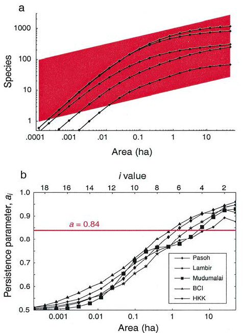

# (PART) Diversité spatialement explicite {-}

# Cadre

```{r, echo=FALSE, message=FALSE}
library("tidyverse")
```

De façon évidente, la richesse augmente avec la surface ou le nombre d'individus pris en compte.
Cette constatation peut être interprétée de deux façons différentes: l'augmentation progressive de l'effort d'échantillonnage permet d'atteindre une asymptote quand la diversité est complètement inventoriée, ou, au contraire, l'augmentation de la diversité avec la surface prise en compte est une propriété intrinsèque, et aucune asymptote n'existe.

Dans une communauté de taille définie, avec une distribution des espèces et un nombre d'individus définis même s'ils sont inconnus, l'augmentation de l'échantillonnage permet l'accumulation de la découverte de nouvelles espèces jusqu'à une asymptote.
L'accumulation de la diversité locale, décrite par une courbe d'accumulation (SAC) est présentée au chapitre \@ref(chap:Accumulation).

Il est tentant dans ce cadre de chercher un indicateur de la richesse indépendant de la surface ou du nombre d'individus.
L'approche la plus simple consiste à normaliser le nombre d'espèces observées.
@Menhinick1964 a proposé l'indice ${S^{n}}/{\sqrt{n}}$ à peu près constant dans des communautés d'insectes.
L'indice de @Margalef1958a est ${S^{n} -1}/{\ln{n}}$, adapté à une communauté de plancton.
Les deux supposent implicitement une forme de la courbe d'accumulation des espèces:  dans le premier cas, proportionnelle à la racine du nombre d'individus, dans le second à son logarithme (comme dans la relation de @Gleason1922, page \@ref(sec:Gleason)).
Aucune de ces normalisations ne fonctionne en général [@Magurran2004, p. 77].
L'indice de Fisher [@Fisher1943], construit à partir d'un modèle explicite de distribution des probabilités des espèces, a nettement plus de succès.
Il est présenté au chapitre suivant.
Son problème est qu'il est souvent utilisé pour décrire la diversité locale, comme s'il permettait de normaliser l'effort d'échantillonnage, alors que sa validité est plutôt à l'échelle régionale [@Hubbell2001].

A cette échelle, plusieurs communautés sont prises en compte simultanément.
Il est possible de rechercher une nouvelle asymptote, atteinte quand toutes les communautés sont incluses (par exemple, la totalité de la forêt amazonienne [@TerSteege2013]) ou de raisonner en termes de relation aire-espèces, sans rechercher une richesse totale hypothétique [@Preston1960].
Là encore, $\alpha$ de Fisher est ambigu puisqu'il peut provenir à la fois d'une infinité d'espèces dans son modèle original ou être compris comme le nombre fondamental de la théorie neutre, égal à deux fois le taux de spéciation fois le nombre total d'espèces (fini) de la méta-communauté [@Hubbell2001].

Enfin, la diversité $\beta$ spatialement explicite est introduite au chapitre \@ref(chap:betasp).


# Indice $\alpha$ de Fisher {#chap:Fisher}

```{block, type='Essentiel'}
L'Indice $\alpha$ de Fisher est la pente de la relation linéaire entre le nombre d'espèces observées et le logarithme du nombre d'individus inventoriés.
  Cette relation correspond à une distribution d'abondance des espèces en log-séries, valide à l'échelle de la méta-communauté.
  Son utilisation à l'échelle locale est discutable.
```


Le modèle de Fisher [@Fisher1943] aboutissant à la SAD en log-séries, a marqué l'histoire de l'écologie.
Il lie le nombre d'espèces au logarithme du nombre d'individus de façon linéaire dès que l'effectif est suffisant: la pente de la droite est le bien connu indice $\alpha$, tombé en désuétude pendant quelques décennies mais remis en vedette par la théorie neutre de @Hubbell2001.
Il est utilisé à l'échelle locale (probablement à tort) et à l'échelle régionale, c'est pourquoi il est présenté en premier.


## Construction

Le nombre d'espèces échantillonnées dépend de l'effort d'échantillonnage.

Fisher a relié le nombre d'espèces $S^{n}$ au nombre d'individus $n$ échantillonnés à partir du modèle suivant:

* Le nombre d'individus $N$ de l'échantillon suit une loi de Poisson de paramètre $\lambda$ par hypothèse: la surface est fixée, égale à 1, et les individus sont distribués totalement aléatoirement (avec la même probabilité partout, et indépendamment les uns des autres);
* Étant donné la taille de l'échantillon $N$ et la probabilité $p_s$ d'échantillonner l'espèce $s$, l'espérance du nombre d'individus échantillonnés dans l'espèce $s$ est $Np_s$;
* Le nombre d'individus réellement observé fluctue aléatoirement.
  Il suit une loi de Poisson d'espérance $\lambda_s$, où $\lambda_s=\lambda p_s$;
* La probabilité d'observer $\nu$ individus de l'espèce $s$ est notée ${\pi}_{s,\nu}$;
* La distribution de $\lambda_s$ retenue par Fisher est une loi gamma de paramètres $k$ et $p$, choisie pour ses propriétés mathématiques qui impliquent que ${\pi}_{s,\nu}$ suit une loi binomiale négative de paramètres $k$ et $1/(p+1)$;
* L'espérance du nombre d'espèces observées $\nu$ fois est $\sum_s{{\pi}_{s,\nu}}$;
* Le paramètre $k=0$ décrit bien les données de Fisher et permet de calculer l'espérance du nombre d'espèces dans un échantillon de taille $n$.

Le raisonnement est détaillé ici.
La loi gamma a deux paramètres positifs notés $k$ et $p$ par Fisher: le premier fixe sa forme, le second l'échelle.
Les valeurs de forme inférieures à 1 donnent une distribution décroissante présentée sur la figure \@ref(fig:gammaFig).
La distribution obtenue est celle de $\lambda_s$, l'espérance du nombre d'individus de l'espèce $s$.
Le paramètre de d'échelle permet d'ajuster les nombres d'individus à la taille de l'échantillon.
Il est forcément très supérieur à 1.
Plus le paramètre de forme $k$ est proche de 0, plus la décroissance des probabilités est rapide.

(ref:gammaFig) Densité de probabilité d'une loi gamma de paramètres $0,2$ et 100. Seules les valeurs inférieures à 50 sont affichées.
```{r gammaFig, echo=FALSE, fig.cap="", message=FALSE, ref.label='gammaCode', results='hide', fig.cap="(ref:gammaFig)"}
```

Le code R nécessaire pour réaliser la figure est:
```{r gammaCode, eval=FALSE, tidy=FALSE}
library("GoFKernel")
k <- 0.2
p <- 100
d <- density.reflected(rgamma(10000, shape = k, scale = p), lower = 0)
ggplot(data.frame(d$x, d$y), aes(d.x, d.y)) +
  geom_line() +
  xlim(0, 50) +
  labs(x = expression(lambda[s]), y = "Densité de probablité")
```


Les effectifs de la communauté sont un mélange de lois de Poisson de paramètres aléatoires suivant tous la même loi gamma.
La distribution des probabilités qui en résulte est une loi binomiale négative [@Greenwood1920].
La probabilité qu'une espèce soit représentée par $\nu$ individus, notée ${\pi}_{s,\nu}$, suit donc une loi binomiale négative de paramètres $k$ et ${1}/{p+1}$ représentée sur la figure \@ref(fig:nbinFig).

(fig:nbinFig) Réalisation d'une loi gamma de paramètres $0,2$ et $100$. L'histogramme représente la proportion (qui estime la probabilité) des valeurs inférieures à 50. Les espèces d'abondance nulle ne sont pas observées dans l'échantillon.
```{r nbinFig, echo=FALSE, results='hide', ref.label='nbinCode', fig.cap="(fig:nbinFig)"}
```

Le code R nécessaire pour réaliser la figure est:
```{r nbinCode, eval=FALSE, tidy=FALSE}
nbin <- rnbinom(10000, size = k, prob = 1/(p+1))
ggplot(data.frame(nbin), aes(x = nbin, y = ..prop..)) + 
  geom_bar(width = 1, color = "black", fill = "white") +
  xlim(-0.5, 50) +
  labs(x = expression(paste("Abondance ", nu)), y = "Probabilité")
```


On notera que la distribution de ${\pi}_{s,\nu}$ décrit, pour une espèce, la probabilité d'être représentée par $\nu$ individus.
Ce n'est pas la distribution des probabilités $p_s$, qui donnent la probabilité qu'un individu appartienne à l'espèce $s$.
Une courbe représentant les valeurs de ${\pi}_{s,\nu}$ en fonction de leur rang n'est donc pas un diagramme rang-abondance, mais un "pseudo-RAC" [@Izsak2012].

La variance de la loi binomiale négative varie en sens inverse du paramètre $k$.
En appliquant son modèle à des données, Fisher remarque que $k \to 0$, ce qui correspond à une distribution comprenant de nombreuses espèces de fréquences très variables, donc un pseudo-RAC décroissant rapidement, et retient cette propriété pour la suite de son raisonnement.
La valeur nulle de $k$ simplifie les calculs et permet de calculer pour une valeur arbitraire de $\nu$ la somme sur toutes les espèces des valeurs de ${\pi}_{s,\nu}$.
Dans ce cas, l'espérance du nombre d'espèces représentées par $\nu$ individus est, en posant $x=p/(p+1)$ et $\alpha$ une constante:

\begin{equation}
  (\#eq:nalpha)
  {\mathbb E}\left(S^{n}_{\nu}\right) = \frac{\alpha}{\nu} x^\nu.
\end{equation}

L'espérance du nombre d'espèces en est la somme pour toutes les valeurs de $\nu$:
\begin{equation}
  (\#eq:EspSn)
  {\mathbb E}\left(S^{n}\right) 
  = \sum_{\nu=1}^{\infty}{{\mathbb E}\left(S^{n}_{\nu}\right)}
  = -\alpha \ln(1-x).
\end{equation}

Le nombre d'espèces est obtenu par la somme du développement en série entière du logarithme de $1-x$, d'où le nom de *log-série*.

De même, le nombre total d'individus est:
\begin{equation}
  (\#eq:nlogserie)
  n = \sum_{\nu=1}^{\infty}{\nu {\mathbb E}\left(S^{n}_{\nu}\right)}
    = \sum_{\nu=1}^{\infty}{\alpha x^\nu} 
    = \frac{\alpha x}{1-x}.
\end{equation}

La combinaison des deux équations permet d'éliminer $x$ et d'obtenir l'espérance du nombre d'espèces observées en fonction de la taille de l'échantillon:

\begin{equation}
  (\#eq:AlphaFisher)
  {\mathbb E}\left( S^n \right) = \alpha\ln \left( 1 + \frac{n}{\alpha} \right).
\end{equation}

$\alpha$ est un indicateur de la biodiversité qui peut être interprété comme le nombre d'espèces nouvelles découvertes quand le nombre d'individus échantillonnés est multiplié par $e$: c'est en effet la pente de la courbe de $S^{n}$ en fonction de $\ln n$, qui se stabilise à partir d'une valeur de $n$ suffisante. 
C'est aussi le nombre de singletons attendus dans l'échantillon de taille $n$ comme le montre l'équation \@ref(eq:nalpha), sachant que $x \approx 1$.

$\alpha$ est aussi égal à $\theta$, le nombre fondamental de la biodiversité de Hubbell quand le nombre d'espèces est grand [@Alonso2004]: la SAD de la méta-communauté (pas celle de la communauté locale si la dispersion est limitée) du modèle neutre est en log-séries.
$\alpha$ est le produit du nombre total d'individus de la méta-communauté, noté classiquement $J_m$, et du taux de spéciation individuel noté $\nu$.
$x$ est le rapport entre les taux de naissance $b$ et de mortalité $d$ dans la méta-communauté, très légèrement inférieur à 1 parce que les espèces existantes sont appelées à disparaître par dérive, et remplacées par les nouvelles espèces: ${(b+\nu)}/{d}=1$.


Dans R, les fonctions `fisher.alpha` de la librairie *vegan* et `fishers.alpha` de la librairie *untb* [@Hankin2007] effectuent une résolution numérique de l'équation \@ref(eq:AlphaFisher) pour estimer $\alpha$.
La fonction `optimal.theta` dans *untb* évalue la valeur de $\theta$ par la méthode du maximum de vraisemblance [@Hubbell2001, page 122], en utilisant toute l'information de la distribution.
Le résultat est très différent parce que l'approximation de l'égalité de $\alpha$ et $\theta$ ne tient pas dans ce cas:
```{r FisherAlpha}
library("vegan")
data(BCI)
# Ns est un vecteur contenant les effectifs de chaque espèce
Ns <- colSums(BCI)
fisher.alpha(Ns)
library("untb")
fishers.alpha(sum(Ns), length(Ns))
optimal.theta(Ns)
```


Le modèle de Fisher \@ref(eq:AlphaFisher) peut être écrit sous la forme $\hat{S}^{n} = \alpha{\ln\left(\alpha+n\right)}-\alpha\ln\left(\alpha\right)$. 
Pour $n$ assez grand et sous l'hypothèse de saturation de Hubbell[@Hubbell2001], $A$ est proportionnel à $\alpha+n$ et le modèle de Fisher est équivalent au modèle de Gleason [@Engen1977].

Bordenave [@Bordenave1998; @Bordenave2011] propose un indice de richesse spécifique (IRS, ou SDI: *Species Diversity Index*) égal à la pente de la relation de Gleason. 
Dans le cadre de l'approximation précédente, il est égal à $\alpha$.


## Variantes

@Schulte2005 ont étendu le modèle de Fisher pour prendre en compte un nombre d'espèces fini $S$ et une distribution non indépendante des individus, prise en compte par un paramètre d'agrégation spatiale $c$ valable pour toutes les espèces:

\begin{equation} 
  (\#eq:Schulte)
  S^{n} = \frac{\alpha}{c} \ln\left(\frac{1+ n^c\,q}{1+ n^c\,q\,e^{-cS/\alpha}}\right),
\end{equation}

où

\begin{equation}
  (\#eq:Schulteq)
  q =\frac{e^{c/\alpha}-1}{1-e^{c\left(1-S\right)/\alpha}}.
\end{equation}

Si $S = \infty$ et $c = 1$, l'équation \@ref(eq:Schulte) se simplifie pour retrouver l'équation \@ref(eq:AlphaFisher).

(ref:Schulte2005b) Comparaison entre le modèle de Fisher et le modèle étendu dans trois parcelles forestières connues. Les modèles sont ajustés aux données observées par @Condit1996. Les courbes légendées *Equation 4* correspondent au modèle de Fisher étendu par Schulte, alors que l'*Equation 5* est le modèle intermédiaire, supposant le nombre total d'espèces infini.
```{r Schulte2005b, fig.cap="(ref:Schulte2005b)", echo=FALSE}

```


(ref:Schulte2005a) Courbes nombre d'individus-espèces-simulées pour illustrer l'importance des paramètres $c$ (concentration spatiale) et $S_{\\max}$ (nombre total d'espèces, $S$ dans nos notations) dans le modèle de Fisher. $\\alpha$ est fixé à 100 pour toutes les courbes. (a) et (b): la concentration spatiale ($c<1$) change drastiquement le nombre d'espèces attendu. En pratique, seuls $S$ et $N$ ($s^{n}_{\ne 0}$ et $n$ dans nos notations) sont observés. Si $c$ est supposé égal à 1 par erreur, $\alpha$ est sous-estimé. (a) et (c): le nombre d'espèces n'est évidemment pas infini, ce qui change fortement la forme de la courbe. Si le nombre d'observations est grand, $\alpha$ sera aussi très sous-estimé.
```{r Schulte2005a, fig.cap="(ref:Schulte2005a)", echo=FALSE}

```

Leurs résultats (figure \@ref(fig:Schulte2005b)) montrent que la non prise en compte de ces deux paramètres aboutit à une sous-estimation systématique de $\alpha$, différente selon les sites, ce qui invalide les comparaisons inter-sites.

Appliqué à des données réelles (figure \@ref(fig:Schulte2005a)), le modèle de Fisher étendu s'ajuste forcément mieux (il possède trois paramètres au lieu d'un). 
L'approximation du nombre d'espèces infini paraît être la plus pénalisante parce qu'elle exclut l'inflexion de la courbe pour les grandes valeurs de $N$, même si ces valeurs sont rarement atteinte dans les faits ($e^{10}>20000)$.

L'indice de Fisher repose lourdement sur l'hypothèse que la distribution réelle des espèces est conforme au modèle. 
@Jost2007 montre par un exemple que des interprétations absurdes de l'indice peuvent être faites si l'hypothèse n'est pas respectée.

@Kempton1976 et @Kempton1978 ont défini l'indice $Q$ comme la pente de la courbe de $\hat{S}^{n}$ en fonction de $\log{n}$ mesurée entre le premier et le troisième quartile du nombre d'espèces observées, quelle que soit la distribution des espèces.
$Q = \alpha$ si la distribution est en log-séries, et $Q = {c S}/{\sigma}$ si elle est log-normale ($c$ est une constante dépendant de la proportion des espèces échantillonnée, $S$ le nombre d'espèces total et $\sigma$ l'écart-type de la distribution du logarithme des probabilités).

La simulation suivante tire 10000 arbres dans le jeu de données BCI indépendamment et selon les fréquences des espèces.
L'indice Q est calculé:
```{r KemptonQ}
Ns <- colSums(BCI)
Inventaire <- rmultinom(10000, 1, Ns/sum(Ns))
# Cumul de l'inventaire
Cumul <- apply(Inventaire, 1, cumsum)
# Nombre d'espèces cumulées
nEspeces <- apply(Cumul, 1, function(x) length(x[x > 0]))
# Nombre total d'espèces
S <- max(nEspeces)
# Premier et troisièmes quartiles
Q13 <- which(nEspeces >= max(nEspeces)/4 & nEspeces <= max(nEspeces)*3/4)
nq1 <- min(Q13)
nq3 <- max(Q13)
Sq1 <- nEspeces[nq1]
Sq3 <- nEspeces[nq3]
# Indice Q
(Q <- (Sq3-Sq1)/log(nq3/nq1))
```

La SAC correspondante est tracée en figure \@ref(fig:KemptonQFig).

(ref:KemptonQFig) SAC d'un inventaire simulé de 10000 arbres de BCI. Le nombre d'espèces cumulé est tracé en fonction du logarithme du nombre d'individus échantillonnés. $Q$ est la pente de la droite passant par les points de la courbe correspondant aux premier et troisième quartiles du nombre d'espèces.
```{r KemptonQFig, echo=FALSE, results='hide', ref.label='KemptonQCode', fig.cap="(ref:KemptonQFig)"}
```

Code R pour réaliser la figure:
```{r KemptonQCode, eval=FALSE, tidy=FALSE}
ggplot(data.frame(x = log(1:ncol(Inventaire)), y = nEspeces)) +
  geom_line(aes(x = x, y = y)) +
  geom_vline(xintercept = log(nq1), lty = 3) +
  geom_vline(xintercept = log(nq3), lty = 3) +
  geom_hline(yintercept = Sq1, lty = 3) +
  geom_hline(yintercept = Sq3, lty = 3) +
  geom_abline(intercept = Sq1-Q*log(nq1), slope = Q) +
  labs(x = "log(n)", y = "Nombre d'espèces")
```


# Accumulation de la diversité locale {#chap:Accumulation}

```{block, type='Essentiel'}
  La courbe d'accumulation (SAC) décrit comment la richesse, ou la diversité, augmente en fonction de l'effort d'échantillonnage.
  Sous l'hypothèse d'un tirage multinomial des individus observés, les formules de raréfaction (estimation du nombre d'espèces pour une surface inférieure à celle inventoriée) sont bien contenues.
  La structure spatiale rend les observations dépendantes entre elles et doit être prise en compte.
```


Les propriétés des courbes d'accumulation ont été largement étudiées dans la littérature, notamment pour prédire la richesse spécifique (section \@ref(sec:RichesseSAC)).

L'influence de la structure spatiale est considérable mais souvent négligée parce que difficile à prendre en compte.
Quelques méthodes sont pourtant applicables.

## Courbes d'accumulation

On suppose que la communauté locale est de taille fixe et contient donc un nombre fixe d'espèces, et que leur découverte progressive aboutira à une asymptote de la SAC.

(ref:Gotelli2001) Courbes d'accumulation et de raréfaction, obtenues par inventaires individuels ou groupés (*samples*). Les courbes de raréfaction permettent de lisser les courbes d'accumulation. Les courbes obtenues par inventaire groupé sont en général en dessous des courbes individuelles à cause de l'agrégation spatiale.
```{r Gotelli2001, fig.cap="(ref:Gotelli2001)", echo=FALSE}
knitr::include_graphics('images/Gotelli2001.png')
```

@Gotelli2001 proposent une revue des problèmes les plus communément rencontrés dans l'estimation et la comparaison de la richesse spécifique. 
Ils suggèrent notamment de calculer la courbe de raréfaction (figure \@ref(fig:Gotelli2001)) plutôt que d'utiliser la courbe d'accumulation obtenue en traçant simplement le nombre d'espèces découvert en fonction de l'effort d'échantillonnage.
La courbe de raréfaction est obtenue en sous-échantillonnant dans l'inventaire complet des effectifs de toutes tailles et en calculant le nombre moyen d'espèces trouvé pour chacun, ce qui permet de la lisser.
La formulation exacte de la courbe de raréfaction et de sa variance est connue [@Ugland2003]. 

(ref:specaccumFig) Courbe d'accumulation des espèces d'arbres de Barro Colorado Island. Calcul par specaccum: accumulation des 50 carrés avec permutations.
```{r specaccumFig, fig.cap="(ref:specaccumFig)", ref.label="specaccumCode"}
```

La fonction `specaccum` de la librairie *vegan* [@Oksanen2012] permet de tracer les SAC (figure \@ref(fig:specaccumFig)) selon différentes méthodes, avec un intervalle de confiance obtenu par permutation de l'ordre d'ajout des données ou à partir des formules de raréfaction.

Le code R nécessaire pour réaliser la figure est:
```{r specaccumCode, eval=FALSE}
data(BCI)
SAC <- specaccum(BCI, "random")
plot(SAC, ci.type="poly", lwd=2, ci.lty=0, ci.col="lightgray")
```

Pour une surface donnée, le nombre d'individus est une variable aléatoire.
Dans ce cas, la SAC (dépendant de la surface) est différente de la courbe de raréfaction (fonction du nombre d'individus) de Gotelli et Colwell, que @Coleman1981 nomme "courbe du collecteur ".

La SAC théorique en fonction de la surface contient une incertitude concernant le nombre d'individus.
Si la densité $\lambda_s$ (nombre d'individus par unité de surface) des espèces peut être connue (estimée en comptant les individus) ou si les probabilités $p_s$ sont issues d'un modèle (log-séries, log-normal...), le nombre d'individus observés de l'espèce $s$ suit une loi de Poisson d'espérance $A\hat{\lambda}_s$ ou, de façon équivalente [@Pielou1969, pages 204-205], $np_s$ (dans ce deuxième cas, $n$ est l'estimateur de $N$, la variable aléatoire correspondant à la taille de l'échantillon).

La SAC théorique en fonction du nombre d'individus ne contient pas cet aléa.
Le nombre d'individus de l'espèce $s$ suit alors une loi binomiale d'espérance $np_s$ et la distribution d'un échantillon de taille $n$ suit la loi multinomiale correspondante.
Les deux approches se réconcilient en fixant arbitrairement le nombre d'individus échantillonnés dans la courbe aire-espèce: conditionnellement au nombre total d'individus, la distribution des abondances des espèces issues de lois de Poisson de paramètres $\lambda_s$ suit une loi multinomiale [@Steel1953] dont les probabilités sont proportionnelles à $\lambda_s$.

La SAC définie en fonction du nombre d'individus est au sens strict une succession de points (à chaque valeur de $n$), pas une courbe continue.
Elle est toutefois toujours présentée comme une courbe lissée passant par les points pour être continue et dérivable.

(ref:SACzetaFig) Courbe d'accumulation des espèces d'arbres de Barro Colorado Island. Somme des entropies de Simpson généralisées.
```{r SACzetaFig, fig.cap="(ref:SACzetaFig)", ref.label="SACzetaCode"}
```

Une difficulté supplémentaire consiste à prendre en compte les espèces non échantillonnées en appliquant des techniques statistiques pour réduire le biais qu'elles induisent [@Colwell2012].
Dans ce but, la SAC théorique peut être construite [@Chao2013] comme la somme des entropies de Simpson généralisées [@Zhang2010], présentées en section \@ref(sec:SimpsonG).

La courbe obtenue (figure \@ref(fig:SACzetaFig)) est la même que par raréfaction, sans les problèmes d'estimation.
Son intervalle de confiance n'est pas représenté: l'estimation est sans biais et a une variance très petite; d'autre part, la variabilité de l'échantillonnage prise en compte dans la figure \@ref(fig:specaccumFig) est ignorée ici. La fonction `GenSimp.z` est fournie par le package *EntropyEstimation* [@Cao2014].

Code pour la figure:
```{r SACzetaCode, eval=FALSE, tidy=FALSE}
library("EntropyEstimation")
data(BCI)
Ns <- colSums(BCI)
gsValues <- sapply(1:(sum(Ns)-1), function(r) GenSimp.z(Ns, r))
SAC <- cumsum(gsValues)
ggplot(data.frame(x = 0:(sum(Ns)-1), y = c(0, SAC)), aes(x = x, y = y)) +
  geom_line() +
  labs(x = "Nombre d'individus", y = "Nombre d'espèces")
```


## Extrapolation {#sec:Extrapolation}

L'extrapolation de la SAC est un cas particulier de celle de la diversité, déjà vue en section \@ref(sec:RarExtrapol).

@Beguinot2015 a une approche différente.
Il considère la SAC comme une fonction continue et infiniment dérivable de la taille de l'échantillon.
Le nombre d'espèces non observées dans un échantillon de taille $n$ est noté $s^{n}_{0}$.
Le nombre d'espèces observées dans la SAC est $s^{n}_{>0} = S - s^{n}_{0}$.
Quand $n$ est assez grand, la pente de la SAC varie peu entre $n-1$ et $n+1$ individus.
@Beguinot2014 approxime la dérivée de $s^{n}_{0}$ par $s^{n}_{0}-s^{n-1}_{0}$.
La dérivée est en réalité plus grande: la pente de la SAC, qui est l'opposée de la pente de $s^{n}_{0}$, décroît avec $n$ mais l'approximation est acceptable quand $n$ est assez grand.
De même, les dérivées successives, par exemple seconde, sont approchées par la variation de la dérivée d'ordre inférieur, par exemple première, entre $n-1$ et $n$.
En combinant ces approximations avec l'espérance du nombre d'espèces observées $\nu$ fois dans un échantillon de taille $n$, équation \@ref(eq:Esnnu), on obtient:
\begin{equation}
  (\#eq:Beguinot2014)
  {\mathbb E}\left( s^{n}_{\nu} \right) 
  = \left(-1 \right)^{\nu-1} \binom{n}{\nu} \frac{\partial^\nu s^{n}_{>0}}{\partial n^\nu}, \nu=1,2,\dots
\end{equation}

L'espérance du nombre d'espèces observées $\nu$ fois dépend directement de la dérivée $\nu$\ieme\ de la SAC.

@Beguinot2015 écrit l'accroissement du nombre d'espèces observées quand l'échantillon augmente de $n$ à $n +\delta n$ sous la forme d'une série entière, qu'il combine avec l'équation précédente pour en obtenir une approximation:
\begin{equation}
  s^{n +\delta n}
  \approx s^{n} + \sum_\nu {\left(-1 \right)^{\nu-1} s^{n}_{\nu} \left(\frac{\delta n}{n}\right)^{\nu}}.
\end{equation}

La somme est infinie mais ses termes décroissent rapidement. 
Le nombre de termes à prendre en compte est d'autant plus grand que $\frac{\delta n}{n}$, le niveau d'extrapolation, est grand.
L'auteur conseille de ne pas pousser l'extrapolation au delà du double de $n$.

Cette méthode est comparée à l'extrapolation de la diversité d'ordre 0 (section \@ref(sec:RarExtrapol)) et à l'estimateur de @Shen2003 (section \@ref(sec:Extrapol)) dans l'illustration suivante.

Une communauté théorique log-normale de 300 espèces est créée.
Des inventaires de 1000 individus sont simulés et les trois méthodes d'extrapolation de la richesse spécifique sont appliquées pour estimer la richesse d'un échantillon de 1800 individus.
Les résultats obtenus sont comparés à des inventaires directs de 1800 individus.

```{r Beguinot2015}
# Ecart-type de la communauté log-normale
sdlog <- 2
# Nombre d'espèces
S <- 300
# Tirage des probabilités log-normales (l'espérance est sans importance)
Ps <- as.ProbaVector(rlnorm(S, 0, sdlog))
# Taille de l'inventaire
n <- 1000
# Niveau d'extrapolation
extra <- 0.8
# Nombre de simulations
nSim <- 500
# Création de nSim inventaires de n individus
Samples <- rmultinom(nSim, n, Ps)
# Richesse observée
S0 <- colSums(Samples>0)
# Fonction d'extrapolation selon Béguinot
ExtrapolateB <- function(Ns) {
  # Création d'un tableau contenant le nombre d'espèces par abondance
  f <- AbdFreqCount(Ns)
  # Calcul des termes de la somme
  s <- sapply(1:nrow(f), function(i) (-1)^(f[i,1]-1)* f[i,2] * extra^f[i,1])
  return(sum(s))
}
# Extrapolation des inventaires
eB <- apply(Samples, 2, ExtrapolateB)+S0
# Extrapolation par iNext
library("iNEXT")
ei <- iNEXT(as.data.frame(Samples), q=0, endpoint=n*(1+extra), knots=4, se=FALSE)$iNextEst
# Extraction des résultats de l'objet obtenu
ei <- sapply(ei, function(x) x[[4]][4])
# Fonction d'extrapolation selon Shen et al.
library("SPECIES")
ExtrapolateS <- function(Ns) {
  # Nombre d'espèces non observées
  sink(tempfile()) # Suppression des messages de jacknife()
  S0 <- jackknife(AbdFreqCount(Ns))$Nhat-sum(Ns>0)
  sink() # restauration de l'affichage normal
  # Taux de couverture
  C <- Coverage(Ns)
  # Espèces nouvelles
  return(S0*(1-(1-(1-C)/S0)^(n*extra)))
}
# Extrapolation des inventaires
eS <- apply(Samples, 2, ExtrapolateS)+S0
# Tirage de nSim communautés de taille n(1+extra)
Communities <- rmultinom(nSim, n*(1+extra), Ps)
richCommunities <- colSums(Communities>0)
# Distribution des résultats
deCommunities <- density(richCommunities)
deB <- density(eB)
dei <- density(ei)
deS <- density(eS)
```


(ref:Beguinot2015Fig) Distribution de la richesse obtenue par extrapolation à 1800 individus de 500 inventaires de 1000 individus selon les méthodes de @Shen2003 (pointillés alternés vert), @Beguinot2015 (tirets rouges) ou avec le package iNEXT [@Hsieh2014] (pointillés bleu). La distribution de la richesse de 500 inventaires de même taille est représentée par la courbe noire.
```{r Beguinot2015Fig, echo=FALSE, results='hide', ref.label='Beguinot2015Code', fig.cap="(ref:Beguinot2015Fig)"}
```


La figure \@ref(fig:Beguinot2015Fig) montre que les extrapolations sont bonnes et très similaires avec les trois méthodes.
La distribution des 500 simulations d'extrapolation est proche de celle des 500 inventaires, avec une plus grande variabilité due à la quantiité plus faible de données disponibles.

Le code R nécessaire pour réaliser la figure est:
```{r Beguinot2015Code, eval=FALSE, tidy=FALSE}
Xlab <- "Nombre d'espèces"
Ylab <- "Densité de probabilité"
ggplot(data.frame(richCommunities, eB, ei, eS)) +
  geom_density(aes(richCommunities)) +
  geom_density(aes(eB), lty = 2, col = "red") +
  geom_density(aes(ei), lty = 3, col = "blue") +
  geom_density(aes(eS), lty = 4, col = "darkgreen") +
  labs(x = Xlab, y = Ylab)
```

@Beguinot2015a propose également une forme analytique de la SAC extrapolée en combinant l'équation \@ref(eq:Beguinot2014) à l'estimateur jackknife d'ordre 2.
Alors, dans le domaine de validité de l'estimateur jackknife 2, c'est-à-dire quand le nombre de singletons est supérieur à 0,6 fois le nombre de doubletons, la richesse pour $n$ individus est
\begin{equation}
  (\#eq:Beguinot2015a)
  s^{n}
  = s^{n_0}
  +2s^{n_0}_{1}-s^{n_0}_{2}
  -\left(3s^{n_0}_{1}-2s^{n_0}_{2}\right)*\frac{n_0}{n}
  -\left(s^{n_0}_{2}-s^{n_0}_{1}\right)*\left(\frac{n_0}{n}\right)^2,
\end{equation}
où $n_0$ est la taille de l'inventaire de départ.

La méthode est testée ici sur la même communauté log-normale.
500 inventaires de 5000 individus sont réalisés et chacun est extrapolé jusqu'à 25000 individus.

```{r Beguinot2015b}
# Extrapolation jusqu'à
Nmax <- 25000
# SAC réelle, obtenue par la somme des entropies de Simpson généralisées
# Calcul de p(1-p)^r pour toutes les espèces (en lignes) et tous les r (en colonnes)
GSsr <- Ps*sapply(1:Nmax, function(r) (1-Ps)^r)
# Simpson généralisé pour tous les r
GSr <- colSums(GSsr)
# SAC: somme cumulée des entropies de Simpson généralisées
SAC <- cumsum(GSr)
# Fonction d'extrapolation de la SAC                  
ExtraSAC <- function(Ns, N) {
  # Ns est le vecteur des abondances de l'échantillon,
  # N est le vecteur des tailles à extrapoler 
  n0 <- sum(Ns)
  Sn0 <- sum(Ns>0)
  f1 <- sum(Ns==1)
  f2 <- sum(Ns==2)
  # Extrapolation à chaque taille
  vapply(N, function(n) Sn0+2*f1-f2-(3*f1-2*f2)*n0/n-(f2-f1)*(n0/n)^2, 0)
}
# Taille de l'échantillon
n <- 5000
# Tirage de nSim inventaires dans la communauté log-normale
Samples <- rmultinom(nSim, n, Ps)
# Extrapolation des inventaires
ExtraSACs <- apply(Samples, 2, ExtraSAC, n:Nmax)
# Moyenne et intervalle de confiance à 95%
Moyenne <- apply(ExtraSACs, 1, mean)
Max <- apply(ExtraSACs, 1, quantile, probs=.975)
Min <- apply(ExtraSACs, 1, quantile, probs=.025)
# Taille d'échantillon réduite
nReduit <- 1000
# Tirage de nSim inventaires dans la communauté log-normale
Samples <- rmultinom(nSim, nReduit, Ps)
# Extrapolation des inventaires
ExtraSACs <- apply(Samples, 2, ExtraSAC, nReduit:Nmax)
# Moyenne
MoyenneReduit <- apply(ExtraSACs, 1, mean)
```

À titre de comparaison, l'extrapolation d'un seul inventaire de 1000 individus est également tentée.

(ref:Beguinot2015aFig) Extrapolation de 500 inventaires de 5000 individus (valeurs moyenne en tireté rouge et enveloppe de confiance à 95\\% en gris) superposée à la SAC réelle d'une communauté log-normale de 300 espèces. L'extrapolation (en pointllés bleu) d'un inventaire limité à 1000 individus est sévèrement sous-estimée.
```{r Beguinot2015aFig, echo=FALSE, results='hide', ref.label='Beguinot2015aCode', fig.cap="(ref:Beguinot2015aFig)"}
```


L'extrapolation fonctionne assez bien (figure \@ref(fig:Beguinot2015aFig)) tant que l'échantillonnage n'est pas trop faible.
Avec un inventaire de 5000 individus dans cet exemple, l'estimation de la richesse asymptotique par l'estimateur jackknife 2 est correcte, l'extrapolation de la SAC l'est aussi.
En limitant l'inventaire à 1000 individus, l'information disponible est trop limitée.

Le code R nécessaire pour réaliser la figure est:
```{r Beguinot2015aCode, eval=FALSE, tidy=FALSE}
ggplot() +
  geom_ribbon(aes(x, ymin = Min, ymax = Max), 
              data.frame(x = n:Nmax, Min, Max), alpha = 0.3) +
  geom_line(aes(x, y), data.frame(x = 0:Nmax, y = c(0, SAC))) +
  geom_line(aes(x, y), data.frame(x = n:Nmax, y = Moyenne), 
            col = "red", lty = 2) +
  geom_line(aes(x, y), data.frame(x = nReduit:Nmax, y = MoyenneReduit), 
            col = "blue", lty = 3) +
  labs(x = "Nombre d'individus", y = "Nombre d'espèces")
```

## Influence de la structure spatiale

Les modèles classiques de courbes aire-espèces supposent un tirage indépendant des individus. 
Sur le terrain, par exemple en forêt, l'échantillonnage est continu: s'il existe une structure spatiale comme des agrégats, la probabilité que l'arbre suivant soit d'une espèce donnée dépend de ses voisins, donc de l'arbre précédent. 
Intuitivement, on comprend bien que le nouvel arbre de la même espèce apporte moins d'information, ce qui revient à surestimer la taille de l'échantillon ou sous-estimer la richesse pour une taille d'échantillon fixée.

@Plotkin2000a traitent un problème un peu différent: connaissant le nombre total d'espèces dans les dispositifs de la figure \@ref(fig:CTFS), ils tracent la courbe de raréfaction théorique qui considère simplement que la probabilité de ne pas rencontrer une espèce suit une loi binomiale, les tirages étant indépendants. 
Ce modèle surestime largement la diversité pour les petites surfaces: la probabilité de ne pas rencontrer une espèce agrégative est sous-estimée. 
Le biais diminue quand la surface d'échantillonnage augmente, parce que la taille relative des agrégats diminue.

Les effets de l'agrégation peuvent donc être opposés selon la question posée. 
Dans tous les cas, il suffit de considérer qu'un agrégat surestime le nombre d'arbres de son espèce qui devrait être pris en compte dans le cadre d'un modèle à tirages indépendants.

Plotkin et al. proposent une méthode permettant de prendre en compte la structure spatiale pour fournir des modèles de courbes aire-espèces fiables, dans un cadre particulier où le nombre total d'espèces et leur structure spatiale sont connus. 
La méthode nécessite une carte des individus. 
Le semis de point est considéré comme le résultat d'un processus de Neyman-Scott [@Neyman1958]: des centres d'agrégats sont tirés de façon complètement aléatoire et les individus sont répartis autour des centres selon une loi normale en deux dimensions. 
Les paramètres du processus sont estimés à partir du semis de points, puis la courbe aire-espèces est obtenue par simulation du processus.

Le problème est traité de façon plus approfondie par @Picard2004 qui s'appuient sur la théorie des processus ponctuels.
En supposant que la distribution spatiale des espèces est homogène (c'est-à-dire stationnaire et isotrope), la forme du domaine échantillonné n'a pas d'importance: l'aire $A$ peut être représentée par un cercle de rayon $r=\sqrt{{A}/{\pi}}$.
La probabilité d'observer l'espèce $s$ dans $A$ est identique à la probabilité que la distance entre un individu de l'espèce $s$ et un point arbitrairement choisi soit inférieure à $r$.
Cette probabilité a été largement étudiée et est connue sous le nom de fonction $F$ de @Diggle1983, ou *empty space function*.
$F_s(r)$ est la fonction d'espace vide de l'espèce $s$, dont l'argument est la distance $r$.
Le nombre d'espèces peut être écrit comme la somme des fonctions $F_s$:

\begin{equation}
  (\#eq:SARF)
  {\mathbb E}\left( S^A \right)  = \sum_s{F_s\left( r \right) }.
\end{equation}

La fonction $F_s(r)$ est connue pour les processus ponctuels courants [@Cressie1993, Stoyan1994].
Le processus de Poisson place les individus indépendamment les uns des autres avec la même probabilité partout.
Son seul paramètre est l'intensité $\lambda_s$, qui donne l'espérance du nombre d'individus de l'espèce $s$ par unité de surface.
Si toutes les espèces sont distribuées selon un processus de Poisson, la courbe aire-espèce est décrite par

\begin{equation}
  (\#eq:SARPoisson)
  {\mathbb E}\left( S^A \right)  = S - \sum_s{e^{-\lambda_s A}}.
\end{equation}

L'équation \@ref(eq:SARPoisson) est identique au modèle de distribution aléatoire de Coleman en remplaçant la distribution observée des effectifs par espèce par l'intensité du processus de Poisson.
Les formes de $F_s$ sont connues aussi pour des processus agrégatifs, notamment le processus de @Matern1960 ou des distributions régulières.
La courbe aire-espèce peut donc être évaluée à partir d'inventaires fournissant la position des individus.
Le processus ponctuel correspondant à chaque espèce peut être inféré pour fournir une forme analytique de la courbe comme dans l'équation \@ref(eq:SARPoisson) ou bien la fonction d'espace vide de chaque espèce peut être estimée à partir des données par la fonction `Fest` du package *spatstat* et sommée pour toutes les espèces selon l'équation \@ref(eq:SARF).


La relation aire-espèce contient au moins autant de paramètres que d'espèces: l'intensité $\lambda_s$ si l'espèce $s$ est distribuée spatialement selon un processus de Poisson, deux paramètres supplémentaires pour le processus de Matérn.
Cette complexité peut être réduite si la distribution des fréquences des espèces (la SAD) est connue.
Picard et al. fournissent les relations pour une SAD en log-séries et une SAD géométrique, avec une distribution spatiale suivant un processus de Poisson: elles ne contiennent que deux paramètres, un lié au nombre total d'individus, et un propre à chaque SAD.
Les formules se compliquent quand la distribution spatiale n'est pas poissonnienne et ne sont pas disponibles quand la SAD (log-normale par exemple) ne prévoit pas le nombre exact d'individus par espèce.

Enfin, il est possible de prendre en compte les espèces non observées.
La relation aire-espèce \@ref(eq:SARF) s'entend pour toutes les espèces.
Elle peut être réécrite sous la forme
\begin{equation}
  (\#eq:SARF2)
  {\mathbb E}\left( S^A \right) 
  = \sum_{s=1}^{S_{\ne 0}}{F_s\left( r \right)}
    + \sum_{s=S_{\ne 0}+1}^{S}{F_s\left( r \right)}.
\end{equation}

Le premier terme de la somme correspond aux espèces observées, le deuxième aux espèces non observées.
La distribution des espèces non observées peut maintenant être estimée dans certains cas [@Chao2014c] et leur distribution spatiale être supposée poissonnienne puisque ce sont des espèces rares [@Picard2004], ce qui ouvre la voie à une meilleure estimation de la courbe.


# Diversité régionale

```{block, type='Essentiel'}
  La relation d'Arrhenius prévoit que logarithme du nombre d'espèces soit proportionnel au logarithme de la surface (de façon équivalente, que le nombre d'espèces soit proportionnel à la surface à une puissance $z$ constante).
  Elle est plus robuste à l'échelle régionale que le modèle de Gleason qui prédit que le nombre d'espèces, plutôt que son logarithme, soit en relation linéaire avec le logarithme de la surface (très proche du modèle de Fisher dans lequel le nombre d'espèces est proportionnel au logarithme du nombre d'individus échantillonnés à partir d'une certaine surface). 
```

En forêt tempérée, toutes les espèces d'un habitat sont rencontrées sur une surface inférieure à l'hectare. 
L'*aire minimale* est la surface nécessaire à échantillonner pour caractériser une *association végétale*, dans l'approche de la phytosociologie fondée par @Braun-Blanquet1928 (et plus largement [@Greig-Smith1983], même si son intérêt est discuté [@McGuinness1984]): elle ne contient pas toutes les espèces mais un sous-ensemble caractéristique. 
Elle est de l'ordre de 200&nbsp;m² en Europe [@Chytry2003].
L'augmentation de la surface intègre de nouveaux habitats et ajoute donc la diversité $\beta$, par sauts successifs dans la situation idéale.

En forêt tropicale, il existe de nombreuses espèces rares, au sens où la probabilité de ne pas les rencontrer à l'occasion d'un échantillonnage d'une certaine taille n'est pas négligeable. 
L'expérience montre que l'augmentation de l'aire d'échantillonnage n'est pas la solution adaptée, puisqu'on rencontre toujours de nouvelles espèces [@Gotelli2001], même en échantillonnant des surfaces considérables (50&nbsp;ha pour la figure \@ref(fig:Plotkin2000) au-delà du million de km² pour la figure \@ref(fig:Williamson2001)).
L'intégration de la diversité $\beta$ due aux nouveaux habitats inventoriés se confond avec la progression de l'accumulation de la diversité locale.
Dans le cas général, la SAR ne tend alors pas vers une asymptote, et nombre d'espèces augmente tant que la surface échantillonnée croît [@Williamson2001]. 
Il ne s'agit donc pas d'estimer un nombre d'espèces asymptotique pour une communauté, mais un nombre dépendant de la surface d'échantillonnage.

Une revue historique des théories sur la forme de la SAR est fournie par @McGuinness1984.


## La relation d'Arrhenius {#sec:Arrhenius}

(ref:Williamson2001) Logarithme du nombre d'espèces en fonction du logarithme de la surface échantillonnée. Les données sont des relevés d'espèces natives sur 104 sites de taille variable à travers le monde. Les symboles correspondent à divers types d'habitats (îles ou continent, réserves ou non) sans intérêt ici. La valeur de $z$ est 0,27.
```{r Williamson2001, fig.cap="(ref:Williamson2001)", echo=FALSE}
knitr::include_graphics('images/Williamson2001.png')
```


### Loi de puissance

@Arrhenius1921 a établi le modèle de base, dit *loi de puissance*:

\begin{equation} 
  (\#eq:Arrhenius1921)
  S^{A} = c A^{z}.
\end{equation}

$A$ est la surface, $S^{A}$ est le nombre d'espèces dans $A$, $c$ et $z$ des paramètres.

@Preston1962 a montré que si la distribution des espèces est log-normale (sur un ensemble d'îles), la SAR (le nombre d'espèces en fonction de la surface de chaque île, mais en aucun cas la SAC de chaque île) suit une loi de puissance, et a établi que la puissance $z$ valait environ 0,26 (à partir de données empiriques, pas par nécessité théorique).
On notera que le nombre d'espèces est clairement fini dans ce cadre, mais que la SAR n'a pas d'asymptote: les deux notions ne sont pas équivalentes.
La loi de puissance peut donc être bornée.
Le glissement d'un modèle de biogéographie des îles à un cadre plus général est faisable simplement, à la manière de @Hubbell2001 pour la théorie neutre: chaque île peut être considérée comme une communauté locale issue d'une méta-communauté régionale.

La distribution log-normale de Preston, dite "canonique " assumait une relation particulière entre le nombre d'espèces et le nombre d'individus, pour laquelle @May1975 a montré que la valeur exacte de $z$ est 0,25.
Les résultats empiriques ultérieurs [@May1975; @May2000], pour des lois quelconques, non canoniques, ont fourni des valeurs généralement comprises entre 0,2 et 0,3. 
Une large méta-analyse [@Drakare2006] à partir de 794 SAR d'origine très différentes fournit une moyenne de 0,27, comme la méta-analyse de la figure \@ref(fig:Williamson2001) [@Williamson2001], données de @Lonsdale1999, mais avec une certaine variabilité que les auteurs relient à l'échelle spatiale, au type d'organismes et aux habitats échantillonnés, mais aussi à la technique d'échantillonnage.

Le paramètre le plus variable de la loi de puissance reste donc $c$, un facteur d'échelle dépendant de la richesse de l'habitat.

Représentée en logarithmes, la relation est une droite (figure \@ref(fig:Williamson2001)):

\begin{equation}
  (\#eq:Arrhenius1921log)
  \ln S^{A} = \ln c + z\ln A.
\end{equation}

La constante $c$ est ignorée par la majorité de la littérature [@Gould1979] mais présente un intérêt pour la comparaison de courbes de même pente.
La remarquable constance de la valeur de $z$ est donc utile ici.
Le rapport des valeurs de la constante pour deux régions par exemple permet de comparer leur richesse: à taille identique, les îles Philippines ont 6 fois plus d'espèces d'oiseaux que l'archipel de Hawaï ($z=0,31$, $c$ vaut respectivement 12 et 2).
Sur un même territoire, le rapport entre le nombre d'espèces de deux taxons est le rapport des constantes si $z$ est identique: par exemple, 1,5 espèces d'oiseaux par espèce de plante dans une partie de l'archipel d'Hawaï. 


### Le modèle de Plotkin

@Plotkin2000 ont eu accès à de grands échantillons (5 placettes de 50 hectares de forêt dans l'ensemble du monde tropical, figure \@ref(fig:CTFS), toutes déterminées correctement sur le plan botanique et dans lesquels chaque arbre est positionné). 
Ils montrent que le modèle d'Arrhenius comme les SAD classiques rendent mal compte de la réalité (figure \@ref(fig:Plotkin2000)a) quand on les compare aux courbes d'accumulation à l'échelle locale.


(ref:CTFS) Les cinq dispositifs de Plotkin *et al*. Chaque dispositif mesure 50 ha et toutes les tiges de diamètre supérieur à 1 cm sont cartographiées et déterminées.
```{r CTFS, fig.cap="(ref:CTFS)", echo=FALSE}
knitr::include_graphics('images/CTFS.png')
```


@Harte1999 ont montré que la loi de puissance était équivalente au modèle d'autosimilarité, dérivé de la théorie des fractales. 
On considère un rectangle $A_i$ dont le rapport longueur sur largeur vaut $\sqrt{2}$. 
On obtient le rectangle $A_{i+1}$ en plaçant deux rectangles $A_i$ côte à côte (et donc le rectangle $A_{i-1}$ en coupant $A_i$ en deux). 
$\hat{S}^{A_i}$ est le nombre d'espèces rencontrées dans $A_i$. 
On définit enfin $a_i=\hat{S}^{A_{i-1}}/\hat{S}^{A_i}$ le facteur de diminution du nombre d'espèces (dit *paramètre de persistance*) lié à la division par 2 de la taille du rectangle.

(ref:Plotkin2000) Courbes aire-espèces (a) et paramètre de persistance en fonction de la surface (b) dans 5 forêts tropicales. Le modèle d'Arrhenius est représentée par le parallélogramme sur la figure a, pour une gamme de valeurs de la constante. Elle implique que la relation aire-espèces représentée en logarithmes soit une droite, dont la position dépend de la constante, ce qui n'est visiblement pas le cas.
```{r Plotkin2000, fig.cap="(ref:Plotkin2000)", echo=FALSE}

```


S'il s'agit d'une constante, $a$, indépendante de la taille du rectangle, l'habitat est dit auto-similaire: l'augmentation du nombre d'espèces ne dépend pas de l'échelle d'observation Si cette condition est respectée, le nombre d'espèces suit la loi de puissance, et $a=2^{-z}$. 
Pour la valeur classique de $z=0,25$, $a=0,84$. 
La figure \@ref(fig:Plotkin2000)b [@Plotkin2000] présente la valeur de $a_i$ en fonction de la surface échantillonnée. 
Elle augmente avec la surface, ce qui infirme le modèle d'autosimilarité.

@Plotkin2000 ne supposent pas $a_i$ constant et lui imposent simplement d'être une fonction de la surface, choisie arbitrairement pour permettre les calculs ultérieurs, et dont la forme correspond aux observations de la figure \@ref(fig:Plotkin2000)b. 
Après calculs, la relation aire-espèces est $S^{A}\approx cA^z e^{-p\left(A\right)}$. 
$p(A)$ est un polynôme de degré $n$ de $A$, sans constante. 
Les monômes sont d'autant moins importants que leur degré est élevé. 
L'approximation de degré 0 est la loi de puissance. 
Celle de degré 1 est retenue par les auteurs pour estimer le nombre d'espèces rencontrées sur la surface $A$:

\begin{equation}
  (\#eq:Plotkin2000)
  \hat{S}^{A} = cA^z e^{-kA}.
\end{equation}

(ref:Plotkin2000b) Performance du modèle de @Plotkin2000 face à des distributions théoriques: SAD log-normales, modèles de Fisher et Broken Stick de MacArthur. La courbe représente le nombre d'espèces rencontrées à Pasoh sur des surfaces de 0 à 50 ha. Les données observées sont des tirages aléatoires d'échantillons de la surface souhaitée. L'écart-type est représenté (l'intervalle de fluctuation à 95\\% est de l'ordre de 2 écart-types). Les valeurs issues du modèle ont été obtenues par un paramétrage de $k$ et $z$ sur 25 ha, supposé valide également sur les autres forêts. Le paramétrage de $c$ est obtenu par un échantillon d'un hectare, répété 1000 fois pour obtenir un intervalle de confiance. L'intervalle de fluctuation à 95\% est ici encore de l'ordre de deux écart-types.
```{r Plotkin2000b, fig.cap="(ref:Plotkin2000b)", echo=FALSE}

```


Ce modèle contient un paramètre $k$ en plus de la loi de puissance. 
Les auteurs ont établi que les paramètres $k$ et $z$ étaient très proches pour les cinq forêts ($z=0,125$ et $k=0,0541$ à Pasoh), et que leur estimation sur une forêt permettait de prédire avec une très bonne précision la richesse des autres, à partir d'un échantillon d'un hectare nécessaire pour obtenir le paramètre $c$. 
La figure \@ref(fig:Plotkin2000b) compare les performances de cette méthode (*persistence method*), de la loi de puissance 0,25 (loi log-normale) et du modèle de Fisher.


## Le modèle de Gleason {#sec:Gleason}

@Gleason1922 réfute le travail d'Arrhenius [-@Arrhenius1921] à partir de l'argument selon lequel le nombre d'espèces doit se stabiliser quand la surface augmente, au risque de prévoir une richesse beaucoup trop élevée pour de grandes surfaces. 
Les travaux ultérieurs lui donneront tort [@Williamson2001].

Gleason propose une relation dans laquelle le nombre d'espèces (et non son logarithme) croît avec le logarithme de la surface:

\begin{equation} 
  (\#eq:Gleason1922)
  S^{A} = \ln{c} + z \ln{A}.
\end{equation}

@Williams1964 reprend ce modèle et affirme sa validité à partir d'arguments sur la variabilité de l'habitat quand la surface d'échantillonnage augmente (par opposition à la relation d'Arrhenius applicable dans un habitat homogène, et due à la distribution log-normale des espèces selon Preston). 
@Connor1979 discutent de la façon de tester les deux hypothèses mais ne disposent pas des données pour le faire.


## Le modèle de placement aléatoire

(ref:Coleman1982) Relation aire-espèce de Coleman. Les axes sont en échelle logarithmique. Les points représentent des relevés de nombre d'espèces d'oiseaux (en 1979) en fonction de la taille des îles où elles se trouvaient. La ligne en pointillés courts est l'ajustement d'une loi de puissance (modèle d'Arrhenius). Les pointillés long correspondent du modèle de Gleason. La courbe continue est l'ajustement du modèle de placement aléatoire. Un test de qualité d'ajustement montre que le modèle de placement aléatoire est le plus proche des données.
```{r Coleman1982, fig.cap="(ref:Coleman1982)", echo=FALSE}

```


En concurrence au modèle de @Preston1962 prédisant une SAR en forme de loi de puissance, Coleman [-@Coleman1981; -@Coleman1982] propose le modèle de placement aléatoire (*random placement*).
L'idée sous-jacente est que certaines communautés ont une composition "aléatoire ", c'est-à-dire issues d'un simple échantillonnage de la méta-communauté.
Coleman ne prétend pas que la SAR des arbres de forêt tropicale suive son modèle, mais que ce soit le cas par exemple pour les oiseaux à une échelle spatiale limitée.

Plusieurs îles (communautés locales) de taille relative  $p_i$ appartiennent à un ensemble (méta-communautés) dans lequel la distribution des espèces $\mathbf{n}$, est considéré comme connue.
Chaque individu d'une espèce donnée peut se placer sur une quelconque des îles, avec une probabilité égale à $p_i$.
La probabilité qu'un individu au moins de l'espèce $s$ se trouve sur l'île $i$ est $1-(1-p_i)^{n_s}$ (1 moins la probabilité que tous les individus de l'espèce se trouve sur une autre île, elle-même égale à $1-p_i$ pour tous les individus).
L'espérance du nombre d'espèces représentées sur l'île $i$ est donc
\begin{equation}
  (\#eq:Coleman)
  {\mathbb E}\left( S^{i}_{\ne 0}\right) = S - \sum_{s}{\left( 1- p_i \right)^{n_s}}.
\end{equation}

Ce modèle ne fait aucune hypothèse sur la distribution de la probabilité des espèces et n'assume que l'indépendance des individus et la proportionnalité entre la probabilité de présence et la surface.
Formellement, il s'agit donc d'une courbe d'accumulation d'espèces.
Sur des données de richesse en nombre d'espèces d'oiseaux reproducteurs dans les îles d'un lac nord-américain, le modèle s'ajuste mieux que ceux d'Arrhenius et de Gleason (figure \@ref(fig:Coleman1982)) [@Coleman1982, fig. 3].

Le modèle de Coleman est parfois utilisé à l'échelle locale, pour construire une courbe d'accumulation par raréfaction [@Coleman1981].
$S$ est alors la richesse de la communauté et $p_i$ la proportion de la surface de la communauté inventoriée.
La courbe est tracée pour les valeurs de $p-i$ entre 0 et 1.
La fonction `specaccum` de *vegan* permet de calculer une SAC selon ce modèle.


## Synthèse

La relation d'Arrhenius est plus robuste que celle de Gleason, selon les résultats empiriques et des considérations théoriques [@GarciaMartin2006], y compris de thermodynamique [@Wurtz2008].

@Engen1974 généralise le modèle de Fisher en autorisant des valeurs négatives du paramètre $k$ de la loi binomiale négative.
Dans le modèle de Fisher, ce paramètre est l'inverse de la variabilité de l'espérance du nombre d'individus observés par espèce, qui tend vers 0 car la variabilité est très grande.
Il perd son sens quand il devient négatif mais l'espérance du nombre d'espèces en fonction de la surface a une forme plus générale [@Engen1977]:
\begin{equation}
  (\#eq:AlphaEngen)
  {\mathbb E}\left( S^n \right) = \frac{\alpha}{k} \left[ 1 - \left(\frac{\alpha}{\alpha + n}\right)^k \right].
\end{equation}

L'équation \@ref(eq:AlphaFisher) en est la limite pour $k \to 0$.
Pour $-1<k<0$, avec $A$ suffisamment grand, l'équation \@ref(eq:AlphaEngen) revient à la relation d'Arrhenius, où $z=-k$.
Les deux relations peuvent donc être obtenues à partir du même modèle mathématique dont seul le paramètre $k$ diffère, mais aucune interprétation biologique sur le choix du paramètre n'est possible.

Empiriquement, il est difficile d'estimer lequel des modèles est le plus adapté aux données: sur 35 jeux de données, @Connor1979 montrent que les régressions de $S$ ou $\ln S$ en fonction de $A$ ou $\ln A$ ont des performances similaires en termes de qualité d'ajustement ($R^2$), mais @Triantis2012 valident largement le modèle d'Arrhenius pour des SAR insulaires.
Ce résultat est conforme à celui de @Dengler2009 qui a testé 23 types de SAR et conclu que la loi de puissance est le modèle le plus universel.

@Preston1960 argumente en faveur du modèle d'Arrhenius (et en défaveur de celui de Gleason) aux échelles intermédiaires et montre que la courbe aire-espèces est triphasique (figure \@ref(fig:Grilli2012)). 
Ce résultat fait maintenant consensus mais pas la délimitation des trois échelles, ni la forme de la relation aux échelles extrêmes.
On notera que la partie locale de la courbe est en général une courbe d'accumulation, alors que les zones B et C sont traitées comme des SAR au sens strict.

@Hubbell2001, chapitre 6, établit que le modèle de Fisher est pertinent à l'échelle de la méta-communauté et donc de la communauté locale en absence de limitation de la dispersion (si le taux de migration *m* vaut 1, la communauté locale est un échantillon de la méta-communauté). 
Dans ce cas, la SAR a la forme de la courbe de la figure \@ref(fig:Grilli2012), zone A, et l'indice $\alpha$ de Fisher est le bon outil de mesure. 
Mais la dispersion est limitée, et la distribution de la communauté locale est plus compliquée. 
@McGill2003 montre qu'une SAD log-normale s'ajuste mieux aux données que le modèle neutre selon les résultats de Hubbell. 
@Volkov2003 établissent la SAD neutre de façon analytique qui s'ajuste mieux aux données que le modèle log-normal, mais la traduction en SAR n'est pas faite.

```{r Grilli2012, fig.cap="Relation aire-espèce triphasique [@Grilli2012]. Zone B: relation d'Arrhenius.", echo=FALSE}
knitr::include_graphics('images/Grilli2012.png')
```

Le meilleur modèle à l'échelle locale est donc celui de @Plotkin2000, qui réfute à la fois Gleason et Arrhenius. 
La SAC est concave sur une échelle log-log (figure \@ref(fig:Plotkin2000)). 

L'utilisation de l'indice $\alpha$ de Fisher est sujette à caution puisque la SAC locale ne correspond pas au modèle (figure \@ref(fig:Plotkin2000b)).
Sa valeur calculée plus haut pour BCI est 35, très différente de la valeur de $\theta$ du modèle neutre pour les mêmes données [@Volkov2003, figure 1], entre 47 et 50.

L'échelle plus grande (zone B de la figure \@ref(fig:Grilli2012)) est pour Hubbell un assemblage d'un certain nombre de communautés composant la méta-communauté (page 186). 
La SAR obtenue par simulation suit la loi de puissance d'Arrhenius. 
@Grilli2012 développent un modèle de SAR valable à toutes les échelles. 
Ses hypothèses sont peu réalistes dans la zone A, mais il valide la loi de puissance analytiquement à l'échelle intermédiaire.

La relation d'Arrhenius est donc systématiquement validée à l'échelle régionale (figure \@ref(fig:Williamson2001)). 
On remarquera que la distribution de Fisher, validée par Hubbell pour la méta-communauté, n'est jamais observée dans la SAR à cause de l'agrégation spatiale: en augmentant la surface d'échantillonnage, de nouvelles communautés sont ajoutées progressivement, mais l'échantillonnage de toute la méta-communauté n'est jamais réalisé (sauf au point marquant le passage de la zone B à la zone C). 
Les seuls exemples empiriques sont des inventaires d'arbres à l'échelle de l'Amazonie entière [@TerSteege2013], ou de la totalité des forêts tropicales [@Slik2015] qui correspondent à la distribution de Fisher. Dans ces deux exemples, l'ajustement est obtenu en extrapolant linéairement la SAD, ce qui est légitime [@Izsak2012] si la distribution est effectivement celle de Fisher: la forme de la distribution est donc assumée, pas prouvée.
Les valeurs de $\alpha$ à ces échelles sont bien supérieures aux valeurs locales (35 pour BCI, voir chapitre \@ref(chap:Fisher)): 754 pour l'Amazonie, de l'ordre de 1000 pour les néotropiques, mais seulement de 250 pour l'Afrique, et de l'ordre de 2000 pour l'ensemble des tropiques.

Enfin, quand l'échelle est encore plus grande, le nombre d'espèces augmente à nouveau plus vite parce que d'autres méta-communautés sont intégrées.


## Estimation de la richesse à partir de placettes distantes

@Krishnamani2004, d'après @Harte1999, développent une méthode permettant l'extrapolation de la richesse mesurée sur de petites surfaces (48 placettes de .25&nbsp;ha) à de très grandes zones (60000&nbsp;km², la taille des Western Ghats en Inde).

Partant de la relation d'Arrhenius vue précédemment, le nombre d'espèces dans une surface $A_1$ est

\begin{equation}
  (\#eq:NsA1)
  S^{A_1} = \left({A_1}/{A_0}\right)^z{S^{A_0}},
\end{equation}

c'est-à-dire le nombre d'espèces dans la surface $A_0$ plus petite multipliée par le rapport des surfaces à la puissance $z$. 
La valeur de $z$ est constante pour des variations de surface limitées. 
L'idée est donc de procéder par étapes, en partant du nombre d'espèces mesuré sur les petites placettes, et extrapolant vers une surface plus grande. 
Cette surface est ensuite prise pour référence pour une nouvelle extrapolation avec une nouvelle valeur de $z$. 
En indiçant les surfaces de 0 à $n$, on obtient

\begin{equation}
  (\#eq:NsAn)
  S^{A_n} = {\left({A_n}/{A_{n-1}}\right)}^{z_{n-1}}{\left({A_{n-1}}/{A_{n -2}}\right)}^{z_{n-2}} \dots{\left({A_1}/{A_0}\right)}^{z_0}S^{A_0}.
\end{equation}

Il reste à évaluer les différentes valeurs de $z$. 
À l'intérieur de chaque placette, l'équation \@ref(eq:NsA1) est suffisante. 
À plus grande distance, les auteurs utilisent l'indice de Sørensen, c'est-à-dire deux fois la fraction d'espèces communes entre deux placettes: $\chi=2{\left(S^{1} \cap S^{2}\right)}/{\left(S^{1}+S^{2}\right)}$. 
L'indice dépend principalement de la surface des placettes $A$ et de leur éloignement $d$. 
Pour chaque plage de distances, à conditions que les placettes soient éloignées ($d$ étant la distance entre deux placettes, ${A} \ll d^2$), $\chi$ est proportionnel à $({A}/{d^2})^z$. 
La valeur de $z$ peut donc être calculée en comptant le nombre d'espèces communes entre chaque paire de placettes, et ajustant $\ln\chi$ à $\ln({A}/{d^2})$ sur des plages de distances convenables pour que $z$ reste constant, et donc que la relation soit linéaire.

Cette méthode permet l'extrapolation à de très grandes surfaces de mesures de richesse faites sur de petites placettes à condition qu'elles soient assez nombreuses et éloignées les unes des autres.


# Diversité $\beta$ spatialement explicite {#chap:betasp}


```{block, type='Essentiel'}
  L'indice de Simpson spatialement explicite ou le variogramme de complémentarité relient la diversité $\beta$ à la distance entre communautés.
```


La diversité $\beta$ de différentiation mesure à quel point deux communautés sont différentes entre elles.
Elle peut être reliée à la distance entre les communautés pour définir une diversité $\beta$ spatialement explicite.


## L'indice de Simpson spatialement explicite {#sec:SimpsonSpatial}

@Chave2002 écrivent un modèle neutre de dispersion des espèces forestières, appliqué à l'échelle de l'Amazonie occidentale[@Condit2002]. 
Ils définissent dans ce cadre la fonction $F(r)$ égale à la probabilité que deux individus situés à distance $r$ l'un de l'autre soient de la même espèce, c'est-a-dire l'indice de concentration de Simpson \@ref(eq:SimpsonD), appliqué à des paires d'individus distants. 
$\beta_s(r)=1-F(r)$ est appelé "indice de Simpson spatialement explicite" par @Shen2013
En pratique il est estimé à partir d'individus situés dans des parcelles distantes de $r$, l'ordre de grandeur de $r$ étant nettement plus grand que la taille des parcelles.

De la même façon que l'indice de Simpson est généralisable à l'indice de Rao, $\beta_s(r)$ est généralisable à $\beta_{phy}(r)$, l'indice de Rao spatialement explicite, égal à la divergence moyenne entre deux individus situés à distance $r$.

Les deux mesures sont des entropies $\beta$, au sens où ce sont des diversités de différenciation [@Jurasinski2009], voir section \@ref(sec:DebatDecomposition), qui mesurent à quel point des unités spatiales distantes de $r$ sont différentes. 
Ce ne sont pas des mesures de diversité proportionnelle parce que ce ne sont pas les différences entre les entropies $\gamma$ (de la méta-communauté composée de toutes les parcelles) et $\alpha$ (la moyenne des entropies des parcelles). 
L'avantage de ces mesures est d'être facilement interprétables, estimables sans biais (en tant qu'entropies de Simpson ou de Rao), et indépendantes de la diversité $\alpha$.

Une décomposition due à @Nei1973 reprise par @Chave2007 montre que $\beta_s(r)$ est en réalité un mélange d'entropie $\alpha$ et $\beta$.
Notons $E_{i,j}$ la probabilité que deux individus tirés respectivement dans les parcelles $i$ et $j$ soient d'espèces différentes:

\begin{equation}
  (\#eq:Nei1973)
  E_{i,j} = 1-\sum_{s}{p_{s|i}}{p_{sj}}.
\end{equation}

$E_{ii}$ est l'entropie de Simpson calculée dans la parcelle $i$. 
L'entropie $\beta$ de Simpson (équation \@ref(eq:SimpsonNei), dans le cadre de la décomposition de la variance) pour des parcelles de poids égal vaut

\begin{equation}
  (\#eq:EbetaNei)
  E_{\beta} = \frac{1}{I^2} \sum_{i}\sum_{j\ne i}\left({E_{i,j}-\frac{E_{ii}+E_{jj}}{2}}\right).
\end{equation}

En se limitant à deux parcelles $i$ et $j$ situées à distance $r$, le premier terme de la somme $E_{i,j}$ est l'indice de Simpson spatialement explicite, qui doit être corrigé du deuxième terme de la somme, l'entropie $\alpha$ de la paire de parcelle, pour obtenir l'entropie $\beta$ après la normalisation nécessaire ($E_{i,j}=E_{j,i}$ est compté deux fois dans la somme mais divisé par $I^2=4$).
L'extension à $\beta_{phy}(r)$ est immédiate, en remplaçant l'entropie de Simpson par celle de Rao.

Il est donc préférable de calculer la diversité $\beta$ de Simpson ou de Rao plutôt que $\beta_{s}(r)$ ou $\beta_{phy}(r)$.


## Le variogramme de complémentarité

@Wagner2003 définit le variogramme de complémentarité à partir des techniques de géostatistique. 
Les espèces sont inventoriées dans des parcelles de taille identique, en présence-absence.
Les distances entre parcelles sont regroupées par classes. 
L'indicatrice ${\mathbf 1}_{s|i}$ vaut 1 si l'espèce $s$ est présente dans la parcelle $i$, 0 sinon. 
$n_r$ est le nombre de paires de parcelles $i$ et $j$ situées dans la classe de distances dont la valeur centrale est $r$ (leur distance exacte est $d(i,j)$).
La semi-variance empirique à distance $r$ de la variable indicatrice de la présence de l'espèce $s$ est
\begin{equation}
  (\#eq:Estgammasr)
  \hat{\gamma}_{s}(r) = \frac{1}{2 n_r} \sum_{i,j;d(i,j)\approx r}{({\mathbf 1}_{s|i} - {\mathbf 1}_{s,j})^2}.
\end{equation}

Chaque terme de la somme vaut 1 si l'espèce est présente sur une seule des deux parcelles: $\hat{\gamma}_{s}(r)$ estime donc la probabilité que l'espèce ne soit présente que sur une seule parcelle.
Le variogramme de la variable indicatrice est obtenue en traçant la valeur de $\hat{\gamma}_{s}(r)$ en fonction de $r$.
Ce variogramme univarié, classique en géostatistique, est généralisé aux données multivariées: le vecteur de présence des espèces $\mathbf{s_i}$ dont chaque terme est ${\mathbf 1}_{s|i}$.
La semi-variance de ce vecteur de composition spécifique est
\begin{equation}
  (\#eq:Estgammar)
  \hat{\gamma}(r) 
  = \frac{1}{2 n_r} \sum_{i,j;d(i,j)\approx r}{\| \mathbf{s_i}-\mathbf{s_j} \|^2}
  = \sum_{s}{\hat{\gamma}_{s}(r)}.
\end{equation}

$\|\mathbf{s_i}-\mathbf{s_j}\|$ est la distance euclidienne entre les deux vecteurs.
Puisque $\hat{\gamma}(r)$ est la somme des semi-variances spécifiques, c'est un estimateur de l'espérance du nombre d'espèces présentes sur une seule parcelle de chaque paire.
Le variogramme de la composition spécifique est appelé "variogramme de complémentarité " pour cette raison.

@Bacaro2007a l'utilisent en tant que mesure de diversité $\beta$.

${\mathbb E}({\mathbf 1}_{s})$ est la probabilité qu'une parcelle quelconque contienne l'espèce $s$.
Ce n'est pas la probabilité $p_s$ qu'un individu appartienne à l'espèce $s$: 
comme toutes les parcelles sont de taille identique, $p_s$ est égal à ${{\mathbb E}({\mathbf 1}_{s})}/{\sum_s{{\mathbb E}({\mathbf 1}_{s})}}$.

En absence de structuration spatiale, ou à partir de la valeur de $r$ appelée *portée*, au-delà de laquelle la variance se stabilise à son *palier*, $\hat{\gamma}(r)$ est égal à $\sum_s{{\mathbb E}({\mathbf 1}_{s})[1-{\mathbb E}({\mathbf 1}_{s})]}$.
$\hat{\gamma}(r)$ n'est pas une forme de l'indice de Simpson parce que la somme des ${\mathbb E}({\mathbf 1}_{s})$ ne vaut pas 1.

Le variogramme peut être standardisé en divisant toutes les valeurs par la valeur attendue du palier, $\sum_s{{\mathbb E}({\mathbf 1}_{s})[1-{\mathbb E}({\mathbf 1}_{s})]}$, pour éliminer l'effet de la diversité et se concentrer sur la structuration spatiale.

Le variogramme peut être complété par un covariogramme.
La covariance entre les indicatrices de présence des espèces $s$ et $t$ est
\begin{equation}
  (\#eq:Estgammast)
  \hat{\gamma}_{s,t}(r) = \frac{1}{2 n_r} \sum_{i,j;d(i,j)\approx r}{({\mathbf 1}_{s,i} - {\mathbf 1}_{s,j})({\mathbf 1}_{t,i} - {\mathbf 1}_{t,j})}.
\end{equation}

Wagner montre que l'estimateur de la variance de la richesse spécifique par parcelle est
\begin{equation}
  (\#eq:VarS)
  \hat{\operatorname{Var}}(S) = \sum_r{\frac{n_r}{\sum_r{n_r}}} \sum_{s,t}{\hat{\gamma}_{s,t}(r)}.
\end{equation}

Si les espèces sont distribuées indépendamment les unes des autres, la covariance est nulle pour toutes les paires d'espèces à toutes les distances.
Le test d'égalité entre $\operatorname{Var}(S)$ et $\gamma_{s,t}(r)$ à chaque valeur de $r$ (obtenu par la méthode de Monte-Carlo en redistribuant aléatoirement la présence de chaque espèce sur le même nombre de parcelles que dans les données réelles) permet de rejeter l'indépendance entre les espèces.
