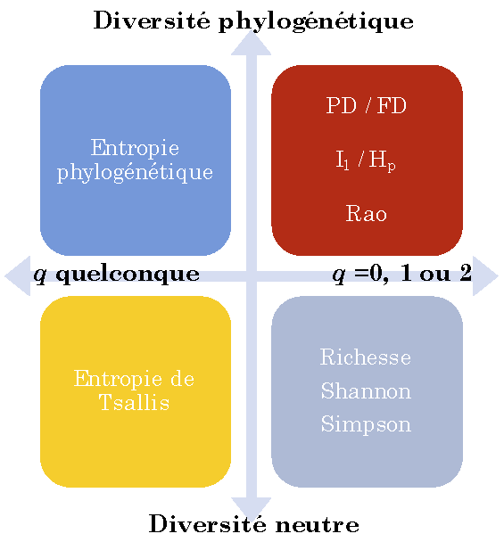

# (PART) Conclusion {-}

# Synthèse {#sec:conclusionSynthese}

```{r, echo=FALSE, message=FALSE}
library("tidyverse")
```

La biodiversité peut être mesurée de nombreuses façons. 
La dualité entropie-diversité fournit un cadre clair et rigoureux pour le faire.
D'autres mesures de diversité ont été présentées ici, d'autres encore peuvent être trouvées dans la littérature. 
Elles ont en général un moins bon support mathématique, surtout les mesures de diversité $\beta$, elles ne peuvent pas être décomposées, corrigées ou interprétées. 
La diversité de Hurlbert possède toutes ses propriétés et une correction très efficace du biais d'estimation, mais elle n'est pas généralisée à la diversité phylogénétique.


## Entropie et diversité

(ref:ConclusionFig) Généralisation des mesures classiques de diversité. La figure présente les mesures d'entropie, qui peuvent toutes être transformées en mesures de diversité au sens strict. Toutes ces entropies sont des cas particuliers de l'entropie de Ricotta et Szeidl, qui peut être transformée en diversité de Leinster et Cobbold.
```{r ConclusionFig, fig.cap="(ref:ConclusionFig)", echo=FALSE, out.width='60%'}

```

L'entropie est la surprise moyenne fournie par les individus d'une communauté. 
Le choix de la fonction d'information qui mesure cette surprise à partir des probabilités d'occurrence des espèces (ou d'autres catégories) permet de définir les mesures de diversités neutres, fonctionnelles ou phylogénétique présentées ici. 

L'entropie est transformée en diversité au sens strict par une fonction croissante (l'exponentielle déformée), ce qui simplifie son interprétation en tant que nombre équivalent d'espèces, dans une distribution idéale dans laquelle toutes les espèces seraient équifréquentes.

@Chao2014a proposent un cadre fondé exclusivement sur les nombres de Hill sans référence à l'entropie. 
Les principales différences avec celui présenté ici concernent la définition de la diversité $\alpha$ et donc celle de la diversité $\beta$.

L'entropie phylogénétique généralise les indices de diversité classique (figure \@ref(fig:ConclusionFig)), intègre si nécessaire la distance entre espèces, peut être décomposée et corrigée des biais d'estimation. 
Sa transformation en diversité au sens strict permet d'interpréter les valeurs sous une forme unique: un nombre équivalent d'espèces et un nombre équivalent de communautés. 
La diversité de Leinster et Cobbold généralise à son tour la diversité phylogénétique et permet d'autres définitions de la distance entre espèces.
Le paramétrage des mesures (l'ordre de la diversité) permet de donner plus ou moins d'importance aux espèces rares et de tracer des profils de diversité.

Les communautés et assemblages idéals définissant les nombres équivalents d'espèces et de communautés sont:

* des communautés d'espèces équiprobables [@Hill1973], dont l'ancêtre commun est la racine de l'arbre phylogénétique (diversité phylogénétique)[@Marcon2014b] ou dont la distance fonctionnelle est maximale (diversité fonctionnelle) [@Leinster2012];
* une méta-communauté contenant des communautés de poids égal et totalement distinctes [@Jost2007], c'est-à-dire n'ayant aucune espèce en commun. De plus, la distance fonctionnelle ou phylogénétique est maximale entre deux espèces quelconques appartenant à des communautés différentes [@Pavoine2015a].

Le package *entropart*[@Marcon2014c] permet de calculer avec R la diversité d'une méta-communauté à partir de données d'abondances et d'un arbre (phylogénétique) ou d'une matrice de distances (fonctionnelles).


## Ordres particuliers de diversité

La diversité d'ordre 2 présente de nombreuses particularités et avantages qui font qu'elle est très employée

### Estimation

Tous les estimateurs de $^q\!H$ sont biaisés, d'autant plus que $q$ est petit. 
Seul l'estimateur de l'indice de Simpson, $^{2}\!\tilde{H}=[n/(n-1)](1-\sum_s{{\hat{p}}^{2}_{s}})$ est non biaisé.
Comme l'entropie de Rao est la somme sur les périodes de l'arbre des entropies de Simpson, $^{2}\!\tilde{H}(T)=[n/(n-1)]\,^{2}\!\hat{H}(T)$ est donc sans biais.
  
### Partition

L'entropie de Simpson peut être décomposée comme une variance. 
La contribution de chaque communauté à la variance inter n'est pas la même que dans la décomposition générale de l'entropie HCDT mais la variance inter est bien égale à l'entropie $\beta$. 
La décomposition de la diversité de Pélissier et Couteron est identique.
Dans le cas particulier de l'entropie de Rao, l'entropie phylogénétique, sans normalisation par la hauteur de l'arbre, est égale à la somme pondérée des dissimilarités (divergences de Jensen-Shannon) entre les paires de communautés. 
Cette propriété permet de représenter dans un même espace les espèces et les communautés par une double analyse en composantes principales.
  
### Égalité des diversités

Pour $q=2$ seulement, toutes les mesures de diversité sont identiques:

* Le nombre équivalent d'espèces de Hurlbert est égal à $^{2}\!D$, le nombre de Hill;
* La diversité de Leinster et Cobbold est égale à la diversité phylogénétique.
    
La diversité d'ordre 1 a en revanche des propriétés avantageuses pour la décomposition: toutes les définitions de diversité $\alpha$ sont dans ce cas identiques, et l'information mutuelle se confond avec la diversité $\beta$.


## Limites

Les principales limites des mesures de diversité sont d'ordre conceptuel et pratique. 
L'axiome de symétrie interdit de donner un rôle particulier à une espèce: il n'est donc pas possible conceptuellement de prendre en compte les espèces focales [@Zacharias2001] dans la quantification de la diversité (espèces emblématiques, espèces clé de voûte [@Paine1969], espèces parapluie [@Roberge2004], espèces ingénieures [@Jones1994]...). 
Leur présence peut être décisive pour la conservation, mais il s'agit clairement d'une question distincte de celle de la diversité.

Sur le plan pratique, la mesure de la diversité se réduit souvent à un groupe biologique (dans ce document, les arbres).
Estimer la biodiversité totale est un objectif hors d'atteinte.
L'étendue spatiale à laquelle des données d'abondance sont accessibles est souvent trop réduite [@Chiarucci2011].
Si la diversité à prendre en compte est au-delà des données disponibles, il est nécessaire d'utiliser des *indicateurs* [@Balmford2003] qui peuvent être la diversité d'un ou quelques groupes représentatifs, voire la présence d'espèces indicatrices [@Clements1916]. 
Des indicateurs indirects sont la diversité des habitats ou même l'étendue de certains habitats reconnus comme les plus favorables à un haut niveau de diversité. 
Une réflexion en cours [@Pereira2013] consiste à établir une liste de variables pertinentes (*Essential biodiversity variables*) qui puissent constituer des indicateurs standardisés à l'échelle globale pour permettre la comparaison des données.
Les indicateurs dévient souvent de la notion stricte de diversité et peuvent mesurer tout autre chose, comme l'indice BII (*Biodiversity Intactness Index* [@Scholes2005]) qui est la moyenne pondérée par la surface des habitats et le nombre d'espèces concernées de la variation des effectifs des populations induite par l'anthropisation. 
Les effectifs ne sont pas pris en compte dans la mesure de la diversité (sauf dans le calcul des biais d'estimation), seules les proportions importent: l'indice BII mesure donc la dégradation des habitats plus que la variation de la biodiversité. 
L'argument, développé par @Balmford2003, est que la diminution des effectifs des espèces suivies est corrélé à la disparition des espèces plus vulnérables; l'effectif d'une population est aussi un indicateur de sa diversité génétique.
La moyenne géométrique des abondances relatives [@Buckland2011] compare les abondances des espèces au cours du temps à leur valeur initiale.
L'indice LPI (*Living Planet Index*) [@Loh2005] s'appuie sur ce même principe: il mesure l'évolution dans le temps des effectifs d'un grand nombre de populations de vertébrés.
Une approche similaire mais plus exhaustive [@Ceballos2017] montre une très forte probabilité d'extinction massive à venir.

La recherche sur la mesure de la diversité est très active, ce document évolue donc régulièrement pour prendre en compte les avancées récentes.

