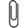

--- 
title: "Mesures de la Biodiversité"
author: "Eric Marcon"
date: "`r Sys.Date()`"
biblio-style: authoryear-ibid
bibliography: library.bib
cite-style: verbose-inote
classoption:
- extrafontsizes
- onecolumn
- openright
colorlinks: yes
biblatexoptions:
- backend=biber
- citestyle=verbose-inote
- pageref=true
- isbn=false
- backref=true
- giveninits=true
- uniquename=init
- maxcitenames=2
- maxbibnames=150
- sorting=nyt
- sortcites=false
description: Mesures de la Biodiversité.
documentclass: memoir
fig_crop: yes
fontsize: 11pt
fourthpagefontsize: normalsize
graphics: yes
lang: fr
link-citations: yes
maintitlepage:
  epigraph: |
    Ce document est réalisé de façon dynamique et reproductible grâce à:
    \begin{itemize}
      \item \LaTeX, dans sa distribution Miktex (\url{http://miktex.org/}) et la classe memoir (\url{http://www.ctan.org/pkg/memoir}).
      \item R (\url{http://www.r-project.org/}) et RStudio (\url{http://www.rstudio.com/})
      \item bookdown (\url{http://bookdown.org/})
    \end{itemize}
otherlangs:
- en-US
- en-GB
- fr
papersize: A4
resume: |
  
  La biodiversité peut être mesurée de nombreuses façons.

  La dualité entropie-diversité fournit un cadre clair et rigoureux pour le faire. 
  L’entropie est la surprise moyenne fournie par les individus d’une communauté.
  Le choix de la fonction d’information qui mesure cette surprise à partir des probabilités d’occurence des espèces (ou d’autres catégories) permet de définir les mesures de diversités neutres, fonctionnelles ou phylogénétique présentées ici. 
  L’entropie est transformée en diversité au sens strict par une fonction croissante (l’exponentielle déformée), ce qui simplifie son interprétation en tant que nombre équivalent d’espèces.

  L’entropie phylogénétique généralise les indices de diversité classique, intègre si nécessaire la distance entre espèces, peut être écomposée et corrigée des biais d’estimation.
  Sa transformation en diversité au sens strict permet d’interpréter les valeurs sous une forme unique : un nombre équivalent d’espèces et un nombre équivalent de communautés. 
  La diversité de Leinster et Cobbold généralise à son tour la diversité phylogénétique et permet d’autres définitions de la distance entre espèces. 

  Le paramétrage des mesures (l’ordre de la diversité) permet de donner plus ou moins d’importance aux espèces rares et de tracer des profils de diversité. 

  La construction de ce cadre méthodologique est présentée en détail ainsi que plusieurs approches différentes, qui constituent l'état de l'art de la mesure de la biodiversité.
site: bookdown::bookdown_site
always_allow_html: yes
toc-depth: 3
---

<!-- Commande nécessaire pour la copie de l'icône "Essentiel" en HTML--> 


```{r, echo=FALSE, message=FALSE}
### Utilities. Do not modify.
# Installation of packages if necessary
InstallPackages <- function(Packages) {
  InstallPackage <- function(Package) {
    if (!Package %in% installed.packages()[, 1]) {
      install.packages(Package, repos="https://cran.rstudio.com/")
    }
  }
  invisible(sapply(Packages, InstallPackage))
}

# Basic packages
InstallPackages(c("bookdown", "devtools", "kableExtra", "knitr", "rmarkdown"))
library("kableExtra") # Mandatory to load css and more

# Chunk font size hook: allows size='small' or any valid Latex font size in chunk options
def.chunk.hook  <- knitr::knit_hooks$get("chunk")
knitr::knit_hooks$set(chunk = function(x, options) {
  x <- def.chunk.hook(x, options)
  ifelse(options$size != "normalsize", paste0("\n \\", options$size,"\n\n", x, "\n\n \\normalsize"), x)
})
```


```{r Options, echo=FALSE, message=FALSE}
### Customized options for this book
# Add necessary packages here
Packages <- c("ade4", "adespatial", "entropart", "entropy", "EntropyEstimation", 
              "GoFKernel", "gridExtra","iNEXT", "magrittr", "ragg", "sp", "SPECIES", 
              "tidyverse", "untb", "vegan")
# Install them if necessary
InstallPackages(Packages)
# GitHub packages
if (!"SpatDiv" %in% installed.packages()[, 1]) {
  remotes::install_github("EricMarcon/SpatDiv")
}

# knitr options
knitr::opts_chunk$set(
  cache=TRUE, warning=FALSE, 
  fig.env='SCfigure', fig.asp=.75, fig.align='center', out.width='80%', 
  dev = "ragg_png",
  tidy=TRUE, tidy.opts=list(blank=FALSE, width.cutoff=60), size="scriptsize",
  knitr.graphics.auto_pdf = TRUE)

# ggplot style
library("tidyverse")
theme_set(theme_bw())
theme_update(panel.background = element_rect(fill = "transparent", colour = NA),
             plot.background = element_rect(fill = "transparent", colour = NA))
knitr::opts_chunk$set(dev.args=list(bg="transparent"))

# Random seed
set.seed(973)
```


# Notations {-}

Les notations peuvent différer de celles de la littérature citée pour l'homogénéité de ce document.

Les matrices sont notées en caractères gras et majuscules: $\mathbf{X}$.
Les éléments de la matrice $\mathbf{X}$ sont notés $x_{i,j}$.

Les vecteurs sont notés en gras minuscule: $\mathbf{p}$.
Les nombres sont notés en minuscules, $n$, et les variables aléatoires en majuscules: $N$.
Les valeurs maximales des énumérations font exception: elles sont notées en majuscules pour les distinguer des indices: $\sum_{s=1}^{S}{p_s}=1$.

Le produit matriciel de $\mathbf{X}$ et $\mathbf{Y}$ est noté $\mathbf{X}\mathbf{Y}$. Dans les scripts R, l'opérateur est `\%*\%`.
Le produit de Hadamard (terme à terme) est noté $\mathbf{X}\circ\mathbf{Y}$ (opérateur `*` dans R).
De même $\mathbf{X}^n$ indique la puissance $n$ au sens du produit matriciel d'une matrice carrée (opérateur `\%$\wedge$\%` du package *expm*), alors que $\mathbf{X}^{\circ n}$ est la matrice dont chaque terme est celui de $\mathbf{X}$ à la puissance $n$ (opérateur `$\wedge$` de R).
La matrice transposée de $\mathbf{X}$ est notée $\mathbf{X'}$.

Les notations sont les suivantes:

\noindent ${\mathbf 1}(\cdot)$: la fonction indicatrice, qui vaut 1 si la condition dans la parenthèse est vraie, 0 sinon.

\noindent $\mathbf{1}_s$: le vecteur de longueur $s$ composé uniquement de 1. $\mathbf{1}_s\mathbf{1}_s'=\mathbf{J}_s$ où $\mathbf{J}_s$ est la matrice carré de taille $s$ ne contenant que des 1.

\noindent $A$: l'aire d'étude, et, selon le contexte, sa surface.

\noindent $\alpha_\nu$: la probabilité moyenne des espèces représentées par $\nu$ individus.

\noindent $C$: le taux de couverture de l'échantillon, c'est-à-dire la probabilité qu'un individu de la communauté appartienne à une des espèces échantillonnées. 
$C^{n}$ est le taux de couverture correspondant à un échantillon de taille $n$.

\noindent $^{q}\!D$: la diversité vraie (nombre de Hill pour les diversités $\alpha$ et $\gamma$), nombre équivalent de communautés pour la diversité $\beta$. 
$^{q}_{i}\!D_{\alpha}$ est la diversité $\alpha$ mesurée dans la communauté $i$. 
$^{q}\!\bar{D}\left(T\right)$ est la diversité phylogénétique.

\noindent $\mathbf{\Delta}$: la matrice de dissimilarité dont les éléments sont $\delta_{s,t}$, la dissimilarité entre l'espèce $s$ et l'espèce $t$.

\noindent ${\mathbb E}\left(X\right)$: l'espérance de la variable aléatoire $X$.

\noindent $^{q}\!H$: l'entropie de Tsallis (ou HCDT). 
$^{q}_{i}\!H_{\alpha}$ est l'entropie $\alpha$ mesurée dans la communauté $i$. 
Si nécessaire, le vecteur des probabilités servant au calcul est précisé sous la forme $^{q}\!H(\mathbf{p})$.
$^{q}\!\bar{H}(T)$ est l'entropie phylogénétique.

\noindent $I$: le nombre de communautés qui constituent une partition de la méta-communauté dans le cadre de la décomposition de la diversité. 
Les communautés sont indexées par $i$.

\noindent $I(p_s)$: l'information apportée par l'observation d'un évènement de probabilité $p_s$. 
$I(q_s,p_s)$ est le gain d'information apporté par l'expérience ($q_s$ est observé) par rapport aux probabilités $p_s$ attendues.

\noindent $\mathbf{I}_s$: la matrice identité de rang $s$: matrice carrée de taille $s\times s$ dont la diagonale ne comporte que des 1 et les autres élements sont nuls. 

\noindent $N$: le nombre (aléatoire) d'individus se trouvant dans l'aire d'étude. 
$N_s$ est la même variable aléatoire, mais restreinte aux individus de l'espèce $s$.

\noindent $n$: le nombre d'individus échantillonnés. 
$n_{s,i}$ est le nombre d'individus de l'espèce $s$ dans la communauté $i$. 
Les effectifs totaux sont $n_{s+}$ (pour l'espèce $s$), $n_{+i}$ pour la communauté $i$ et $n$ le total général. 
S'il n'y a qu'une communauté, le nombre d'individus par espèce est $n_s$.

\noindent $p_s$: la probabilité qu'un individu tiré au hasard appartienne à l'espèce $s$. 
Son estimateur, ${\hat{p}}_s$ est la fréquence observée. 
$p_{s|i}$ est la même probabilité dans la communauté $i$.

\noindent $\mathbf{p}=\left( p_1, p_2, \dots, p_s, \dots, p_S \right)$: le vecteur décrivant la distribution des probabilités $p_s$, appelé simplexe en référence à sa représentation dans l'espace à $S$ dimensions.

\noindent ${\pi}_{\nu}$: la probabilité qu'une espèce choisie au hasard soit représentée par $\nu$ individus, $\sum^n_{\nu=1}{{\pi}_{\nu}}$=1. 
Si l'espèce est choisie explicitement, la probabilité est notée ${\pi}_{n_s}$.

\noindent $^{q}\!R$: l'entropie de Rényi d'ordre $q$.

\noindent $S$: le nombre d'espèces, considéré comme une variable aléatoire, estimé par $\hat{S}$.

\noindent $S^{n}_{\nu}$: le nombre d'espèces, considéré comme une variable aléatoire, observées $\nu$ fois dans l'échantillonnage. 
L'indice est le nombre de fois où l'espèce est détectée: par exemple $S_{1}$ ou $S_{\ne 0}$. 
L'exposant est la taille de l'échantillon: $S^{A}$ pour la surface $A$ ou $\hat{S}^{n}$ pour un échantillon de $n$ individus. 
$S^{A}_{0}$ est le nombre d'espèces non rencontrées dans la surface $A$. 
Pour alléger les notations, s'il n'y a pas d'ambiguïté, l'indice est omis pour les espèces présentes: $S^{A}_{\ne 0}$ est noté $S^{A}$. 
Si l'exposant n'est pas noté, l'échantillon n'est pas précisé et peut être aussi bien un nombre d'individus qu'une surface.

\noindent $s^{n}_{\nu}$: le nombre d'espèces observées, avec les mêmes notations que ci-dessus. 
$s^{n}_{\nu}$ peut être considéré comme une réalisation de $S^{n}_{\nu}$.

\noindent $t^{n}_{1-\alpha/2}$: le quantile d'une loi de Student à $n$ degrés de liberté au seuil de risque $\alpha$, classiquement 1,96 pour $n$ grand et $\alpha=5\%$.

\noindent $\mathbf{Z}$: la matrice de similarité entre espèces dont les éléments sont $z_{s,t}$, la similarité entre l'espèce $s$ et l'espèce $t$.

\noindent $\mathrm{\Gamma}(\cdot)$: la fonction gamma.

\noindent $\mathrm{\Psi}(\cdot)$: la fonction digamma.

\noindent $\binom{n}{k}$: le nombre de combinaisons de $k$ éléments parmi $n$: $$\binom{n}{k}=\frac{n!}{k!\,(n-k)!}$$.


<!-- La commande \mainmatter marque le début du corps du document LaTeX--> 
<!-- Elle ne doit pas être supprimée-->
\mainmatter
 
